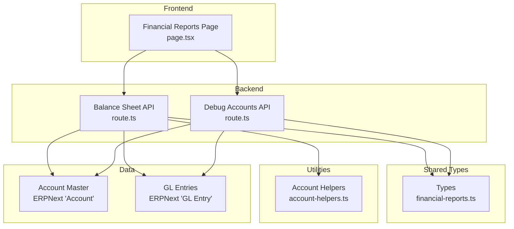
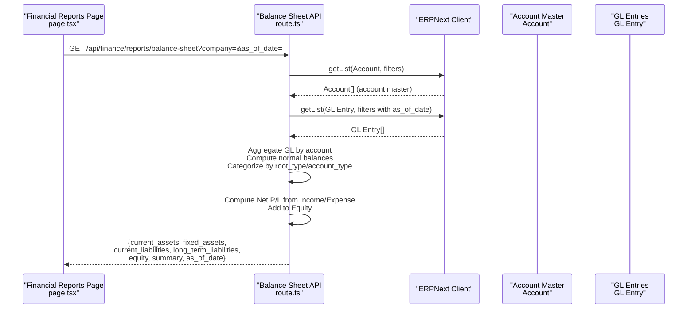
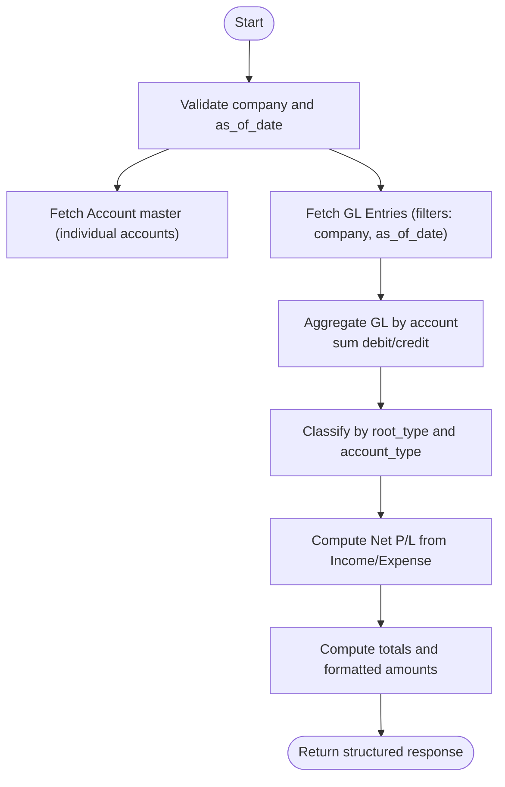
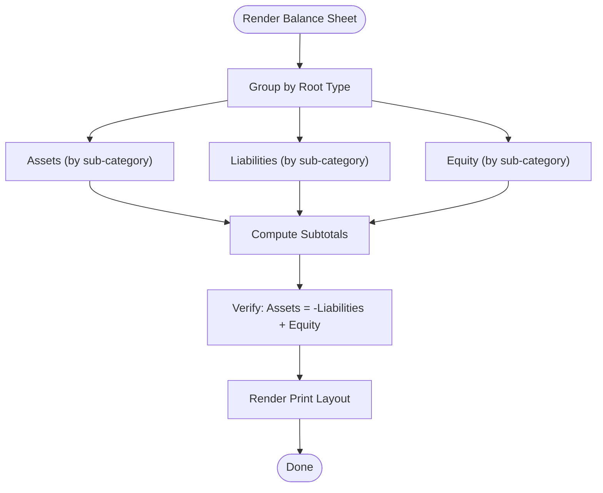
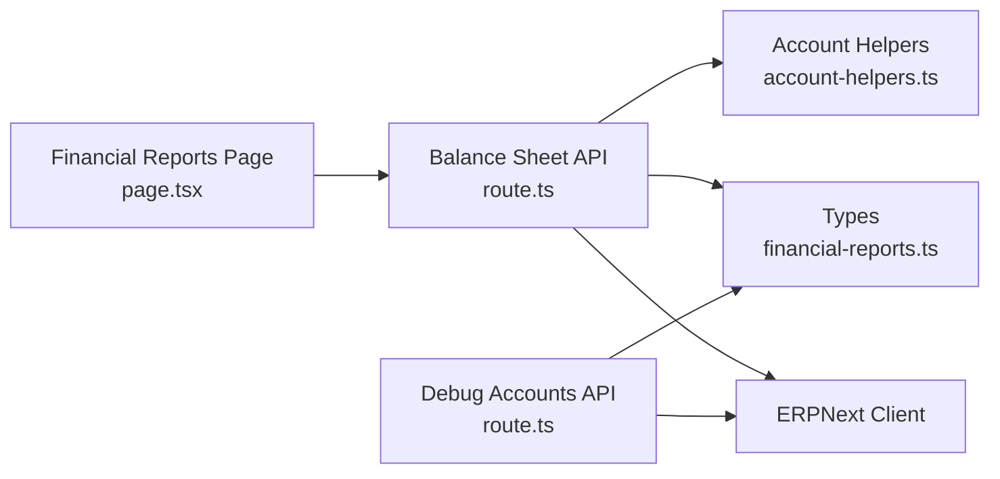

# Balance Sheet

<cite>
**Referenced Files in This Document**
- [route.ts](file://app/api/finance/reports/balance-sheet/route.ts)
- [route.ts](file://app/api/debug/balance-sheet-accounts/route.ts)
- [page.tsx](file://app/financial-reports/page.tsx)
- [types.ts](file://types/financial-reports.ts)
- [account-helpers.ts](file://utils/account-helpers.ts)
- [balance-sheet-integration.test.ts](file://tests/balance-sheet-integration.test.ts)
- [balance-sheet-tax-account-display.test.ts](file://tests/balance-sheet-tax-account-display.test.ts)
</cite>

## Table of Contents
1. [Introduction](#introduction)
2. [Project Structure](#project-structure)
3. [Core Components](#core-components)
4. [Architecture Overview](#architecture-overview)
5. [Detailed Component Analysis](#detailed-component-analysis)
6. [Dependency Analysis](#dependency-analysis)
7. [Performance Considerations](#performance-considerations)
8. [Troubleshooting Guide](#troubleshooting-guide)
9. [Conclusion](#conclusion)
10. [Appendices](#appendices)

## Introduction
This document provides comprehensive documentation for the Balance Sheet report in the ERPNext system. It covers asset classification, liability structure, and equity presentation, along with integration to the chart of accounts, balance sheet equation validation, and period-end adjustments. It also documents report configuration options such as comparative periods, consolidated versus individual company views, and segment reporting. Formatting standards, liquidity ratios calculation, and working capital analysis are included, alongside customization examples for industry standards (IFRS, GAAP) and regulatory requirements. Performance considerations for large balance sheets, recursive account hierarchies, and intercompany eliminations are addressed, along with troubleshooting guidance for imbalances and reconciliation procedures.

## Project Structure
The Balance Sheet implementation spans backend API routes, frontend report rendering, shared types, and utility helpers. The primary backend endpoint aggregates GL entries and account master data to compute balances and categorize accounts by root type and account type. The frontend renders the categorized data into a structured report with totals and print support.

**Diagram sources**
- [route.ts](file://app/api/finance/reports/balance-sheet/route.ts#L1-L262)
- [route.ts](file://app/api/debug/balance-sheet-accounts/route.ts#L1-L140)
- [page.tsx](file://app/financial-reports/page.tsx#L1-L956)
- [types.ts](file://types/financial-reports.ts#L1-L66)
- [account-helpers.ts](file://utils/account-helpers.ts#L1-L72)

**Section sources**
- [route.ts](file://app/api/finance/reports/balance-sheet/route.ts#L1-L262)
- [route.ts](file://app/api/debug/balance-sheet-accounts/route.ts#L1-L140)
- [page.tsx](file://app/financial-reports/page.tsx#L1-L956)
- [types.ts](file://types/financial-reports.ts#L1-L66)
- [account-helpers.ts](file://utils/account-helpers.ts#L1-L72)

## Core Components
- Backend API: Computes balances by aggregating GL entries, applies account master metadata, and categorizes accounts into current/fixed assets, current/long-term liabilities, and equity. It also calculates net profit/loss by aggregating income and expense accounts and adds it to equity.
- Frontend Report: Renders categorized assets/liabilities/equity with subtotals, validates the balance sheet equation, and supports printing with standardized formatting.
- Shared Types: Defines shapes for account master, GL entries, and report lines to ensure consistent data contracts across components.
- Account Helpers: Provides flexible classification of current assets and liabilities based on account_type and parent_account, avoiding hardcoded account numbers.

Key responsibilities:
- Balance Sheet API: Fetches and aggregates GL entries, computes amounts using normal balances, categorizes by root_type and account_type, computes totals, and returns a structured response.
- Frontend Report: Groups entries by root type and sub-category, displays formatted values, and enforces the balance equation (Assets = Liabilities + Equity).
- Debug API: Supports troubleshooting by listing asset accounts with balances and reasons for inclusion/exclusion.

**Section sources**
- [route.ts](file://app/api/finance/reports/balance-sheet/route.ts#L49-L261)
- [page.tsx](file://app/financial-reports/page.tsx#L15-L956)
- [types.ts](file://types/financial-reports.ts#L9-L43)
- [account-helpers.ts](file://utils/account-helpers.ts#L53-L71)

## Architecture Overview
The Balance Sheet report follows a layered architecture:
- Presentation Layer: React page renders the report UI, handles filters, and prints standardized layouts.
- Application Layer: Next.js route orchestrates data fetching, aggregation, and computation.
- Data Access Layer: Uses ERPNext client to query Account and GL Entry records.
- Utility Layer: Helpers encapsulate account classification logic.

**Diagram sources**
- [route.ts](file://app/api/finance/reports/balance-sheet/route.ts#L49-L261)
- [page.tsx](file://app/financial-reports/page.tsx#L115-L140)

## Detailed Component Analysis

### Backend Balance Sheet API
Responsibilities:
- Validate date range and company parameters.
- Fetch account master data filtered to individual accounts (non-group).
- Fetch GL entries filtered by company and optional as_of_date.
- Aggregate GL entries by account and compute normal-balance amounts.
- Categorize accounts into current/fixed assets, current/long-term liabilities, and equity.
- Compute net profit/loss by aggregating income and expense accounts and add to equity.
- Return categorized lines and summary totals with formatted currency values.

Processing logic highlights:
- Normal balance calculation: Asset accounts use debit - credit; Liability/Equity use credit - debit.
- Classification uses account_type and parent_account via helpers to avoid hardcoded account numbers.
- Net profit/loss computed from Income and Expense accounts and added to equity.

**Diagram sources**
- [route.ts](file://app/api/finance/reports/balance-sheet/route.ts#L49-L261)
- [account-helpers.ts](file://utils/account-helpers.ts#L53-L71)

**Section sources**
- [route.ts](file://app/api/finance/reports/balance-sheet/route.ts#L49-L261)
- [account-helpers.ts](file://utils/account-helpers.ts#L53-L71)

### Frontend Balance Sheet Rendering
Responsibilities:
- Group entries by root type and sub-category.
- Render asset/liability/equity sections with subtotals.
- Enforce balance sheet equation and highlight discrepancies.
- Provide print layout with standardized formatting and totals.

Formatting and validation:
- Assets: positive balance = Dr; negative balance = Cr.
- Liabilities/Equity: negative balance = Cr; positive balance = Dr.
- Equation: Assets = -Liabilities + Equity (Liability values negated for equation).
- Print mode: parentheses for negative values; totals bolded.

**Diagram sources**
- [page.tsx](file://app/financial-reports/page.tsx#L155-L300)

**Section sources**
- [page.tsx](file://app/financial-reports/page.tsx#L15-L956)

### Debugging Balance Sheet Accounts
Purpose:
- List asset accounts with balances and reasons for inclusion/exclusion.
- Exclude temporary and opening accounts and zero balances.
- Filter out closing entries for accurate asset reporting.

Usage:
- Configure date range and company.
- Review reasons column to understand exclusions.

**Section sources**
- [route.ts](file://app/api/debug/balance-sheet-accounts/route.ts#L1-L140)

### Shared Types and Contracts
Defines consistent shapes for:
- AccountMaster: account metadata including root_type and account_type.
- GlEntry: GL entry fields used for aggregation.
- ReportLine: standardized report line item with formatted_amount.

**Section sources**
- [types.ts](file://types/financial-reports.ts#L9-L43)

### Account Classification Helpers
Provides:
- isCurrentAsset: identifies current assets by account_type.
- isCurrentLiability: identifies current liabilities by account_type.

These helpers enable flexible classification independent of hardcoded account numbers.

**Section sources**
- [account-helpers.ts](file://utils/account-helpers.ts#L53-L71)

## Dependency Analysis
The Balance Sheet API depends on:
- ERPNext client for data retrieval.
- Account helpers for classification.
- Shared types for data contracts.
- Frontend page for rendering and validation.

**Diagram sources**
- [route.ts](file://app/api/finance/reports/balance-sheet/route.ts#L1-L262)
- [route.ts](file://app/api/debug/balance-sheet-accounts/route.ts#L1-L140)
- [page.tsx](file://app/financial-reports/page.tsx#L1-L956)
- [types.ts](file://types/financial-reports.ts#L1-L66)
- [account-helpers.ts](file://utils/account-helpers.ts#L1-L72)

**Section sources**
- [route.ts](file://app/api/finance/reports/balance-sheet/route.ts#L1-L262)
- [route.ts](file://app/api/debug/balance-sheet-accounts/route.ts#L1-L140)
- [page.tsx](file://app/financial-reports/page.tsx#L1-L956)
- [types.ts](file://types/financial-reports.ts#L1-L66)
- [account-helpers.ts](file://utils/account-helpers.ts#L1-L72)

## Performance Considerations
- Data volume: The API retrieves up to a configurable page length for both Account and GL Entry lists. For large datasets, consider pagination and indexing on company and posting_date.
- Aggregation cost: Aggregating GL entries by account and computing normal balances is linear in the number of GL entries. Ensure database indices exist on company and posting_date.
- Recursive hierarchies: The Balance Sheet API operates on individual accounts (is_group = 0) and does not traverse parent-child hierarchies. For consolidated reporting across subsidiaries, implement intercompany elimination logic at the consolidation stage.
- Intercompany eliminations: Not implemented in the Balance Sheet API; handle at higher levels (consolidation) to avoid double counting.
- Comparative periods: The report supports as_of_date filtering. For comparative periods, issue separate requests and align segments manually in the UI.
- Consolidated vs individual: The API filters by company; to consolidate, aggregate multiple companies’ results and apply elimination entries.

[No sources needed since this section provides general guidance]

## Troubleshooting Guide
Common issues and resolutions:
- Imbalanced equation: The frontend highlights discrepancies when Assets ≠ Liabilities + Equity. Investigate missing postings, incorrect date filters, or misclassified accounts.
- Missing tax accounts: Ensure tax accounts are properly mapped in the chart of accounts and included in the as_of_date snapshot. Use the debug API to verify asset accounts and reasons for inclusion.
- Zero balances: Accounts with zero balances are excluded from the report. Confirm transaction activity within the selected period.
- Temporary and opening accounts: Excluded by design; verify that these are not expected to appear in the Balance Sheet.
- Closing entries: The debug API filters out closing entries; confirm that the closing process is complete before generating the report.

Validation and testing:
- Integration tests verify tax account placement and date filtering.
- Property tests validate correct classification and calculation across randomized scenarios.

**Section sources**
- [balance-sheet-integration.test.ts](file://tests/balance-sheet-integration.test.ts#L229-L493)
- [balance-sheet-tax-account-display.test.ts](file://tests/balance-sheet-tax-account-display.test.ts#L204-L411)
- [route.ts](file://app/api/debug/balance-sheet-accounts/route.ts#L62-L71)

## Conclusion
The Balance Sheet report integrates ERPNext’s chart of accounts with GL entries to produce a categorized, equation-validating financial statement. Its design emphasizes flexibility through account-type-based classification, robust validation in the frontend, and extensibility for comparative periods, consolidated views, and segment reporting. Performance and troubleshooting strategies focus on efficient data retrieval, proper date filtering, and careful handling of period-end adjustments and intercompany eliminations.

[No sources needed since this section summarizes without analyzing specific files]

## Appendices

### Report Configuration Options
- Comparative periods: Use as_of_date to compare snapshots across periods; implement side-by-side rendering in the UI.
- Consolidated vs individual: Filter by company; for consolidation, aggregate multiple companies’ results and apply elimination entries.
- Segment reporting: Group by sub_category in the frontend and include segment metadata in account master records.

[No sources needed since this section provides general guidance]

### Balance Sheet Formatting Standards
- Assets: Positive normal balance = Dr; negative = Cr.
- Liabilities/Equity: Negative normal balance = Cr; positive = Dr.
- Print layout: Parentheses for negative values; bolded subtotals and totals; standardized headers and footers.

**Section sources**
- [page.tsx](file://app/financial-reports/page.tsx#L42-L67)
- [page.tsx](file://app/financial-reports/page.tsx#L218-L300)

### Liquidity Ratios and Working Capital Analysis
- Current Ratio = Total Current Assets / Total Current Liabilities.
- Quick Ratio = (Cash + Receivables + Short-term Investments) / Total Current Liabilities.
- Working Capital = Total Current Assets − Total Current Liabilities.

Implementation tips:
- Use current_assets and current_liabilities from the report to compute ratios.
- Adjust for seasonal fluctuations and timing differences.

[No sources needed since this section provides general guidance]

### Industry and Regulatory Customization Examples
- IFRS: Emphasize revaluation, hedge accounting, and segment reporting; ensure disclosures align with IFRS templates.
- GAAP: Focus on historical cost, conservatism, and ASC/US GAAP requirements; maintain proper classification and footnote disclosures.
- Local regulations: Align classifications and disclosures with local accounting standards; use segment reporting to meet regulatory breakdowns.

[No sources needed since this section provides general guidance]