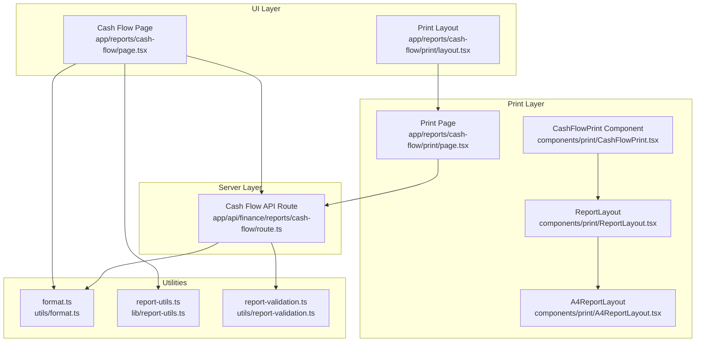
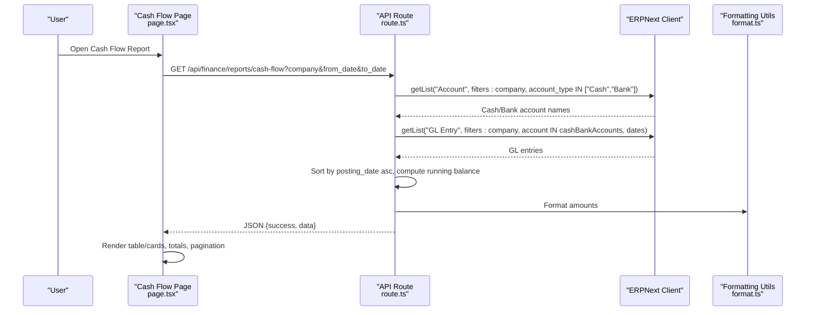
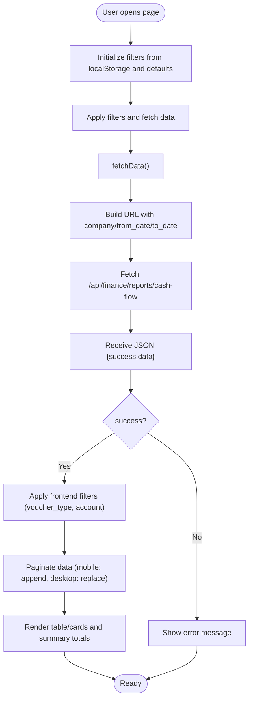
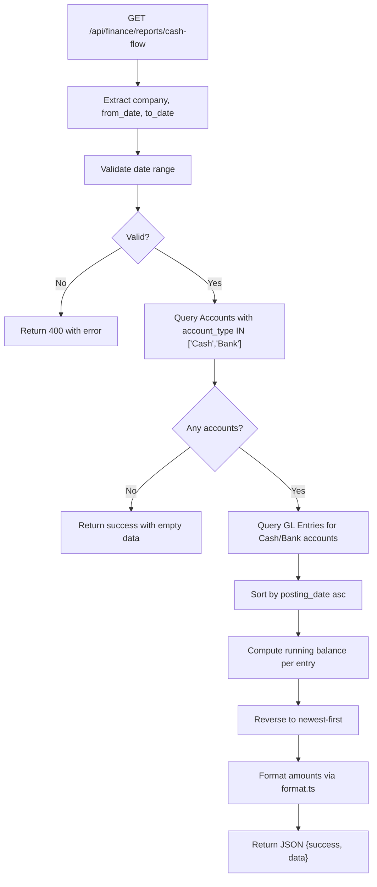
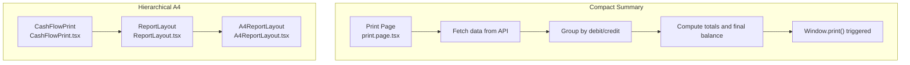
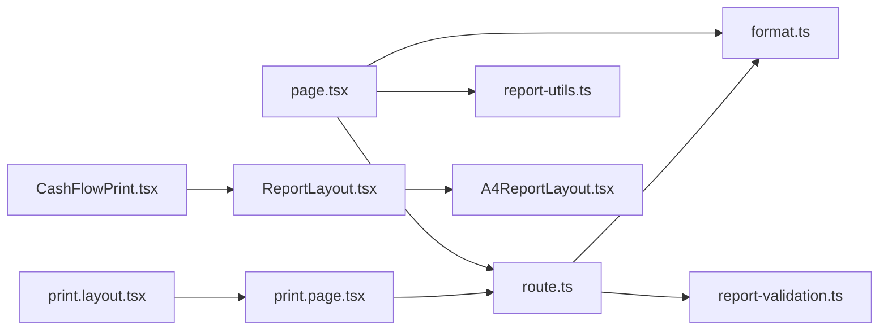

# Cash Flow Report

<cite>
**Referenced Files in This Document**
- [page.tsx](file://app/reports/cash-flow/page.tsx)
- [route.ts](file://app/api/finance/reports/cash-flow/route.ts)
- [CashFlowPrint.tsx](file://components/print/CashFlowPrint.tsx)
- [print.page.tsx](file://app/reports/cash-flow/print/page.tsx)
- [print.layout.tsx](file://app/reports/cash-flow/print/layout.tsx)
- [format.ts](file://utils/format.ts)
- [report-utils.ts](file://lib/report-utils.ts)
- [report-validation.ts](file://utils/report-validation.ts)
- [A4ReportLayout.tsx](file://components/print/A4ReportLayout.tsx)
- [ReportLayout.tsx](file://components/print/ReportLayout.tsx)
- [tasks.md](file://.kiro/specs/financial-reports-comprehensive-fix/tasks.md)
- [design.md](file://.kiro/specs/financial-reports-comprehensive-fix/design.md)
</cite>

## Table of Contents
1. [Introduction](#introduction)
2. [Project Structure](#project-structure)
3. [Core Components](#core-components)
4. [Architecture Overview](#architecture-overview)
5. [Detailed Component Analysis](#detailed-component-analysis)
6. [Dependency Analysis](#dependency-analysis)
7. [Performance Considerations](#performance-considerations)
8. [Troubleshooting Guide](#troubleshooting-guide)
9. [Conclusion](#conclusion)
10. [Appendices](#appendices)

## Introduction
This document explains the Cash Flow Report implementation, focusing on how it presents cash movements by classifying them into operating, investing, and financing activities. It covers the conversion from accrual basis to cash basis, the underlying data model, UI rendering, printing formats, and configuration options. It also provides guidance on customization for different business models, cash concentration needs, performance optimization across currencies and historical periods, and troubleshooting reconciliations and timing differences between book and tax reporting.

## Project Structure
The Cash Flow Report spans a Next.js app page, a server-side API route, and two print/render components:
- UI page: renders a transactional ledger view with filters, pagination, and totals.
- API route: queries GL entries for Cash and Bank accounts and computes a running balance.
- Print components: render a simplified cash summary and a hierarchical A4 layout supporting operating/investing/financing sections.

**Diagram sources**
- [page.tsx](file://app/reports/cash-flow/page.tsx#L1-L658)
- [route.ts](file://app/api/finance/reports/cash-flow/route.ts#L1-L107)
- [CashFlowPrint.tsx](file://components/print/CashFlowPrint.tsx#L1-L105)
- [print.page.tsx](file://app/reports/cash-flow/print/page.tsx#L1-L172)
- [print.layout.tsx](file://app/reports/cash-flow/print/layout.tsx#L1-L15)
- [format.ts](file://utils/format.ts#L1-L102)
- [report-utils.ts](file://lib/report-utils.ts#L1-L108)
- [report-validation.ts](file://utils/report-validation.ts)

**Section sources**
- [page.tsx](file://app/reports/cash-flow/page.tsx#L1-L658)
- [route.ts](file://app/api/finance/reports/cash-flow/route.ts#L1-L107)
- [CashFlowPrint.tsx](file://components/print/CashFlowPrint.tsx#L1-L105)
- [print.page.tsx](file://app/reports/cash-flow/print/page.tsx#L1-L172)
- [print.layout.tsx](file://app/reports/cash-flow/print/layout.tsx#L1-L15)
- [format.ts](file://utils/format.ts#L1-L102)
- [report-utils.ts](file://lib/report-utils.ts#L1-L108)
- [report-validation.ts](file://utils/report-validation.ts)

## Core Components
- Cash Flow UI Page: Presents a chronological ledger of GL entries for Cash/Bank accounts, computes totals, supports filters, pagination, and print preview.
- Cash Flow API Route: Queries the ERPNext client for Cash and Bank accounts, then retrieves GL entries and calculates a running balance.
- Print Components: Provide a compact cash summary and a hierarchical A4 layout suitable for operating/investing/financing presentation.

Key capabilities:
- Accrual-to-cash conversion: Uses actual cash receipts and payments recorded in GL entries for Cash/Bank accounts.
- Running balance: Maintains a cumulative balance across posting dates.
- Filtering and pagination: Supports date range, voucher type, and account search; desktop pagination and mobile infinite scroll.
- Printing: Two print views—one compact summary and one hierarchical A4 layout with totals.

**Section sources**
- [page.tsx](file://app/reports/cash-flow/page.tsx#L82-L658)
- [route.ts](file://app/api/finance/reports/cash-flow/route.ts#L11-L107)
- [CashFlowPrint.tsx](file://components/print/CashFlowPrint.tsx#L1-L105)
- [print.page.tsx](file://app/reports/cash-flow/print/page.tsx#L21-L172)

## Architecture Overview
The report follows a client-server architecture:
- The UI page fetches data from the Cash Flow API route.
- The API route queries the ERPNext client for accounts classified as Cash or Bank, then retrieves GL entries and computes a running balance.
- Print components render either a simple cash summary or a hierarchical A4 layout.

**Diagram sources**
- [page.tsx](file://app/reports/cash-flow/page.tsx#L161-L230)
- [route.ts](file://app/api/finance/reports/cash-flow/route.ts#L36-L99)
- [format.ts](file://utils/format.ts#L26-L34)

## Detailed Component Analysis

### UI Page: Cash Flow Ledger
Responsibilities:
- Manage filters (company, from_date, to_date, voucher_type, account).
- Fetch and paginate data, with separate logic for desktop and mobile.
- Compute totals and render summary cards.
- Provide print preview modal with a tabular layout.

Notable behaviors:
- Frontend filtering for voucher_type and partial account name match.
- Desktop pagination replaces content; mobile infinite scroll appends.
- Running totals computed from rendered data.

**Diagram sources**
- [page.tsx](file://app/reports/cash-flow/page.tsx#L161-L274)

**Section sources**
- [page.tsx](file://app/reports/cash-flow/page.tsx#L82-L658)

### API Route: Cash Flow Data Source
Responsibilities:
- Validate company and optional date range.
- Query Cash and Bank accounts by account_type.
- Retrieve GL entries for those accounts within the date range.
- Sort entries chronologically, compute running balance, and reverse to show newest first.

**Diagram sources**
- [route.ts](file://app/api/finance/reports/cash-flow/route.ts#L11-L107)
- [report-validation.ts](file://utils/report-validation.ts)

**Section sources**
- [route.ts](file://app/api/finance/reports/cash-flow/route.ts#L11-L107)

### Print Components: Compact Summary and Hierarchical A4
- Compact Summary: Groups entries into cash inflows/outflows and prints totals and final balance.
- Hierarchical A4 Layout: Designed for operating/investing/financing sections with indentation and totals.

**Diagram sources**
- [print.page.tsx](file://app/reports/cash-flow/print/page.tsx#L31-L172)
- [CashFlowPrint.tsx](file://components/print/CashFlowPrint.tsx#L70-L104)
- [ReportLayout.tsx](file://components/print/ReportLayout.tsx)
- [A4ReportLayout.tsx](file://components/print/A4ReportLayout.tsx)

**Section sources**
- [print.page.tsx](file://app/reports/cash-flow/print/page.tsx#L21-L172)
- [CashFlowPrint.tsx](file://components/print/CashFlowPrint.tsx#L1-L105)

### Formatting Standards and Localization
- Currency formatting: Uses Indonesian locale with Rp prefix and dot/thousands separator.
- Number formatting: Thousands separators for integers.
- Date formatting: DD/MM/YYYY for display; YYYY-MM-DD for API.
- Print formatting: Specialized print CSS and A4 layouts.

**Section sources**
- [format.ts](file://utils/format.ts#L26-L53)
- [report-utils.ts](file://lib/report-utils.ts#L29-L38)
- [print.page.tsx](file://app/reports/cash-flow/print/page.tsx#L11-L19)
- [CashFlowPrint.tsx](file://components/print/CashFlowPrint.tsx#L44-L53)

### Report Configuration Options
- Method selection: The current implementation computes cash movements from actual GL entries for Cash/Bank accounts. There is no explicit direct vs indirect method toggle in the UI or API; the UI shows a ledger view rather than a reconciled P&L-based indirect calculation.
- Extraordinary items: Not exposed as a configuration option in the UI or API.
- Segment reporting: Not implemented in the current UI/API; segments would require additional filters and aggregation logic.

Recommendations:
- To support the indirect method, add a configuration switch and compute adjustments from P&L reconciliations.
- To support extraordinary items, add a filter or tag on GL entries and include them as a separate line item.
- For segment reporting, introduce a segment dimension in GL entries and aggregate by segment in the API.

**Section sources**
- [page.tsx](file://app/reports/cash-flow/page.tsx#L101-L107)
- [route.ts](file://app/api/finance/reports/cash-flow/route.ts#L36-L58)

### Cash Flow Statement Preparation and Classification
Current state:
- The UI displays a chronological ledger of cash receipts and payments.
- There is no built-in classification into operating, investing, and financing sections in the UI or API.

Proposed approach:
- Classify entries by mapping voucher types and account categories to activities.
- Aggregate subtotals per activity and compute net cash flow.
- Present via the hierarchical A4 layout component.

**Section sources**
- [CashFlowPrint.tsx](file://components/print/CashFlowPrint.tsx#L31-L38)
- [print.page.tsx](file://app/reports/cash-flow/print/page.tsx#L61-L144)

### Ratio Calculations and Liquidity Metrics
The current implementation does not compute ratios or liquidity metrics. To add:
- Cash flow to debt: net cash from operating activities divided by total debt.
- Free cash flow: operating cash flow minus capital expenditures.
- Liquidity ratios: current cash ratio, cash ratio.

Implementation steps:
- Extend the API to return activity-based cash flows.
- Add a dedicated ratios panel in the UI with configurable periods.

**Section sources**
- [route.ts](file://app/api/finance/reports/cash-flow/route.ts#L68-L95)

### Examples of Customization
- Business model customization: Adjust classification rules for non-traditional revenue/expense accounts.
- Cash concentration: Add filters for parent/child cash accounts and consolidate balances.
- Multi-currency: Ensure GL entries include exchange differences and present translated values.

[No sources needed since this section provides general guidance]

### Performance Optimization
- Pagination: The UI uses frontend pagination for small datasets; consider server-side pagination for large histories.
- Sorting: The API sorts by posting_date; ensure appropriate indexes exist in the database.
- Formatting: Centralized formatting reduces overhead and ensures consistency.
- Caching: Cache frequently accessed account lists and recent GL entries.

**Section sources**
- [page.tsx](file://app/reports/cash-flow/page.tsx#L200-L218)
- [route.ts](file://app/api/finance/reports/cash-flow/route.ts#L75-L95)
- [format.ts](file://utils/format.ts#L26-L34)

## Dependency Analysis

**Diagram sources**
- [page.tsx](file://app/reports/cash-flow/page.tsx#L1-L658)
- [route.ts](file://app/api/finance/reports/cash-flow/route.ts#L1-L107)
- [CashFlowPrint.tsx](file://components/print/CashFlowPrint.tsx#L1-L105)
- [print.page.tsx](file://app/reports/cash-flow/print/page.tsx#L1-L172)
- [print.layout.tsx](file://app/reports/cash-flow/print/layout.tsx#L1-L15)
- [format.ts](file://utils/format.ts#L1-L102)
- [report-utils.ts](file://lib/report-utils.ts#L1-L108)
- [report-validation.ts](file://utils/report-validation.ts)

**Section sources**
- [page.tsx](file://app/reports/cash-flow/page.tsx#L1-L658)
- [route.ts](file://app/api/finance/reports/cash-flow/route.ts#L1-L107)
- [CashFlowPrint.tsx](file://components/print/CashFlowPrint.tsx#L1-L105)
- [print.page.tsx](file://app/reports/cash-flow/print/page.tsx#L1-L172)
- [print.layout.tsx](file://app/reports/cash-flow/print/layout.tsx#L1-L15)
- [format.ts](file://utils/format.ts#L1-L102)
- [report-utils.ts](file://lib/report-utils.ts#L1-L108)
- [report-validation.ts](file://utils/report-validation.ts)

## Performance Considerations
- Use account_type filtering to avoid scanning all accounts by name.
- Limit page lengths and implement server-side pagination for large datasets.
- Cache account lists per company and invalidate on chart of accounts changes.
- Minimize re-renders by memoizing derived totals and using efficient sorting.

[No sources needed since this section provides general guidance]

## Troubleshooting Guide
Common issues and resolutions:
- Empty data: Ensure Cash/Bank accounts exist for the selected company; verify account_type filter.
- Invalid date range: The API validates from_date ≤ to_date; adjust filters accordingly.
- Currency formatting inconsistencies: Use centralized formatCurrency from utils/format.
- Print discrepancies: Compare UI totals with printed totals; verify grouping and rounding.

**Section sources**
- [route.ts](file://app/api/finance/reports/cash-flow/route.ts#L24-L31)
- [format.ts](file://utils/format.ts#L26-L34)
- [print.page.tsx](file://app/reports/cash-flow/print/page.tsx#L54-L58)

## Conclusion
The Cash Flow Report currently provides a robust cash ledger view derived from actual Cash and Bank GL entries. It supports filtering, pagination, and printing. To meet full cash flow statement requirements, implement activity-based classification, support the indirect method, add ratios and liquidity metrics, and enable segment reporting. The existing infrastructure supports these enhancements with minimal disruption.

[No sources needed since this section summarizes without analyzing specific files]

## Appendices

### Appendix A: Indirect Method Implementation Notes
- Requires mapping accrual-based P&L adjustments to operating cash flows.
- Needs additional configuration switches and reconciliations.
- Should integrate with the existing API and UI components.

**Section sources**
- [tasks.md](file://.kiro/specs/financial-reports-comprehensive-fix/tasks.md#L387-L432)
- [design.md](file://.kiro/specs/financial-reports-comprehensive-fix/design.md#L43-L833)