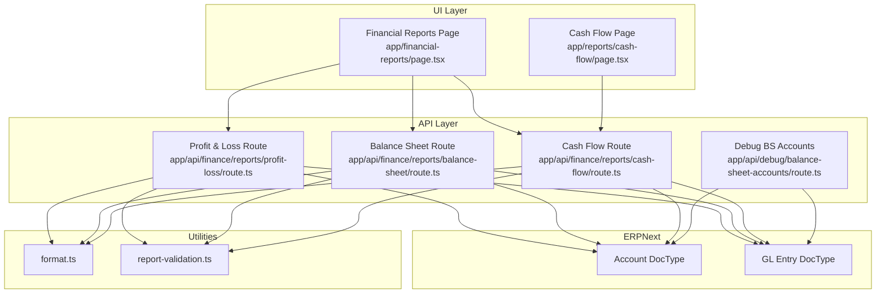
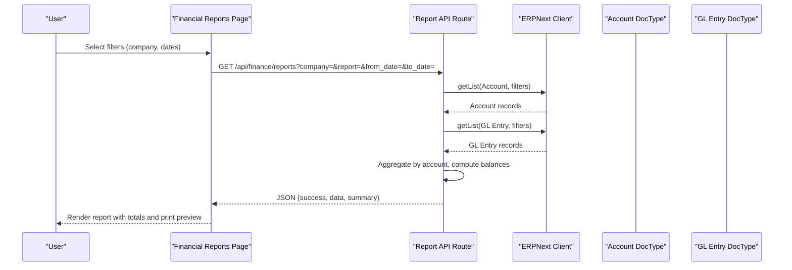
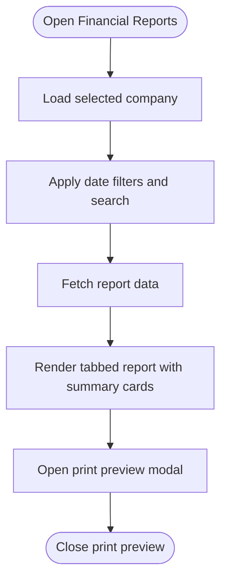
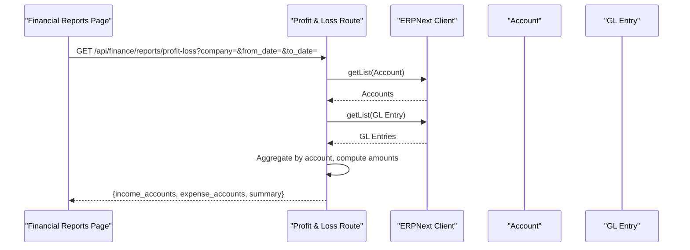
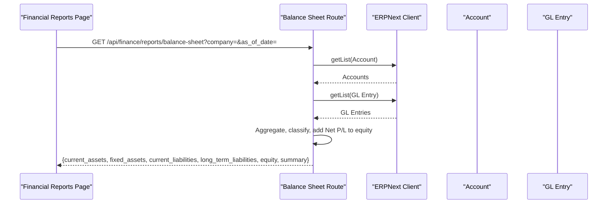
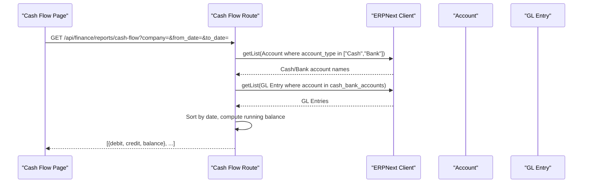
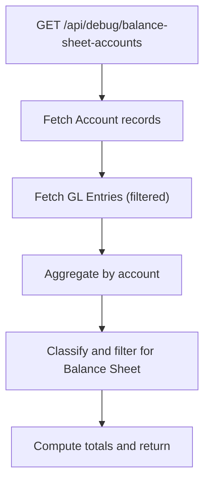
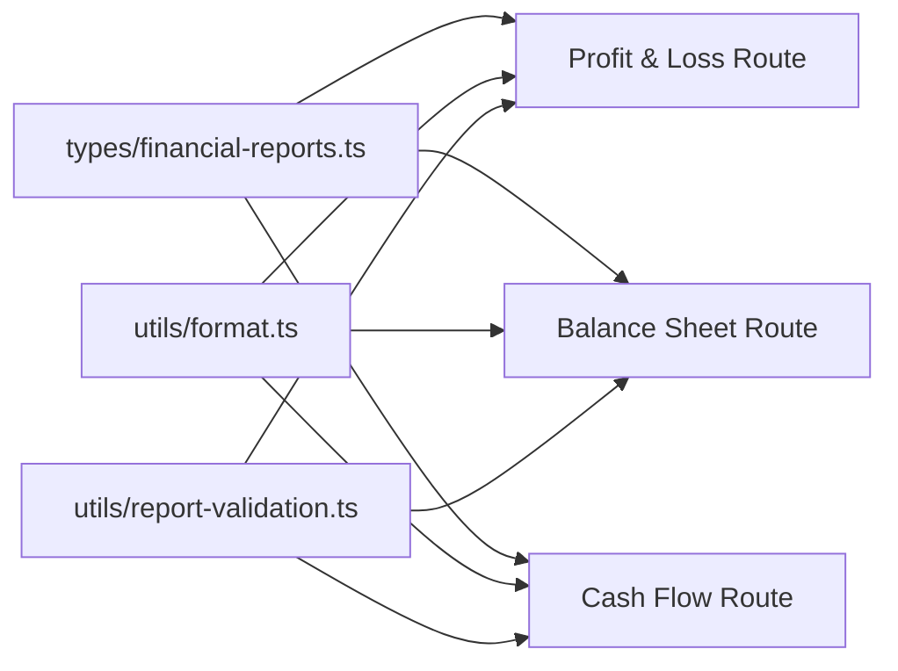

# Financial Reports

<cite>
**Referenced Files in This Document**
- [financial-reports/page.tsx](file://app/financial-reports/page.tsx)
- [types/financial-reports.ts](file://types/financial-reports.ts)
- [api/finance/reports/profit-loss/route.ts](file://app/api/finance/reports/profit-loss/route.ts)
- [api/finance/reports/balance-sheet/route.ts](file://app/api/finance/reports/balance-sheet/route.ts)
- [api/finance/reports/cash-flow/route.ts](file://app/api/finance/reports/cash-flow/route.ts)
- [reports/cash-flow/page.tsx](file://app/reports/cash-flow/page.tsx)
- [reports/cash-flow/print/layout.tsx](file://app/reports/cash-flow/print/layout.tsx)
- [reports/cash-flow/print/page.tsx](file://app/reports/cash-flow/print/page.tsx)
- [api/debug/balance-sheet-accounts/route.ts](file://app/api/debug/balance-sheet-accounts/route.ts)
- [utils/format.ts](file://utils/format.ts)
- [utils/report-validation.ts](file://utils/report-validation.ts)
</cite>

## Table of Contents
1. [Introduction](#introduction)
2. [Project Structure](#project-structure)
3. [Core Components](#core-components)
4. [Architecture Overview](#architecture-overview)
5. [Detailed Component Analysis](#detailed-component-analysis)
6. [Dependency Analysis](#dependency-analysis)
7. [Performance Considerations](#performance-considerations)
8. [Troubleshooting Guide](#troubleshooting-guide)
9. [Conclusion](#conclusion)
10. [Appendices](#appendices)

## Introduction
This document describes the Financial Reports module that generates Profit and Loss, Balance Sheet, Cash Flow, and Trial Balance reports. It explains the financial reporting architecture, how data is aggregated from ERPNext GL entries, and the report generation workflows. It also documents report configurations, date range filters, currency handling, report layouts, formatting standards, compliance considerations, customization examples, drill-down capabilities, inter-report relationships, performance optimization, caching strategies, batch processing, and troubleshooting guidance.

## Project Structure
The Financial Reports module is composed of:
- A unified Financial Reports page that renders Trial Balance, Balance Sheet, and Profit and Loss in tabs with shared filters and print support.
- Dedicated API routes for each report type that query ERPNext’s Account and GL Entry doctypes, aggregate balances, and compute summaries.
- A Cash Flow report page with advanced filtering, pagination, and print support.
- Shared utilities for formatting and date validation.
- Debug endpoints to inspect raw GL entries and account balances for troubleshooting.

**Diagram sources**
- [financial-reports/page.tsx](file://app/financial-reports/page.tsx#L91-L140)
- [reports/cash-flow/page.tsx](file://app/reports/cash-flow/page.tsx#L82-L230)
- [api/finance/reports/profit-loss/route.ts](file://app/api/finance/reports/profit-loss/route.ts#L50-L105)
- [api/finance/reports/balance-sheet/route.ts](file://app/api/finance/reports/balance-sheet/route.ts#L49-L100)
- [api/finance/reports/cash-flow/route.ts](file://app/api/finance/reports/cash-flow/route.ts#L11-L73)
- [api/debug/balance-sheet-accounts/route.ts](file://app/api/debug/balance-sheet-accounts/route.ts#L9-L60)
- [utils/format.ts](file://utils/format.ts#L26-L34)
- [utils/report-validation.ts](file://utils/report-validation.ts#L17-L53)

**Section sources**
- [financial-reports/page.tsx](file://app/financial-reports/page.tsx#L1-L956)
- [reports/cash-flow/page.tsx](file://app/reports/cash-flow/page.tsx#L1-L658)
- [api/finance/reports/profit-loss/route.ts](file://app/api/finance/reports/profit-loss/route.ts#L1-L244)
- [api/finance/reports/balance-sheet/route.ts](file://app/api/finance/reports/balance-sheet/route.ts#L1-L262)
- [api/finance/reports/cash-flow/route.ts](file://app/api/finance/reports/cash-flow/route.ts#L1-L107)
- [api/debug/balance-sheet-accounts/route.ts](file://app/api/debug/balance-sheet-accounts/route.ts#L1-L140)
- [utils/format.ts](file://utils/format.ts#L1-L102)
- [utils/report-validation.ts](file://utils/report-validation.ts#L1-L54)

## Core Components
- Financial Reports Page (Unified):
  - Renders Trial Balance, Balance Sheet, and Profit and Loss in tabs.
  - Provides date range filters, search by account name, and print preview modal.
  - Computes totals and sanity checks (e.g., Trial Balance equality, Balance Sheet equation).
- Profit and Loss API:
  - Aggregates GL entries by account, computes amounts using normal account balances, and categorizes income and expenses.
  - Calculates summary metrics including gross profit, total expenses, and net profit.
- Balance Sheet API:
  - Aggregates GL entries by account and classifies into current/fixed assets, current/long-term liabilities, and equity.
  - Adds Net Profit/Loss to equity and validates the balance equation.
- Cash Flow API and Page:
  - Filters GL entries for Cash/Bank accounts within a date range.
  - Sorts entries chronologically, computes running balance, and supports pagination and filtering.
- Utilities:
  - Currency formatting with Indonesian locale and consistent Rp prefix.
  - Date range validation for report queries.

**Section sources**
- [financial-reports/page.tsx](file://app/financial-reports/page.tsx#L91-L180)
- [api/finance/reports/profit-loss/route.ts](file://app/api/finance/reports/profit-loss/route.ts#L107-L211)
- [api/finance/reports/balance-sheet/route.ts](file://app/api/finance/reports/balance-sheet/route.ts#L102-L217)
- [api/finance/reports/cash-flow/route.ts](file://app/api/finance/reports/cash-flow/route.ts#L36-L99)
- [reports/cash-flow/page.tsx](file://app/reports/cash-flow/page.tsx#L161-L230)
- [utils/format.ts](file://utils/format.ts#L26-L34)
- [utils/report-validation.ts](file://utils/report-validation.ts#L17-L53)

## Architecture Overview
The Financial Reports module follows a layered architecture:
- UI layer: React pages/components for rendering and printing.
- API layer: Next.js routes that query ERPNext via a site-aware client, apply filters, aggregate GL entries, and compute report data.
- Data layer: ERPNext DocTypes (Account, GL Entry) and optional debug endpoints.
- Utility layer: Formatting and validation helpers reused across reports.

**Diagram sources**
- [financial-reports/page.tsx](file://app/financial-reports/page.tsx#L115-L138)
- [api/finance/reports/profit-loss/route.ts](file://app/api/finance/reports/profit-loss/route.ts#L78-L105)
- [api/finance/reports/balance-sheet/route.ts](file://app/api/finance/reports/balance-sheet/route.ts#L76-L100)
- [api/finance/reports/cash-flow/route.ts](file://app/api/finance/reports/cash-flow/route.ts#L36-L73)

## Detailed Component Analysis

### Unified Financial Reports Page
- Responsibilities:
  - Manage active tab state (Trial Balance, Balance Sheet, Profit and Loss).
  - Persist selected company across sessions.
  - Fetch report data via a single endpoint with report type and date filters.
  - Provide search by account name and print preview modal.
  - Compute and display summary cards and totals.
- Data Aggregation:
  - Uses a single endpoint that returns data for the requested report type.
  - Applies date filters and company context.
- Formatting and Compliance:
  - Uses local currency formatting and consistent negative-value presentation.
  - Enforces Balance Sheet equation and Trial Balance equality checks.

**Diagram sources**
- [financial-reports/page.tsx](file://app/financial-reports/page.tsx#L101-L140)

**Section sources**
- [financial-reports/page.tsx](file://app/financial-reports/page.tsx#L91-L180)

### Profit and Loss Report API
- Data Source:
  - Reads Account and GL Entry doctypes.
- Aggregation:
  - Groups GL entries by account and computes normal-account-based amounts.
  - Separates income and expense accounts; excludes temporary/discount accounts from base calculations.
- Computation:
  - Computes gross profit, net profit, and detailed summaries.
- Output:
  - Returns categorized income and expense arrays plus formatted summary.

**Diagram sources**
- [api/finance/reports/profit-loss/route.ts](file://app/api/finance/reports/profit-loss/route.ts#L78-L169)

**Section sources**
- [api/finance/reports/profit-loss/route.ts](file://app/api/finance/reports/profit-loss/route.ts#L50-L244)
- [types/financial-reports.ts](file://types/financial-reports.ts#L22-L43)

### Balance Sheet Report API
- Data Source:
  - Reads Account and GL Entry doctypes.
- Aggregation:
  - Groups GL entries by account and computes normal-account-based amounts.
  - Classifies accounts into current/fixed assets, current/long-term liabilities, and equity.
- Net Profit/Loss:
  - Computes total income minus total expense and adds to equity.
- Output:
  - Returns categorized lists and formatted summary.

**Diagram sources**
- [api/finance/reports/balance-sheet/route.ts](file://app/api/finance/reports/balance-sheet/route.ts#L76-L217)

**Section sources**
- [api/finance/reports/balance-sheet/route.ts](file://app/api/finance/reports/balance-sheet/route.ts#L49-L262)
- [types/financial-reports.ts](file://types/financial-reports.ts#L9-L17)

### Cash Flow Report API and Page
- API:
  - Filters GL entries for Cash/Bank accounts within a date range.
  - Sorts by posting date ascending, computes running balance, and reverses order for display.
- Page:
  - Supports frontend filtering (voucher type, account), pagination, and infinite scroll on mobile.
  - Provides print preview with summary cards.

**Diagram sources**
- [api/finance/reports/cash-flow/route.ts](file://app/api/finance/reports/cash-flow/route.ts#L36-L99)
- [reports/cash-flow/page.tsx](file://app/reports/cash-flow/page.tsx#L161-L230)

**Section sources**
- [api/finance/reports/cash-flow/route.ts](file://app/api/finance/reports/cash-flow/route.ts#L11-L107)
- [reports/cash-flow/page.tsx](file://app/reports/cash-flow/page.tsx#L82-L230)
- [reports/cash-flow/print/layout.tsx](file://app/reports/cash-flow/print/layout.tsx#L1-L15)
- [reports/cash-flow/print/page.tsx](file://app/reports/cash-flow/print/page.tsx#L21-L49)

### Debugging Endpoint for Balance Sheet Accounts
- Purpose:
  - Inspect raw GL entries and account balances for Balance Sheet accounts during debugging.
- Features:
  - Excludes cancelled and closing entries.
  - Flags temporary and opening accounts for exclusion.
  - Aggregates and sorts by balance.

**Diagram sources**
- [api/debug/balance-sheet-accounts/route.ts](file://app/api/debug/balance-sheet-accounts/route.ts#L28-L121)

**Section sources**
- [api/debug/balance-sheet-accounts/route.ts](file://app/api/debug/balance-sheet-accounts/route.ts#L9-L140)

## Dependency Analysis
- Shared Types:
  - AccountMaster, GlEntry, ReportLine, and DateValidationResult define cross-report interfaces.
- Formatting and Validation:
  - format.ts provides consistent currency formatting and date utilities.
  - report-validation.ts enforces date range correctness.
- API Routes:
  - All report routes depend on a site-aware client and share validation and formatting utilities.

**Diagram sources**
- [types/financial-reports.ts](file://types/financial-reports.ts#L9-L43)
- [utils/format.ts](file://utils/format.ts#L26-L34)
- [utils/report-validation.ts](file://utils/report-validation.ts#L17-L53)
- [api/finance/reports/profit-loss/route.ts](file://app/api/finance/reports/profit-loss/route.ts#L1-L10)
- [api/finance/reports/balance-sheet/route.ts](file://app/api/finance/reports/balance-sheet/route.ts#L1-L10)
- [api/finance/reports/cash-flow/route.ts](file://app/api/finance/reports/cash-flow/route.ts#L1-L9)

**Section sources**
- [types/financial-reports.ts](file://types/financial-reports.ts#L1-L66)
- [utils/format.ts](file://utils/format.ts#L1-L102)
- [utils/report-validation.ts](file://utils/report-validation.ts#L1-L54)

## Performance Considerations
- Data Volume Controls:
  - Limit page lengths for Account and GL Entry queries to moderate sizes.
  - Use targeted filters (company, posting date range) to reduce payload.
- Sorting and Aggregation:
  - Aggregate GL entries by account server-side to minimize client computation.
  - Cash Flow route sorts by posting date and computes running balance efficiently.
- Pagination and Infinite Scroll:
  - Cash Flow page implements frontend pagination and infinite scroll to manage large datasets.
- Caching Strategies:
  - Cache report results per company and date range on the server for repeated requests.
  - Use short-lived caches with invalidation on posting date changes.
- Batch Processing:
  - For heavy report runs, schedule batch jobs outside peak hours and precompute aggregates.
- Network Efficiency:
  - Minimize redundant requests by combining filters and reusing fetched datasets.

[No sources needed since this section provides general guidance]

## Troubleshooting Guide
- Date Range Issues:
  - Ensure from_date ≤ to_date and valid YYYY-MM-DD format.
- Company Context:
  - Verify selected company is persisted and passed to report APIs.
- Zero or Unexpected Totals:
  - Use the debug endpoint to inspect GL entries and excluded accounts.
- Balance Sheet Imbalance:
  - Confirm Net Profit/Loss inclusion and correct classification of asset/liability/equity accounts.
- Cash Flow Discrepancies:
  - Check Cash/Bank account types and date range; verify running balance computation.
- Print Formatting:
  - Use dedicated print pages and layouts for A4-ready output.

**Section sources**
- [utils/report-validation.ts](file://utils/report-validation.ts#L17-L53)
- [api/debug/balance-sheet-accounts/route.ts](file://app/api/debug/balance-sheet-accounts/route.ts#L127-L133)
- [reports/cash-flow/print/page.tsx](file://app/reports/cash-flow/print/page.tsx#L21-L49)

## Conclusion
The Financial Reports module integrates UI, API, and ERPNext data to deliver accurate and compliant financial statements. By leveraging server-side aggregation, strict date validation, and consistent formatting, it ensures reliable reporting across Trial Balance, Balance Sheet, Profit and Loss, and Cash Flow. The modular design supports customization, drill-down, and robust troubleshooting.

[No sources needed since this section summarizes without analyzing specific files]

## Appendices

### Report Configurations and Filters
- Common Filters:
  - Company selection and persistence.
  - Date range filters (from_date, to_date for P&L/TB/CF; as_of_date for Balance Sheet).
  - Search by account name.
- Cash Flow Filters:
  - Additional filters for voucher type and account name.

**Section sources**
- [financial-reports/page.tsx](file://app/financial-reports/page.tsx#L101-L140)
- [reports/cash-flow/page.tsx](file://app/reports/cash-flow/page.tsx#L518-L575)

### Currency Handling and Formatting Standards
- Currency:
  - Consistent Rp prefix with Indonesian locale formatting.
  - Negative values displayed with parentheses in print contexts.
- Numbers and Dates:
  - Number formatting and date parsing utilities support localized presentation.

**Section sources**
- [utils/format.ts](file://utils/format.ts#L26-L53)
- [financial-reports/page.tsx](file://app/financial-reports/page.tsx#L42-L49)

### Compliance and Inter-report Relationships
- Balance Equation:
  - Assets = Liabilities + Equity; verified with computed totals and alerts for imbalances.
- Net Profit/Loss:
  - Added to equity in Balance Sheet; derived from P&L computations.
- Temporary and Opening Accounts:
  - Excluded from Balance Sheet totals for accuracy.

**Section sources**
- [api/finance/reports/balance-sheet/route.ts](file://app/api/finance/reports/balance-sheet/route.ts#L169-L217)
- [api/debug/balance-sheet-accounts/route.ts](file://app/api/debug/balance-sheet-accounts/route.ts#L88-L121)

### Examples of Report Customization and Drill-down
- Customize Filters:
  - Extend UI filters to include additional dimensions (cost centers, project).
- Drill-down:
  - Link account lines to detailed ledger views (e.g., GL Entry drill-through).
- Inter-report Relationships:
  - Use Cash Flow to reconcile Balance Sheet changes and P&L impacts.

[No sources needed since this section provides general guidance]