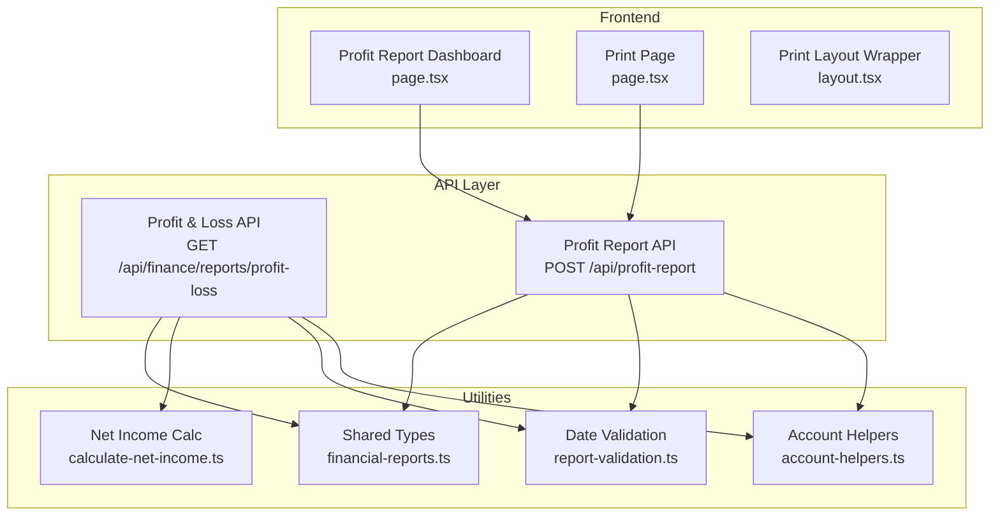
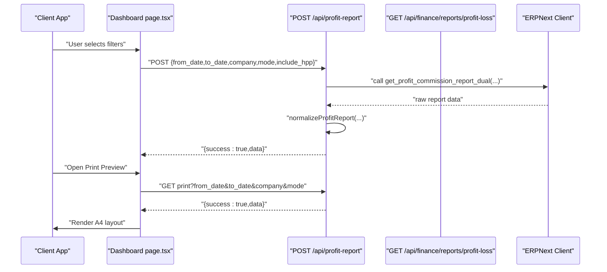
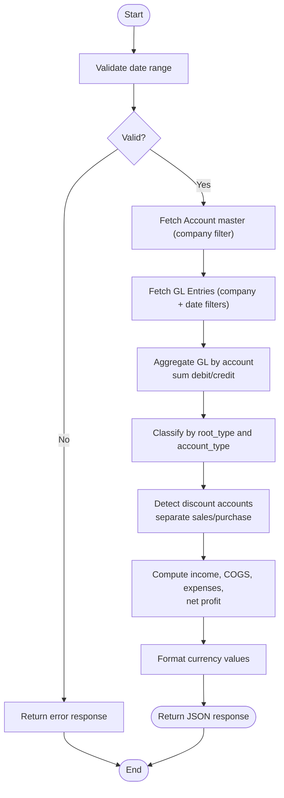
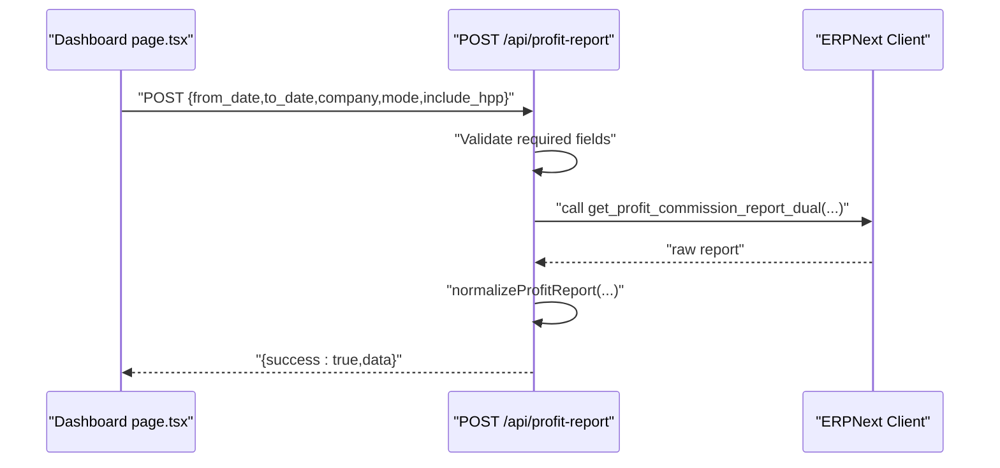
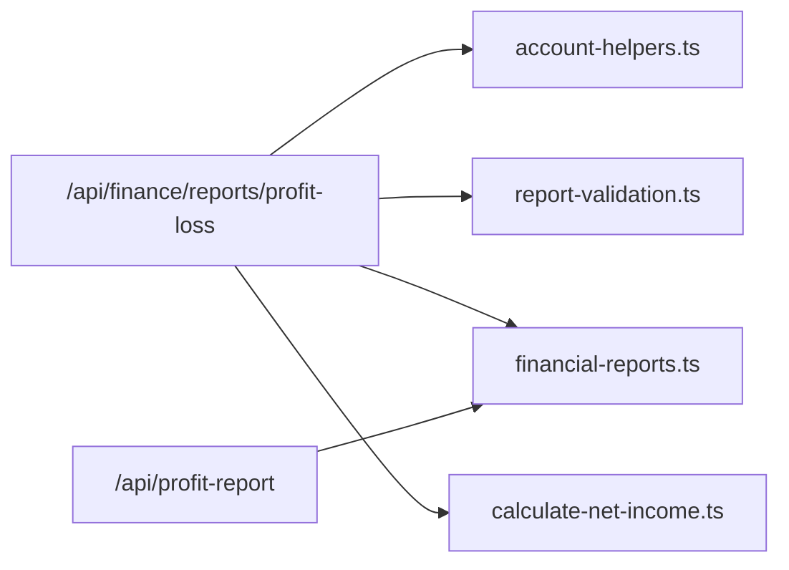

# Profit and Loss Statement

<cite>
**Referenced Files in This Document**
- [route.ts](file://app/api/finance/reports/profit-loss/route.ts)
- [route.ts](file://app/api/profit-report/route.ts)
- [page.tsx](file://app/(dashboard)/profit-report/page.tsx)
- [page.tsx](file://app/reports/profit/print/page.tsx)
- [layout.tsx](file://app/reports/profit/print/layout.tsx)
- [account-helpers.ts](file://utils/account-helpers.ts)
- [report-validation.ts](file://utils/report-validation.ts)
- [calculate-net-income.ts](file://lib/calculate-net-income.ts)
- [financial-reports.ts](file://types/financial-reports.ts)
</cite>

## Table of Contents
1. [Introduction](#introduction)
2. [Project Structure](#project-structure)
3. [Core Components](#core-components)
4. [Architecture Overview](#architecture-overview)
5. [Detailed Component Analysis](#detailed-component-analysis)
6. [Dependency Analysis](#dependency-analysis)
7. [Performance Considerations](#performance-considerations)
8. [Troubleshooting Guide](#troubleshooting-guide)
9. [Conclusion](#conclusion)
10. [Appendices](#appendices)

## Introduction
This document describes the Profit and Loss Statement report implementation in the system, focusing on revenue recognition, expense categorization, cost of goods sold (COGS) computation, and profit calculation methodologies. It also documents data sources from ERPNext GL entries, income statement components, and cost of goods sold calculations. Configuration options such as date ranges, company filters, and currency formatting are covered, along with formatting standards, comparative period analysis, and trend reporting. Guidance is included for customizing reports by business segments and profit centers, performance optimization for large datasets, caching strategies, integration with tax reporting, and troubleshooting profit calculation discrepancies.

## Project Structure
The Profit and Loss report spans API endpoints, frontend dashboards, and print/report rendering:
- API endpoints compute financial metrics from GL entries and account master data.
- The dashboard page renders charts, summaries, and drill-down tables.
- Print pages render A4-ready layouts for official distribution.
- Utility modules support account classification, date validation, and net income calculation.

**Diagram sources**
- [route.ts](file://app/api/finance/reports/profit-loss/route.ts#L50-L244)
- [route.ts](file://app/api/profit-report/route.ts#L10-L57)
- [page.tsx](file://app/(dashboard)/profit-report/page.tsx#L121-L686)
- [page.tsx](file://app/reports/profit/print/page.tsx#L21-L110)
- [layout.tsx](file://app/reports/profit/print/layout.tsx#L1-L15)
- [account-helpers.ts](file://utils/account-helpers.ts#L29-L39)
- [report-validation.ts](file://utils/report-validation.ts#L17-L53)
- [calculate-net-income.ts](file://lib/calculate-net-income.ts#L18-L44)
- [financial-reports.ts](file://types/financial-reports.ts#L9-L43)

**Section sources**
- [route.ts](file://app/api/finance/reports/profit-loss/route.ts#L50-L244)
- [route.ts](file://app/api/profit-report/route.ts#L10-L57)
- [page.tsx](file://app/(dashboard)/profit-report/page.tsx#L121-L686)
- [page.tsx](file://app/reports/profit/print/page.tsx#L21-L110)
- [layout.tsx](file://app/reports/profit/print/layout.tsx#L1-L15)
- [account-helpers.ts](file://utils/account-helpers.ts#L29-L39)
- [report-validation.ts](file://utils/report-validation.ts#L17-L53)
- [calculate-net-income.ts](file://lib/calculate-net-income.ts#L18-L44)
- [financial-reports.ts](file://types/financial-reports.ts#L9-L43)

## Core Components
- Profit & Loss API (GL-based): Aggregates GL entries by account, applies normal balances, detects discount accounts, computes income, COGS, expenses, and net profit.
- Profit Report API (dual-mode): Calls server-side report function, normalizes output, and supports valuation/margin modes and optional HPP inclusion.
- Dashboard UI: Renders summary cards, charts, and drill-down tables; supports filters and export/print.
- Print Rendering: A4-ready layout with totals and currency formatting.
- Utilities: Account classification helpers, date validation, and net income calculation.

**Section sources**
- [route.ts](file://app/api/finance/reports/profit-loss/route.ts#L50-L244)
- [route.ts](file://app/api/profit-report/route.ts#L10-L57)
- [page.tsx](file://app/(dashboard)/profit-report/page.tsx#L121-L686)
- [page.tsx](file://app/reports/profit/print/page.tsx#L21-L110)
- [account-helpers.ts](file://utils/account-helpers.ts#L29-L39)
- [report-validation.ts](file://utils/report-validation.ts#L17-L53)
- [calculate-net-income.ts](file://lib/calculate-net-income.ts#L18-L44)

## Architecture Overview
The system retrieves GL entries filtered by company and posting date range, builds account maps from the chart of accounts, aggregates debits/credits, and computes income, COGS, and expenses using normal balances. Discount accounts are detected via flexible heuristics and treated as contra accounts. The dual-mode profit report integrates with a server-side function and normalizes results for the UI.

**Diagram sources**
- [page.tsx](file://app/(dashboard)/profit-report/page.tsx#L152-L186)
- [route.ts](file://app/api/profit-report/route.ts#L10-L57)
- [page.tsx](file://app/reports/profit/print/page.tsx#L32-L50)

## Detailed Component Analysis

### Profit & Loss API (GL-based)
Responsibilities:
- Validate date range.
- Fetch chart of accounts and GL entries for the selected company and date range.
- Aggregate GL entries by account and compute amounts using normal balances.
- Detect discount accounts and separate sales/purchase discounts.
- Compute income, COGS, expenses, and net profit.
- Format currency values and return structured summary.

Key processing logic:
- Normal balance calculation: Income accounts use credit minus debit; Expense accounts use debit minus credit.
- Discount detection via account name or parent account heuristics.
- Filtering for gross sales, net sales, gross COGS, net COGS, and total expenses.
- Summary includes formatted currency values.

**Diagram sources**
- [route.ts](file://app/api/finance/reports/profit-loss/route.ts#L50-L244)
- [account-helpers.ts](file://utils/account-helpers.ts#L29-L39)
- [report-validation.ts](file://utils/report-validation.ts#L17-L53)

**Section sources**
- [route.ts](file://app/api/finance/reports/profit-loss/route.ts#L50-L244)
- [account-helpers.ts](file://utils/account-helpers.ts#L29-L39)
- [report-validation.ts](file://utils/report-validation.ts#L17-L53)

### Profit Report API (Dual-mode)
Responsibilities:
- Enforce authentication via site-aware session cookie.
- Call server-side report function with parameters: from_date, to_date, company, mode, include_hpp.
- Normalize raw report data and return to the UI.

**Diagram sources**
- [route.ts](file://app/api/profit-report/route.ts#L10-L57)

**Section sources**
- [route.ts](file://app/api/profit-report/route.ts#L10-L57)

### Dashboard UI (Filters, Charts, Tables)
Responsibilities:
- Provide date range, company, sales person, customer, and mode filters.
- Fetch and display summary cards, bar charts, and drill-down tables.
- Export to Excel and open print preview.

Highlights:
- Filters are normalized to ISO date format.
- Optional inclusion of HPP in computations.
- Print preview opens a dedicated print route with query parameters.

**Section sources**
- [page.tsx](file://app/(dashboard)/profit-report/page.tsx#L131-L223)
- [page.tsx](file://app/(dashboard)/profit-report/page.tsx#L305-L334)
- [page.tsx](file://app/(dashboard)/profit-report/page.tsx#L390-L483)

### Print Rendering (A4 Layout)
Responsibilities:
- Render an A4-friendly report with columns, summary cards, and totals.
- Automatically trigger browser print after data loads.
- Support localization formatting for currency and dates.

**Section sources**
- [page.tsx](file://app/reports/profit/print/page.tsx#L21-L110)
- [layout.tsx](file://app/reports/profit/print/layout.tsx#L1-L15)

### Shared Types and Utilities
- AccountMaster and GlEntry define the shape of chart of accounts and GL entries used across financial reports.
- Date validation ensures robust input handling for report queries.
- Net income calculation demonstrates the standard formula for income and expense balances.

**Section sources**
- [financial-reports.ts](file://types/financial-reports.ts#L9-L43)
- [report-validation.ts](file://utils/report-validation.ts#L17-L53)
- [calculate-net-income.ts](file://lib/calculate-net-income.ts#L18-L44)

## Dependency Analysis
- The GL-based Profit & Loss API depends on:
  - Account helpers for discount detection.
  - Date validation for input sanitization.
  - Shared types for account and GL entry structures.
  - Net income calculation utility for consistency checks.
- The dual-mode Profit Report API depends on:
  - Authentication helpers for site-aware sessions.
  - Normalization utilities for consistent output.
  - Shared types for typed requests/responses.

**Diagram sources**
- [route.ts](file://app/api/finance/reports/profit-loss/route.ts#L50-L244)
- [route.ts](file://app/api/profit-report/route.ts#L10-L57)
- [account-helpers.ts](file://utils/account-helpers.ts#L29-L39)
- [report-validation.ts](file://utils/report-validation.ts#L17-L53)
- [calculate-net-income.ts](file://lib/calculate-net-income.ts#L18-L44)
- [financial-reports.ts](file://types/financial-reports.ts#L9-L43)

**Section sources**
- [route.ts](file://app/api/finance/reports/profit-loss/route.ts#L50-L244)
- [route.ts](file://app/api/profit-report/route.ts#L10-L57)
- [account-helpers.ts](file://utils/account-helpers.ts#L29-L39)
- [report-validation.ts](file://utils/report-validation.ts#L17-L53)
- [calculate-net-income.ts](file://lib/calculate-net-income.ts#L18-L44)
- [financial-reports.ts](file://types/financial-reports.ts#L9-L43)

## Performance Considerations
- Data volume controls:
  - Limit page lengths for account and GL entry queries to manage memory and response size.
  - Apply strict date filters to reduce dataset size.
- Efficient aggregation:
  - Aggregate GL entries by account using a single pass map to minimize repeated scans.
  - Use targeted filters for income, expense, and COGS categories to avoid unnecessary processing.
- Client-side rendering:
  - Memoize computed datasets (e.g., comparison data) to prevent redundant recomputation.
  - Defer heavy operations until data is available.
- Printing and exporting:
  - Streamline print layout rendering and avoid blocking UI during print triggers.
  - Export only visible or summarized data to Excel to reduce payload.

[No sources needed since this section provides general guidance]

## Troubleshooting Guide
Common issues and resolutions:
- Zero or unexpected values in Profit & Loss:
  - Verify date range validity and ensure GL entries exist for the selected period.
  - Confirm company filter matches the intended entity.
  - Check discount account detection logic and adjust account naming conventions if needed.
- Variance between GL-based and period-closing net income:
  - Compare normal balance logic and ensure contra accounts are handled consistently.
  - Reconcile with net income calculation utility to validate totals.
- Formatting inconsistencies:
  - Ensure currency formatting is applied uniformly across APIs and print layouts.
- Authentication errors:
  - Confirm site-aware session cookie presence for the Profit Report API.

**Section sources**
- [report-validation.ts](file://utils/report-validation.ts#L17-L53)
- [calculate-net-income.ts](file://lib/calculate-net-income.ts#L18-L44)
- [route.ts](file://app/api/profit-report/route.ts#L14-L19)

## Conclusion
The Profit and Loss Statement implementation leverages ERPNext GL entries and chart of accounts to compute income, COGS, expenses, and net profit. The dual-mode profit report extends this with segment-level analytics and printing capabilities. Robust utilities ensure accurate discount handling, date validation, and consistent net income calculations. With appropriate configuration options and performance strategies, the report supports comparative analysis, trend insights, and integration with tax and management reporting.

[No sources needed since this section summarizes without analyzing specific files]

## Appendices

### Report Configuration Options
- Date range: from_date and to_date with validation.
- Company filter: defaults to environment/company if not provided.
- Currency formatting: standardized across APIs and print layouts.
- Comparative analysis: dashboard charts compare sales, COGS, gross profit, commission, and profit across invoices and segments.
- Trend reporting: historical comparisons supported by date range selection and export capabilities.

**Section sources**
- [route.ts](file://app/api/finance/reports/profit-loss/route.ts#L55-L66)
- [page.tsx](file://app/(dashboard)/profit-report/page.tsx#L390-L483)
- [page.tsx](file://app/reports/profit/print/page.tsx#L65-L99)

### Customization Examples
- Business segments:
  - Use sales person and customer filters to isolate segment performance.
  - Drill down from invoice-level to item-level for granular insights.
- Profit center reporting:
  - Aggregate by sales or customer groups to derive profit center contributions.
  - Combine with commission calculations for incentive alignment.

**Section sources**
- [page.tsx](file://app/(dashboard)/profit-report/page.tsx#L420-L483)
- [page.tsx](file://app/(dashboard)/profit-report/page.tsx#L533-L613)

### Integration with Tax Reporting
- Discount accounts are detected via naming conventions and parent account metadata, ensuring proper treatment in tax computations.
- Net income calculation follows standard financial formulas, aiding reconciliations with tax statements.

**Section sources**
- [account-helpers.ts](file://utils/account-helpers.ts#L29-L39)
- [calculate-net-income.ts](file://lib/calculate-net-income.ts#L18-L44)