# Report Utilities and Helpers

<cite>
**Referenced Files in This Document**
- [report-utils.ts](file://lib/report-utils.ts)
- [report-auth-helper.ts](file://lib/report-auth-helper.ts)
- [print-utils.ts](file://lib/print-utils.ts)
- [FilterSection.tsx](file://components/reports/FilterSection.tsx)
- [SummaryCards.tsx](file://components/reports/SummaryCards.tsx)
- [ReportLayout.tsx](file://components/print/ReportLayout.tsx)
- [PrintLayout.tsx](file://components/print/PrintLayout.tsx)
- [print.ts](file://types/print.ts)
- [route.ts](file://app/api/finance/reports/profit-loss/route.ts)
</cite>

## Table of Contents
1. [Introduction](#introduction)
2. [Project Structure](#project-structure)
3. [Core Components](#core-components)
4. [Architecture Overview](#architecture-overview)
5. [Detailed Component Analysis](#detailed-component-analysis)
6. [Dependency Analysis](#dependency-analysis)
7. [Performance Considerations](#performance-considerations)
8. [Troubleshooting Guide](#troubleshooting-guide)
9. [Conclusion](#conclusion)

## Introduction
This document describes the report utilities and helper modules that power financial and system reporting in the application. It covers:
- Common report functionality: currency formatting, date range processing, and data aggregation across multiple sources
- Authentication helpers for access control and audit-ready request headers
- Print utilities for report layout optimization, PDF generation, and printer-specific formatting
- Examples of filter section implementation, summary card creation, and dynamic report parameter handling
- Performance optimization techniques for large datasets, caching strategies, and memory management
- Troubleshooting guidance for rendering, authentication, and print formatting issues

## Project Structure
The report-related functionality spans three primary areas:
- Shared utilities for report data transformation and formatting
- Print system utilities and layout components for reports and transaction documents
- UI components for report filters and summary cards
- API routes that fetch and aggregate data for reports

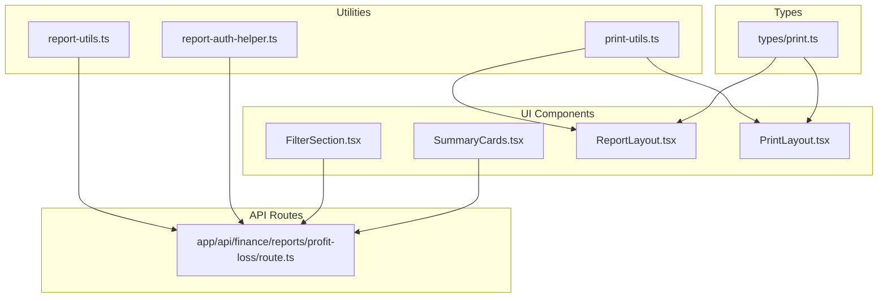

**Diagram sources**
- [report-utils.ts](file://lib/report-utils.ts#L1-L108)
- [report-auth-helper.ts](file://lib/report-auth-helper.ts#L1-L21)
- [print-utils.ts](file://lib/print-utils.ts#L1-L574)
- [FilterSection.tsx](file://components/reports/FilterSection.tsx#L1-L92)
- [SummaryCards.tsx](file://components/reports/SummaryCards.tsx#L1-L46)
- [ReportLayout.tsx](file://components/print/ReportLayout.tsx#L1-L381)
- [PrintLayout.tsx](file://components/print/PrintLayout.tsx#L1-L622)
- [print.ts](file://types/print.ts#L1-L327)
- [route.ts](file://app/api/finance/reports/profit-loss/route.ts#L1-L244)

**Section sources**
- [report-utils.ts](file://lib/report-utils.ts#L1-L108)
- [report-auth-helper.ts](file://lib/report-auth-helper.ts#L1-L21)
- [print-utils.ts](file://lib/print-utils.ts#L1-L574)
- [FilterSection.tsx](file://components/reports/FilterSection.tsx#L1-L92)
- [SummaryCards.tsx](file://components/reports/SummaryCards.tsx#L1-L46)
- [ReportLayout.tsx](file://components/print/ReportLayout.tsx#L1-L381)
- [PrintLayout.tsx](file://components/print/PrintLayout.tsx#L1-L622)
- [print.ts](file://types/print.ts#L1-L327)
- [route.ts](file://app/api/finance/reports/profit-loss/route.ts#L1-L244)

## Core Components
This section outlines the core modules and their responsibilities.

- Report utilities
  - Date formatting helpers for API and display
  - Number and currency formatting with Indonesian locale
  - Summary calculators for invoices and payments
  - Status badge color mapping
  - Current date and month boundary helpers

- Report authentication helper
  - Dual authentication support: API key and session cookie
  - Generates standardized headers for ERPNext API requests

- Print utilities
  - Paper dimension constants and conversions
  - Page dimension calculation for continuous and sheet modes
  - Margin and printable area definitions
  - CSS @page rule generation
  - Indonesian localization for labels, currency, dates, and number-to-words conversion

- Report UI components
  - FilterSection: date range, search, and action buttons
  - SummaryCards: colored summary cards with configurable values

- Print layouts
  - ReportLayout: A4 sheet-based report with pagination and totals
  - PrintLayout: Continuous form for transaction documents with metadata, items, totals, and signatures

**Section sources**
- [report-utils.ts](file://lib/report-utils.ts#L1-L108)
- [report-auth-helper.ts](file://lib/report-auth-helper.ts#L1-L21)
- [print-utils.ts](file://lib/print-utils.ts#L1-L574)
- [FilterSection.tsx](file://components/reports/FilterSection.tsx#L1-L92)
- [SummaryCards.tsx](file://components/reports/SummaryCards.tsx#L1-L46)
- [ReportLayout.tsx](file://components/print/ReportLayout.tsx#L1-L381)
- [PrintLayout.tsx](file://components/print/PrintLayout.tsx#L1-L622)
- [print.ts](file://types/print.ts#L1-L327)

## Architecture Overview
The report pipeline integrates UI components, utilities, and API routes to produce formatted reports and printable documents.

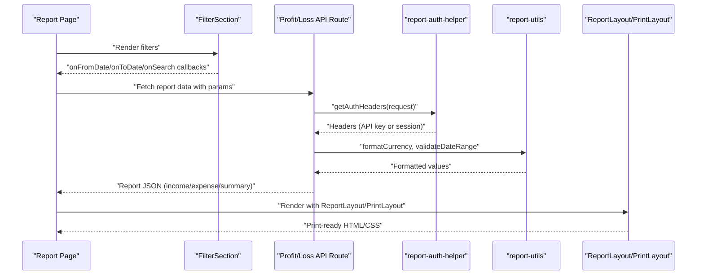

**Diagram sources**
- [FilterSection.tsx](file://components/reports/FilterSection.tsx#L1-L92)
- [route.ts](file://app/api/finance/reports/profit-loss/route.ts#L1-L244)
- [report-auth-helper.ts](file://lib/report-auth-helper.ts#L1-L21)
- [report-utils.ts](file://lib/report-utils.ts#L1-L108)
- [ReportLayout.tsx](file://components/print/ReportLayout.tsx#L1-L381)
- [PrintLayout.tsx](file://components/print/PrintLayout.tsx#L1-L622)

## Detailed Component Analysis

### Report Utilities
Key capabilities:
- Date conversion between API and display formats
- Currency and number formatting aligned with Indonesian locale
- Summary calculations for invoices and payments
- Status badge color classification
- Date helpers for current date and month boundaries

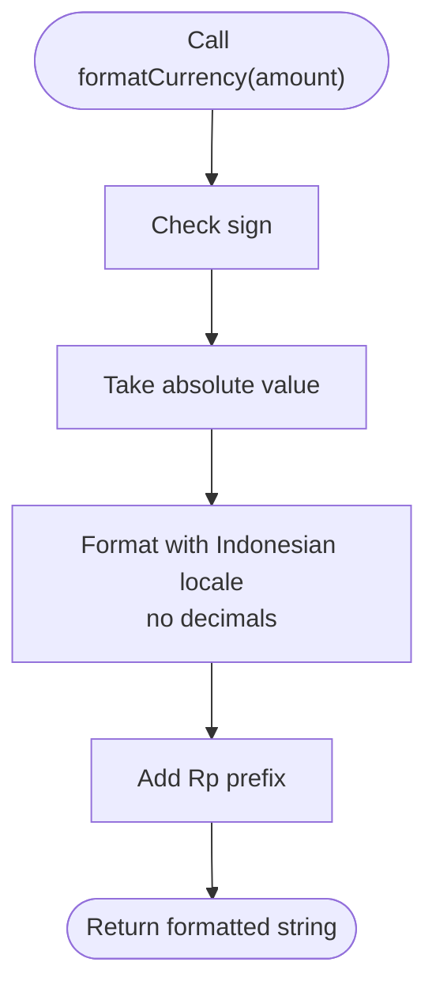

**Diagram sources**
- [report-utils.ts](file://lib/report-utils.ts#L26-L38)

**Section sources**
- [report-utils.ts](file://lib/report-utils.ts#L1-L108)

### Report Authentication Helper
Dual authentication strategy:
- Prefer API key/secret when configured
- Fallback to session cookie (sid) when API key is unavailable
- Returns standardized headers for ERPNext API calls

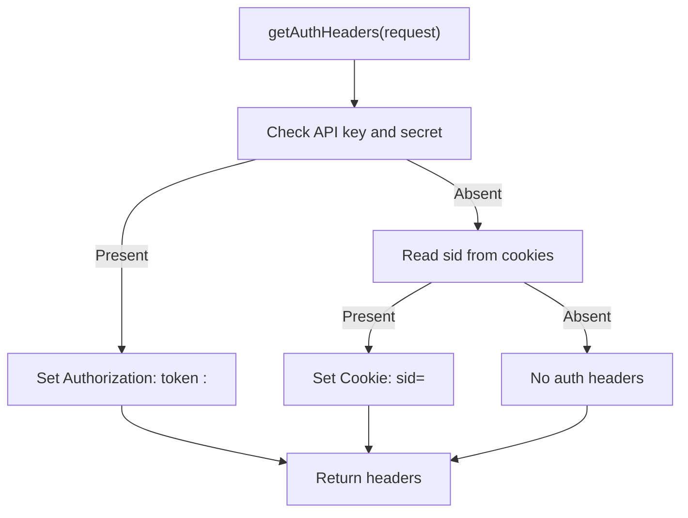

**Diagram sources**
- [report-auth-helper.ts](file://lib/report-auth-helper.ts#L1-L21)

**Section sources**
- [report-auth-helper.ts](file://lib/report-auth-helper.ts#L1-L21)

### Print Utilities
Capabilities:
- Conversion constants between millimeters and pixels
- Paper dimensions and printable areas for A4 and continuous forms
- Page dimension calculation by mode, size, and orientation
- Margin retrieval and printable area helpers
- CSS @page rule generation
- Indonesian localization for labels, currency, dates, and number-to-words conversion

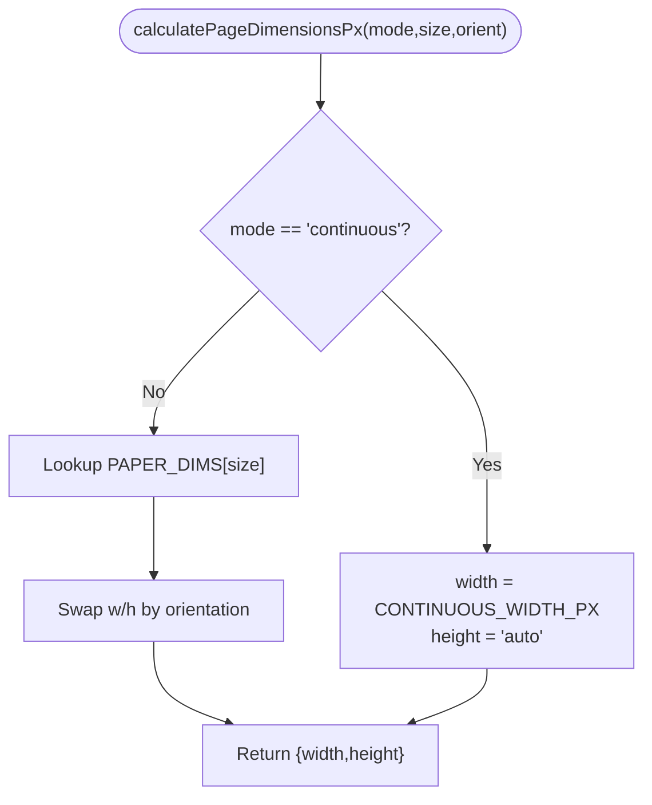

**Diagram sources**
- [print-utils.ts](file://lib/print-utils.ts#L153-L192)

**Section sources**
- [print-utils.ts](file://lib/print-utils.ts#L1-L574)

### Report UI Components

#### FilterSection
- Provides date range inputs, a free-text search, and action buttons
- Accepts additional filters via a slot
- Emits callbacks for clearing and refreshing filters

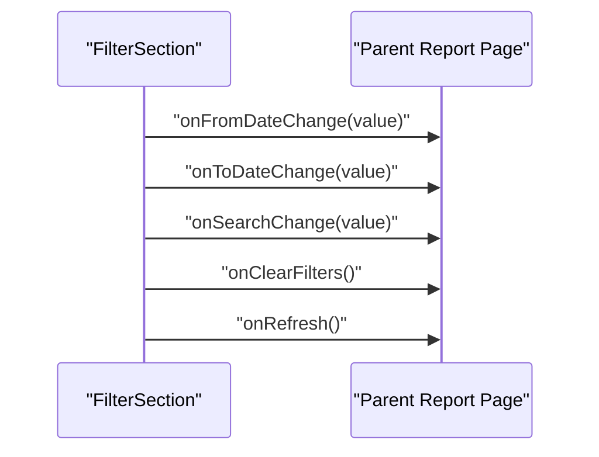

**Diagram sources**
- [FilterSection.tsx](file://components/reports/FilterSection.tsx#L1-L92)

**Section sources**
- [FilterSection.tsx](file://components/reports/FilterSection.tsx#L1-L92)

#### SummaryCards
- Renders a responsive grid of summary cards
- Supports color variants and value formatting
- Accepts an array of card objects with label, value, and color

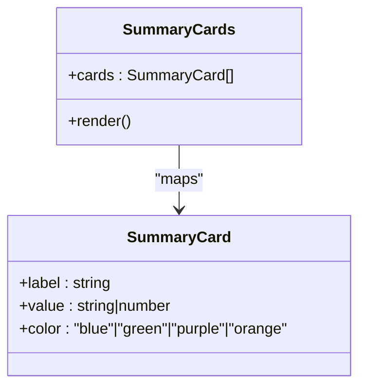

**Diagram sources**
- [SummaryCards.tsx](file://components/reports/SummaryCards.tsx#L1-L46)

**Section sources**
- [SummaryCards.tsx](file://components/reports/SummaryCards.tsx#L1-L46)

### Print Layouts

#### ReportLayout (A4 Sheet Reports)
- Fixed A4 dimensions with standard margins
- Pagination computed from content height
- Header, table (with optional hierarchy), and footer with page numbers
- Designed for financial/system reports requiring structured totals

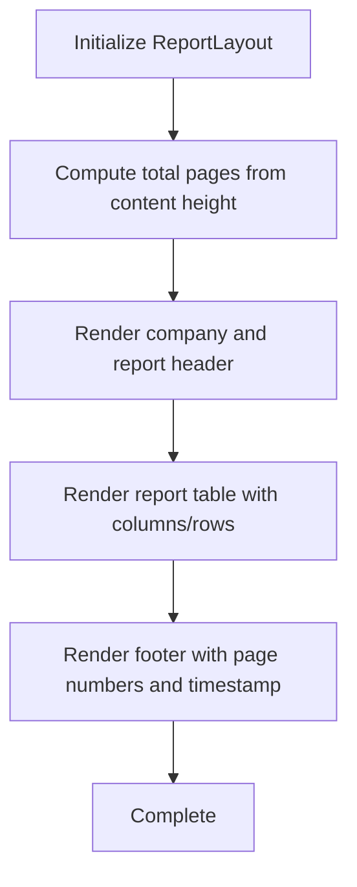

**Diagram sources**
- [ReportLayout.tsx](file://components/print/ReportLayout.tsx#L1-L381)

**Section sources**
- [ReportLayout.tsx](file://components/print/ReportLayout.tsx#L1-L381)
- [print.ts](file://types/print.ts#L188-L236)

#### PrintLayout (Continuous Transaction Documents)
- Continuous form layout optimized for dot matrix printers
- Includes document header, metadata, item table, totals, notes, signatures, and footer
- Right-aligned totals and Terbilang (amount in words) support

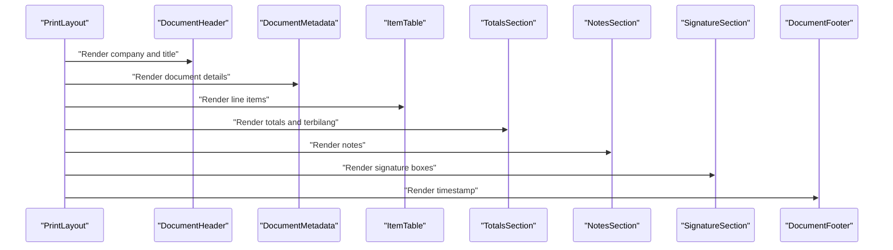

**Diagram sources**
- [PrintLayout.tsx](file://components/print/PrintLayout.tsx#L1-L622)
- [print.ts](file://types/print.ts#L66-L182)

**Section sources**
- [PrintLayout.tsx](file://components/print/PrintLayout.tsx#L1-L622)
- [print.ts](file://types/print.ts#L1-L327)

### API Route Example: Profit and Loss
The profit-loss route demonstrates:
- Parameter extraction (company, from_date, to_date)
- Date range validation
- Fetching account master and GL entries
- Aggregation by account and classification by root type
- Summary computation and formatted currency responses
- Audit-ready error handling and site-aware responses

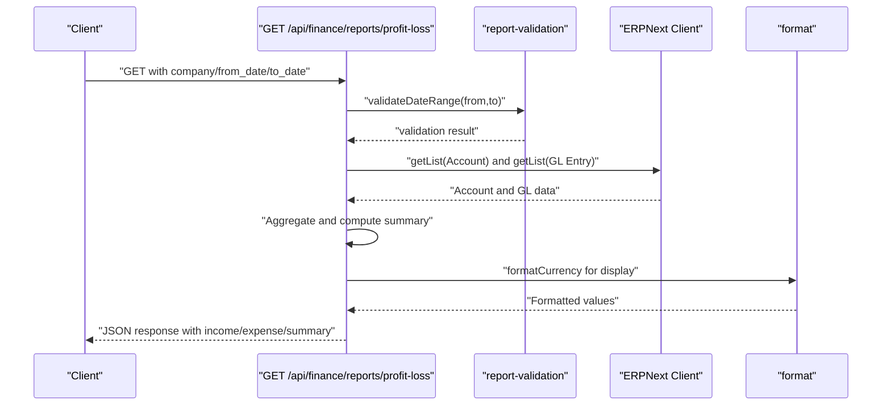

**Diagram sources**
- [route.ts](file://app/api/finance/reports/profit-loss/route.ts#L1-L244)

**Section sources**
- [route.ts](file://app/api/finance/reports/profit-loss/route.ts#L1-L244)

## Dependency Analysis
The following diagram shows key dependencies among report utilities, authentication, print utilities, and layout components.

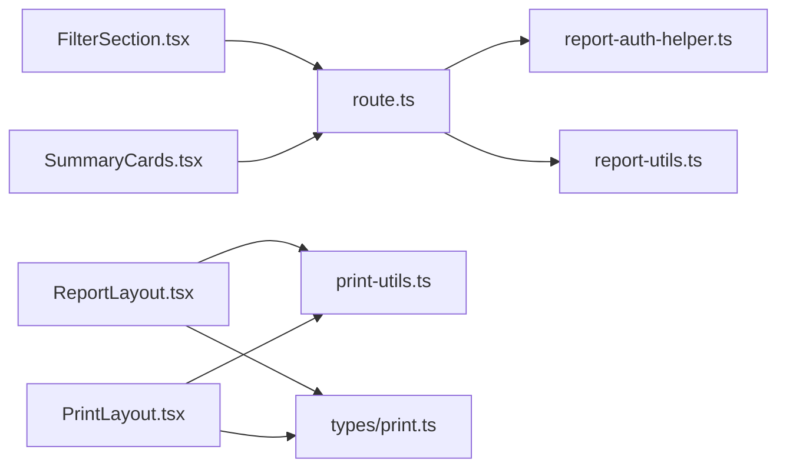

**Diagram sources**
- [FilterSection.tsx](file://components/reports/FilterSection.tsx#L1-L92)
- [SummaryCards.tsx](file://components/reports/SummaryCards.tsx#L1-L46)
- [route.ts](file://app/api/finance/reports/profit-loss/route.ts#L1-L244)
- [report-auth-helper.ts](file://lib/report-auth-helper.ts#L1-L21)
- [report-utils.ts](file://lib/report-utils.ts#L1-L108)
- [ReportLayout.tsx](file://components/print/ReportLayout.tsx#L1-L381)
- [PrintLayout.tsx](file://components/print/PrintLayout.tsx#L1-L622)
- [print-utils.ts](file://lib/print-utils.ts#L1-L574)
- [print.ts](file://types/print.ts#L1-L327)

**Section sources**
- [FilterSection.tsx](file://components/reports/FilterSection.tsx#L1-L92)
- [SummaryCards.tsx](file://components/reports/SummaryCards.tsx#L1-L46)
- [route.ts](file://app/api/finance/reports/profit-loss/route.ts#L1-L244)
- [report-auth-helper.ts](file://lib/report-auth-helper.ts#L1-L21)
- [report-utils.ts](file://lib/report-utils.ts#L1-L108)
- [ReportLayout.tsx](file://components/print/ReportLayout.tsx#L1-L381)
- [PrintLayout.tsx](file://components/print/PrintLayout.tsx#L1-L622)
- [print-utils.ts](file://lib/print-utils.ts#L1-L574)
- [print.ts](file://types/print.ts#L1-L327)

## Performance Considerations
- Data aggregation
  - Use efficient map-based aggregations to avoid repeated scans
  - Limit page sizes for large lists to reduce memory footprint
  - Precompute derived values (e.g., formatted amounts) during aggregation to minimize runtime formatting overhead

- Rendering
  - For reports, compute pagination based on content height to prevent overflow and improve print quality
  - Avoid unnecessary reflows by batching DOM updates and using stable keys for rows

- Caching
  - Cache frequently accessed report parameters (e.g., account master) per request lifecycle
  - Cache formatted currency and localized strings when reused across rows
  - Consider server-side caching for static report configurations

- Memory management
  - Paginate large datasets before rendering
  - Dispose of temporary arrays after aggregation
  - Use streaming or chunked rendering for very large reports

[No sources needed since this section provides general guidance]

## Troubleshooting Guide

- Report rendering issues
  - Verify paper mode and dimensions match the document type (continuous vs sheet)
  - Ensure printable area and margins are correctly applied
  - Confirm pagination logic does not cause content overflow

- Authentication failures
  - Confirm API key and secret environment variables are set
  - Validate session cookie presence when API key is absent
  - Check that headers are included in API requests

- Print formatting problems
  - Validate CSS @page rules for the selected mode and orientation
  - Ensure labels and currency formatting use Indonesian locale
  - Confirm Terbilang conversion handles edge cases (negative, zero, large numbers)

**Section sources**
- [print-utils.ts](file://lib/print-utils.ts#L244-L276)
- [report-auth-helper.ts](file://lib/report-auth-helper.ts#L1-L21)
- [ReportLayout.tsx](file://components/print/ReportLayout.tsx#L1-L381)
- [PrintLayout.tsx](file://components/print/PrintLayout.tsx#L1-L622)

## Conclusion
The report utilities and helpers provide a cohesive foundation for building financial and system reports. They offer robust data transformation, secure authentication, and printer-friendly layouts tailored to Indonesian localization. By leveraging the provided components and following the performance and troubleshooting guidance, teams can deliver reliable, scalable, and compliant reporting experiences.