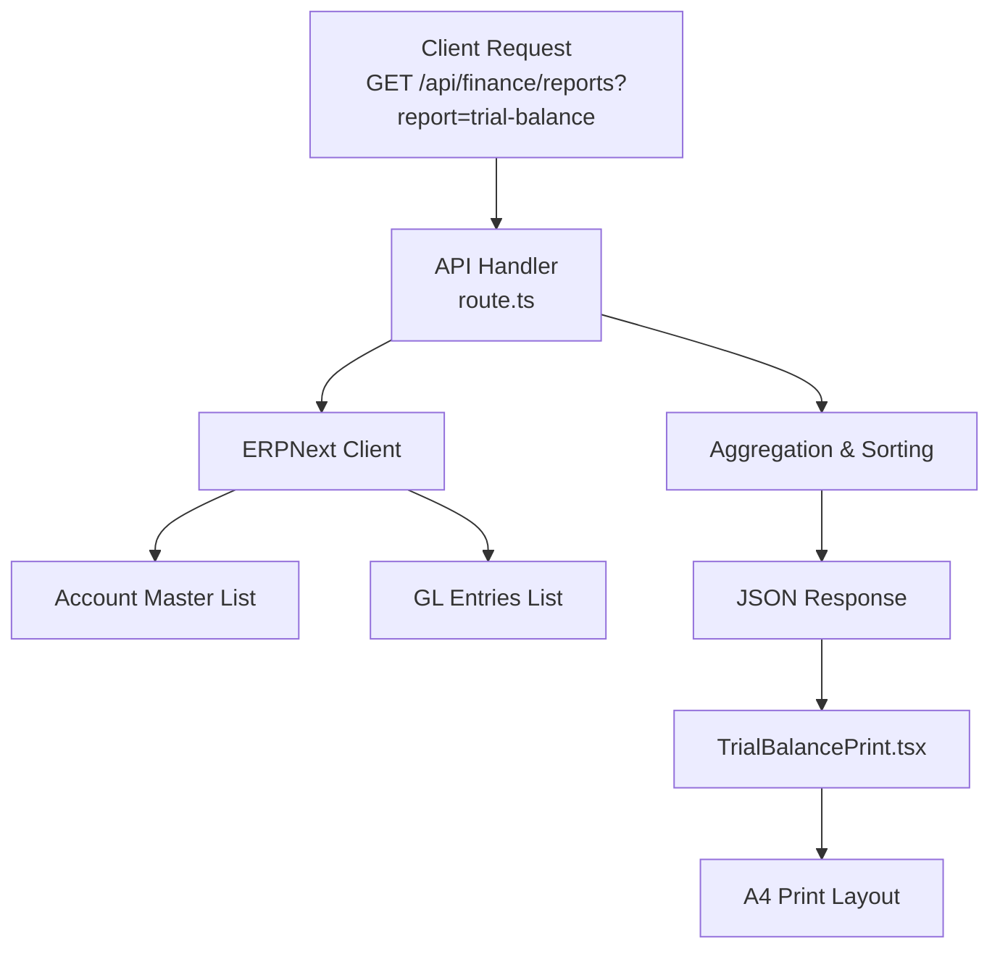
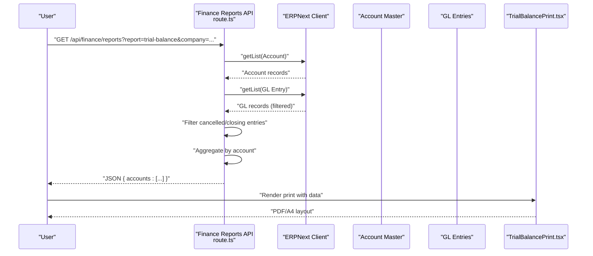
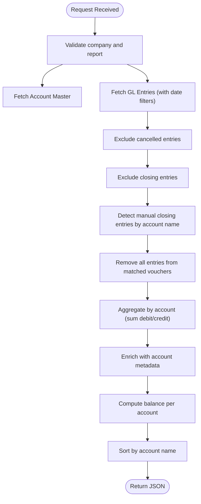
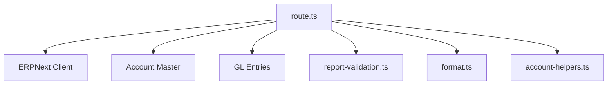

# Trial Balance Report

<cite>
**Referenced Files in This Document**
- [route.ts](file://app/api/finance/reports/route.ts)
- [TrialBalancePrint.tsx](file://components/print/TrialBalancePrint.tsx)
- [balance-sheet\route.ts](file://app/api/finance/reports/balance-sheet/route.ts)
- [profit-loss\route.ts](file://app/api/finance/reports/profit-loss/route.ts)
- [report-validation.ts](file://lib/report-validation.ts)
- [account-helpers.ts](file://lib/account-helpers.ts)
- [format.ts](file://lib/format.ts)
- [CLOSING_JOURNAL_IMPACT.md](file://docs/accounting-period/CLOSING_JOURNAL_IMPACT.md)
- [print-financial-reports.test.tsx](file://tests/print-financial-reports.test.tsx)
</cite>

## Table of Contents
1. [Introduction](#introduction)
2. [Project Structure](#project-structure)
3. [Core Components](#core-components)
4. [Architecture Overview](#architecture-overview)
5. [Detailed Component Analysis](#detailed-component-analysis)
6. [Dependency Analysis](#dependency-analysis)
7. [Performance Considerations](#performance-considerations)
8. [Troubleshooting Guide](#troubleshooting-guide)
9. [Conclusion](#conclusion)
10. [Appendices](#appendices)

## Introduction
This document provides comprehensive documentation for the Trial Balance Report within the ERPNext system. It explains how the report aggregates account-wise debit and credit balances, reconciles accounts, validates ledger postings, and supports financial closing procedures. It also covers report configuration options, formatting standards, account hierarchy presentation, and analytical reporting by account type. Guidance is included for performance considerations, customization across chart of accounts structures, integration with subsidiary ledgers, and troubleshooting discrepancies and year-end adjustments.

## Project Structure
The Trial Balance Report is implemented as a server-side API endpoint that fetches GL entries and account master data, aggregates balances, and returns structured data consumable by the frontend and print components. The print rendering is handled by a dedicated print component that formats the data according to Indonesian localization and A4 layout requirements.

**Diagram sources**
- [route.ts](file://app/api/finance/reports/route.ts#L55-L282)
- [TrialBalancePrint.tsx](file://components/print/TrialBalancePrint.tsx#L71-L112)

**Section sources**
- [route.ts](file://app/api/finance/reports/route.ts#L55-L282)
- [TrialBalancePrint.tsx](file://components/print/TrialBalancePrint.tsx#L1-L113)

## Core Components
- API Endpoint for Trial Balance:
  - Accepts company, report type, and optional date filters.
  - Excludes cancelled entries and closing entries from aggregation.
  - Filters out manual closing entries by identifying specific voucher numbers.
  - Aggregates GL entries by account and computes debit, credit, and balance.
  - Sorts results by account name for consistent presentation.
- Print Component:
  - Formats currency using Indonesian locale and currency code.
  - Presents account hierarchy via indentation and subtotal/grand total rows.
  - Renders a fixed A4 layout suitable for printing.

Key behaviors:
- Data filtering excludes cancelled and closing entries to ensure accurate trial balance computation.
- Manual closing entries are detected and removed to avoid double-counting in period balances.
- Sorting ensures deterministic output for reconciliation and auditing.

**Section sources**
- [route.ts](file://app/api/finance/reports/route.ts#L55-L175)
- [TrialBalancePrint.tsx](file://components/print/TrialBalancePrint.tsx#L44-L112)

## Architecture Overview
The Trial Balance pipeline integrates with the ERPNext client to fetch account and GL data, applies business rules for exclusions and filtering, aggregates balances, and returns a normalized dataset. The print component consumes this dataset to render a standardized report.

**Diagram sources**
- [route.ts](file://app/api/finance/reports/route.ts#L87-L175)
- [TrialBalancePrint.tsx](file://components/print/TrialBalancePrint.tsx#L71-L112)

## Detailed Component Analysis

### API Endpoint: Trial Balance Aggregation
Responsibilities:
- Validate presence of company and report parameters.
- Fetch account master data for the company to enrich GL entries with account metadata.
- Retrieve GL entries with optional date filters and exclude cancelled entries and closing entries.
- Detect and remove manual closing entries by voucher number.
- Aggregate debits and credits per account and compute balances.
- Enrich with account name, number, root type, and account type.
- Sort by account name for consistent ordering.

Processing logic highlights:
- Exclusion of cancelled entries prevents invalid postings from skewing balances.
- Exclusion of closing entries avoids double counting during period-end procedures.
- Manual closing entries are identified by scanning for a specific account name pattern and removing all entries from those vouchers.
- Sorting uses locale-aware comparison to ensure consistent ordering across locales.

**Diagram sources**
- [route.ts](file://app/api/finance/reports/route.ts#L55-L175)

**Section sources**
- [route.ts](file://app/api/finance/reports/route.ts#L55-L175)

### Print Component: Trial Balance Rendering
Responsibilities:
- Define report columns for account, debit, and credit.
- Map internal data to report rows supporting hierarchy, subtotals, and grand totals.
- Format currency using Indonesian locale and currency code.
- Render an A4 print layout with hierarchy and totals enabled.

Formatting standards:
- Currency uses Indonesian Rupiah with zero decimals and localized separators.
- Columns are sized for A4 printing with left-aligned account names and right-aligned monetary values.

Hierarchy presentation:
- Indentation indicates account hierarchy depth.
- Subtotal and grand total rows are marked for proper rendering.

**Section sources**
- [TrialBalancePrint.tsx](file://components/print/TrialBalancePrint.tsx#L23-L112)

### Comparative Reporting Context
While focused on Trial Balance, the system also provides Balance Sheet and Profit & Loss reports. These reports rely on similar data retrieval and aggregation patterns but apply different categorizations and computations:
- Balance Sheet aggregates by root type and account type, adds net profit/loss to equity, and computes totals.
- Profit & Loss aggregates income and expense accounts, recognizes discount accounts, and computes summarized values.

These reports complement the Trial Balance in financial closing and reconciliation workflows.

**Section sources**
- [balance-sheet\route.ts](file://app/api/finance/reports/balance-sheet/route.ts#L113-L255)
- [profit-loss\route.ts](file://app/api/finance/reports/profit-loss/route.ts#L118-L236)

## Dependency Analysis
The Trial Balance API depends on:
- ERPNext client for data retrieval.
- Account master data for enrichment (account name, number, root type, account type).
- GL entries for debits, credits, and posting dates.
- Utility modules for validation, formatting, and account helpers.

**Diagram sources**
- [route.ts](file://app/api/finance/reports/route.ts#L1-L10)
- [report-validation.ts](file://lib/report-validation.ts)
- [format.ts](file://lib/format.ts)
- [account-helpers.ts](file://lib/account-helpers.ts)

**Section sources**
- [route.ts](file://app/api/finance/reports/route.ts#L1-L10)

## Performance Considerations
- Data volume controls:
  - Page length limits are applied when fetching account and GL entry lists to prevent oversized payloads.
  - Filtering by company and optional date ranges reduces dataset size.
- Aggregation efficiency:
  - Single-pass aggregation by account minimizes repeated scans.
  - Map-based lookups for account master and aggregated rows improve access speed.
- Sorting:
  - Locale-aware sorting is used for deterministic ordering; consider indexing account names at the database level for very large datasets.
- Exclusions:
  - Early filtering of cancelled and closing entries reduces downstream processing.
- Printing:
  - Rendering is optimized for A4; avoid unnecessary transformations in the print pipeline.

Recommendations:
- Monitor query performance for large companies with extensive GL histories; consider partitioning or indexed views if needed.
- Batch processing and pagination should be considered for extremely large datasets.

**Section sources**
- [route.ts](file://app/api/finance/reports/route.ts#L87-L129)

## Troubleshooting Guide
Common issues and resolutions:
- Unauthorized or missing parameters:
  - Ensure company and report parameters are present; the API returns a 400 error otherwise.
- Empty or imbalanced results:
  - Verify date filters and confirm that closing entries are excluded as intended.
  - Confirm that manual closing entries are not being reintroduced inadvertently.
- Currency formatting inconsistencies:
  - Use the print component’s formatter to ensure consistent Indonesian Rupiah formatting.
- Hierarchy display anomalies:
  - Confirm that the print component receives accounts with proper indentation and subtotal markers.
- Year-end and closing procedures:
  - After closing, Trial Balance should reflect only balance sheet accounts; income and expense accounts should have zero balances.
  - Review closing journal impact documentation to understand expected outcomes.

Validation references:
- Unit tests validate hierarchy support, empty data handling, and optional fields.
- Closing journal impact documentation outlines expected post-closing behavior.

**Section sources**
- [route.ts](file://app/api/finance/reports/route.ts#L65-L81)
- [print-financial-reports.test.tsx](file://tests/print-financial-reports.test.tsx#L329-L383)
- [CLOSING_JOURNAL_IMPACT.md](file://docs/accounting-period/CLOSING_JOURNAL_IMPACT.md#L171-L207)

## Conclusion
The Trial Balance Report provides a reliable, filtered, and aggregated view of account balances suitable for reconciliation, financial closing, and validation. Its design emphasizes exclusion of invalid entries, robust aggregation, and standardized printing. By leveraging the provided configuration options and following the troubleshooting guidance, organizations can maintain accurate trial balances across diverse chart of accounts structures and subsidiaries.

## Appendices

### Report Configuration Options
- Required parameters:
  - company: Target company identifier.
  - report: Must be trial-balance for this endpoint.
- Optional parameters:
  - from_date, to_date: Limit GL entries to a specific period.
- Behavior:
  - Excludes cancelled entries and closing entries.
  - Removes manual closing entries by detecting specific account names and associated voucher numbers.
  - Sorts results by account name.

**Section sources**
- [route.ts](file://app/api/finance/reports/route.ts#L62-L110)
- [route.ts](file://app/api/finance/reports/route.ts#L131-L152)

### Formatting Standards
- Currency:
  - Indonesian Rupiah (IDR) with zero decimal places and localized thousands separators.
- Columns:
  - Account: Left-aligned.
  - Debit: Right-aligned.
  - Credit: Right-aligned.
- Paper:
  - A4 print layout with hierarchy and totals.

**Section sources**
- [TrialBalancePrint.tsx](file://components/print/TrialBalancePrint.tsx#L44-L93)

### Account Hierarchy Presentation
- Indentation reflects hierarchical depth.
- Subtotal and grand total rows are supported for analytical summaries.

**Section sources**
- [TrialBalancePrint.tsx](file://components/print/TrialBalancePrint.tsx#L55-L65)
- [print-financial-reports.test.tsx](file://tests/print-financial-reports.test.tsx#L329-L348)

### Analytical Reporting by Account Type
- While the Trial Balance focuses on balances, the system’s Balance Sheet and Profit & Loss endpoints demonstrate how account types and root types are used for categorization and computation.
- These reports can be used alongside the Trial Balance for deeper analysis.

**Section sources**
- [balance-sheet\route.ts](file://app/api/finance/reports/balance-sheet/route.ts#L149-L167)
- [profit-loss\route.ts](file://app/api/finance/reports/profit-loss/route.ts#L152-L169)

### Customization Examples
- Chart of Accounts structures:
  - The API enriches data with account name, number, root type, and account type; ensure these fields are populated consistently in the account master.
- Subsidiary Ledgers integration:
  - GL entries from subsidiaries are aggregated automatically; ensure posting dates and account mappings are correct.
- Comparative period analysis:
  - Use from_date and to_date to compare balances across periods.

**Section sources**
- [route.ts](file://app/api/finance/reports/route.ts#L87-L129)
- [route.ts](file://app/api/finance/reports/route.ts#L156-L175)

### Bulk Posting Validation
- The API excludes cancelled entries and closing entries to prevent skewed balances.
- Manual closing entries are detected and removed by voucher number to avoid double counting.

**Section sources**
- [route.ts](file://app/api/finance/reports/route.ts#L99-L142)

### Year-End Adjustment Procedures
- After closing, Trial Balance should reflect only balance sheet accounts; income and expense accounts should have zero balances.
- Review closing journal impact documentation for expected outcomes.

**Section sources**
- [CLOSING_JOURNAL_IMPACT.md](file://docs/accounting-period/CLOSING_JOURNAL_IMPACT.md#L171-L207)