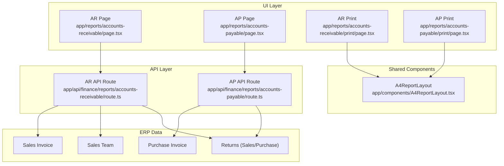
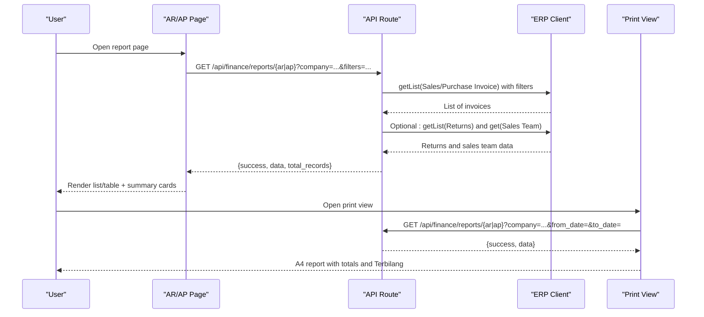
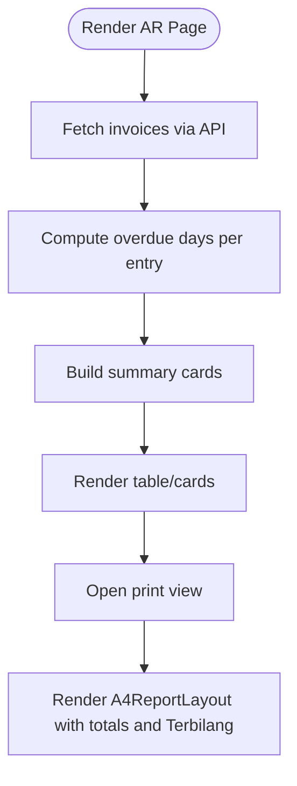
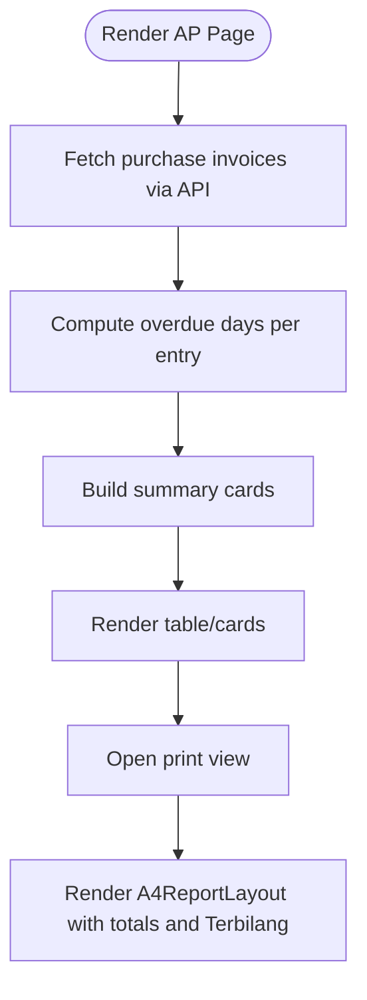
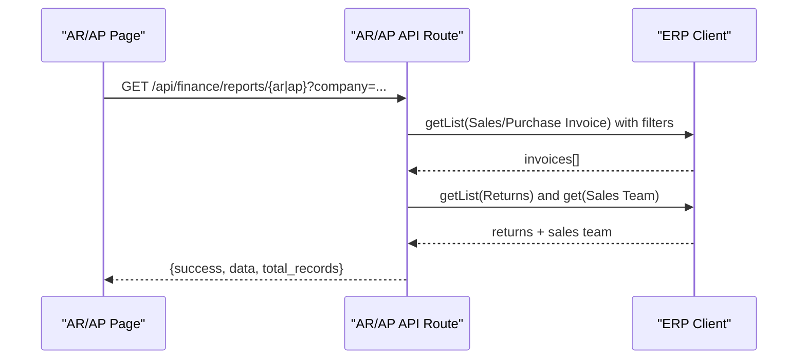
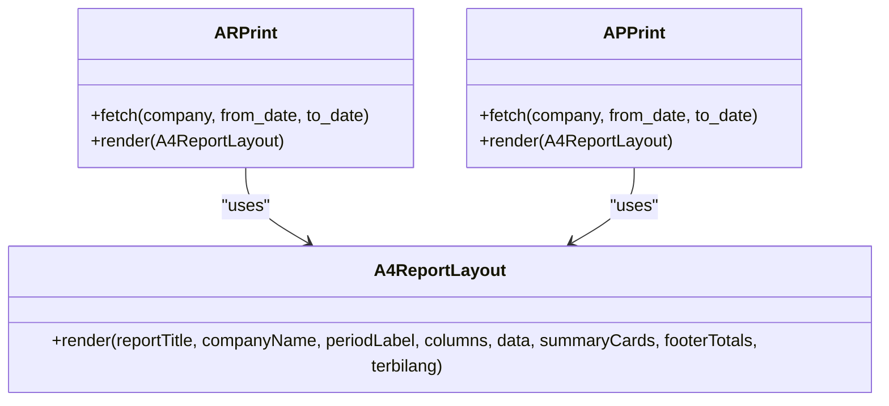
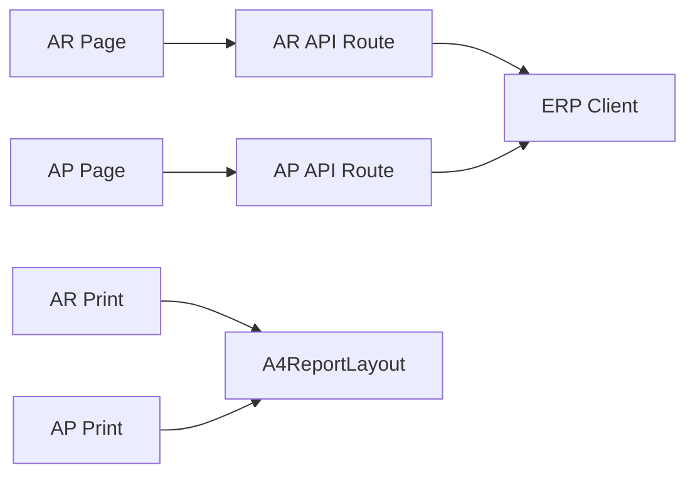

# Accounts Receivable & Payable Reports

<cite>
**Referenced Files in This Document**
- [app/reports/accounts-receivable/page.tsx](file://app/reports/accounts-receivable/page.tsx)
- [app/reports/accounts-receivable/print/page.tsx](file://app/reports/accounts-receivable/print/page.tsx)
- [app/reports/accounts-receivable/print/layout.tsx](file://app/reports/accounts-receivable/print/layout.tsx)
- [app/api/finance/reports/accounts-receivable/route.ts](file://app/api/finance/reports/accounts-receivable/route.ts)
- [app/reports/accounts-payable/page.tsx](file://app/reports/accounts-payable/page.tsx)
- [app/reports/accounts-payable/print/page.tsx](file://app/reports/accounts-payable/print/page.tsx)
- [app/reports/accounts-payable/print/layout.tsx](file://app/reports/accounts-payable/print/layout.tsx)
- [app/api/finance/reports/accounts-payable/route.ts](file://app/api/finance/reports/accounts-payable/route.ts)
- [app/components/A4ReportLayout.tsx](file://app/components/A4ReportLayout.tsx)
- [tests/payment-due-date-preservation.pbt.test.ts](file://tests/payment-due-date-preservation.pbt.test.ts)
- [tests/payment-due-date-bug-exploration.pbt.test.ts](file://tests/payment-due-date-bug-exploration.pbt.test.ts)
</cite>

## Table of Contents
1. [Introduction](#introduction)
2. [Project Structure](#project-structure)
3. [Core Components](#core-components)
4. [Architecture Overview](#architecture-overview)
5. [Detailed Component Analysis](#detailed-component-analysis)
6. [Dependency Analysis](#dependency-analysis)
7. [Performance Considerations](#performance-considerations)
8. [Troubleshooting Guide](#troubleshooting-guide)
9. [Conclusion](#conclusion)
10. [Appendices](#appendices)

## Introduction
This document describes the Accounts Receivable and Accounts Payable Reports in the ERP system. It covers how customer and supplier outstanding balances are presented, how aging analysis is computed, and how due date tracking supports collection and payment forecasting. It also documents report layouts, printing, filtering, and integration points with the broader financial reporting framework.

## Project Structure
The Accounts Receivable and Accounts Payable reports share a similar front-end architecture:
- A client-side page component renders the interactive UI, filters, and paginated lists.
- An API route fetches and aggregates data from ERP documents (Sales/Purchase Invoices), optionally adjusting for returns.
- Print views render A4-ready reports using a shared layout component.

**Diagram sources**
- [app/reports/accounts-receivable/page.tsx](file://app/reports/accounts-receivable/page.tsx#L397-L521)
- [app/reports/accounts-payable/page.tsx](file://app/reports/accounts-payable/page.tsx#L391-L534)
- [app/api/finance/reports/accounts-receivable/route.ts](file://app/api/finance/reports/accounts-receivable/route.ts#L10-L153)
- [app/api/finance/reports/accounts-payable/route.ts](file://app/api/finance/reports/accounts-payable/route.ts#L10-L111)
- [app/reports/accounts-receivable/print/page.tsx](file://app/reports/accounts-receivable/print/page.tsx#L31-L86)
- [app/reports/accounts-payable/print/page.tsx](file://app/reports/accounts-payable/print/page.tsx#L31-L86)
- [app/components/A4ReportLayout.tsx](file://app/components/A4ReportLayout.tsx)

**Section sources**
- [app/reports/accounts-receivable/page.tsx](file://app/reports/accounts-receivable/page.tsx#L1-L999)
- [app/reports/accounts-payable/page.tsx](file://app/reports/accounts-payable/page.tsx#L1-L956)
- [app/api/finance/reports/accounts-receivable/route.ts](file://app/api/finance/reports/accounts-receivable/route.ts#L1-L154)
- [app/api/finance/reports/accounts-payable/route.ts](file://app/api/finance/reports/accounts-payable/route.ts#L1-L112)

## Core Components
- Accounts Receivable Page
  - Provides filters for date range, customer name, invoice number, and sales person.
  - Computes overdue days per entry and shows summary cards (total invoices, total outstanding, overdue count).
  - Supports infinite scroll on mobile and pagination on desktop.
  - Integrates with print view for A4 reports.

- Accounts Payable Page
  - Provides filters for date range, supplier name/code, and invoice number.
  - Computes overdue days per entry and shows summary cards (total invoices, total outstanding, overdue count).
  - Supports infinite scroll on mobile and pagination on desktop.
  - Integrates with print view for A4 reports.

- API Routes
  - Accounts Receivable API: Lists Sales Invoices with outstanding amounts, adjusts for Sales Returns, and enriches with sales team info.
  - Accounts Payable API: Lists Purchase Invoices with outstanding amounts, adjusts for Purchase Returns.

- Print Views
  - Render A4 reports with standardized columns, totals, and “Terbilang” (Indonesian word form for amounts).
  - Use a shared A4ReportLayout component for consistent styling and print behavior.

**Section sources**
- [app/reports/accounts-receivable/page.tsx](file://app/reports/accounts-receivable/page.tsx#L14-L113)
- [app/reports/accounts-receivable/page.tsx](file://app/reports/accounts-receivable/page.tsx#L237-L269)
- [app/reports/accounts-receivable/page.tsx](file://app/reports/accounts-receivable/page.tsx#L468-L521)
- [app/reports/accounts-payable/page.tsx](file://app/reports/accounts-payable/page.tsx#L13-L107)
- [app/reports/accounts-payable/page.tsx](file://app/reports/accounts-payable/page.tsx#L231-L263)
- [app/reports/accounts-payable/page.tsx](file://app/reports/accounts-payable/page.tsx#L460-L534)
- [app/api/finance/reports/accounts-receivable/route.ts](file://app/api/finance/reports/accounts-receivable/route.ts#L10-L153)
- [app/api/finance/reports/accounts-payable/route.ts](file://app/api/finance/reports/accounts-payable/route.ts#L10-L111)
- [app/reports/accounts-receivable/print/page.tsx](file://app/reports/accounts-receivable/print/page.tsx#L18-L86)
- [app/reports/accounts-payable/print/page.tsx](file://app/reports/accounts-payable/print/page.tsx#L18-L86)

## Architecture Overview
The reports follow a layered architecture:
- Front-end pages orchestrate filters, pagination, and rendering.
- API routes connect to ERP via a site-aware client, apply filters, and compute adjusted outstanding amounts.
- Print pages fetch the same dataset and render A4 layouts.

**Diagram sources**
- [app/reports/accounts-receivable/page.tsx](file://app/reports/accounts-receivable/page.tsx#L468-L521)
- [app/api/finance/reports/accounts-receivable/route.ts](file://app/api/finance/reports/accounts-receivable/route.ts#L26-L147)
- [app/reports/accounts-receivable/print/page.tsx](file://app/reports/accounts-receivable/print/page.tsx#L41-L55)
- [app/reports/accounts-payable/page.tsx](file://app/reports/accounts-payable/page.tsx#L460-L534)
- [app/api/finance/reports/accounts-payable/route.ts](file://app/api/finance/reports/accounts-payable/route.ts#L26-L103)
- [app/reports/accounts-payable/print/page.tsx](file://app/reports/accounts-payable/print/page.tsx#L41-L55)

## Detailed Component Analysis

### Accounts Receivable Report
- Data model and fields
  - Entries include customer identifiers, posting date, due date, invoice totals, outstanding amounts, sales person, and computed overdue days.
- Aging and overdue computation
  - Overdue days computed as the difference between current date and due date, floored at zero.
- Filters and search
  - Date range, customer name, invoice number, and sales person filters; active filters are shown as badges.
- Layout and UX
  - Summary cards for counts and totals.
  - Desktop: table with columns for invoice number, customer, posting date, due date, totals, outstanding, overdue, and actions.
  - Mobile: card list with compact display and “+N days overdue” badges.
- Printing
  - Print view uses A4ReportLayout with columns for invoice number, customer, dates, totals, outstanding, and overdue days.

**Diagram sources**
- [app/reports/accounts-receivable/page.tsx](file://app/reports/accounts-receivable/page.tsx#L80-L88)
- [app/reports/accounts-receivable/page.tsx](file://app/reports/accounts-receivable/page.tsx#L237-L269)
- [app/reports/accounts-receivable/print/page.tsx](file://app/reports/accounts-receivable/print/page.tsx#L18-L29)

**Section sources**
- [app/reports/accounts-receivable/page.tsx](file://app/reports/accounts-receivable/page.tsx#L16-L47)
- [app/reports/accounts-receivable/page.tsx](file://app/reports/accounts-receivable/page.tsx#L80-L88)
- [app/reports/accounts-receivable/page.tsx](file://app/reports/accounts-receivable/page.tsx#L397-L521)
- [app/reports/accounts-receivable/print/page.tsx](file://app/reports/accounts-receivable/print/page.tsx#L18-L86)

### Accounts Payable Report
- Data model and fields
  - Entries include supplier identifiers, posting date, due date, invoice totals, outstanding amounts, and optional bill number/date.
- Aging and overdue computation
  - Same overdue days calculation as receivables.
- Filters and search
  - Date range, supplier name/code, and invoice number filters; active filters shown as badges.
- Layout and UX
  - Summary cards and desktop table with columns for invoice number, supplier, dates, totals, outstanding, overdue, and actions.
  - Mobile card list with compact display and overdue badges.
- Printing
  - Print view uses A4ReportLayout with columns for invoice number, supplier, dates, totals, outstanding, and overdue days.

**Diagram sources**
- [app/reports/accounts-payable/page.tsx](file://app/reports/accounts-payable/page.tsx#L15-L44)
- [app/reports/accounts-payable/page.tsx](file://app/reports/accounts-payable/page.tsx#L77-L85)
- [app/reports/accounts-payable/page.tsx](file://app/reports/accounts-payable/page.tsx#L231-L263)
- [app/reports/accounts-payable/print/page.tsx](file://app/reports/accounts-payable/print/page.tsx#L18-L29)

**Section sources**
- [app/reports/accounts-payable/page.tsx](file://app/reports/accounts-payable/page.tsx#L15-L44)
- [app/reports/accounts-payable/page.tsx](file://app/reports/accounts-payable/page.tsx#L77-L85)
- [app/reports/accounts-payable/page.tsx](file://app/reports/accounts-payable/page.tsx#L391-L534)
- [app/reports/accounts-payable/print/page.tsx](file://app/reports/accounts-payable/print/page.tsx#L18-L86)

### API Routes: Receivable and Payable
- Accounts Receivable API
  - Filters: docstatus=1, company matches, outstanding_amount > 0.
  - Enriches with sales team (first sales person) and adjusts outstanding by subtracting Sales Returns totals.
  - Returns success flag, data array, and total_records.
- Accounts Payable API
  - Filters: docstatus=1, company matches, outstanding_amount > 0.
  - Adjusts outstanding by subtracting Purchase Returns totals.
  - Returns success flag, data array, and total_records.

**Diagram sources**
- [app/api/finance/reports/accounts-receivable/route.ts](file://app/api/finance/reports/accounts-receivable/route.ts#L29-L147)
- [app/api/finance/reports/accounts-payable/route.ts](file://app/api/finance/reports/accounts-payable/route.ts#L29-L103)

**Section sources**
- [app/api/finance/reports/accounts-receivable/route.ts](file://app/api/finance/reports/accounts-receivable/route.ts#L10-L153)
- [app/api/finance/reports/accounts-payable/route.ts](file://app/api/finance/reports/accounts-payable/route.ts#L10-L111)

### Print Layout and Export Options
- Print pages
  - AR/AP print pages fetch the same dataset and render A4ReportLayout with:
    - Report title
    - Company name
    - Period label (optional from_date-to_date)
    - Columns: invoice number, customer/supplier, dates, totals, outstanding, overdue days
    - Summary cards and footer totals
    - Terbilang (amount in words)
- Print layout styles
  - Print layouts hide UI chrome and center content for A4 printing.

**Diagram sources**
- [app/reports/accounts-receivable/print/page.tsx](file://app/reports/accounts-receivable/print/page.tsx#L68-L86)
- [app/reports/accounts-payable/print/page.tsx](file://app/reports/accounts-payable/print/page.tsx#L68-L86)
- [app/components/A4ReportLayout.tsx](file://app/components/A4ReportLayout.tsx)

**Section sources**
- [app/reports/accounts-receivable/print/page.tsx](file://app/reports/accounts-receivable/print/page.tsx#L18-L86)
- [app/reports/accounts-receivable/print/layout.tsx](file://app/reports/accounts-receivable/print/layout.tsx#L1-L15)
- [app/reports/accounts-payable/print/page.tsx](file://app/reports/accounts-payable/print/page.tsx#L18-L86)
- [app/reports/accounts-payable/print/layout.tsx](file://app/reports/accounts-payable/print/layout.tsx#L1-L15)
- [app/components/A4ReportLayout.tsx](file://app/components/A4ReportLayout.tsx)

## Dependency Analysis
- Front-end pages depend on:
  - API routes for data retrieval.
  - Shared components for print layout and UI patterns.
- API routes depend on:
  - ERP client to query Sales/Purchase Invoices and Returns.
  - Utilities for formatting and error handling.
- Print pages depend on:
  - API routes for data and A4ReportLayout for rendering.

**Diagram sources**
- [app/reports/accounts-receivable/page.tsx](file://app/reports/accounts-receivable/page.tsx#L468-L521)
- [app/reports/accounts-payable/page.tsx](file://app/reports/accounts-payable/page.tsx#L460-L534)
- [app/api/finance/reports/accounts-receivable/route.ts](file://app/api/finance/reports/accounts-receivable/route.ts#L26-L147)
- [app/api/finance/reports/accounts-payable/route.ts](file://app/api/finance/reports/accounts-payable/route.ts#L26-L103)
- [app/reports/accounts-receivable/print/page.tsx](file://app/reports/accounts-receivable/print/page.tsx#L41-L55)
- [app/reports/accounts-payable/print/page.tsx](file://app/reports/accounts-payable/print/page.tsx#L41-L55)

**Section sources**
- [app/reports/accounts-receivable/page.tsx](file://app/reports/accounts-receivable/page.tsx#L1-L999)
- [app/reports/accounts-payable/page.tsx](file://app/reports/accounts-payable/page.tsx#L1-L956)
- [app/api/finance/reports/accounts-receivable/route.ts](file://app/api/finance/reports/accounts-receivable/route.ts#L1-L154)
- [app/api/finance/reports/accounts-payable/route.ts](file://app/api/finance/reports/accounts-payable/route.ts#L1-L112)

## Performance Considerations
- Pagination and lazy loading
  - Pages support pagination and infinite scroll on mobile to reduce initial payload sizes.
- Filtering and server-side constraints
  - API routes filter by docstatus, company, and outstanding_amount > 0 to minimize dataset size.
- Batch operations
  - Sales/Purchase Returns are fetched in batches and aggregated per original invoice to avoid N+1 queries.
- Currency and date formatting
  - Formatting is handled on the server to reduce client-side overhead.

[No sources needed since this section provides general guidance]

## Troubleshooting Guide
- Missing company selection
  - Pages require a selected company; an error is shown if missing.
- Unauthorized access
  - API routes check for a valid session cookie; unauthorized requests receive a 401 response.
- Empty datasets
  - When filters exclude all records, pages show empty states with icons and messages.
- Print view not triggering
  - Print pages trigger the browser print dialog after data loads; ensure network connectivity and permissions.

**Section sources**
- [app/reports/accounts-receivable/page.tsx](file://app/reports/accounts-receivable/page.tsx#L468-L472)
- [app/api/finance/reports/accounts-receivable/route.ts](file://app/api/finance/reports/accounts-receivable/route.ts#L17-L24)
- [app/reports/accounts-payable/page.tsx](file://app/reports/accounts-payable/page.tsx#L460-L464)
- [app/api/finance/reports/accounts-payable/route.ts](file://app/api/finance/reports/accounts-payable/route.ts#L17-L24)
- [app/reports/accounts-receivable/print/page.tsx](file://app/reports/accounts-receivable/print/page.tsx#L57-L59)
- [app/reports/accounts-payable/print/page.tsx](file://app/reports/accounts-payable/print/page.tsx#L57-L59)

## Conclusion
The Accounts Receivable and Accounts Payable reports provide robust, filterable, and printable views of outstanding balances. They compute aging and overdue metrics, integrate with ERP data, and support both desktop and mobile consumption. The print module ensures consistent A4 output suitable for internal and external distribution.

[No sources needed since this section summarizes without analyzing specific files]

## Appendices

### Aging Calculations and Due Date Tracking
- Aging basis
  - Overdue days computed as the integer number of calendar days between current date and due date, capped at zero.
- Due date derivation
  - Tests indicate default behavior adds 30 days to posting date when no payment terms template is present; payment terms templates define credit days for calculation.
- Impact on reports
  - Both AR and AP reports rely on due dates to compute overdue status and display aging columns in print views.

**Section sources**
- [app/reports/accounts-receivable/page.tsx](file://app/reports/accounts-receivable/page.tsx#L80-L88)
- [app/reports/accounts-payable/page.tsx](file://app/reports/accounts-payable/page.tsx#L77-L85)
- [app/reports/accounts-receivable/print/page.tsx](file://app/reports/accounts-receivable/print/page.tsx#L10-L16)
- [app/reports/accounts-payable/print/page.tsx](file://app/reports/accounts-payable/print/page.tsx#L10-L16)
- [tests/payment-due-date-preservation.pbt.test.ts](file://tests/payment-due-date-preservation.pbt.test.ts#L95-L345)
- [tests/payment-due-date-bug-exploration.pbt.test.ts](file://tests/payment-due-date-bug-exploration.pbt.test.ts#L152-L332)

### Report Types and Capabilities
- Receivable report types
  - Customer aging summaries (via overdue days and outstanding totals).
  - Overdue receivables analysis (overdue count and aging buckets).
  - Collection effectiveness (computed via outstanding trends and aging).
  - Credit limit monitoring (requires customer credit limits in ERP; AR report surfaces outstanding amounts).
- Payable report types
  - Supplier aging summaries (via overdue days and outstanding totals).
  - Payment due dates (due date tracking).
  - Supplier concentration analysis (by supplier grouping and totals).
  - Cash payment schedules (requires scheduled payments; AP report surfaces due dates and outstanding).
- Additional analytics
  - Bad debt analysis (requires allowance/adjustments in ERP; AR/AP reports show outstanding balances).
  - Liquidity management reporting (requires cash flow linkage; cash flow report complements receivable/payable).

[No sources needed since this section provides general guidance]

### Filter Configurations
- Receivable filters
  - Date range (posting date), customer name, invoice number, sales person.
- Payable filters
  - Date range (posting date), supplier name/code, invoice number.
- Common
  - Active filters displayed as removable badges; reset button restores defaults.

**Section sources**
- [app/reports/accounts-receivable/page.tsx](file://app/reports/accounts-receivable/page.tsx#L657-L771)
- [app/reports/accounts-payable/page.tsx](file://app/reports/accounts-payable/page.tsx#L646-L746)

### Report Layouts and Export Options
- Desktop table layout with sortable columns and action buttons.
- Mobile card layout optimized for touch and limited screen space.
- Export/print
  - Print views render A4 PDFs with totals and Terbilang; print layout hides UI chrome.

**Section sources**
- [app/reports/accounts-receivable/page.tsx](file://app/reports/accounts-receivable/page.tsx#L778-L800)
- [app/reports/accounts-payable/page.tsx](file://app/reports/accounts-payable/page.tsx#L778-L800)
- [app/reports/accounts-receivable/print/layout.tsx](file://app/reports/accounts-receivable/print/layout.tsx#L1-L15)
- [app/reports/accounts-payable/print/layout.tsx](file://app/reports/accounts-payable/print/layout.tsx#L1-L15)

### Integration with Financial Dashboards
- The reports can be embedded or linked from dashboards; print views are designed for standalone distribution.
- Summary cards and totals can feed dashboard widgets for quick visibility.

[No sources needed since this section provides general guidance]