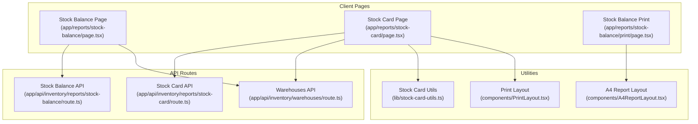
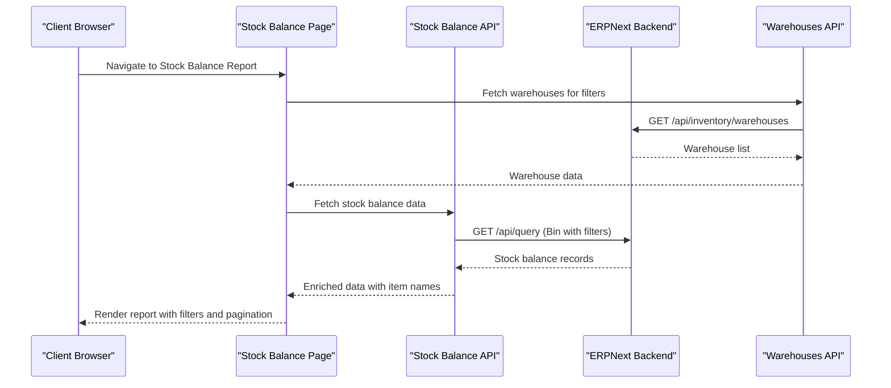
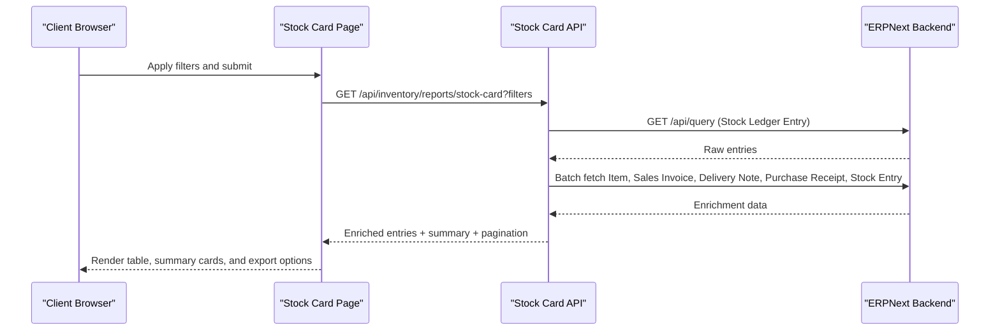
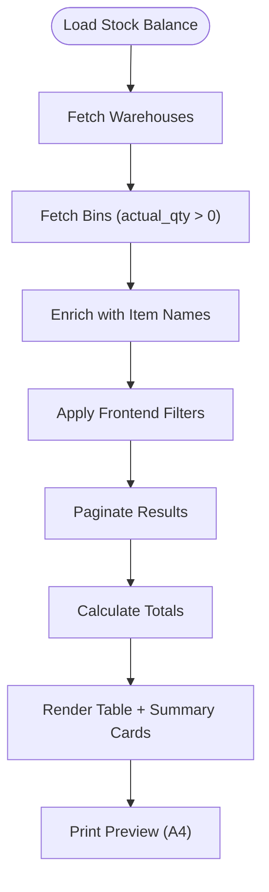
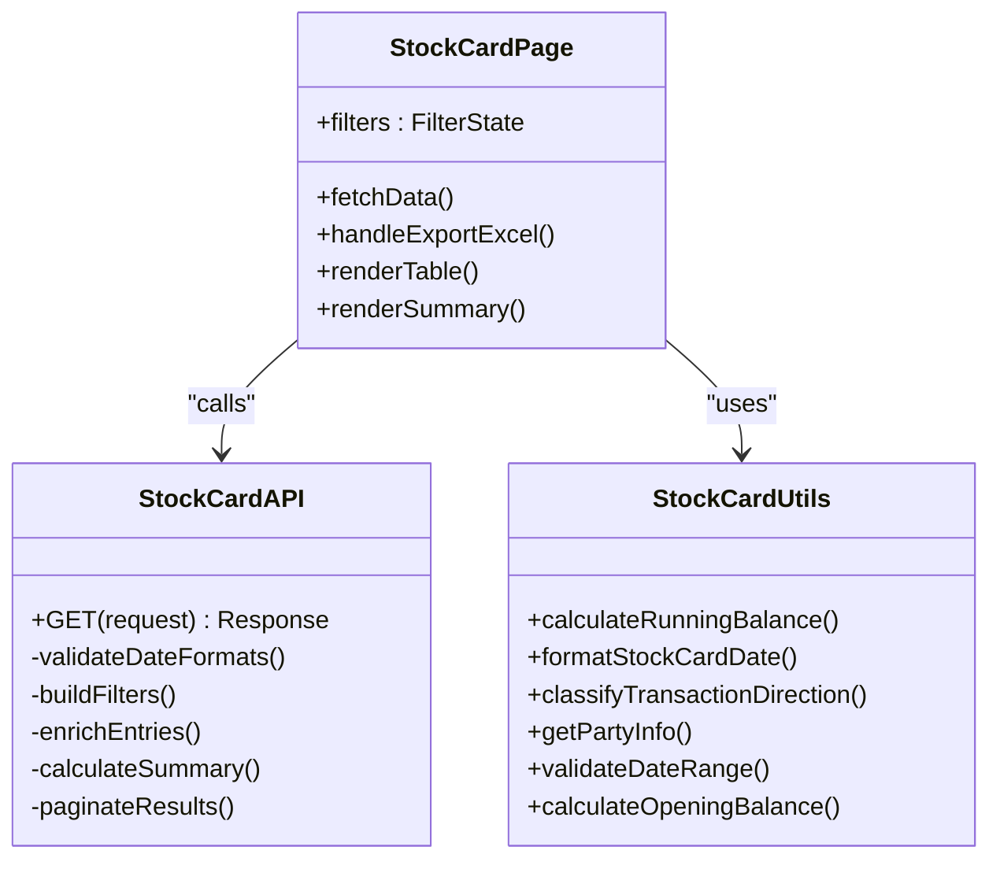
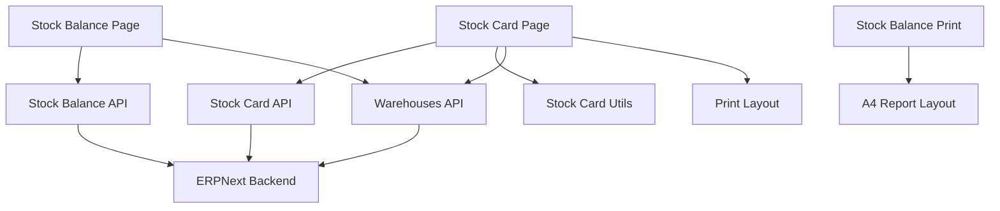

# Inventory Reports

<cite>
**Referenced Files in This Document**
- [stock-balance route.ts](file://app/api/inventory/reports/stock-balance/route.ts)
- [stock-card route.ts](file://app/api/inventory/reports/stock-card/route.ts)
- [stock-balance page.tsx](file://app/reports/stock-balance/page.tsx)
- [stock-card page.tsx](file://app/reports/stock-card/page.tsx)
- [stock-balance print page.tsx](file://app/reports/stock-balance/print/page.tsx)
- [stock-card utils.ts](file://lib/stock-card-utils.ts)
- [stock-card filters.tsx](file://components/stock-card/StockCardFilters.tsx)
- [stock-card summary.tsx](file://components/stock-card/StockCardSummary.tsx)
- [stock-card table.tsx](file://components/stock-card/StockCardTable.tsx)
- [A4 report layout.tsx](file://components/A4ReportLayout.tsx)
- [print layout.tsx](file://components/PrintLayout.tsx)
- [report layout.tsx](file://components/print/ReportLayout.tsx)
- [inventory warehouses route.ts](file://app/api/inventory/warehouses/route.ts)
- [stock card tests summary calculations](file://tests/stock-card-summary-calculations.test.ts)
- [stock card tests utils](file://tests/stock-card-utils.test.ts)
- [stock card tests pagination](file://tests/stock-card-pagination.test.ts)
- [stock card tests summary](file://tests/stock-card-summary.test.tsx)
</cite>

## Table of Contents
1. [Introduction](#introduction)
2. [Project Structure](#project-structure)
3. [Core Components](#core-components)
4. [Architecture Overview](#architecture-overview)
5. [Detailed Component Analysis](#detailed-component-analysis)
6. [Dependency Analysis](#dependency-analysis)
7. [Performance Considerations](#performance-considerations)
8. [Troubleshooting Guide](#troubleshooting-guide)
9. [Conclusion](#conclusion)

## Introduction
This document provides comprehensive documentation for Inventory Reports in the ERPNext system, focusing on:
- Stock balance reports: item-wise summaries, warehouse analysis, low stock alerts, and inventory turnover calculations
- Stock card reports: detailed transaction histories, movement tracking, batch-wise analysis, and valuation calculations
- Inventory data aggregation, cost of goods sold tracking, valuation methods (FIFO/LIFO/Average), and shrinkage analysis
- Filter configurations for item categories, warehouses, batches, and date ranges
- Report layouts, export options, and dashboard integrations
- Inventory optimization reporting, storage efficiency analysis, and supply chain performance metrics

## Project Structure
The inventory reporting functionality is organized around Next.js API routes and client-side pages:
- API routes under app/api/inventory/reports handle backend data retrieval and processing
- Client pages under app/reports implement user interfaces, filters, and export/print capabilities
- Utility libraries provide shared helpers for date formatting, balance calculations, and validation
- Print layouts support A4 PDF generation and responsive report rendering

**Diagram sources**
- [stock-balance page.tsx](file://app/reports/stock-balance/page.tsx#L1-L427)
- [stock-card page.tsx](file://app/reports/stock-card/page.tsx#L1-L1030)
- [stock-balance route.ts](file://app/api/inventory/reports/stock-balance/route.ts#L1-L81)
- [stock-card route.ts](file://app/api/inventory/reports/stock-card/route.ts#L1-L667)
- [inventory warehouses route.ts](file://app/api/inventory/warehouses/route.ts#L77-L117)
- [stock-card utils.ts](file://lib/stock-card-utils.ts#L1-L321)
- [A4 report layout.tsx](file://components/A4ReportLayout.tsx)
- [print layout.tsx](file://components/PrintLayout.tsx)

**Section sources**
- [stock-balance page.tsx](file://app/reports/stock-balance/page.tsx#L1-L427)
- [stock-card page.tsx](file://app/reports/stock-card/page.tsx#L1-L1030)
- [stock-balance route.ts](file://app/api/inventory/reports/stock-balance/line 1-L81)
- [stock-card route.ts](file://app/api/inventory/reports/stock-card/line 1-L667)
- [inventory warehouses route.ts](file://app/api/inventory/warehouses/line 77-L117)
- [stock-card utils.ts](file://lib/stock-card-utils.ts#L1-L321)

## Core Components
This section outlines the primary components involved in inventory reporting:

- Stock Balance Report
  - Backend: Retrieves Bin data filtered by positive quantities, enriches with item names, and returns warehouse-level stock summaries
  - Frontend: Provides filtering by warehouse and item, pagination, summary cards, and print/export capabilities
  - Print: Uses A4 report layout with summary cards and footer totals

- Stock Card Report
  - Backend: Fetches Stock Ledger Entries with comprehensive filters, enriches with item names, party info, and warehouse details for transfers
  - Frontend: Implements advanced filtering (item, warehouse, transaction type, date range, customer/supplier), pagination, export to Excel, and print preview
  - Utilities: Handles date validation, running balance calculations, transaction direction classification, and party information extraction

- Shared Infrastructure
  - Warehouse API: Aggregates stock quantities and values per warehouse from Bin records
  - Print Layouts: Standardized A4 report formatting and responsive print experiences

**Section sources**
- [stock-balance route.ts](file://app/api/inventory/reports/stock-balance/line 23-L74)
- [stock-balance page.tsx](file://app/reports/stock-balance/page.tsx#L12-L174)
- [stock-balance print page.tsx](file://app/reports/stock-balance/print/page.tsx#L10-L67)
- [stock-card route.ts](file://app/api/inventory/reports/stock-card/line 547-L656)
- [stock-card page.tsx](file://app/reports/stock-card/page.tsx#L522-L635)
- [stock-card utils.ts](file://lib/stock-card-utils.ts#L37-L320)
- [inventory warehouses route.ts](file://app/api/inventory/warehouses/line 80-L115)

## Architecture Overview
The inventory reporting architecture follows a client-server pattern with specialized API routes and modular frontend components:

**Diagram sources**
- [stock-balance page.tsx](file://app/reports/stock-balance/page.tsx#L116-L132)
- [stock-balance route.ts](file://app/api/inventory/reports/stock-balance/line 37-L74)
- [inventory warehouses route.ts](file://app/api/inventory/warehouses/line 100-L115)

**Diagram sources**
- [stock-card page.tsx](file://app/reports/stock-card/page.tsx#L522-L569)
- [stock-card route.ts](file://app/api/inventory/reports/stock-card/line 547-L573)
- [stock-card route.ts](file://app/api/inventory/reports/stock-card/line 235-L268)

## Detailed Component Analysis

### Stock Balance Report
The stock balance report aggregates warehouse-level inventory data:

- Data Retrieval
  - Fetches Bin records with positive quantities
  - Enriches with item names via batch queries
  - Calculates totals for display

- Filtering and Presentation
  - Filters by warehouse and item search terms
  - Supports pagination with configurable page sizes
  - Displays summary cards for total items, quantities, and values
  - Provides print functionality with A4 layout

**Diagram sources**
- [stock-balance route.ts](file://app/api/inventory/reports/stock-balance/line 37-L74)
- [stock-balance page.tsx](file://app/reports/stock-balance/page.tsx#L140-L173)
- [stock-balance print page.tsx](file://app/reports/stock-balance/print/page.tsx#L27-L67)

**Section sources**
- [stock-balance route.ts](file://app/api/inventory/reports/stock-balance/line 23-L74)
- [stock-balance page.tsx](file://app/reports/stock-balance/page.tsx#L12-L174)
- [stock-balance print page.tsx](file://app/reports/stock-balance/print/page.tsx#L10-L67)

### Stock Card Report
The stock card report provides granular transaction-level visibility:

- Backend Processing
  - Validates date formats and ranges
  - Applies comprehensive filters (company, item, warehouse, date range, transaction type, customer/supplier)
  - Enriches entries with item names, party information, and transfer warehouse details
  - Calculates summary statistics (opening/closing balances, totals, transaction counts)
  - Implements pagination with graceful error handling

- Frontend Features
  - Advanced filter controls for items, warehouses, transaction types, date ranges, and parties
  - Responsive table with desktop/mobile views
  - Export to Excel with summary row
  - Print preview with standardized layout
  - Detail modal for transaction insights

**Diagram sources**
- [stock-card route.ts](file://app/api/inventory/reports/stock-card/line 406-L667)
- [stock-card utils.ts](file://lib/stock-card-utils.ts#L37-L320)
- [stock-card page.tsx](file://app/reports/stock-card/page.tsx#L522-L635)

**Section sources**
- [stock-card route.ts](file://app/api/inventory/reports/stock-card/line 14-L667)
- [stock-card utils.ts](file://lib/stock-card-utils.ts#L1-L321)
- [stock-card page.tsx](file://app/reports/stock-card/page.tsx#L1-L1030)

### Report Layouts and Export Options
The system supports multiple output formats and layouts:

- Print Layouts
  - A4ReportLayout: Standardized A4 PDF generation with column definitions, summary cards, and footer totals
  - PrintLayout: Generic print layout component for report rendering
  - ReportLayout: Specific report layout for print previews

- Export Options
  - Excel export from Stock Card report with detailed columns and summary row
  - Print preview modals for both stock balance and stock card reports

**Section sources**
- [A4 report layout.tsx](file://components/A4ReportLayout.tsx)
- [print layout.tsx](file://components/PrintLayout.tsx)
- [report layout.tsx](file://components/print/ReportLayout.tsx)
- [stock-card page.tsx](file://app/reports/stock-card/page.tsx#L600-L624)
- [stock-balance print page.tsx](file://app/reports/stock-balance/print/page.tsx#L10-L67)

### Filter Configurations
Both reports implement comprehensive filtering:

- Stock Balance Filters
  - Warehouse selection
  - Item search by code/name
  - Date range selection
  - Refresh and clear filters

- Stock Card Filters
  - Item dropdown with 1000-item limit
  - Warehouse dropdown
  - Transaction type selection
  - Date range picker with DD/MM/YYYY format
  - Customer/supplier filters (mutually exclusive)
  - Reset filters functionality

**Section sources**
- [stock-balance page.tsx](file://app/reports/stock-balance/page.tsx#L252-L317)
- [stock-card page.tsx](file://app/reports/stock-card/page.tsx#L672-L747)

## Dependency Analysis
The inventory reporting system exhibits clear separation of concerns:

**Diagram sources**
- [stock-balance page.tsx](file://app/reports/stock-balance/page.tsx#L116-L132)
- [stock-card page.tsx](file://app/reports/stock-card/page.tsx#L500-L520)
- [stock-balance route.ts](file://app/api/inventory/reports/stock-balance/line 37-L74)
- [stock-card route.ts](file://app/api/inventory/reports/stock-card/line 547-L573)
- [inventory warehouses route.ts](file://app/api/inventory/warehouses/line 100-L115)

Key dependencies and relationships:
- API routes depend on ERPNext client for data retrieval
- Frontend pages coordinate multiple API calls for dropdown options
- Utility functions encapsulate business logic for date handling and calculations
- Print components rely on standardized layout components

**Section sources**
- [stock-balance page.tsx](file://app/reports/stock-balance/page.tsx#L116-L132)
- [stock-card page.tsx](file://app/reports/stock-card/page.tsx#L500-L520)
- [stock-card utils.ts](file://lib/stock-card-utils.ts#L1-L321)

## Performance Considerations
Several performance aspects are implemented:

- Efficient Data Fetching
  - Stock balance API limits item enrichment to 100 items per request
  - Stock card API uses server-side ordering and pagination
  - Batch enrichment reduces multiple API calls

- Client-Side Optimization
  - Frontend filtering after initial data load
  - Memoized computations for totals and summaries
  - Responsive pagination with configurable page sizes

- Error Handling and Graceful Degradation
  - API routes continue with partial data if enrichment fails
  - Frontend displays meaningful error messages
  - Pagination validates page numbers and handles edge cases

[No sources needed since this section provides general guidance]

## Troubleshooting Guide
Common issues and resolutions:

- API Validation Errors
  - Missing company parameter returns 400 status
  - Invalid date formats trigger validation errors
  - Page number validation prevents out-of-range requests

- Data Enrichment Failures
  - Item name enrichment continues if Item lookup fails
  - Party information fallback to basic data
  - Summary calculation defaults to safe values on failure

- Frontend Issues
  - Local storage and cookie persistence for company selection
  - URL synchronization for pagination state
  - Mobile responsiveness with adaptive layouts

**Section sources**
- [stock-card route.ts](file://app/api/inventory/reports/stock-card/line 416-L495)
- [stock-card route.ts](file://app/api/inventory/reports/stock-card/line 566-L611)
- [stock-card page.tsx](file://app/reports/stock-card/page.tsx#L490-L498)
- [stock-card page.tsx](file://app/reports/stock-card/page.tsx#L571-L591)

## Conclusion
The inventory reporting system provides comprehensive coverage of stock balance and stock card reporting needs. It offers:
- Flexible filtering and pagination for both warehouse and transaction-level views
- Robust data enrichment and validation mechanisms
- Multiple output formats including print-ready PDFs and Excel exports
- Responsive user interfaces optimized for desktop and mobile devices
- Strong error handling and performance optimizations

The modular architecture enables easy extension for additional report types and enhanced functionality while maintaining clear separation between presentation, business logic, and data access layers.