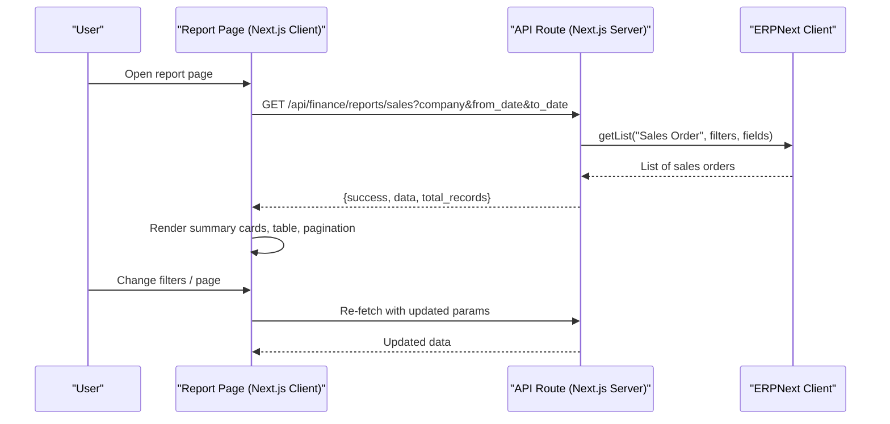
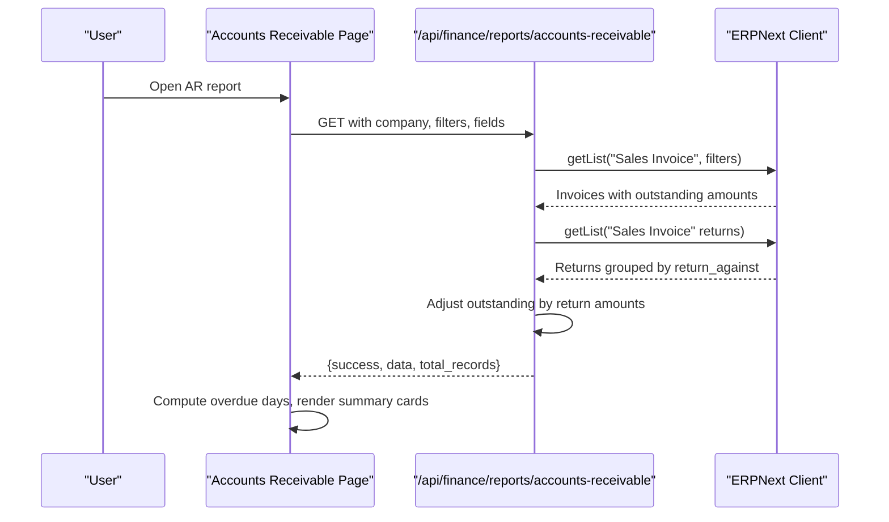
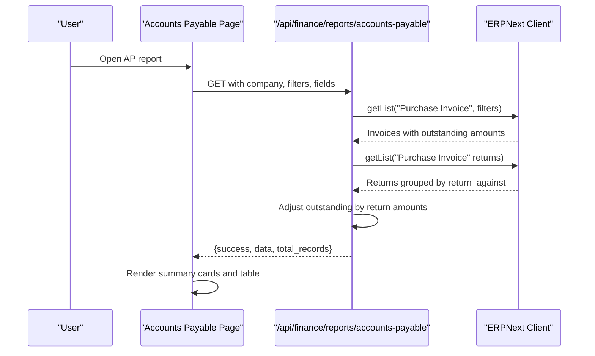
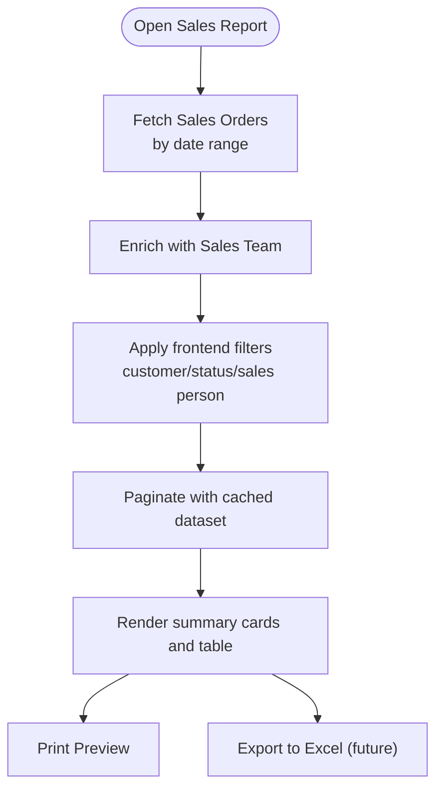
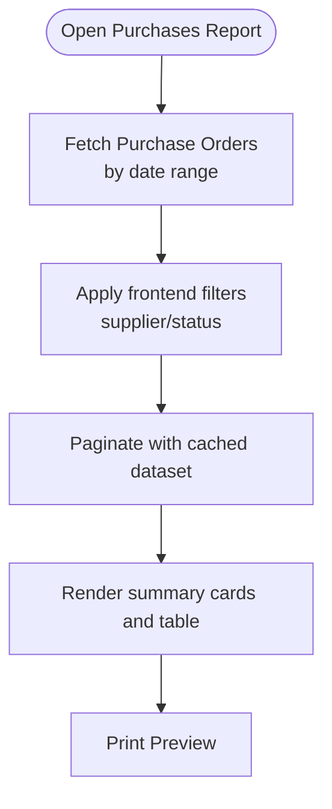
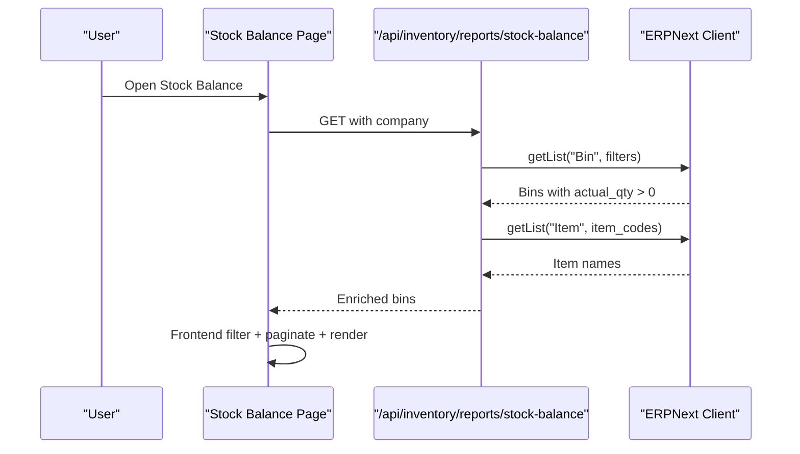
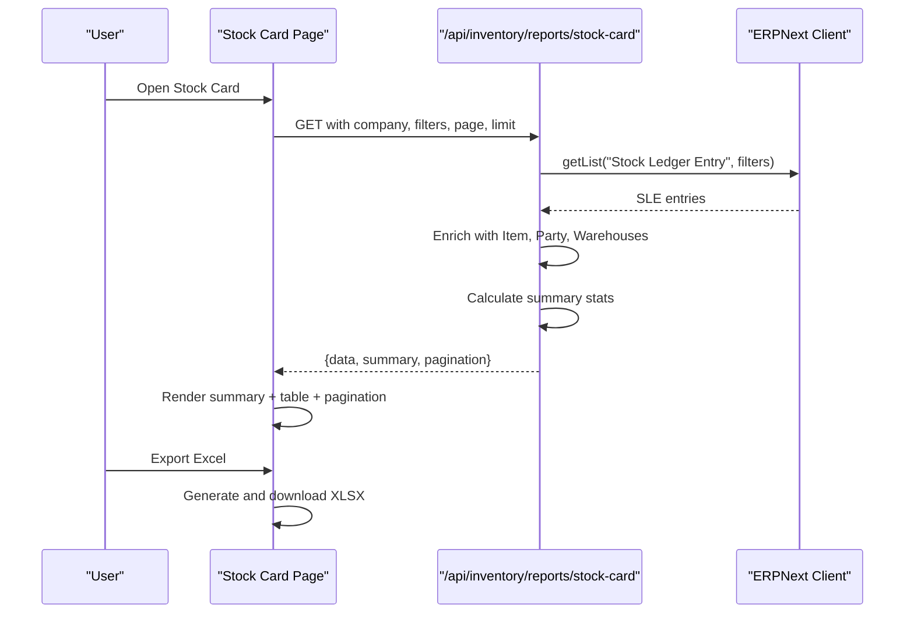
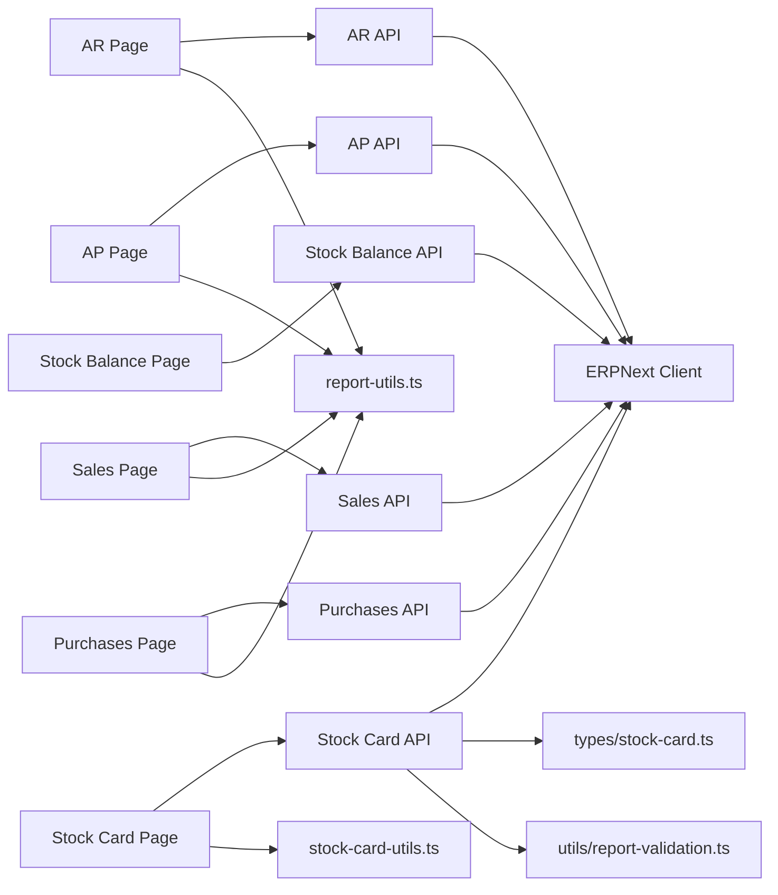

# Operational Reports

<cite>
**Referenced Files in This Document**
- [app/reports/accounts-receivable/page.tsx](file://app/reports/accounts-receivable/page.tsx)
- [app/reports/accounts-payable/page.tsx](file://app/reports/accounts-payable/page.tsx)
- [app/reports/sales/page.tsx](file://app/reports/sales/page.tsx)
- [app/reports/purchases/page.tsx](file://app/reports/purchases/page.tsx)
- [app/reports/stock-balance/page.tsx](file://app/reports/stock-balance/page.tsx)
- [app/reports/stock-card/page.tsx](file://app/reports/stock-card/page.tsx)
- [app/api/finance/reports/accounts-receivable/route.ts](file://app/api/finance/reports/accounts-receivable/route.ts)
- [app/api/finance/reports/accounts-payable/route.ts](file://app/api/finance/reports/accounts-payable/route.ts)
- [app/api/finance/reports/sales/route.ts](file://app/api/finance/reports/sales/route.ts)
- [app/api/finance/reports/purchases/route.ts](file://app/api/finance/reports/purchases/route.ts)
- [app/api/inventory/reports/stock-balance/route.ts](file://app/api/inventory/reports/stock-balance/route.ts)
- [app/api/inventory/reports/stock-card/route.ts](file://app/api/inventory/reports/stock-card/route.ts)
- [components/reports/FilterSection.tsx](file://components/reports/FilterSection.tsx)
- [components/reports/SummaryCards.tsx](file://components/reports/SummaryCards.tsx)
- [components/stock-card/StockCardFilters.tsx](file://components/stock-card/StockCardFilters.tsx)
- [components/stock-card/StockCardSummary.tsx](file://components/stock-card/StockCardSummary.tsx)
- [components/stock-card/StockCardTable.tsx](file://components/stock-card/StockCardTable.tsx)
- [lib/report-utils.ts](file://lib/report-utils.ts)
- [lib/stock-card-utils.ts](file://lib/stock-card-utils.ts)
- [utils/report-validation.ts](file://utils/report-validation.ts)
- [types/stock-card.ts](file://types/stock-card.ts)
</cite>

## Table of Contents
1. [Introduction](#introduction)
2. [Project Structure](#project-structure)
3. [Core Components](#core-components)
4. [Architecture Overview](#architecture-overview)
5. [Detailed Component Analysis](#detailed-component-analysis)
6. [Dependency Analysis](#dependency-analysis)
7. [Performance Considerations](#performance-considerations)
8. [Troubleshooting Guide](#troubleshooting-guide)
9. [Conclusion](#conclusion)

## Introduction
This document describes the Operational Reports module that powers sales, purchase, accounts receivable/payable, stock balance, and stock card reporting. It explains the frontend UI components, backend API routes, data aggregation logic, and performance characteristics. It also covers report filters, summary cards, pivot-like views, drill-down capabilities, export formats, and real-time refresh mechanisms.

## Project Structure
The Operational Reports module is organized into:
- Frontend pages under app/reports/<report>/page.tsx
- Backend API routes under app/api/<category>/reports/<report>/route.ts
- Shared UI components under components/reports/ and components/stock-card/
- Utility libraries under lib/ and shared types under types/

```mermaid
graph TB
subgraph "Frontend Pages"
AR["Accounts Receivable Page<br/>app/reports/accounts-receivable/page.tsx"]
AP["Accounts Payable Page<br/>app/reports/accounts-payable/page.tsx"]
SALES["Sales Report Page<br/>app/reports/sales/page.tsx"]
PURCHASES["Purchases Report Page<br/>app/reports/purchases/page.tsx"]
STOCK_BALANCE["Stock Balance Page<br/>app/reports/stock-balance/page.tsx"]
STOCK_CARD["Stock Card Page<br/>app/reports/stock-card/page.tsx"]
end
subgraph "Shared Components"
FILTERS["FilterSection.tsx"]
SUMMARY["SummaryCards.tsx"]
SC_FILTERS["StockCardFilters.tsx"]
SC_SUMMARY["StockCardSummary.tsx"]
SC_TABLE["StockCardTable.tsx"]
end
subgraph "Backend APIs"
AR_API["/api/finance/reports/accounts-receivable<br/>route.ts"]
AP_API["/api/finance/reports/accounts-payable<br/>route.ts"]
SALES_API["/api/finance/reports/sales<br/>route.ts"]
PURCHASES_API["/api/finance/reports/purchases<br/>route.ts"]
SB_API["/api/inventory/reports/stock-balance<br/>route.ts"]
SC_API["/api/inventory/reports/stock-card<br/>route.ts"]
end
AR --> AR_API
AP --> AP_API
SALES --> SALES_API
PURCHASES --> PURCHASES_API
STOCK_BALANCE --> SB_API
STOCK_CARD --> SC_API
AR --- FILTERS
AP --- FILTERS
SALES --- SUMMARY
PURCHASES --- SUMMARY
STOCK_CARD --- SC_FILTERS
STOCK_CARD --- SC_SUMMARY
STOCK_CARD --- SC_TABLE
```

**Diagram sources**
- [app/reports/accounts-receivable/page.tsx](file://app/reports/accounts-receivable/page.tsx#L397-L999)
- [app/reports/accounts-payable/page.tsx](file://app/reports/accounts-payable/page.tsx#L391-L956)
- [app/reports/sales/page.tsx](file://app/reports/sales/page.tsx#L50-L550)
- [app/reports/purchases/page.tsx](file://app/reports/purchases/page.tsx#L45-L474)
- [app/reports/stock-balance/page.tsx](file://app/reports/stock-balance/page.tsx#L40-L427)
- [app/reports/stock-card/page.tsx](file://app/reports/stock-card/page.tsx#L440-L1030)
- [app/api/finance/reports/accounts-receivable/route.ts](file://app/api/finance/reports/accounts-receivable/route.ts#L10-L154)
- [app/api/finance/reports/accounts-payable/route.ts](file://app/api/finance/reports/accounts-payable/route.ts#L10-L112)
- [app/api/finance/reports/sales/route.ts](file://app/api/finance/reports/sales/route.ts#L10-L98)
- [app/api/finance/reports/purchases/route.ts](file://app/api/finance/reports/purchases/route.ts#L10-L65)
- [app/api/inventory/reports/stock-balance/route.ts](file://app/api/inventory/reports/stock-balance/route.ts#L9-L81)
- [app/api/inventory/reports/stock-card/route.ts](file://app/api/inventory/reports/stock-card/route.ts#L406-L667)

**Section sources**
- [app/reports/accounts-receivable/page.tsx](file://app/reports/accounts-receivable/page.tsx#L1-L999)
- [app/reports/accounts-payable/page.tsx](file://app/reports/accounts-payable/page.tsx#L1-L956)
- [app/reports/sales/page.tsx](file://app/reports/sales/page.tsx#L1-L550)
- [app/reports/purchases/page.tsx](file://app/reports/purchases/page.tsx#L1-L474)
- [app/reports/stock-balance/page.tsx](file://app/reports/stock-balance/page.tsx#L1-L427)
- [app/reports/stock-card/page.tsx](file://app/reports/stock-card/page.tsx#L1-L1030)

## Core Components
- Accounts Receivable and Accounts Payable pages implement:
  - Filter panels with date ranges, customer/supplier search, and voucher filters
  - Summary cards aggregating totals and overdue counts
  - Paginated lists with desktop/tablet/mobile layouts
  - Detail modals for transaction drill-down
  - Print preview integration
- Sales and Purchases pages implement:
  - Date range filters and status filters
  - Summary cards for totals and averages
  - Frontend pagination with caching of full dataset
  - Print preview modal
- Stock Balance page implements:
  - Item search, warehouse filter, and date range selection
  - Summary cards for quantities and values
  - Frontend filtering and pagination
- Stock Card page implements:
  - Comprehensive filters (item, warehouse, customer/supplier, transaction type, date range)
  - Summary panel with opening/closing balances and totals
  - Export to Excel and print preview
  - Drill-down via detail modal

**Section sources**
- [app/reports/accounts-receivable/page.tsx](file://app/reports/accounts-receivable/page.tsx#L397-L999)
- [app/reports/accounts-payable/page.tsx](file://app/reports/accounts-payable/page.tsx#L391-L956)
- [app/reports/sales/page.tsx](file://app/reports/sales/page.tsx#L50-L550)
- [app/reports/purchases/page.tsx](file://app/reports/purchases/page.tsx#L45-L474)
- [app/reports/stock-balance/page.tsx](file://app/reports/stock-balance/page.tsx#L40-L427)
- [app/reports/stock-card/page.tsx](file://app/reports/stock-card/page.tsx#L440-L1030)

## Architecture Overview
The Operational Reports architecture follows a clear separation of concerns:
- Frontend pages orchestrate filters, pagination, and rendering
- Backend API routes query ERPNext documents and compute derived metrics
- Utilities validate inputs and enrich data where needed
- Shared components encapsulate reusable UI patterns

**Diagram sources**
- [app/reports/sales/page.tsx](file://app/reports/sales/page.tsx#L120-L171)
- [app/api/finance/reports/sales/route.ts](file://app/api/finance/reports/sales/route.ts#L34-L58)

**Section sources**
- [app/reports/sales/page.tsx](file://app/reports/sales/page.tsx#L50-L202)
- [app/api/finance/reports/sales/route.ts](file://app/api/finance/reports/sales/route.ts#L10-L98)

## Detailed Component Analysis

### Accounts Receivable Report
- Purpose: Display outstanding sales invoices with customer, due date, and overdue status.
- Data aggregation:
  - Fetches posted Sales Invoices with outstanding amounts > 0
  - Optionally adjusts outstanding amounts by subtracting Sales Returns linked to the invoice
  - Enriches with first sales person from Sales Team child table
- Filters:
  - Date range (posting date)
  - Customer name search
  - Voucher number search
  - Sales person search
- UI features:
  - Summary cards for total invoices, total grand total, total outstanding, overdue count
  - Desktop table and mobile card layout
  - Pagination with progress indicator
  - Detail modal with status computation and overdue days
  - Print preview integration

**Diagram sources**
- [app/reports/accounts-receivable/page.tsx](file://app/reports/accounts-receivable/page.tsx#L468-L512)
- [app/api/finance/reports/accounts-receivable/route.ts](file://app/api/finance/reports/accounts-receivable/route.ts#L29-L147)

**Section sources**
- [app/reports/accounts-receivable/page.tsx](file://app/reports/accounts-receivable/page.tsx#L397-L999)
- [app/api/finance/reports/accounts-receivable/route.ts](file://app/api/finance/reports/accounts-receivable/route.ts#L10-L154)

### Accounts Payable Report
- Purpose: Display outstanding purchase invoices with supplier, due date, and overdue status.
- Data aggregation:
  - Fetches posted Purchase Invoices with outstanding amounts > 0
  - Adjusts outstanding amounts by subtracting Purchase Returns linked to the invoice
- Filters:
  - Date range (posting date)
  - Supplier name search
  - Voucher number search
- UI features:
  - Summary cards for total bills, total grand total, total outstanding, overdue count
  - Desktop table and mobile card layout
  - Pagination and detail modal
  - Print preview integration

**Diagram sources**
- [app/reports/accounts-payable/page.tsx](file://app/reports/accounts-payable/page.tsx#L460-L504)
- [app/api/finance/reports/accounts-payable/route.ts](file://app/api/finance/reports/accounts-payable/route.ts#L29-L103)

**Section sources**
- [app/reports/accounts-payable/page.tsx](file://app/reports/accounts-payable/page.tsx#L391-L956)
- [app/api/finance/reports/accounts-payable/route.ts](file://app/api/finance/reports/accounts-payable/route.ts#L10-L112)

### Sales Report
- Purpose: Summarize Sales Orders with delivery and billing progress.
- Data aggregation:
  - Fetches posted Sales Orders within date range
  - Enriches with first sales person from Sales Team child table
- Filters:
  - Date range
  - Customer search
  - Status filter
  - Sales person filter
- UI features:
  - Summary cards for total orders, total sales, average order value, page info
  - Desktop table with progress bars and status badges
  - Mobile card layout
  - Frontend pagination with cached dataset
  - Print preview modal

**Diagram sources**
- [app/reports/sales/page.tsx](file://app/reports/sales/page.tsx#L120-L171)
- [app/api/finance/reports/sales/route.ts](file://app/api/finance/reports/sales/route.ts#L63-L89)

**Section sources**
- [app/reports/sales/page.tsx](file://app/reports/sales/page.tsx#L50-L550)
- [app/api/finance/reports/sales/route.ts](file://app/api/finance/reports/sales/route.ts#L10-L98)

### Purchases Report
- Purpose: Summarize Purchase Orders with receive and bill progress.
- Data aggregation:
  - Fetches posted Purchase Orders within date range
- Filters:
  - Date range
  - Supplier search
  - Status filter
- UI features:
  - Summary cards for total orders, total purchases, average order value, page info
  - Desktop table with status badges
  - Mobile card layout
  - Frontend pagination with cached dataset
  - Print preview modal

**Diagram sources**
- [app/reports/purchases/page.tsx](file://app/reports/purchases/page.tsx#L101-L149)
- [app/api/finance/reports/purchases/route.ts](file://app/api/finance/reports/purchases/route.ts#L34-L56)

**Section sources**
- [app/reports/purchases/page.tsx](file://app/reports/purchases/page.tsx#L45-L474)
- [app/api/finance/reports/purchases/route.ts](file://app/api/finance/reports/purchases/route.ts#L10-L65)

### Stock Balance Report
- Purpose: Show bin-level stock quantities and values per warehouse.
- Data aggregation:
  - Fetches Bins with actual_qty > 0
  - Attempts to enrich with item names for display
- Filters:
  - Item search
  - Warehouse filter
  - Date range (UI supports date pickers)
- UI features:
  - Summary cards for total items, total quantity, total stock value
  - Desktop table and mobile card layout
  - Frontend filtering and pagination
  - Print preview modal

**Diagram sources**
- [app/reports/stock-balance/page.tsx](file://app/reports/stock-balance/page.tsx#L95-L132)
- [app/api/inventory/reports/stock-balance/route.ts](file://app/api/inventory/reports/stock-balance/route.ts#L23-L72)

**Section sources**
- [app/reports/stock-balance/page.tsx](file://app/reports/stock-balance/page.tsx#L40-L427)
- [app/api/inventory/reports/stock-balance/route.ts](file://app/api/inventory/reports/stock-balance/route.ts#L9-L81)

### Stock Card Report
- Purpose: Detailed movement history for an item with balances and drill-down.
- Data aggregation:
  - Fetches Stock Ledger Entries with optional filters
  - Enriches with item names, party info (customer/supplier), and warehouse info for transfers
  - Calculates summary: opening/closing balances, total in/out, transaction count
- Filters:
  - Item, warehouse, transaction type, date range
  - Customer or Supplier (mutually exclusive)
- UI features:
  - Summary panel with opening/balance/total in/total out
  - Desktop table and mobile card layout
  - Pagination with page size control
  - Export to Excel (download)
  - Print preview
  - Detail modal for transaction specifics

**Diagram sources**
- [app/reports/stock-card/page.tsx](file://app/reports/stock-card/page.tsx#L523-L569)
- [app/api/inventory/reports/stock-card/route.ts](file://app/api/inventory/reports/stock-card/route.ts#L548-L656)

**Section sources**
- [app/reports/stock-card/page.tsx](file://app/reports/stock-card/page.tsx#L440-L1030)
- [app/api/inventory/reports/stock-card/route.ts](file://app/api/inventory/reports/stock-card/route.ts#L406-L667)

## Dependency Analysis
- Frontend pages depend on:
  - Shared UI components (FilterSection, SummaryCards, StockCard* components)
  - Utility modules for report validation and stock-card helpers
  - Type definitions for typed data structures
- Backend APIs depend on:
  - ERPNext client helpers for site-aware requests
  - Validation utilities for date ranges
  - Type definitions for typed responses

**Diagram sources**
- [app/reports/accounts-receivable/page.tsx](file://app/reports/accounts-receivable/page.tsx#L1-L12)
- [app/reports/accounts-payable/page.tsx](file://app/reports/accounts-payable/page.tsx#L1-L11)
- [app/reports/sales/page.tsx](file://app/reports/sales/page.tsx#L1-L12)
- [app/reports/purchases/page.tsx](file://app/reports/purchases/page.tsx#L1-L10)
- [app/reports/stock-balance/page.tsx](file://app/reports/stock-balance/page.tsx#L1-L10)
- [app/reports/stock-card/page.tsx](file://app/reports/stock-card/page.tsx#L1-L13)
- [app/api/finance/reports/accounts-receivable/route.ts](file://app/api/finance/reports/accounts-receivable/route.ts#L1-L8)
- [app/api/finance/reports/accounts-payable/route.ts](file://app/api/finance/reports/accounts-payable/route.ts#L1-L8)
- [app/api/finance/reports/sales/route.ts](file://app/api/finance/reports/sales/route.ts#L1-L8)
- [app/api/finance/reports/purchases/route.ts](file://app/api/finance/reports/purchases/route.ts#L1-L8)
- [app/api/inventory/reports/stock-balance/route.ts](file://app/api/inventory/reports/stock-balance/route.ts#L1-L7)
- [app/api/inventory/reports/stock-card/route.ts](file://app/api/inventory/reports/stock-card/route.ts#L1-L8)
- [lib/report-utils.ts](file://lib/report-utils.ts)
- [lib/stock-card-utils.ts](file://lib/stock-card-utils.ts)
- [utils/report-validation.ts](file://utils/report-validation.ts)
- [types/stock-card.ts](file://types/stock-card.ts)

**Section sources**
- [lib/report-utils.ts](file://lib/report-utils.ts)
- [lib/stock-card-utils.ts](file://lib/stock-card-utils.ts)
- [utils/report-validation.ts](file://utils/report-validation.ts)
- [types/stock-card.ts](file://types/stock-card.ts)

## Performance Considerations
- Pagination:
  - Sales and Purchases pages use frontend pagination with a cached full dataset to reduce server round trips after initial load.
  - Stock Card and Receivable/AP pages use backend pagination with explicit page and limit parameters.
- Data volume:
  - APIs cap limit_page_length to moderate values to avoid heavy queries.
  - Stock Card API fetches all matching entries and paginates in-memory; consider narrowing filters to reduce payload.
- Enrichment:
  - Stock Card API performs parallel enrichment for item names, party info, and warehouse info; ensure filters minimize the base dataset.
- Date validation:
  - Sales/Purchases APIs validate date ranges to prevent invalid queries.
- Currency formatting:
  - Frontend pages format currency and dates for readability; backend APIs can pre-format if needed for print/export.

[No sources needed since this section provides general guidance]

## Troubleshooting Guide
Common issues and resolutions:
- Missing company context:
  - Symptom: API returns “Company is required” or unauthorized errors.
  - Resolution: Ensure the selected company is persisted and passed in request headers or cookies.
- Empty or stale data:
  - Symptom: Reports show no data despite existing transactions.
  - Resolution: Verify date ranges, filters, and document status (only posted documents are fetched). Refresh data and confirm warehouse/item availability.
- Excessive load or slow performance:
  - Symptom: Long load times for Stock Card or Receivable/AP with broad filters.
  - Resolution: Narrow filters (item, warehouse, date range, transaction type). For Stock Card, prefer item-specific filters.
- Export failures:
  - Symptom: Export to Excel does not produce a file.
  - Resolution: Ensure entries exist; the export function checks for non-empty datasets before generating the file.
- Print preview issues:
  - Symptom: Print preview does not render correctly.
  - Resolution: Confirm print URL parameters and browser support for print media.

**Section sources**
- [app/api/finance/reports/sales/route.ts](file://app/api/finance/reports/sales/route.ts#L19-L30)
- [app/api/inventory/reports/stock-card/route.ts](file://app/api/inventory/reports/stock-card/route.ts#L471-L495)
- [app/reports/stock-card/page.tsx](file://app/reports/stock-card/page.tsx#L601-L624)

## Conclusion
The Operational Reports module provides a cohesive, filter-rich, and responsive reporting experience across sales, purchases, accounts receivable/payable, stock balance, and stock card domains. Its architecture cleanly separates frontend UI concerns from backend data aggregation, enabling efficient pagination, drill-down, and export capabilities. By applying targeted filters and leveraging frontend caching where appropriate, teams can achieve fast, accurate insights for operational decision-making.