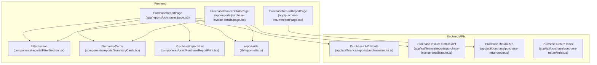
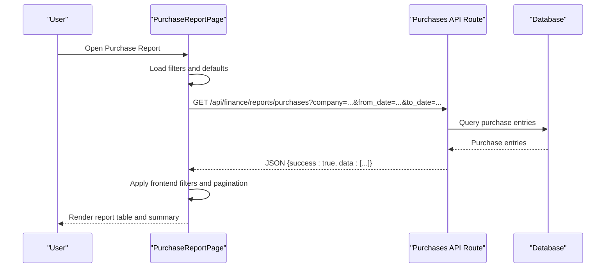
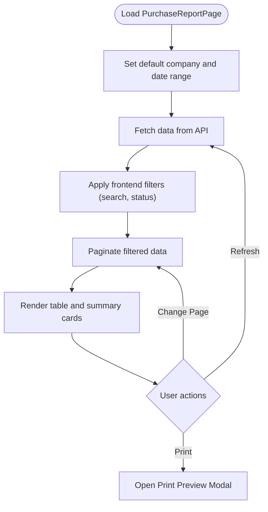
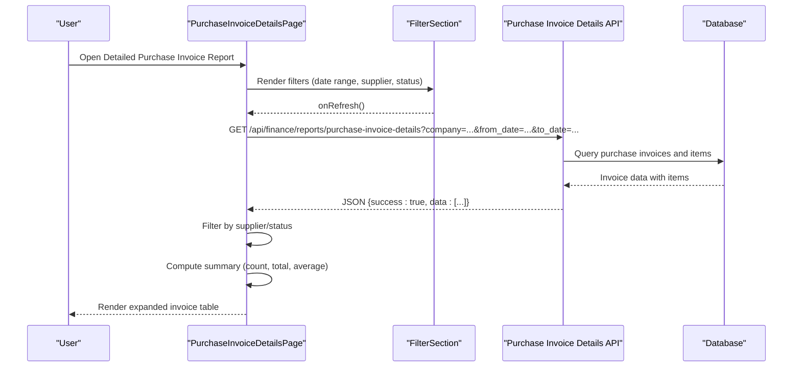
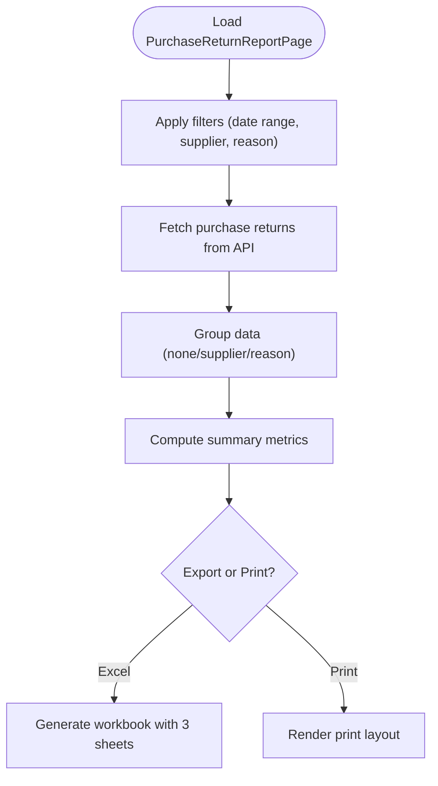
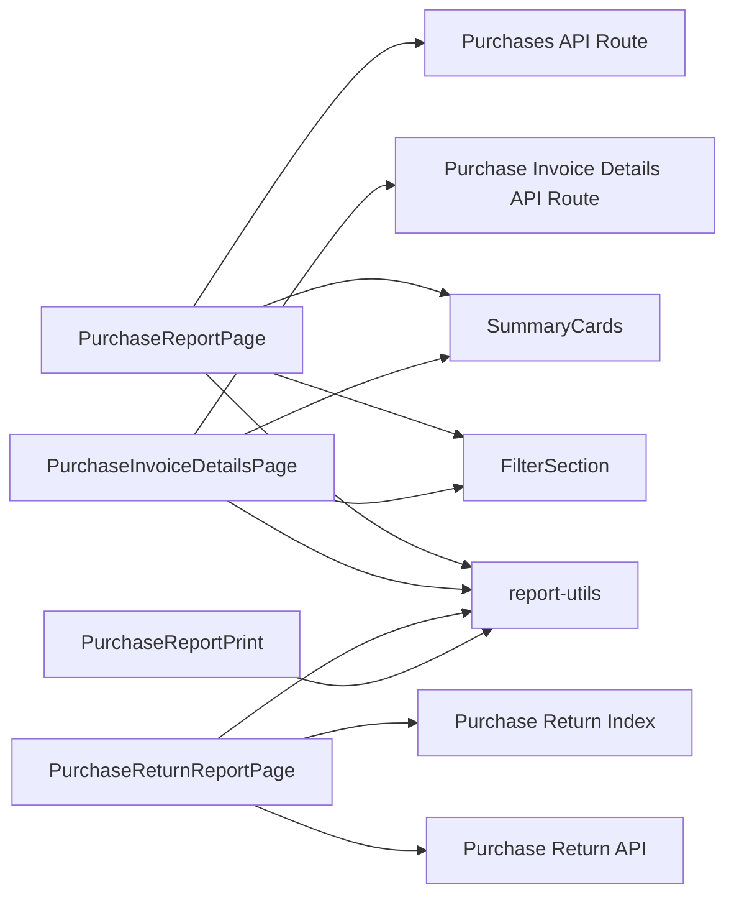

# Purchase Reports

<cite>
**Referenced Files in This Document**
- [PurchaseReportPage](file://app/reports/purchases/page.tsx)
- [PurchaseInvoiceDetailsPage](file://app/reports/purchase-invoice-details/page.tsx)
- [PurchaseReturnReportPage](file://app/purchase-return/report/page.tsx)
- [PurchaseReportPrint](file://components/print/PurchaseReportPrint.tsx)
- [FilterSection](file://components/reports/FilterSection.tsx)
- [SummaryCards](file://components/reports/SummaryCards.tsx)
- [report-utils](file://lib/report-utils.ts)
- [PurchaseInvoiceDetails API Route](file://app/api/finance/reports/purchase-invoice-details/route.ts)
- [Purchases API Route](file://app/api/finance/reports/purchases/route.ts)
- [Purchase Return API Route](file://app/api/purchase/purchase-return/route.ts)
- [Purchase Return API Endpoint](file://app/api/purchase/purchase-return/index.ts)
- [Purchase Return Type Definitions](file://types/purchase-return.ts)
- [Purchase Invoice Details Type Definitions](file://types/purchase-invoice-details.ts)
</cite>

## Table of Contents
1. [Introduction](#introduction)
2. [Project Structure](#project-structure)
3. [Core Components](#core-components)
4. [Architecture Overview](#architecture-overview)
5. [Detailed Component Analysis](#detailed-component-analysis)
6. [Dependency Analysis](#dependency-analysis)
7. [Performance Considerations](#performance-considerations)
8. [Troubleshooting Guide](#troubleshooting-guide)
9. [Conclusion](#conclusion)

## Introduction
This document provides comprehensive documentation for the Purchase Reports functionality in the ERPNext system. It covers purchase invoice reports, supplier performance analysis, and procurement tracking reports. The documentation explains report types, data aggregation, cost calculation, tax reporting integration, payment tracking, filter configurations, report layouts, export options, and procurement dashboard integration. It also addresses performance optimization, supplier relationship analytics, and procurement efficiency metrics.

## Project Structure
The Purchase Reports feature spans frontend report pages, shared UI components, utility libraries, and backend API routes. The structure supports:
- Purchase summary report with filtering and pagination
- Detailed purchase invoice report with expandable line items
- Purchase return report with export and grouping capabilities
- Shared components for filters, summary cards, and printing
- Utility functions for date and currency formatting, and summary calculations

**Diagram sources**
- [PurchaseReportPage](file://app/reports/purchases/page.tsx#L45-L474)
- [PurchaseInvoiceDetailsPage](file://app/reports/purchase-invoice-details/page.tsx#L22-L492)
- [PurchaseReturnReportPage](file://app/purchase-return/report/page.tsx#L37-L545)
- [FilterSection](file://components/reports/FilterSection.tsx#L16-L92)
- [SummaryCards](file://components/reports/SummaryCards.tsx#L27-L46)
- [PurchaseReportPrint](file://components/print/PurchaseReportPrint.tsx#L106-L161)
- [report-utils](file://lib/report-utils.ts#L9-L108)
- [Purchases API Route](file://app/api/finance/reports/purchases/route.ts)
- [Purchase Invoice Details API Route](file://app/api/finance/reports/purchase-invoice-details/route.ts)
- [Purchase Return API Route](file://app/api/purchase/purchase-return/route.ts)
- [Purchase Return API Endpoint](file://app/api/purchase/purchase-return/index.ts)

**Section sources**
- [PurchaseReportPage](file://app/reports/purchases/page.tsx#L1-L474)
- [PurchaseInvoiceDetailsPage](file://app/reports/purchase-invoice-details/page.tsx#L1-L492)
- [PurchaseReturnReportPage](file://app/purchase-return/report/page.tsx#L1-L545)
- [FilterSection](file://components/reports/FilterSection.tsx#L1-L92)
- [SummaryCards](file://components/reports/SummaryCards.tsx#L1-L46)
- [PurchaseReportPrint](file://components/print/PurchaseReportPrint.tsx#L1-L161)
- [report-utils](file://lib/report-utils.ts#L1-L108)

## Core Components
This section outlines the primary components involved in Purchase Reports and their responsibilities.

- PurchaseReportPage: Implements the purchase summary report with date range filtering, supplier search, status filtering, pagination, and print preview.
- PurchaseInvoiceDetailsPage: Provides detailed purchase invoice records with expandable line items, supplier and status filters, and summary cards.
- PurchaseReturnReportPage: Generates purchase return reports with export to Excel, grouping by supplier or reason, and summary breakdowns.
- FilterSection: Reusable component for date range, search, and additional filters.
- SummaryCards: Reusable component for displaying summary metrics.
- PurchaseReportPrint: Print layout component for purchase reports using a standardized report template.
- report-utils: Shared utilities for date formatting, currency formatting, summary calculations, and status color mapping.

Key responsibilities:
- Data fetching via API routes
- Client-side filtering and pagination
- Summary computation and display
- Print and export capabilities
- Responsive UI for desktop and mobile

**Section sources**
- [PurchaseReportPage](file://app/reports/purchases/page.tsx#L12-L213)
- [PurchaseInvoiceDetailsPage](file://app/reports/purchase-invoice-details/page.tsx#L22-L173)
- [PurchaseReturnReportPage](file://app/purchase-return/report/page.tsx#L37-L241)
- [FilterSection](file://components/reports/FilterSection.tsx#L16-L92)
- [SummaryCards](file://components/reports/SummaryCards.tsx#L27-L46)
- [PurchaseReportPrint](file://components/print/PurchaseReportPrint.tsx#L106-L161)
- [report-utils](file://lib/report-utils.ts#L9-L108)

## Architecture Overview
The Purchase Reports architecture follows a client-server pattern:
- Frontend report pages fetch data from backend API routes using fetch requests.
- Shared components encapsulate UI logic for filters, summaries, and printing.
- Utility functions standardize formatting and calculations.
- Backend routes process queries, apply filters, aggregate data, and return structured JSON responses.

**Diagram sources**
- [PurchaseReportPage](file://app/reports/purchases/page.tsx#L101-L149)
- [Purchases API Route](file://app/api/finance/reports/purchases/route.ts)

**Section sources**
- [PurchaseReportPage](file://app/reports/purchases/page.tsx#L101-L149)
- [PurchaseInvoiceDetailsPage](file://app/reports/purchase-invoice-details/page.tsx#L60-L94)
- [PurchaseReturnReportPage](file://app/purchase-return/report/page.tsx#L64-L114)
- [report-utils](file://lib/report-utils.ts#L9-L108)

## Detailed Component Analysis

### Purchase Summary Report (PurchaseReportPage)
Purpose:
- Display purchase order summary with supplier, transaction date, grand total, and status.
- Enable filtering by date range, supplier search, and status.
- Support pagination and print preview.

Key features:
- Date conversion utilities for API compatibility
- Frontend filtering and pagination
- Summary cards for total purchases, average purchase, and page info
- Print preview modal with report layout

**Diagram sources**
- [PurchaseReportPage](file://app/reports/purchases/page.tsx#L82-L180)

**Section sources**
- [PurchaseReportPage](file://app/reports/purchases/page.tsx#L45-L474)
- [report-utils](file://lib/report-utils.ts#L9-L24)

### Detailed Purchase Invoice Report (PurchaseInvoiceDetailsPage)
Purpose:
- Show purchase invoices with expandable line items, supplier details, posting date, status, and grand total.
- Allow filtering by supplier and status, with summary calculations.

Key features:
- Expandable rows for line item details
- Summary cards with count, total, average, and page info
- Filter section component for reusable UI
- Print preview with consolidated invoice data

**Diagram sources**
- [PurchaseInvoiceDetailsPage](file://app/reports/purchase-invoice-details/page.tsx#L22-L173)
- [FilterSection](file://components/reports/FilterSection.tsx#L16-L92)
- [PurchaseInvoiceDetails API Route](file://app/api/finance/reports/purchase-invoice-details/route.ts)

**Section sources**
- [PurchaseInvoiceDetailsPage](file://app/reports/purchase-invoice-details/page.tsx#L22-L492)
- [FilterSection](file://components/reports/FilterSection.tsx#L16-L92)
- [report-utils](file://lib/report-utils.ts#L43-L53)

### Purchase Return Report (PurchaseReturnReportPage)
Purpose:
- Provide purchase return analytics with export to Excel and grouping options.
- Display summary metrics, breakdown by return reason, and detailed documents/items.

Key features:
- Client-side filtering by return reason
- Grouping by supplier or reason
- Excel export with three sheets: Summary, Documents, Items
- Print layout with summary cards and tables

**Diagram sources**
- [PurchaseReturnReportPage](file://app/purchase-return/report/page.tsx#L37-L241)

**Section sources**
- [PurchaseReturnReportPage](file://app/purchase-return/report/page.tsx#L37-L545)
- [Purchase Return API Route](file://app/api/purchase/purchase-return/route.ts)
- [Purchase Return API Endpoint](file://app/api/purchase/purchase-return/index.ts)
- [Purchase Return Type Definitions](file://types/purchase-return.ts)
- [Purchase Invoice Details Type Definitions](file://types/purchase-invoice-details.ts)

### Shared Components and Utilities
- FilterSection: Standardized filter UI for date range, search, and additional filters.
- SummaryCards: Consistent summary card rendering with configurable colors.
- report-utils: Formatting and calculation utilities used across report pages.

**Section sources**
- [FilterSection](file://components/reports/FilterSection.tsx#L16-L92)
- [SummaryCards](file://components/reports/SummaryCards.tsx#L27-L46)
- [report-utils](file://lib/report-utils.ts#L9-L108)

## Dependency Analysis
The report pages depend on shared components and utilities, while backend routes provide data. Dependencies are primarily unidirectional from frontend to backend.

**Diagram sources**
- [PurchaseReportPage](file://app/reports/purchases/page.tsx#L1-L50)
- [PurchaseInvoiceDetailsPage](file://app/reports/purchase-invoice-details/page.tsx#L1-L20)
- [PurchaseReturnReportPage](file://app/purchase-return/report/page.tsx#L1-L10)
- [FilterSection](file://components/reports/FilterSection.tsx#L1-L14)
- [SummaryCards](file://components/reports/SummaryCards.tsx#L1-L11)
- [PurchaseReportPrint](file://components/print/PurchaseReportPrint.tsx#L1-L15)
- [report-utils](file://lib/report-utils.ts#L1-L4)

**Section sources**
- [PurchaseReportPage](file://app/reports/purchases/page.tsx#L1-L50)
- [PurchaseInvoiceDetailsPage](file://app/reports/purchase-invoice-details/page.tsx#L1-L20)
- [PurchaseReturnReportPage](file://app/purchase-return/report/page.tsx#L1-L10)
- [PurchaseReportPrint](file://components/print/PurchaseReportPrint.tsx#L1-L15)
- [report-utils](file://lib/report-utils.ts#L1-L4)

## Performance Considerations
- Client-side pagination: Pages cache all filtered data for fast navigation without re-fetching.
- Debounced filtering: Resetting page on filter change prevents unnecessary re-queries.
- Efficient summary computation: Memoized calculations reduce render overhead.
- Print optimization: Print preview modal minimizes DOM and styles for print-friendly output.
- Export efficiency: Excel generation uses a single data pass and sheet creation.

Recommendations:
- Consider server-side pagination for very large datasets.
- Implement debounced search to avoid frequent API calls.
- Optimize database queries with appropriate indexes on date, supplier, and status fields.
- Use virtualized lists for mobile views with large datasets.

**Section sources**
- [PurchaseReportPage](file://app/reports/purchases/page.tsx#L151-L180)
- [PurchaseInvoiceDetailsPage](file://app/reports/purchase-invoice-details/page.tsx#L116-L127)
- [PurchaseReturnReportPage](file://app/purchase-return/report/page.tsx#L173-L241)

## Troubleshooting Guide
Common issues and resolutions:
- Empty or stale data: Ensure company selection is present and refresh data after changing filters.
- Date format errors: Verify date conversions between DD/MM/YYYY and YYYY-MM-DD formats.
- Print layout issues: Confirm print preview modal is configured with proper paper settings.
- Export failures: Check browser support for Excel export and ensure sufficient memory for large datasets.

Validation steps:
- Confirm API responses include success flag and data array.
- Verify filter values are properly encoded in URL parameters.
- Test print preview rendering with representative data sets.

**Section sources**
- [PurchaseReportPage](file://app/reports/purchases/page.tsx#L101-L149)
- [PurchaseInvoiceDetailsPage](file://app/reports/purchase-invoice-details/page.tsx#L60-L94)
- [PurchaseReturnReportPage](file://app/purchase-return/report/page.tsx#L64-L114)
- [report-utils](file://lib/report-utils.ts#L9-L24)

## Conclusion
The Purchase Reports functionality provides robust reporting capabilities for purchase activities, including summary views, detailed invoice analysis, and return tracking. The modular architecture with shared components and utilities ensures maintainability and consistency. With client-side filtering, pagination, and export/print options, the system delivers efficient procurement insights and supports data-driven decision-making.