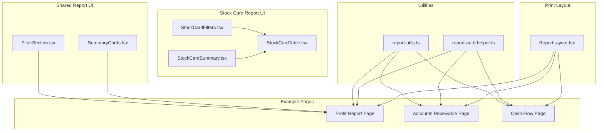
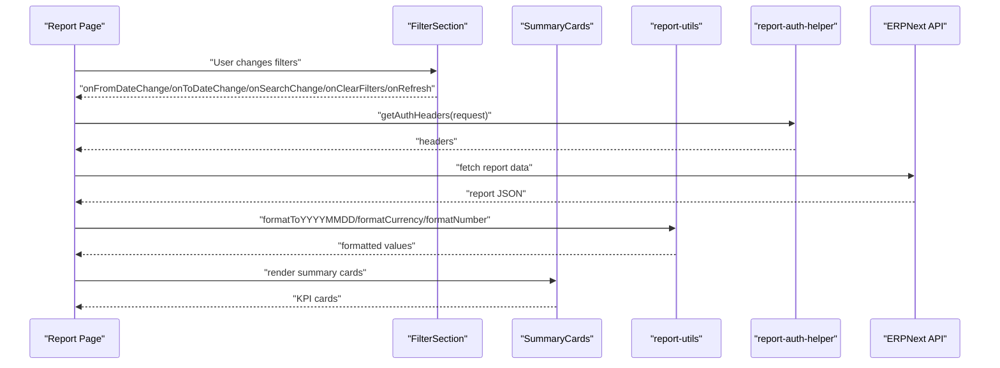
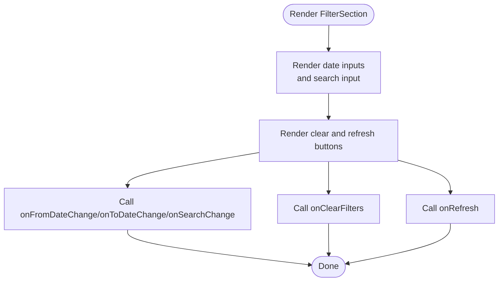
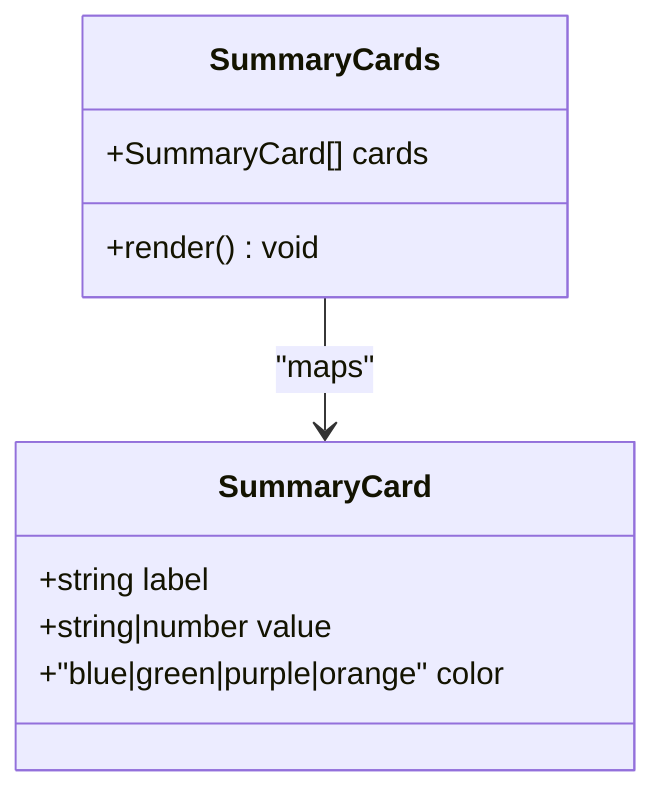
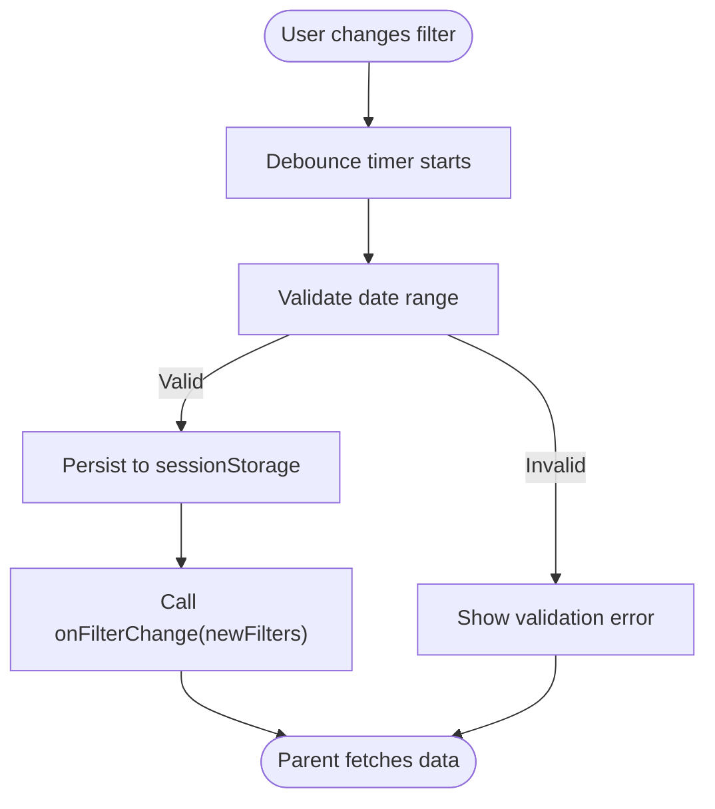
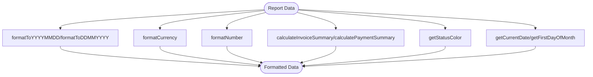
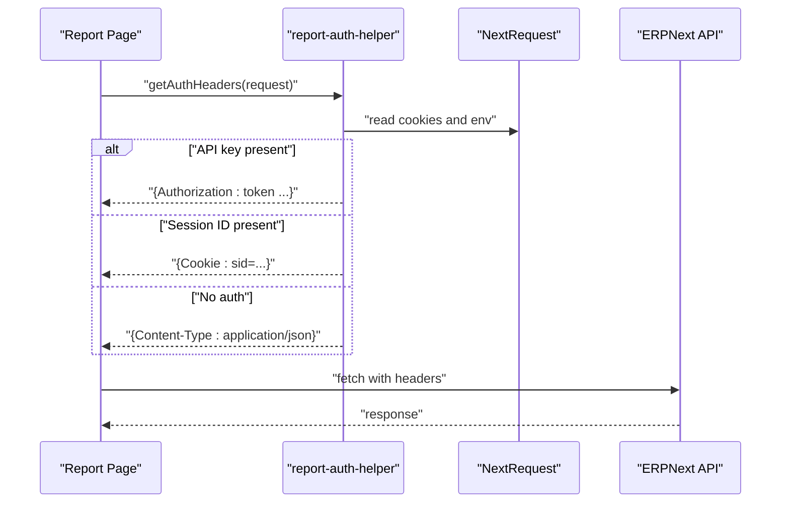
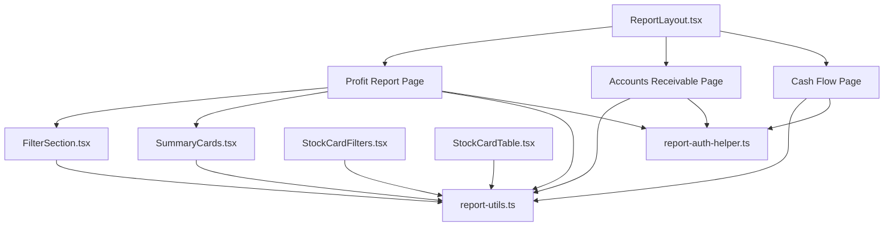

# Report Components & Utilities

<cite>
**Referenced Files in This Document**
- [FilterSection.tsx](file://components/reports/FilterSection.tsx)
- [SummaryCards.tsx](file://components/reports/SummaryCards.tsx)
- [report-utils.ts](file://lib/report-utils.ts)
- [report-auth-helper.ts](file://lib/report-auth-helper.ts)
- [page.tsx](file://app/(dashboard)/profit-report/page.tsx)
- [page.tsx](file://app/reports/accounts-receivable/page.tsx)
- [page.tsx](file://app/reports/cash-flow/page.tsx)
- [StockCardFilters.tsx](file://components/stock-card/StockCardFilters.tsx)
- [StockCardSummary.tsx](file://components/stock-card/StockCardSummary.tsx)
- [StockCardTable.tsx](file://components/stock-card/StockCardTable.tsx)
- [ReportLayout.tsx](file://components/print/ReportLayout.tsx)
</cite>

## Table of Contents
1. [Introduction](#introduction)
2. [Project Structure](#project-structure)
3. [Core Components](#core-components)
4. [Architecture Overview](#architecture-overview)
5. [Detailed Component Analysis](#detailed-component-analysis)
6. [Dependency Analysis](#dependency-analysis)
7. [Performance Considerations](#performance-considerations)
8. [Troubleshooting Guide](#troubleshooting-guide)
9. [Conclusion](#conclusion)

## Introduction
This document describes shared report components and utilities used across the ERPNext system. It covers:
- FilterSection: dynamic filter generation, validation, multi-criteria filtering, and persistence
- SummaryCards: key performance indicators, dashboard widgets, and executive summaries
- Report utilities: data transformation, formatting, aggregation, and export functionality
- Authentication and authorization patterns for secure report access
- Examples of component customization, reusability, and integration with different report types
- Performance optimization techniques, lazy loading strategies, and responsive design considerations

## Project Structure
The report system is organized around reusable UI components and shared utilities:
- Shared report UI: components/reports/*
- Stock card report UI: components/stock-card/*
- Print/report layout: components/print/*
- Utilities: lib/*
- Example report pages: app/*/page.tsx

**Diagram sources**
- [FilterSection.tsx](file://components/reports/FilterSection.tsx#L1-L92)
- [SummaryCards.tsx](file://components/reports/SummaryCards.tsx#L1-L46)
- [StockCardFilters.tsx](file://components/stock-card/StockCardFilters.tsx#L1-L645)
- [StockCardSummary.tsx](file://components/stock-card/StockCardSummary.tsx#L1-L140)
- [StockCardTable.tsx](file://components/stock-card/StockCardTable.tsx#L1-L426)
- [ReportLayout.tsx](file://components/print/ReportLayout.tsx#L1-L381)
- [report-utils.ts](file://lib/report-utils.ts#L1-L108)
- [report-auth-helper.ts](file://lib/report-auth-helper.ts#L1-L21)
- [page.tsx](file://app/(dashboard)/profit-report/page.tsx#L1-L910)
- [page.tsx](file://app/reports/accounts-receivable/page.tsx#L1-L999)
- [page.tsx](file://app/reports/cash-flow/page.tsx#L1-L658)

**Section sources**
- [FilterSection.tsx](file://components/reports/FilterSection.tsx#L1-L92)
- [SummaryCards.tsx](file://components/reports/SummaryCards.tsx#L1-L46)
- [StockCardFilters.tsx](file://components/stock-card/StockCardFilters.tsx#L1-L645)
- [StockCardSummary.tsx](file://components/stock-card/StockCardSummary.tsx#L1-L140)
- [StockCardTable.tsx](file://components/stock-card/StockCardTable.tsx#L1-L426)
- [ReportLayout.tsx](file://components/print/ReportLayout.tsx#L1-L381)
- [report-utils.ts](file://lib/report-utils.ts#L1-L108)
- [report-auth-helper.ts](file://lib/report-auth-helper.ts#L1-L21)
- [page.tsx](file://app/(dashboard)/profit-report/page.tsx#L1-L910)
- [page.tsx](file://app/reports/accounts-receivable/page.tsx#L1-L999)
- [page.tsx](file://app/reports/cash-flow/page.tsx#L1-L658)

## Core Components
- FilterSection: provides a standardized filter panel with date range, search, and action buttons; supports additional custom filters via props
- SummaryCards: renders KPI summary cards with configurable colors and values
- StockCardFilters: advanced filter controls for stock transactions with debounced updates, validation, and persistence
- StockCardSummary: displays stock movement summaries with icons and units
- StockCardTable: responsive table with pagination, formatting, and drill-down links
- ReportLayout: A4-print layout with header, table, footer, and pagination
- report-utils: date conversion, currency formatting, number formatting, summary calculations, status coloring, and date helpers
- report-auth-helper: dual authentication headers for ERPNext API requests

**Section sources**
- [FilterSection.tsx](file://components/reports/FilterSection.tsx#L1-L92)
- [SummaryCards.tsx](file://components/reports/SummaryCards.tsx#L1-L46)
- [StockCardFilters.tsx](file://components/stock-card/StockCardFilters.tsx#L1-L645)
- [StockCardSummary.tsx](file://components/stock-card/StockCardSummary.tsx#L1-L140)
- [StockCardTable.tsx](file://components/stock-card/StockCardTable.tsx#L1-L426)
- [ReportLayout.tsx](file://components/print/ReportLayout.tsx#L1-L381)
- [report-utils.ts](file://lib/report-utils.ts#L1-L108)
- [report-auth-helper.ts](file://lib/report-auth-helper.ts#L1-L21)

## Architecture Overview
The report architecture follows a layered pattern:
- Presentation layer: reusable components (FilterSection, SummaryCards, StockCard* components)
- Data layer: utilities for formatting and aggregation (report-utils)
- Access layer: authentication helper for API requests (report-auth-helper)
- Integration layer: example pages orchestrate data fetching and rendering

**Diagram sources**
- [page.tsx](file://app/(dashboard)/profit-report/page.tsx#L152-L186)
- [report-auth-helper.ts](file://lib/report-auth-helper.ts#L7-L20)
- [report-utils.ts](file://lib/report-utils.ts#L9-L38)
- [FilterSection.tsx](file://components/reports/FilterSection.tsx#L16-L91)
- [SummaryCards.tsx](file://components/reports/SummaryCards.tsx#L27-L45)

## Detailed Component Analysis

### FilterSection Component
FilterSection provides a consistent filter UI with:
- Date range inputs (from/to)
- Text search input
- Optional additional filters slot
- Clear filters and refresh actions

Key behaviors:
- Controlled props for all inputs
- Event handlers for changes and actions
- Responsive grid layout
- Action buttons for clearing and refreshing

Customization patterns:
- Pass additional custom filters via the additionalFilters prop
- Configure placeholders and callbacks externally
- Integrate with report-specific state machines

**Diagram sources**
- [FilterSection.tsx](file://components/reports/FilterSection.tsx#L16-L91)

**Section sources**
- [FilterSection.tsx](file://components/reports/FilterSection.tsx#L1-L92)

### SummaryCards Component
SummaryCards renders a grid of summary cards with:
- Configurable labels and values
- Color-coded categories (blue, green, purple, orange)
- Responsive grid layout

Usage patterns:
- Pass an array of cards with label, value, and color
- Use for KPI dashboards and executive summaries
- Combine with report-utils for consistent formatting

**Diagram sources**
- [SummaryCards.tsx](file://components/reports/SummaryCards.tsx#L3-L45)

**Section sources**
- [SummaryCards.tsx](file://components/reports/SummaryCards.tsx#L1-L46)

### StockCardFilters Component
StockCardFilters provides comprehensive filtering for stock transactions:
- Date range validation (DD/MM/YYYY)
- Debounced filter updates
- Persistent filters in sessionStorage
- Multi-select dropdowns for item, warehouse, customer, supplier
- Transaction type filter

Validation and persistence:
- Validates date range correctness
- Saves filters to sessionStorage
- Debounces API calls to reduce network load

Integration:
- Integrates with StockCardTable for pagination and rendering
- Emits filtered state to parent for data fetching

**Diagram sources**
- [StockCardFilters.tsx](file://components/stock-card/StockCardFilters.tsx#L118-L147)
- [StockCardFilters.tsx](file://components/stock-card/StockCardFilters.tsx#L159-L164)

**Section sources**
- [StockCardFilters.tsx](file://components/stock-card/StockCardFilters.tsx#L1-L645)

### StockCardSummary Component
StockCardSummary displays:
- Opening balance
- Total in/out
- Closing balance
- Transaction count
- Optional item name and UoM

Formatting:
- Uses Indonesian locale for numbers
- Conditional UoM display

**Section sources**
- [StockCardSummary.tsx](file://components/stock-card/StockCardSummary.tsx#L1-L140)

### StockCardTable Component
StockCardTable renders:
- Responsive table with desktop/mobile views
- Pagination controls
- Clickable reference links mapped to document routes
- Color-coded quantities (incoming/outgoing)
- Warehouse and party information

Pagination:
- Supports page size selection
- Desktop and mobile pagination UIs
- Page change handlers passed from parent

**Section sources**
- [StockCardTable.tsx](file://components/stock-card/StockCardTable.tsx#L1-L426)

### Report Utilities
report-utils provides:
- Date formatting helpers (DD/MM/YYYY <-> YYYY-MM-DD)
- Currency formatting (IDR)
- Number formatting (ID locale)
- Summary calculations for invoices and payments
- Status badge color mapping
- Current date and first-of-month helpers

**Diagram sources**
- [report-utils.ts](file://lib/report-utils.ts#L9-L107)

**Section sources**
- [report-utils.ts](file://lib/report-utils.ts#L1-L108)

### Report Authentication and Authorization
report-auth-helper implements dual authentication:
- API Key (primary) with Authorization header
- Session Cookie fallback (Cookie header)

Patterns:
- Extract sid from cookies
- Read API key/secret from environment
- Return appropriate headers for ERPNext API requests

**Diagram sources**
- [report-auth-helper.ts](file://lib/report-auth-helper.ts#L7-L20)

**Section sources**
- [report-auth-helper.ts](file://lib/report-auth-helper.ts#L1-L21)

### Example Report Pages and Integration
Example pages demonstrate:
- Profit Report: multi-criteria filters, export to Excel, charts, and drilldown
- Accounts Receivable: pagination, skeleton loaders, modal details, and print preview
- Cash Flow: hybrid pagination (desktop vs mobile), frontend filtering, and print layout

Integration patterns:
- Use report-utils for formatting and calculations
- Use report-auth-helper for secure API access
- Compose FilterSection and SummaryCards with report-specific data

**Section sources**
- [page.tsx](file://app/(dashboard)/profit-report/page.tsx#L152-L186)
- [page.tsx](file://app/reports/accounts-receivable/page.tsx#L468-L512)
- [page.tsx](file://app/reports/cash-flow/page.tsx#L161-L230)

## Dependency Analysis
Component and utility dependencies:

**Diagram sources**
- [FilterSection.tsx](file://components/reports/FilterSection.tsx#L1-L92)
- [SummaryCards.tsx](file://components/reports/SummaryCards.tsx#L1-L46)
- [StockCardFilters.tsx](file://components/stock-card/StockCardFilters.tsx#L1-L645)
- [StockCardTable.tsx](file://components/stock-card/StockCardTable.tsx#L1-L426)
- [ReportLayout.tsx](file://components/print/ReportLayout.tsx#L1-L381)
- [report-utils.ts](file://lib/report-utils.ts#L1-L108)
- [report-auth-helper.ts](file://lib/report-auth-helper.ts#L1-L21)
- [page.tsx](file://app/(dashboard)/profit-report/page.tsx#L1-L910)
- [page.tsx](file://app/reports/accounts-receivable/page.tsx#L1-L999)
- [page.tsx](file://app/reports/cash-flow/page.tsx#L1-L658)

**Section sources**
- [FilterSection.tsx](file://components/reports/FilterSection.tsx#L1-L92)
- [SummaryCards.tsx](file://components/reports/SummaryCards.tsx#L1-L46)
- [StockCardFilters.tsx](file://components/stock-card/StockCardFilters.tsx#L1-L645)
- [StockCardTable.tsx](file://components/stock-card/StockCardTable.tsx#L1-L426)
- [ReportLayout.tsx](file://components/print/ReportLayout.tsx#L1-L381)
- [report-utils.ts](file://lib/report-utils.ts#L1-L108)
- [report-auth-helper.ts](file://lib/report-auth-helper.ts#L1-L21)
- [page.tsx](file://app/(dashboard)/profit-report/page.tsx#L1-L910)
- [page.tsx](file://app/reports/accounts-receivable/page.tsx#L1-L999)
- [page.tsx](file://app/reports/cash-flow/page.tsx#L1-L658)

## Performance Considerations
- Debounced filter updates: StockCardFilters uses a debounce timer to avoid excessive API calls during rapid input changes
- Local storage/session persistence: Filters persist across sessions to reduce repeated selections
- Frontend pagination: Cash Flow applies pagination on the client-side to reduce server load
- Skeleton loaders: Accounts Receivable and Cash Flow use skeleton loaders to improve perceived performance
- Memoized computations: Example pages use useMemo for derived data (e.g., chart data) to avoid unnecessary recalculations
- Lazy loading strategies: Infinite scroll for mobile views in Accounts Receivable and Cash Flow
- Responsive design: Components adapt to mobile/desktop layouts to optimize rendering and UX

[No sources needed since this section provides general guidance]

## Troubleshooting Guide
Common issues and resolutions:
- Authentication failures: Verify API key/secret and session cookie presence; ensure getAuthHeaders is applied to all report API calls
- Filter validation errors: Check date range validation in StockCardFilters; ensure DD/MM/YYYY format
- Export failures: Confirm data availability before exporting; verify workbook creation and download triggers
- Pagination anomalies: Ensure page change source tracking prevents race conditions; verify page size and total records
- Print layout problems: Validate ReportLayout props and page break configurations

**Section sources**
- [report-auth-helper.ts](file://lib/report-auth-helper.ts#L7-L20)
- [StockCardFilters.tsx](file://components/stock-card/StockCardFilters.tsx#L80-L115)
- [page.tsx](file://app/(dashboard)/profit-report/page.tsx#L305-L334)
- [page.tsx](file://app/reports/cash-flow/page.tsx#L114-L116)
- [ReportLayout.tsx](file://components/print/ReportLayout.tsx#L310-L327)

## Conclusion
The shared report components and utilities provide a robust foundation for building consistent, performant, and secure reporting experiences. By leveraging FilterSection, SummaryCards, StockCard* components, report-utils, and report-auth-helper, developers can create reusable, customizable report interfaces that integrate seamlessly across different report types while maintaining strong formatting, validation, and access control.