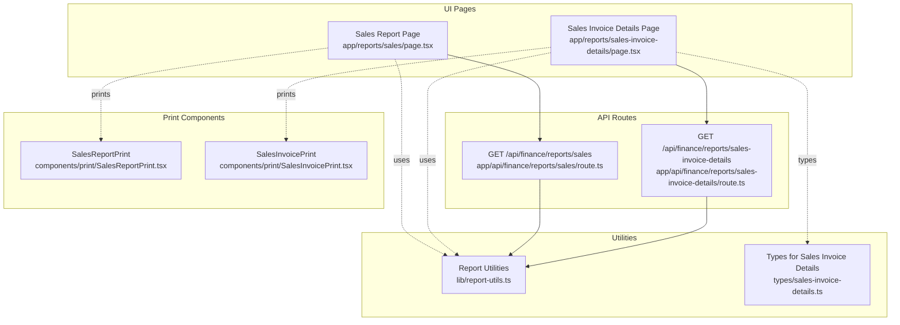
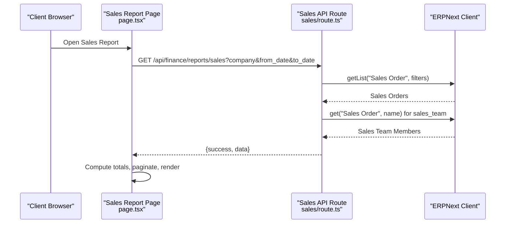
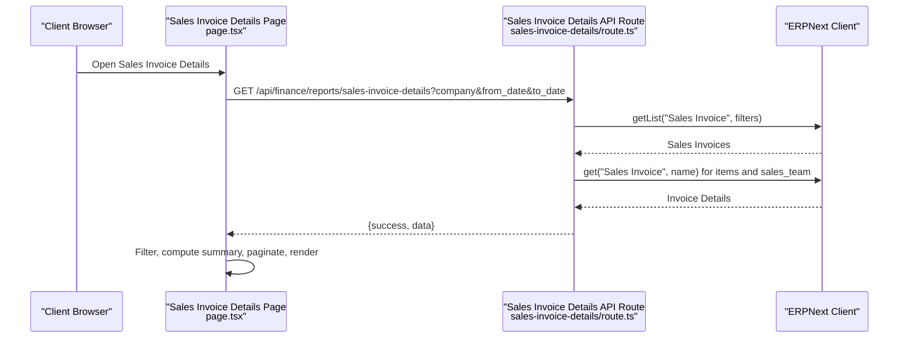
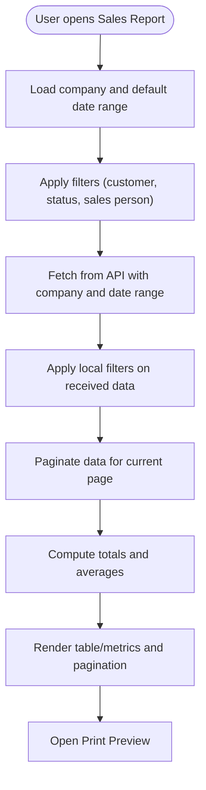
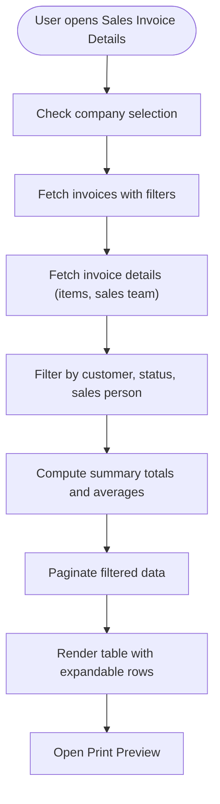
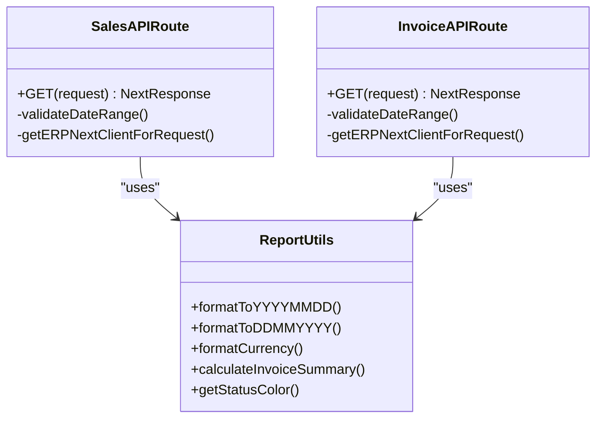
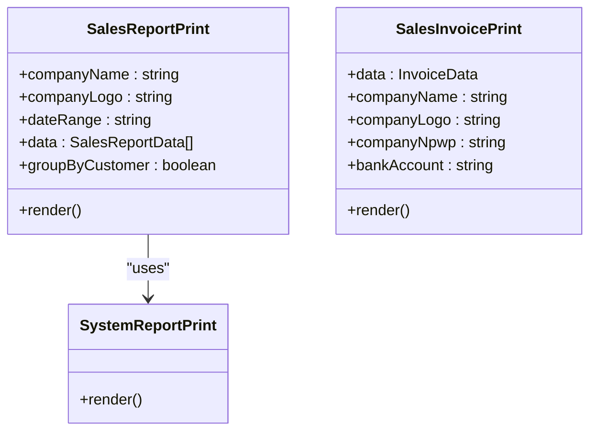
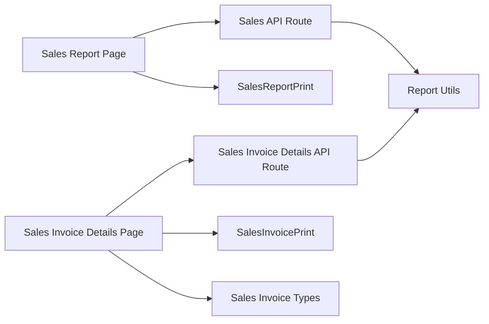

# Sales Reports

<cite>
**Referenced Files in This Document**
- [app/reports/sales/page.tsx](file://app/reports/sales/page.tsx)
- [app/reports/sales-invoice-details/page.tsx](file://app/reports/sales-invoice-details/page.tsx)
- [app/api/finance/reports/sales/route.ts](file://app/api/finance/reports/sales/route.ts)
- [app/api/finance/reports/sales-invoice-details/route.ts](file://app/api/finance/reports/sales-invoice-details/route.ts)
- [components/print/SalesReportPrint.tsx](file://components/print/SalesReportPrint.tsx)
- [components/print/SalesInvoicePrint.tsx](file://components/print/SalesInvoicePrint.tsx)
- [lib/report-utils.ts](file://lib/report-utils.ts)
- [types/sales-invoice-details.ts](file://types/sales-invoice-details.ts)
</cite>

## Table of Contents
1. [Introduction](#introduction)
2. [Project Structure](#project-structure)
3. [Core Components](#core-components)
4. [Architecture Overview](#architecture-overview)
5. [Detailed Component Analysis](#detailed-component-analysis)
6. [Dependency Analysis](#dependency-analysis)
7. [Performance Considerations](#performance-considerations)
8. [Troubleshooting Guide](#troubleshooting-guide)
9. [Conclusion](#conclusion)
10. [Appendices](#appendices)

## Introduction
This document provides comprehensive documentation for the Sales Reports functionality in the ERPNext system. It covers:
- Sales invoice reports and detailed sales invoice views
- Sales analytics and summary metrics
- Customer performance tracking
- Salesperson commission-related insights (via sales team data)
- Data aggregation, revenue calculation, tax reporting integration, and discount analysis
- Filter configurations (date ranges, customer segments, sales persons)
- Report layouts and print/export options
- Dashboard widget integration considerations
- Performance optimization, data refresh mechanisms, and real-time tracking capabilities

## Project Structure
The Sales Reports feature spans UI report pages, API endpoints, shared utilities, and print components:
- Report pages: Sales summary and Sales invoice details
- API routes: Back-end data retrieval and filtering
- Utilities: Date formatting, currency formatting, and summary calculations
- Print components: Standardized report printing for sales data

**Diagram sources**
- [app/reports/sales/page.tsx](file://app/reports/sales/page.tsx#L50-L550)
- [app/reports/sales-invoice-details/page.tsx](file://app/reports/sales-invoice-details/page.tsx#L20-L542)
- [app/api/finance/reports/sales/route.ts](file://app/api/finance/reports/sales/route.ts#L10-L98)
- [app/api/finance/reports/sales-invoice-details/route.ts](file://app/api/finance/reports/sales-invoice-details/route.ts#L11-L170)
- [lib/report-utils.ts](file://lib/report-utils.ts#L1-L108)
- [types/sales-invoice-details.ts](file://types/sales-invoice-details.ts#L1-L40)
- [components/print/SalesReportPrint.tsx](file://components/print/SalesReportPrint.tsx#L1-L161)
- [components/print/SalesInvoicePrint.tsx](file://components/print/SalesInvoicePrint.tsx#L1-L135)

**Section sources**
- [app/reports/sales/page.tsx](file://app/reports/sales/page.tsx#L1-L550)
- [app/reports/sales-invoice-details/page.tsx](file://app/reports/sales-invoice-details/page.tsx#L1-L542)
- [app/api/finance/reports/sales/route.ts](file://app/api/finance/reports/sales/route.ts#L1-L98)
- [app/api/finance/reports/sales-invoice-details/route.ts](file://app/api/finance/reports/sales-invoice-details/route.ts#L1-L170)
- [lib/report-utils.ts](file://lib/report-utils.ts#L1-L108)
- [types/sales-invoice-details.ts](file://types/sales-invoice-details.ts#L1-L40)
- [components/print/SalesReportPrint.tsx](file://components/print/SalesReportPrint.tsx#L1-L161)
- [components/print/SalesInvoicePrint.tsx](file://components/print/SalesInvoicePrint.tsx#L1-L135)

## Core Components
- Sales Report Page: Presents a summarized view of sales orders with progress indicators for delivery and billing, filters, pagination, and print preview.
- Sales Invoice Details Page: Provides a detailed view of sales invoices, expandable item rows, summary cards, and print preview.
- API Routes: Retrieve filtered sales order and sales invoice data from ERPNext via typed filters and date ranges.
- Report Utilities: Shared helpers for date conversion, currency formatting, summary calculations, and status coloring.
- Print Components: Standardized print layouts for sales reports and sales invoices.

Key responsibilities:
- Data fetching and filtering
- Frontend pagination and summary computation
- Print preview generation
- Consistent formatting and status representation

**Section sources**
- [app/reports/sales/page.tsx](file://app/reports/sales/page.tsx#L14-L24)
- [app/reports/sales-invoice-details/page.tsx](file://app/reports/sales-invoice-details/page.tsx#L24-L44)
- [app/api/finance/reports/sales/route.ts](file://app/api/finance/reports/sales/route.ts#L34-L58)
- [app/api/finance/reports/sales-invoice-details/route.ts](file://app/api/finance/reports/sales-invoice-details/route.ts#L40-L78)
- [lib/report-utils.ts](file://lib/report-utils.ts#L9-L53)

## Architecture Overview
The Sales Reports feature follows a client-driven UI pattern with server-side API endpoints:
- UI pages fetch data from API routes with query parameters for company and date range.
- API routes apply filters and retrieve data from ERPNext, enriching sales orders with sales team information.
- UI pages compute summaries and paginate data locally for responsive UX.
- Print previews render standardized layouts using dedicated print components.

**Diagram sources**
- [app/reports/sales/page.tsx](file://app/reports/sales/page.tsx#L120-L171)
- [app/api/finance/reports/sales/route.ts](file://app/api/finance/reports/sales/route.ts#L34-L91)

**Diagram sources**
- [app/reports/sales-invoice-details/page.tsx](file://app/reports/sales-invoice-details/page.tsx#L60-L100)
- [app/api/finance/reports/sales-invoice-details/route.ts](file://app/api/finance/reports/sales-invoice-details/route.ts#L64-L153)

## Detailed Component Analysis

### Sales Report Page
Responsibilities:
- Manage filters: date range, customer search, status, and sales person
- Paginate and summarize sales orders
- Render delivery/billing progress bars and status badges
- Provide print preview with totals

Key behaviors:
- Converts date formats between UI (DD/MM/YYYY) and API (YYYY-MM-DD)
- Computes total sales and average per record
- Applies frontend filters before pagination
- Uses cached data for fast pagination navigation

**Diagram sources**
- [app/reports/sales/page.tsx](file://app/reports/sales/page.tsx#L98-L171)

**Section sources**
- [app/reports/sales/page.tsx](file://app/reports/sales/page.tsx#L50-L550)

### Sales Invoice Details Page
Responsibilities:
- Display detailed sales invoices with expandable item rows
- Provide summary cards (count, total, average)
- Filter by customer, status, and sales person
- Print consolidated invoice details

Key behaviors:
- Fetches invoice list and enriches with item details and sales team
- Uses expandable rows to reveal item-level details
- Calculates summary totals and averages using shared utilities
- Supports print preview with grouped invoice rows

**Diagram sources**
- [app/reports/sales-invoice-details/page.tsx](file://app/reports/sales-invoice-details/page.tsx#L60-L132)
- [app/api/finance/reports/sales-invoice-details/route.ts](file://app/api/finance/reports/sales-invoice-details/route.ts#L82-L153)

**Section sources**
- [app/reports/sales-invoice-details/page.tsx](file://app/reports/sales-invoice-details/page.tsx#L20-L542)
- [types/sales-invoice-details.ts](file://types/sales-invoice-details.ts#L20-L33)

### API Routes
Sales Report API:
- Validates company and date range
- Builds filters for Sales Order (docstatus, company, optional date range)
- Retrieves list and enriches with sales team (first sales person)

Sales Invoice Details API:
- Validates company and date range
- Retrieves Sales Invoice list and details for each invoice
- Extracts items and sales team information

**Diagram sources**
- [app/api/finance/reports/sales/route.ts](file://app/api/finance/reports/sales/route.ts#L10-L98)
- [app/api/finance/reports/sales-invoice-details/route.ts](file://app/api/finance/reports/sales-invoice-details/route.ts#L11-L170)
- [lib/report-utils.ts](file://lib/report-utils.ts#L9-L53)

**Section sources**
- [app/api/finance/reports/sales/route.ts](file://app/api/finance/reports/sales/route.ts#L10-L98)
- [app/api/finance/reports/sales-invoice-details/route.ts](file://app/api/finance/reports/sales-invoice-details/route.ts#L11-L170)
- [lib/report-utils.ts](file://lib/report-utils.ts#L1-L108)

### Print Components
SalesReportPrint:
- Renders a standardized sales report layout with columns for date, customer, document number, and amount
- Supports optional grouping by customer and subtotal computation

SalesInvoicePrint:
- Renders sales invoice documents with itemized details, taxes, and payment terms
- Includes NPWP and bank account notes when provided

**Diagram sources**
- [components/print/SalesReportPrint.tsx](file://components/print/SalesReportPrint.tsx#L106-L160)
- [components/print/SalesInvoicePrint.tsx](file://components/print/SalesInvoicePrint.tsx#L50-L135)

**Section sources**
- [components/print/SalesReportPrint.tsx](file://components/print/SalesReportPrint.tsx#L1-L161)
- [components/print/SalesInvoicePrint.tsx](file://components/print/SalesInvoicePrint.tsx#L1-L135)

## Dependency Analysis
- UI pages depend on:
  - API routes for data retrieval
  - Report utilities for formatting and calculations
  - Print components for rendering print previews
- API routes depend on:
  - ERPNext client for database queries
  - Validation utilities for date range checks
- Print components depend on:
  - Shared print layout templates
  - Formatting helpers

**Diagram sources**
- [app/reports/sales/page.tsx](file://app/reports/sales/page.tsx#L120-L171)
- [app/reports/sales-invoice-details/page.tsx](file://app/reports/sales-invoice-details/page.tsx#L60-L100)
- [app/api/finance/reports/sales/route.ts](file://app/api/finance/reports/sales/route.ts#L34-L58)
- [app/api/finance/reports/sales-invoice-details/route.ts](file://app/api/finance/reports/sales-invoice-details/route.ts#L64-L78)
- [lib/report-utils.ts](file://lib/report-utils.ts#L9-L53)
- [types/sales-invoice-details.ts](file://types/sales-invoice-details.ts#L20-L33)
- [components/print/SalesReportPrint.tsx](file://components/print/SalesReportPrint.tsx#L106-L160)
- [components/print/SalesInvoicePrint.tsx](file://components/print/SalesInvoicePrint.tsx#L50-L135)

**Section sources**
- [app/reports/sales/page.tsx](file://app/reports/sales/page.tsx#L1-L550)
- [app/reports/sales-invoice-details/page.tsx](file://app/reports/sales-invoice-details/page.tsx#L1-L542)
- [app/api/finance/reports/sales/route.ts](file://app/api/finance/reports/sales/route.ts#L1-L98)
- [app/api/finance/reports/sales-invoice-details/route.ts](file://app/api/finance/reports/sales-invoice-details/route.ts#L1-L170)
- [lib/report-utils.ts](file://lib/report-utils.ts#L1-L108)
- [types/sales-invoice-details.ts](file://types/sales-invoice-details.ts#L1-L40)
- [components/print/SalesReportPrint.tsx](file://components/print/SalesReportPrint.tsx#L1-L161)
- [components/print/SalesInvoicePrint.tsx](file://components/print/SalesInvoicePrint.tsx#L1-L135)

## Performance Considerations
- Pagination strategy:
  - UI pages cache full datasets after initial fetch to enable instant pagination without re-fetching.
  - Pagination source tracking prevents race conditions between filter changes and page navigation.
- Filtering:
  - Frontend filtering reduces payload sizes and improves responsiveness for small-to-medium datasets.
- API limits:
  - API routes specify page length limits to avoid oversized responses.
- Formatting:
  - Shared utilities centralize currency and date formatting for consistency and performance.

Recommendations:
- For very large datasets, consider server-side pagination and filtering.
- Debounce filter inputs to reduce unnecessary fetches.
- Use virtualized lists for improved rendering performance on mobile devices.

**Section sources**
- [app/reports/sales/page.tsx](file://app/reports/sales/page.tsx#L73-L74)
- [app/reports/sales/page.tsx](file://app/reports/sales/page.tsx#L180-L194)
- [app/api/finance/reports/sales/route.ts](file://app/api/finance/reports/sales/route.ts#L57-L58)
- [app/api/finance/reports/sales-invoice-details/route.ts](file://app/api/finance/reports/sales-invoice-details/route.ts#L77-L78)

## Troubleshooting Guide
Common issues and resolutions:
- Missing company selection:
  - The invoice details page redirects to company selection if none is found.
- Date range validation errors:
  - API routes validate date ranges and return appropriate error messages.
- Network failures:
  - UI pages display error messages and retry via the refresh action.
- Sales team data missing:
  - API routes gracefully handle missing sales team entries and continue with empty values.

Actions:
- Verify company parameter presence in API requests.
- Confirm date format conversions between UI and API.
- Check network connectivity and API availability.
- Review logs for site-aware error responses.

**Section sources**
- [app/reports/sales-invoice-details/page.tsx](file://app/reports/sales-invoice-details/page.tsx#L50-L57)
- [app/api/finance/reports/sales/route.ts](file://app/api/finance/reports/sales/route.ts#L19-L30)
- [app/api/finance/reports/sales-invoice-details/route.ts](file://app/api/finance/reports/sales-invoice-details/route.ts#L20-L35)
- [app/api/finance/reports/sales/route.ts](file://app/api/finance/reports/sales/route.ts#L81-L88)
- [app/api/finance/reports/sales-invoice-details/route.ts](file://app/api/finance/reports/sales-invoice-details/route.ts#L142-L150)

## Conclusion
The Sales Reports functionality provides robust, user-friendly reporting for sales orders and invoices, with strong filtering, pagination, and print capabilities. The modular design separates concerns across UI pages, API routes, utilities, and print components, enabling maintainability and extensibility. By leveraging frontend caching, local filtering, and standardized print layouts, the system delivers responsive performance while ensuring accurate financial reporting.

## Appendices

### Report Types and Capabilities
- Sales summaries:
  - Sales Report Page displays order-level metrics with delivery/billing progress and status.
- Detailed sales invoices:
  - Sales Invoice Details Page shows invoice-level details with expandable item rows and sales team information.
- Customer performance tracking:
  - Filter by customer and sales person to analyze performance across segments.
- Salesperson commission insights:
  - Sales team data is retrieved and surfaced for commission-related analysis.

**Section sources**
- [app/reports/sales/page.tsx](file://app/reports/sales/page.tsx#L444-L478)
- [app/reports/sales-invoice-details/page.tsx](file://app/reports/sales-invoice-details/page.tsx#L316-L379)
- [app/api/finance/reports/sales/route.ts](file://app/api/finance/reports/sales/route.ts#L62-L89)
- [app/api/finance/reports/sales-invoice-details/route.ts](file://app/api/finance/reports/sales-invoice-details/route.ts#L113-L153)

### Data Aggregation and Calculations
- Revenue calculation:
  - Totals computed from grand totals of invoices/orders.
- Tax reporting integration:
  - Invoice details include tax amounts and rates for tax reporting.
- Discount analysis:
  - Invoice items include discount amounts and percentages for discount analysis.

**Section sources**
- [lib/report-utils.ts](file://lib/report-utils.ts#L43-L53)
- [types/sales-invoice-details.ts](file://types/sales-invoice-details.ts#L1-L12)
- [app/api/finance/reports/sales-invoice-details/route.ts](file://app/api/finance/reports/sales-invoice-details/route.ts#L129-L141)

### Filter Configurations
- Date ranges:
  - From and To date pickers with automatic format conversion.
- Customer segments:
  - Search by customer name or document number.
- Sales persons:
  - Select from dialog or enter partial name.
- Additional filters:
  - Status selection for invoices/orders.

**Section sources**
- [app/reports/sales/page.tsx](file://app/reports/sales/page.tsx#L322-L398)
- [app/reports/sales-invoice-details/page.tsx](file://app/reports/sales-invoice-details/page.tsx#L221-L278)

### Report Layouts and Export Options
- Report layouts:
  - Responsive desktop/tablet/mobile views with expandable rows for invoice details.
- Print options:
  - Print preview modals with paper settings support.
- Export options:
  - PDF export via browser print-to-PDF; Excel export requires backend integration.

**Section sources**
- [app/reports/sales/page.tsx](file://app/reports/sales/page.tsx#L248-L316)
- [app/reports/sales-invoice-details/page.tsx](file://app/reports/sales-invoice-details/page.tsx#L469-L529)
- [components/print/SalesReportPrint.tsx](file://components/print/SalesReportPrint.tsx#L106-L160)
- [components/print/SalesInvoicePrint.tsx](file://components/print/SalesInvoicePrint.tsx#L50-L135)

### Dashboard Widget Integration
- Summary cards:
  - Total invoices, total sales, average invoice, and page info are rendered as summary cards.
- Real-time tracking:
  - Refresh button triggers immediate data reload; pagination leverages cached data for instant navigation.

**Section sources**
- [app/reports/sales/page.tsx](file://app/reports/sales/page.tsx#L401-L419)
- [app/reports/sales-invoice-details/page.tsx](file://app/reports/sales-invoice-details/page.tsx#L134-L156)
- [app/reports/sales/page.tsx](file://app/reports/sales/page.tsx#L219-L225)