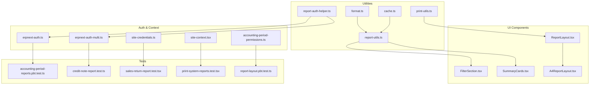
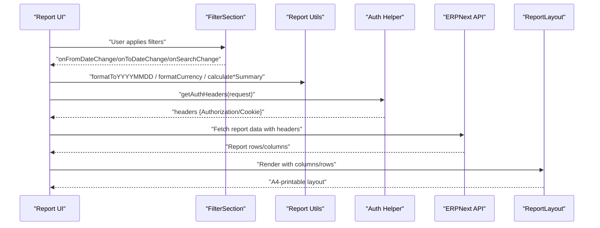
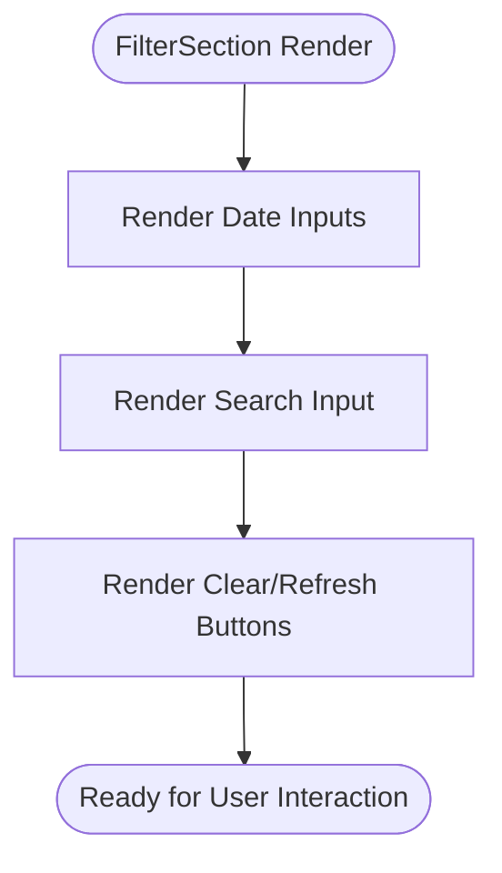
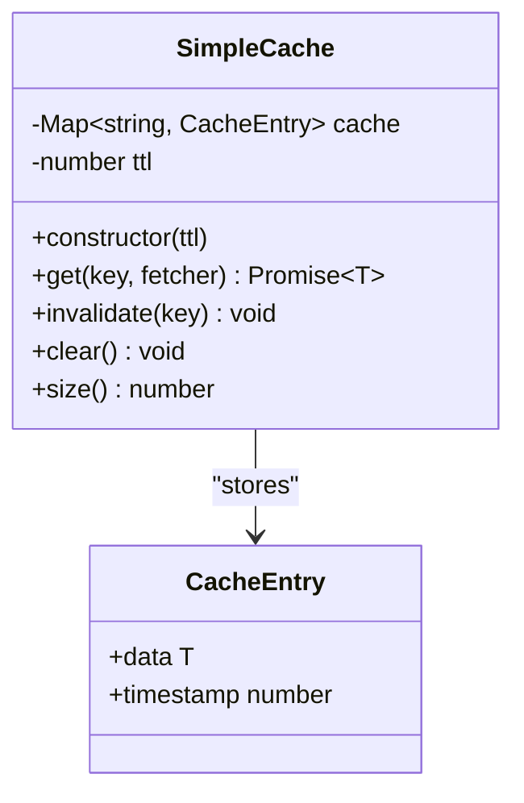
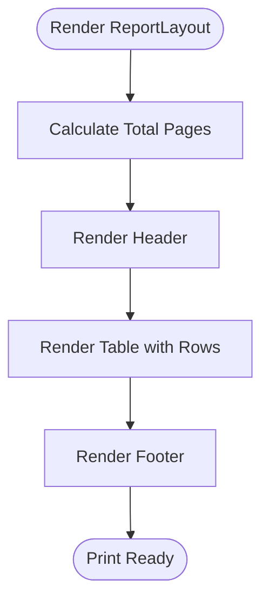
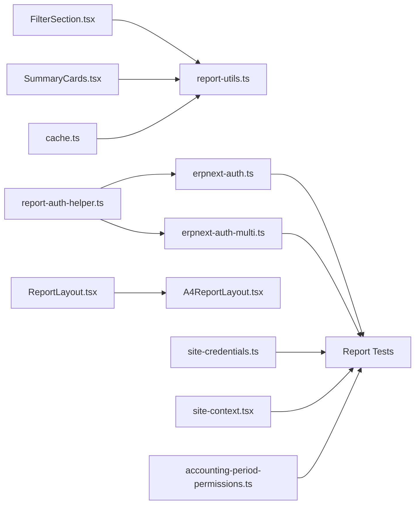

# Report Architecture & Utilities

<cite>
**Referenced Files in This Document**
- [report-utils.ts](file://lib/report-utils.ts)
- [report-auth-helper.ts](file://lib/report-auth-helper.ts)
- [FilterSection.tsx](file://components/reports/FilterSection.tsx)
- [SummaryCards.tsx](file://components/reports/SummaryCards.tsx)
- [cache.ts](file://lib/cache.ts)
- [ReportLayout.tsx](file://components/print/ReportLayout.tsx)
- [A4ReportLayout.tsx](file://app/components/A4ReportLayout.tsx)
- [erpnext-auth.ts](file://utils/erpnext-auth.ts)
- [erpnext-auth-multi.ts](file://utils/erpnext-auth-multi.ts)
- [site-credentials.ts](file://lib/site-credentials.ts)
- [site-context.tsx](file://lib/site-context.tsx)
- [accounting-period-permissions.ts](file://lib/accounting-period-permissions.ts)
- [accounting-period-closing.ts](file://lib/accounting-period-closing.ts)
- [print-utils.ts](file://lib/print-utils.ts)
- [report-validation.ts](file://utils/report-validation.ts)
- [format.ts](file://lib/format.ts)
- [use-erpnext-client.ts](file://lib/use-erpnext-client.ts)
- [accounting-period-reports.pbt.test.ts](file://tests/accounting-period-reports.pbt.test.ts)
- [credit-note-report.test.ts](file://tests/credit-note-report.test.ts)
- [sales-return-report.test.tsx](file://tests/sales-return-report.test.tsx)
- [print-system-reports.test.tsx](file://tests/print-system-reports.test.tsx)
- [print-layout.pbt.test.ts](file://tests/report-layout.pbt.test.ts)
- [report-historical-consistency.test.ts](file://tests/report-historical-consistency.test.ts)
- [role-based-menu-access-preservation.pbt.test.ts](file://tests/role-based-menu-access-preservation.pbt.test.ts)
</cite>

## Table of Contents
1. [Introduction](#introduction)
2. [Project Structure](#project-structure)
3. [Core Components](#core-components)
4. [Architecture Overview](#architecture-overview)
5. [Detailed Component Analysis](#detailed-component-analysis)
6. [Dependency Analysis](#dependency-analysis)
7. [Performance Considerations](#performance-considerations)
8. [Troubleshooting Guide](#troubleshooting-guide)
9. [Conclusion](#conclusion)
10. [Appendices](#appendices)

## Introduction
This document describes the Report Architecture and Utility Systems used across the ERPNext application. It covers:
- Report generation infrastructure and printing layout
- Filtering mechanisms for dynamic report filtering
- Authentication and authorization helpers for secure report access
- Report utility functions for data transformation, aggregation, and formatting
- Summary cards implementation
- Report caching strategies and performance optimization
- Extending the reporting framework, adding custom report types, and integrating with external reporting tools
- Troubleshooting guidance for performance bottlenecks and memory optimization

## Project Structure
The reporting system spans several areas:
- Utilities for report data transformation and formatting
- Authentication helpers for API access
- Reusable UI components for filters and summary cards
- Printing layout components for A4 report rendering
- Caching utilities for performance
- Tests validating report behavior and print layout

**Diagram sources**
- [report-utils.ts](file://lib/report-utils.ts#L1-L108)
- [report-auth-helper.ts](file://lib/report-auth-helper.ts#L1-L21)
- [cache.ts](file://lib/cache.ts#L1-L95)
- [FilterSection.tsx](file://components/reports/FilterSection.tsx#L1-L92)
- [SummaryCards.tsx](file://components/reports/SummaryCards.tsx#L1-L46)
- [ReportLayout.tsx](file://components/print/ReportLayout.tsx#L1-L381)
- [A4ReportLayout.tsx](file://app/components/A4ReportLayout.tsx#L189-L224)
- [erpnext-auth.ts](file://utils/erpnext-auth.ts)
- [erpnext-auth-multi.ts](file://utils/erpnext-auth-multi.ts)
- [site-credentials.ts](file://lib/site-credentials.ts)
- [site-context.tsx](file://lib/site-context.tsx)
- [accounting-period-permissions.ts](file://lib/accounting-period-permissions.ts)
- [print-utils.ts](file://lib/print-utils.ts)
- [format.ts](file://lib/format.ts)

**Section sources**
- [report-utils.ts](file://lib/report-utils.ts#L1-L108)
- [report-auth-helper.ts](file://lib/report-auth-helper.ts#L1-L21)
- [FilterSection.tsx](file://components/reports/FilterSection.tsx#L1-L92)
- [SummaryCards.tsx](file://components/reports/SummaryCards.tsx#L1-L46)
- [ReportLayout.tsx](file://components/print/ReportLayout.tsx#L1-L381)
- [A4ReportLayout.tsx](file://app/components/A4ReportLayout.tsx#L189-L224)
- [cache.ts](file://lib/cache.ts#L1-L95)

## Core Components
- Report Utilities: Date formatting, currency formatting, summary calculations, status color mapping, and convenience date helpers.
- Authentication Helpers: Dual-mode authentication via API key or session cookie for ERPNext API requests.
- Filter Section: Reusable filter UI with date range, search, and action buttons.
- Summary Cards: Reusable summary card component with configurable colors and values.
- Caching: Simple in-memory cache with TTL and global caches for common lookup lists.
- Printing Layout: A4 fixed-format report layout with pagination, hierarchy, and totals.

**Section sources**
- [report-utils.ts](file://lib/report-utils.ts#L1-L108)
- [report-auth-helper.ts](file://lib/report-auth-helper.ts#L1-L21)
- [FilterSection.tsx](file://components/reports/FilterSection.tsx#L1-L92)
- [SummaryCards.tsx](file://components/reports/SummaryCards.tsx#L1-L46)
- [cache.ts](file://lib/cache.ts#L1-L95)
- [ReportLayout.tsx](file://components/print/ReportLayout.tsx#L1-L381)

## Architecture Overview
The reporting architecture integrates UI components, utilities, authentication, and printing layout. Data flows from UI filters to report utilities for transformation and aggregation, then to authentication helpers for secure API access, and finally to printing layout for presentation.

**Diagram sources**
- [FilterSection.tsx](file://components/reports/FilterSection.tsx#L16-L27)
- [report-utils.ts](file://lib/report-utils.ts#L9-L107)
- [report-auth-helper.ts](file://lib/report-auth-helper.ts#L7-L20)
- [ReportLayout.tsx](file://components/print/ReportLayout.tsx#L283-L380)

## Detailed Component Analysis

### Report Utilities
Provides:
- Date conversion helpers for API and display
- Currency and number formatting for Indonesian locale
- Summary calculations for invoices and payments
- Status badge color mapping
- Convenience date helpers for current date and month start

Key functions:
- formatToYYYYMMDD(dateStr)
- formatToDDMMYYYY(dateStr)
- formatCurrency(amount)
- formatNumber(num)
- calculateInvoiceSummary(invoices)
- calculatePaymentSummary(payments)
- getStatusColor(status)
- getCurrentDate()
- getFirstDayOfMonth()

Complexity:
- Date conversions: O(1)
- Summaries: O(n) per array processed
- Formatting: O(1)

Optimization:
- Use memoization for repeated formatting calls
- Batch calculations for large datasets

**Section sources**
- [report-utils.ts](file://lib/report-utils.ts#L9-L107)

### Authentication Helpers
Dual authentication support:
- API Key + Secret (preferred)
- Session Cookie fallback

Behavior:
- Reads sid cookie and ERP API credentials from environment
- Returns Authorization header or Cookie header accordingly

Security considerations:
- Prefer API key for server-side requests
- Ensure cookies are HttpOnly and SameSite configured
- Validate site context and permissions before generating reports

**Section sources**
- [report-auth-helper.ts](file://lib/report-auth-helper.ts#L7-L20)

### Filter Section Component
Reusable filter UI with:
- From/To date pickers
- Text search input
- Additional filters slot
- Clear and Refresh actions

Usage pattern:
- Props define controlled state callbacks for date and search
- Children prop allows embedding additional filter controls
- Action handlers trigger parent refresh logic

**Diagram sources**
- [FilterSection.tsx](file://components/reports/FilterSection.tsx#L16-L27)

**Section sources**
- [FilterSection.tsx](file://components/reports/FilterSection.tsx#L1-L92)

### Summary Cards Component
Displays summary metrics in a responsive grid with color-coded cards.

Features:
- Configurable cards with label/value/color
- Color mapping for consistent visual semantics
- Responsive grid layout

Integration:
- Used alongside filters and report tables
- Values can be numbers (with locale formatting) or strings

**Section sources**
- [SummaryCards.tsx](file://components/reports/SummaryCards.tsx#L1-L46)

### Caching Strategies
Simple in-memory cache with TTL:
- Constructor accepts TTL in milliseconds
- get(key, fetcher) returns cached data if not expired, otherwise fetches and stores
- invalidate(key) and clear() for cache management
- size() for diagnostics

Global caches:
- taxTemplateCache (30 min)
- paymentTermsCache (30 min)
- warehouseCache (30 min)
- itemCache (5 min)
- customerCache/supplierCache (10 min)

**Diagram sources**
- [cache.ts](file://lib/cache.ts#L17-L75)

**Section sources**
- [cache.ts](file://lib/cache.ts#L1-L95)

### Printing Layout (A4 Report)
A4 fixed-format report layout with:
- Header with company info, report title, date range, and timestamp
- Table with dynamic columns, optional hierarchy indentation, and row types (header, total, subtotal, grand total)
- Footer with page numbers and print timestamp
- Pagination calculation based on printable height and content

Integration:
- Consumes columns and rows from report data
- Supports optional children for specialized layouts
- Uses CSS page breaks for pagination

**Diagram sources**
- [ReportLayout.tsx](file://components/print/ReportLayout.tsx#L283-L380)

**Section sources**
- [ReportLayout.tsx](file://components/print/ReportLayout.tsx#L1-L381)
- [A4ReportLayout.tsx](file://app/components/A4ReportLayout.tsx#L189-L224)

### Authentication and Authorization Patterns
- Dual authentication: API key/secret preferred; session cookie fallback
- Site-aware credentials and context for multi-site environments
- Role-based access control for sensitive report features
- Closing period restrictions and notifications

Patterns:
- getAuthHeaders(request) for API calls
- Site credentials extraction and validation
- RBAC checks for report access
- Closing period validations

**Section sources**
- [report-auth-helper.ts](file://lib/report-auth-helper.ts#L7-L20)
- [erpnext-auth.ts](file://utils/erpnext-auth.ts)
- [erpnext-auth-multi.ts](file://utils/erpnext-auth-multi.ts)
- [site-credentials.ts](file://lib/site-credentials.ts)
- [site-context.tsx](file://lib/site-context.tsx)
- [accounting-period-permissions.ts](file://lib/accounting-period-permissions.ts)
- [accounting-period-closing.ts](file://lib/accounting-period-closing.ts)

### Extending the Reporting Framework
- Add custom report types by creating new pages under app/reports/* and components for filters and summary cards
- Integrate with printing layout by preparing columns and rows conforming to the report data model
- Use report utilities for data transformation and aggregation
- Apply caching for expensive lookups (tax templates, items, customers)
- Secure access using authentication helpers and RBAC

Integration points:
- Report pages consume FilterSection and SummaryCards
- Data transformations via report-utils
- Printing via ReportLayout
- Security via auth helpers and site context

[No sources needed since this section provides general guidance]

### Integrating with External Reporting Tools
- Export report data (rows/columns) to CSV/XLSX using formatting utilities
- Use print-utils for export formatting
- Apply filters and authentication consistently across integrations
- Respect caching to avoid redundant exports

[No sources needed since this section provides general guidance]

## Dependency Analysis
The reporting system exhibits low coupling and high cohesion among utilities, UI components, and printing layout. Authentication and caching are cross-cutting concerns.

**Diagram sources**
- [FilterSection.tsx](file://components/reports/FilterSection.tsx#L1-L92)
- [SummaryCards.tsx](file://components/reports/SummaryCards.tsx#L1-L46)
- [report-utils.ts](file://lib/report-utils.ts#L1-L108)
- [report-auth-helper.ts](file://lib/report-auth-helper.ts#L1-L21)
- [cache.ts](file://lib/cache.ts#L1-L95)
- [ReportLayout.tsx](file://components/print/ReportLayout.tsx#L1-L381)
- [A4ReportLayout.tsx](file://app/components/A4ReportLayout.tsx#L189-L224)
- [erpnext-auth.ts](file://utils/erpnext-auth.ts)
- [erpnext-auth-multi.ts](file://utils/erpnext-auth-multi.ts)
- [site-credentials.ts](file://lib/site-credentials.ts)
- [site-context.tsx](file://lib/site-context.tsx)
- [accounting-period-permissions.ts](file://lib/accounting-period-permissions.ts)

**Section sources**
- [report-utils.ts](file://lib/report-utils.ts#L1-L108)
- [report-auth-helper.ts](file://lib/report-auth-helper.ts#L1-L21)
- [FilterSection.tsx](file://components/reports/FilterSection.tsx#L1-L92)
- [SummaryCards.tsx](file://components/reports/SummaryCards.tsx#L1-L46)
- [cache.ts](file://lib/cache.ts#L1-L95)
- [ReportLayout.tsx](file://components/print/ReportLayout.tsx#L1-L381)
- [A4ReportLayout.tsx](file://app/components/A4ReportLayout.tsx#L189-L224)

## Performance Considerations
- Use caching for infrequent or slow-to-fetch report data (tax templates, items, customers)
- Minimize DOM updates by batching filter changes and using controlled components
- Optimize report table rendering by limiting visible rows and deferring heavy computations
- Leverage SimpleCache TTL to balance freshness and performance
- Avoid unnecessary re-renders by memoizing transformed data
- Use pagination in printing layout to reduce memory footprint for large datasets

[No sources needed since this section provides general guidance]

## Troubleshooting Guide
Common issues and remedies:
- Authentication failures: Verify API key/secret and session cookie presence; ensure environment variables are set and cookies are valid
- Filter not applying: Confirm controlled state callbacks are wired correctly; check that onRefresh triggers data reload
- Print layout overflow: Reduce column widths or enable hierarchy indentation; adjust page margins
- Memory spikes: Limit dataset size, apply pagination, and clear caches after long sessions
- Role/access denied: Review RBAC configuration and closing period restrictions

Validation references:
- Accounting period report tests
- Credit note report tests
- Sales return report tests
- Print system and layout tests
- Historical consistency tests
- Role-based menu access preservation tests

**Section sources**
- [accounting-period-reports.pbt.test.ts](file://tests/accounting-period-reports.pbt.test.ts)
- [credit-note-report.test.ts](file://tests/credit-note-report.test.ts)
- [sales-return-report.test.tsx](file://tests/sales-return-report.test.tsx)
- [print-system-reports.test.tsx](file://tests/print-system-reports.test.tsx)
- [print-layout.pbt.test.ts](file://tests/report-layout.pbt.test.ts)
- [report-historical-consistency.test.ts](file://tests/report-historical-consistency.test.ts)
- [role-based-menu-access-preservation.pbt.test.ts](file://tests/role-based-menu-access-preservation.pbt.test.ts)

## Conclusion
The reporting framework combines reusable UI components, robust utilities, secure authentication, and efficient caching to deliver scalable report experiences. By following the patterns outlined here—leveraging report utilities, applying secure authentication, structuring filters and summaries, and optimizing with caching and pagination—you can extend the system with new report types and integrate external tools effectively while maintaining performance and security.

[No sources needed since this section summarizes without analyzing specific files]

## Appendices
- Data model for report rows and columns aligns with printing layout expectations
- Use report-validation utilities to sanitize inputs and ensure consistent data shapes
- For client-side API calls, use the ERPNext client hook to centralize request logic

[No sources needed since this section provides general guidance]