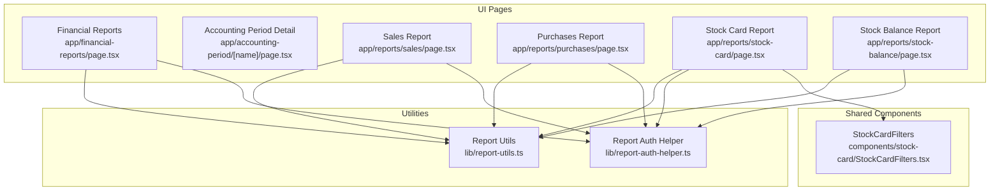
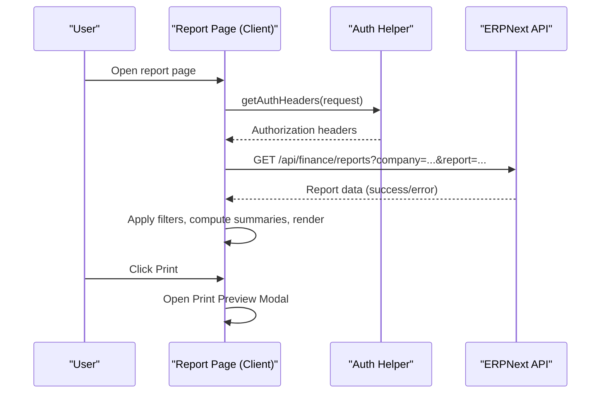
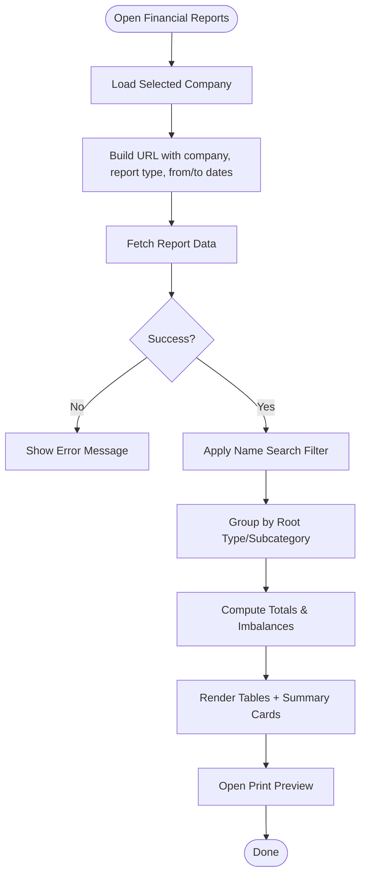
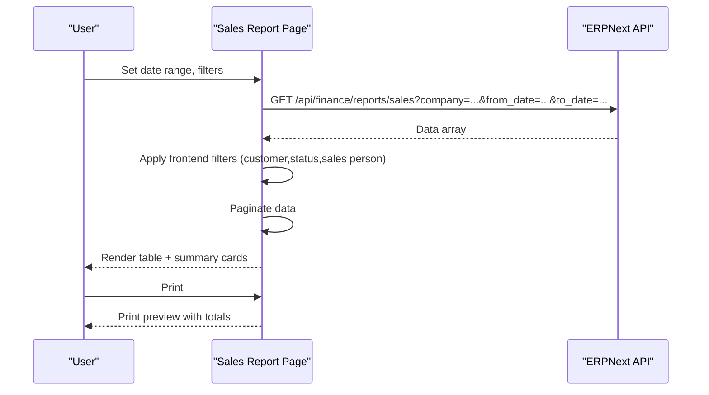
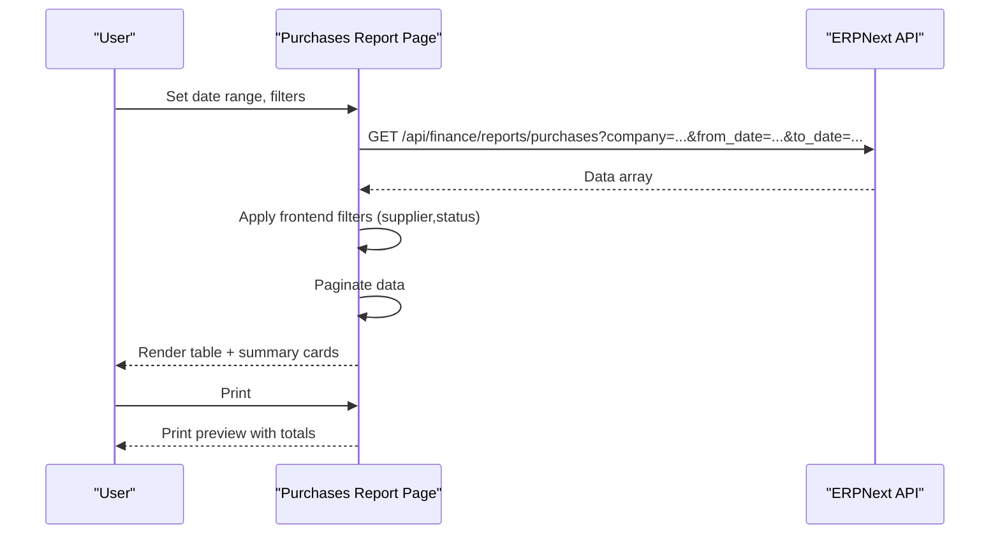
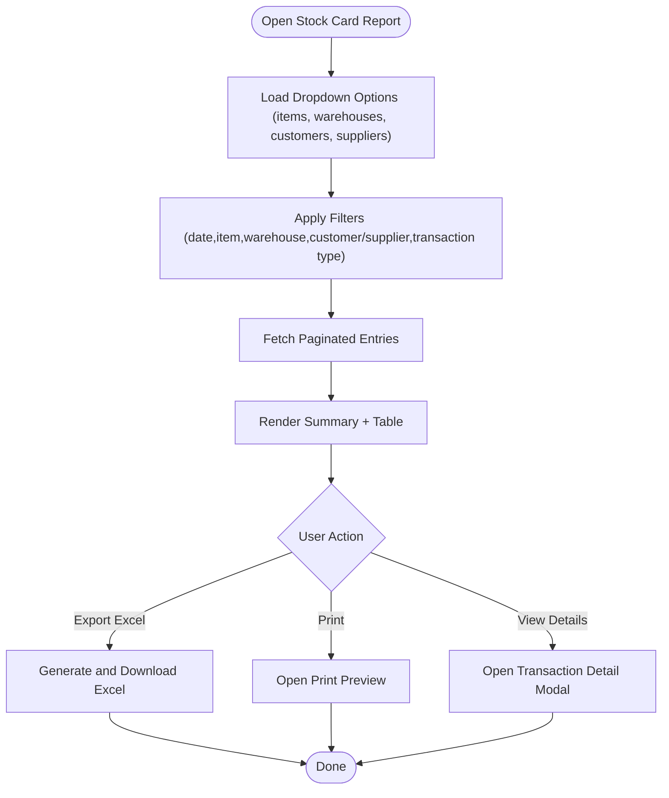
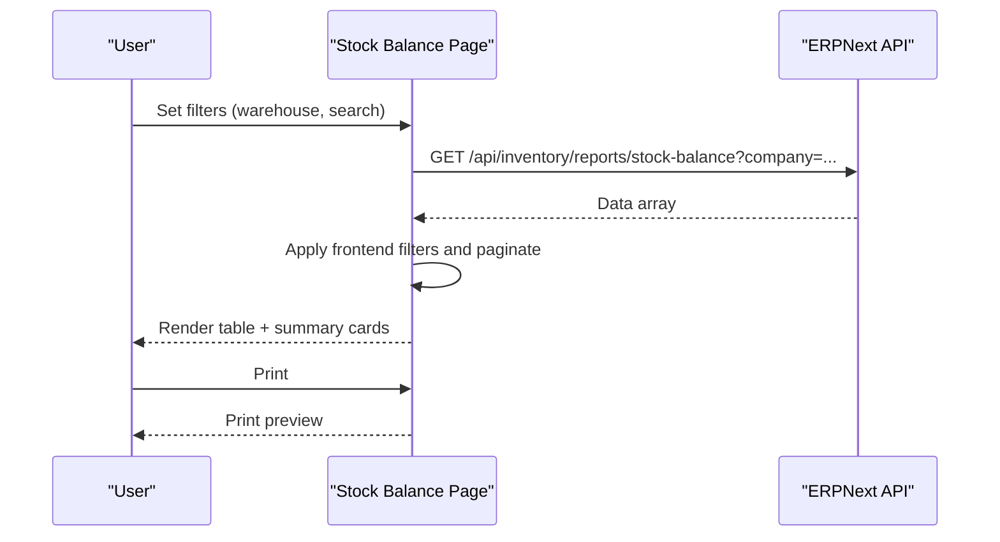
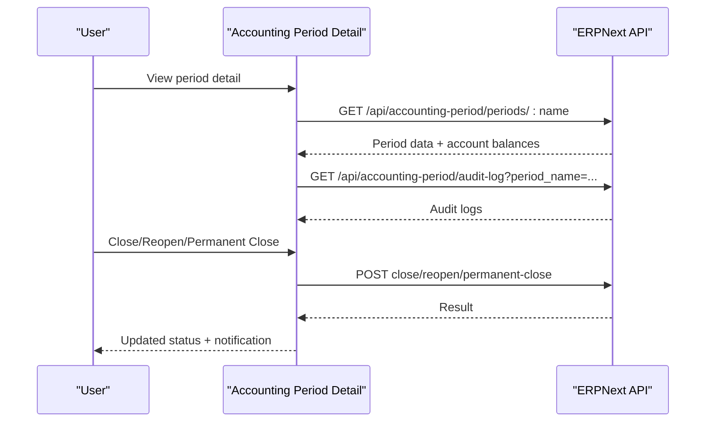
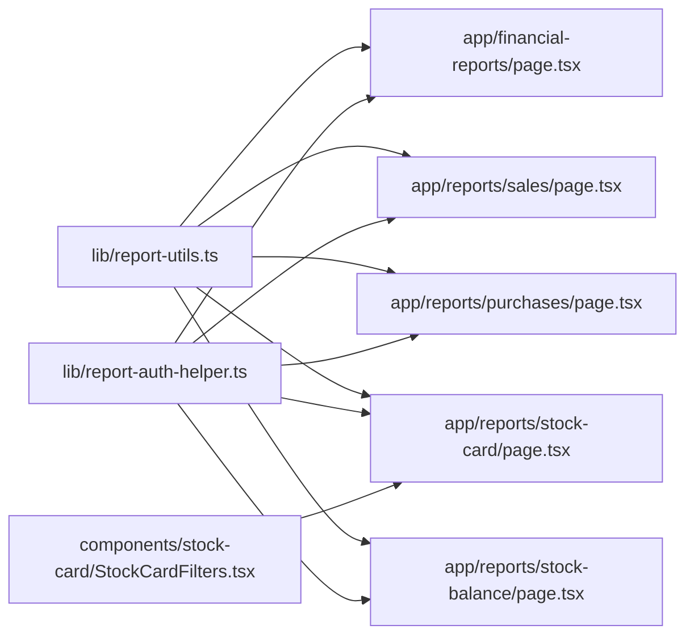

# Reporting System

<cite>
**Referenced Files in This Document**
- [report-utils.ts](file://lib/report-utils.ts)
- [report-auth-helper.ts](file://lib/report-auth-helper.ts)
- [financial-reports/page.tsx](file://app/financial-reports/page.tsx)
- [accounting-period/[name]/page.tsx](file://app/accounting-period/[name]/page.tsx)
- [reports/sales/page.tsx](file://app/reports/sales/page.tsx)
- [reports/purchases/page.tsx](file://app/reports/purchases/page.tsx)
- [reports/stock-card/page.tsx](file://app/reports/stock-card/page.tsx)
- [reports/stock-balance/page.tsx](file://app/reports/stock-balance/page.tsx)
- [components/stock-card/StockCardFilters.tsx](file://components/stock-card/StockCardFilters.tsx)
</cite>

## Table of Contents
1. [Introduction](#introduction)
2. [Project Structure](#project-structure)
3. [Core Components](#core-components)
4. [Architecture Overview](#architecture-overview)
5. [Detailed Component Analysis](#detailed-component-analysis)
6. [Dependency Analysis](#dependency-analysis)
7. [Performance Considerations](#performance-considerations)
8. [Troubleshooting Guide](#troubleshooting-guide)
9. [Conclusion](#conclusion)
10. [Appendices](#appendices)

## Introduction
This document describes the Reporting System within the ERP Next application. It covers financial reports (trial balance, balance sheet, profit and loss), operational reports (sales, purchases, inventory, stock card), report customization via filters, export capabilities, and security considerations. It also provides practical examples of report generation, data visualization, integration with external reporting tools, troubleshooting guidance, and best practices for performance optimization.

## Project Structure
The reporting system is organized around:
- Financial reports UI and data aggregation
- Operational reports (sales, purchases, inventory)
- Stock card report with advanced filtering and export
- Shared utilities for date formatting, currency formatting, and authentication headers
- Accounting period management UI integrating with reports

**Diagram sources**
- [financial-reports/page.tsx](file://app/financial-reports/page.tsx#L91-L140)
- [accounting-period/[name]/page.tsx](file://app/accounting-period/[name]/page.tsx#L14-L75)
- [reports/sales/page.tsx](file://app/reports/sales/page.tsx#L50-L171)
- [reports/purchases/page.tsx](file://app/reports/purchases/page.tsx#L45-L149)
- [reports/stock-card/page.tsx](file://app/reports/stock-card/page.tsx#L440-L569)
- [reports/stock-balance/page.tsx](file://app/reports/stock-balance/page.tsx#L40-L114)
- [report-utils.ts](file://lib/report-utils.ts#L1-L108)
- [report-auth-helper.ts](file://lib/report-auth-helper.ts#L1-L21)
- [components/stock-card/StockCardFilters.tsx](file://components/stock-card/StockCardFilters.tsx#L26-L644)

**Section sources**
- [financial-reports/page.tsx](file://app/financial-reports/page.tsx#L91-L140)
- [reports/sales/page.tsx](file://app/reports/sales/page.tsx#L50-L171)
- [reports/purchases/page.tsx](file://app/reports/purchases/page.tsx#L45-L149)
- [reports/stock-card/page.tsx](file://app/reports/stock-card/page.tsx#L440-L569)
- [reports/stock-balance/page.tsx](file://app/reports/stock-balance/page.tsx#L40-L114)
- [report-utils.ts](file://lib/report-utils.ts#L1-L108)
- [report-auth-helper.ts](file://lib/report-auth-helper.ts#L1-L21)
- [components/stock-card/StockCardFilters.tsx](file://components/stock-card/StockCardFilters.tsx#L26-L644)

## Core Components
- Report Utilities: Provide date conversion, currency formatting, summary calculations, and status color mapping.
- Authentication Helper: Supplies dual-mode authentication headers (API key or session cookie) for secure API requests.
- Financial Reports Page: Aggregates and displays trial balance, balance sheet, and profit and loss with filtering and printing.
- Sales/Purchases Reports: Paginated lists with frontend filtering, summary cards, and print previews.
- Stock Card Report: Advanced filtering, pagination, export to Excel, and detailed transaction modal.
- Stock Balance Report: Warehouse-level inventory snapshot with filtering and printing.
- StockCardFilters Component: Reusable filter UI for stock card report with debounced updates and persisted state.

**Section sources**
- [report-utils.ts](file://lib/report-utils.ts#L1-L108)
- [report-auth-helper.ts](file://lib/report-auth-helper.ts#L1-L21)
- [financial-reports/page.tsx](file://app/financial-reports/page.tsx#L91-L140)
- [reports/sales/page.tsx](file://app/reports/sales/page.tsx#L50-L171)
- [reports/purchases/page.tsx](file://app/reports/purchases/page.tsx#L45-L149)
- [reports/stock-card/page.tsx](file://app/reports/stock-card/page.tsx#L440-L569)
- [reports/stock-balance/page.tsx](file://app/reports/stock-balance/page.tsx#L40-L114)
- [components/stock-card/StockCardFilters.tsx](file://components/stock-card/StockCardFilters.tsx#L26-L644)

## Architecture Overview
The reporting system follows a client-driven architecture:
- UI pages orchestrate data fetching, filtering, and rendering.
- Shared utilities encapsulate formatting and authentication concerns.
- Filtering is applied client-side for quick iteration, with pagination handled either client-side or server-side depending on the report.
- Printing integrates with a print preview modal and external print layouts.

**Diagram sources**
- [report-auth-helper.ts](file://lib/report-auth-helper.ts#L7-L20)
- [financial-reports/page.tsx](file://app/financial-reports/page.tsx#L115-L138)
- [reports/sales/page.tsx](file://app/reports/sales/page.tsx#L120-L171)
- [reports/purchases/page.tsx](file://app/reports/purchases/page.tsx#L101-L149)
- [reports/stock-card/page.tsx](file://app/reports/stock-card/page.tsx#L523-L569)

## Detailed Component Analysis

### Financial Reports (Trial Balance, Balance Sheet, Profit and Loss)
- Data aggregation: Fetches report data by company and date range, computes totals and grouped categories.
- Filtering: Name search, date range, and refresh actions.
- Rendering: Displays grouped sections with computed totals and highlights imbalances.
- Printing: Renders printable layouts with proper formatting and totals.

**Diagram sources**
- [financial-reports/page.tsx](file://app/financial-reports/page.tsx#L91-L140)
- [financial-reports/page.tsx](file://app/financial-reports/page.tsx#L142-L180)
- [financial-reports/page.tsx](file://app/financial-reports/page.tsx#L181-L372)

**Section sources**
- [financial-reports/page.tsx](file://app/financial-reports/page.tsx#L91-L140)
- [financial-reports/page.tsx](file://app/financial-reports/page.tsx#L142-L180)
- [financial-reports/page.tsx](file://app/financial-reports/page.tsx#L181-L372)

### Sales Report
- Data source: Fetches sales data for a company with optional date range.
- Filtering: Customer name, status, and sales person with frontend pagination.
- Summary: Total orders, total sales, average order value, and page info.
- Printing: Print preview modal with summarized table and totals.

**Diagram sources**
- [reports/sales/page.tsx](file://app/reports/sales/page.tsx#L120-L171)
- [reports/sales/page.tsx](file://app/reports/sales/page.tsx#L231-L239)
- [reports/sales/page.tsx](file://app/reports/sales/page.tsx#L264-L316)

**Section sources**
- [reports/sales/page.tsx](file://app/reports/sales/page.tsx#L50-L171)
- [reports/sales/page.tsx](file://app/reports/sales/page.tsx#L231-L239)
- [reports/sales/page.tsx](file://app/reports/sales/page.tsx#L264-L316)

### Purchases Report
- Data source: Fetches purchase data for a company with optional date range.
- Filtering: Supplier name and status with frontend pagination.
- Summary: Total purchase orders, total value, average order value, and page info.
- Printing: Print preview modal with summarized table and totals.

**Diagram sources**
- [reports/purchases/page.tsx](file://app/reports/purchases/page.tsx#L101-L149)
- [reports/purchases/page.tsx](file://app/reports/purchases/page.tsx#L204-L212)
- [reports/purchases/page.tsx](file://app/reports/purchases/page.tsx#L237-L288)

**Section sources**
- [reports/purchases/page.tsx](file://app/reports/purchases/page.tsx#L45-L149)
- [reports/purchases/page.tsx](file://app/reports/purchases/page.tsx#L204-L212)
- [reports/purchases/page.tsx](file://app/reports/purchases/page.tsx#L237-L288)

### Stock Card Report
- Data source: Fetches stock ledger entries with pagination and sorting.
- Filtering: Date range, item, warehouse, customer/supplier (mutually exclusive), transaction type.
- Export: Excel export with summary row.
- Printing: Print preview modal.
- Details: Click to open a modal with transaction details.

**Diagram sources**
- [reports/stock-card/page.tsx](file://app/reports/stock-card/page.tsx#L500-L520)
- [reports/stock-card/page.tsx](file://app/reports/stock-card/page.tsx#L523-L569)
- [reports/stock-card/page.tsx](file://app/reports/stock-card/page.tsx#L600-L624)
- [components/stock-card/StockCardFilters.tsx](file://components/stock-card/StockCardFilters.tsx#L26-L644)

**Section sources**
- [reports/stock-card/page.tsx](file://app/reports/stock-card/page.tsx#L440-L569)
- [reports/stock-card/page.tsx](file://app/reports/stock-card/page.tsx#L600-L624)
- [components/stock-card/StockCardFilters.tsx](file://components/stock-card/StockCardFilters.tsx#L26-L644)

### Stock Balance Report
- Data source: Fetches warehouse-wise stock balances.
- Filtering: Warehouse and item search with frontend pagination.
- Summary: Total items, total quantity, total stock value.
- Printing: Print preview modal.

**Diagram sources**
- [reports/stock-balance/page.tsx](file://app/reports/stock-balance/page.tsx#L95-L114)
- [reports/stock-balance/page.tsx](file://app/reports/stock-balance/page.tsx#L140-L168)
- [reports/stock-balance/page.tsx](file://app/reports/stock-balance/page.tsx#L234-L248)

**Section sources**
- [reports/stock-balance/page.tsx](file://app/reports/stock-balance/page.tsx#L40-L114)
- [reports/stock-balance/page.tsx](file://app/reports/stock-balance/page.tsx#L140-L168)
- [reports/stock-balance/page.tsx](file://app/reports/stock-balance/page.tsx#L234-L248)

### Accounting Period Management
- Provides period detail, account balances, closing journal, and audit logs.
- Supports closing, reopening, and permanent closure with confirmation prompts.
- Includes search and pagination for account balances.

**Diagram sources**
- [accounting-period/[name]/page.tsx](file://app/accounting-period/[name]/page.tsx#L33-L75)
- [accounting-period/[name]/page.tsx](file://app/accounting-period/[name]/page.tsx#L83-L170)

**Section sources**
- [accounting-period/[name]/page.tsx](file://app/accounting-period/[name]/page.tsx#L14-L75)
- [accounting-period/[name]/page.tsx](file://app/accounting-period/[name]/page.tsx#L83-L170)

## Dependency Analysis
- Shared utilities:
  - report-utils.ts: date formatting, currency formatting, summary calculations, status colors.
  - report-auth-helper.ts: dual authentication support for API requests.
- Report pages depend on:
  - Authentication helper for API requests.
  - Report utils for consistent formatting and calculations.
  - Shared components for reusable filters (stock card).

**Diagram sources**
- [report-utils.ts](file://lib/report-utils.ts#L1-L108)
- [report-auth-helper.ts](file://lib/report-auth-helper.ts#L1-L21)
- [financial-reports/page.tsx](file://app/financial-reports/page.tsx#L91-L140)
- [reports/sales/page.tsx](file://app/reports/sales/page.tsx#L50-L171)
- [reports/purchases/page.tsx](file://app/reports/purchases/page.tsx#L45-L149)
- [reports/stock-card/page.tsx](file://app/reports/stock-card/page.tsx#L440-L569)
- [reports/stock-balance/page.tsx](file://app/reports/stock-balance/page.tsx#L40-L114)
- [components/stock-card/StockCardFilters.tsx](file://components/stock-card/StockCardFilters.tsx#L26-L644)

**Section sources**
- [report-utils.ts](file://lib/report-utils.ts#L1-L108)
- [report-auth-helper.ts](file://lib/report-auth-helper.ts#L1-L21)
- [financial-reports/page.tsx](file://app/financial-reports/page.tsx#L91-L140)
- [reports/sales/page.tsx](file://app/reports/sales/page.tsx#L50-L171)
- [reports/purchases/page.tsx](file://app/reports/purchases/page.tsx#L45-L149)
- [reports/stock-card/page.tsx](file://app/reports/stock-card/page.tsx#L440-L569)
- [reports/stock-balance/page.tsx](file://app/reports/stock-balance/page.tsx#L40-L114)
- [components/stock-card/StockCardFilters.tsx](file://components/stock-card/StockCardFilters.tsx#L26-L644)

## Performance Considerations
- Client-side filtering and pagination:
  - Sales and purchases reports cache full datasets for fast filtering and pagination, reducing repeated network requests.
  - Stock card report caches data for pagination and supports export to Excel for large datasets.
- Debounced filter updates:
  - Stock card filters debounce API calls to avoid excessive requests while typing.
- Efficient rendering:
  - Memoized computations for totals and averages to minimize re-renders.
- Printing:
  - Print previews use lightweight modals and iframe-based printing for performance.

[No sources needed since this section provides general guidance]

## Troubleshooting Guide
- Authentication failures:
  - Ensure API key and secret environment variables are configured, or that session cookies are present for fallback authentication.
- Empty or missing data:
  - Verify selected company is set and matches the expected company context.
  - Check date range validity and ensure from_date is not after to_date.
- Excessive network requests:
  - Use debounced filters (stock card) and avoid unnecessary refreshes.
- Large dataset performance:
  - Prefer exporting to Excel for bulk operations; use server-side pagination where available.
- Print formatting issues:
  - Confirm print preview modal is opened and printer settings are configured.

**Section sources**
- [report-auth-helper.ts](file://lib/report-auth-helper.ts#L7-L20)
- [reports/sales/page.tsx](file://app/reports/sales/page.tsx#L120-L171)
- [reports/purchases/page.tsx](file://app/reports/purchases/page.tsx#L101-L149)
- [reports/stock-card/page.tsx](file://app/reports/stock-card/page.tsx#L523-L569)
- [components/stock-card/StockCardFilters.tsx](file://components/stock-card/StockCardFilters.tsx#L122-L147)

## Conclusion
The Reporting System provides a cohesive, efficient framework for financial and operational reporting. It leverages shared utilities for formatting and authentication, offers robust filtering and printing capabilities, and integrates seamlessly with external reporting tools. By following the best practices outlined here, teams can maintain reliable, performant, and secure reporting experiences.

[No sources needed since this section summarizes without analyzing specific files]

## Appendices

### Practical Examples
- Generate a financial report:
  - Select company, choose report type (trial balance, balance sheet, profit and loss), set date range, apply name search, and click print.
- Generate an operational report:
  - Sales: filter by customer, status, and sales person; view summary cards; print.
  - Purchases: filter by supplier and status; view summary cards; print.
- Generate an inventory report:
  - Stock card: select item, date range, warehouse, customer/supplier (mutually exclusive), transaction type; export to Excel; print.
  - Stock balance: filter by warehouse and item; print.

[No sources needed since this section provides general guidance]