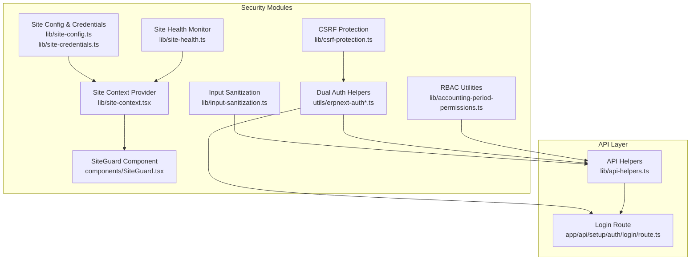
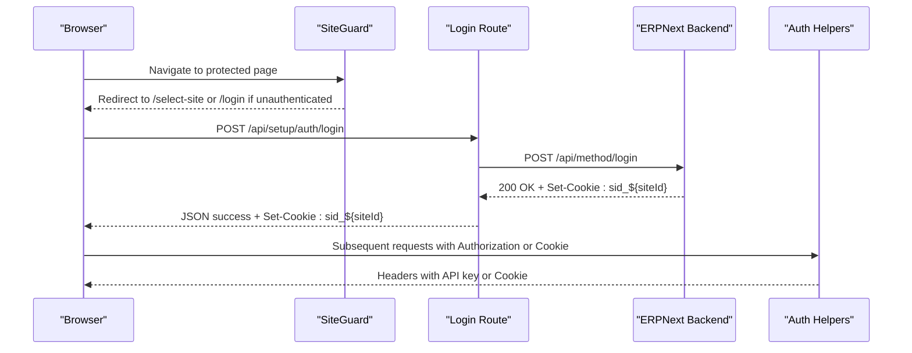
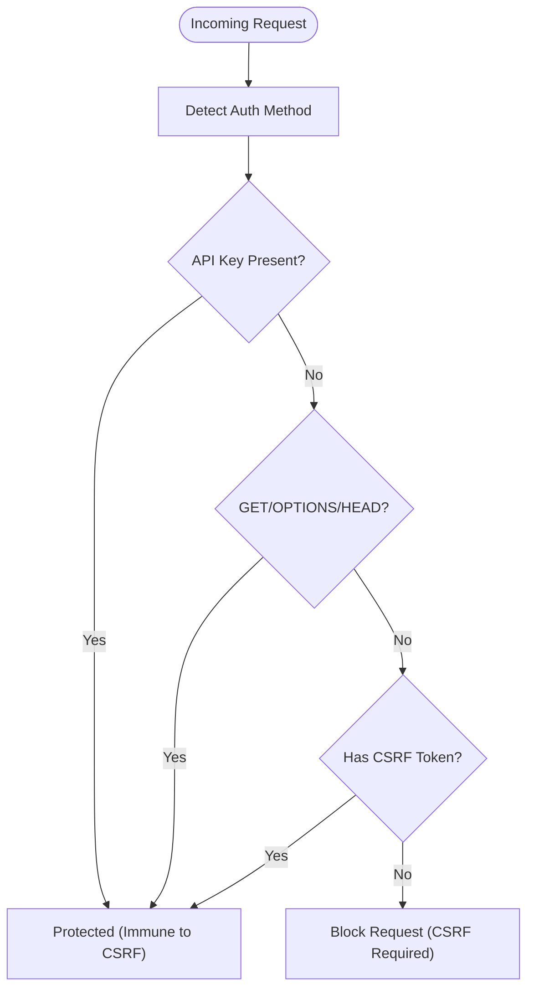
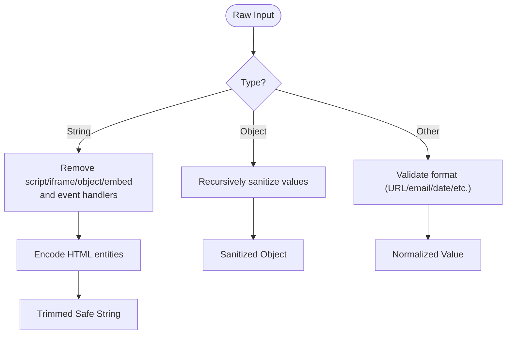
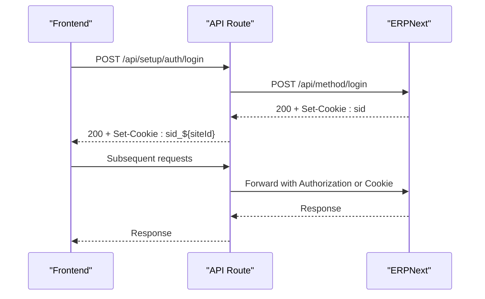
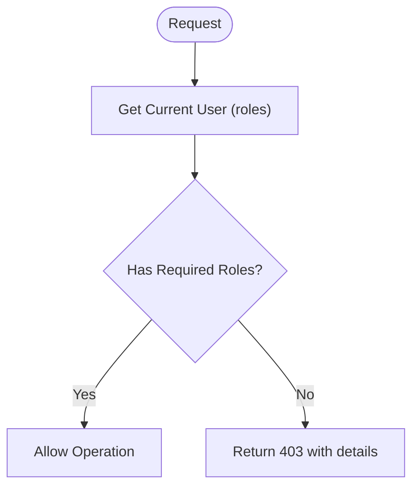
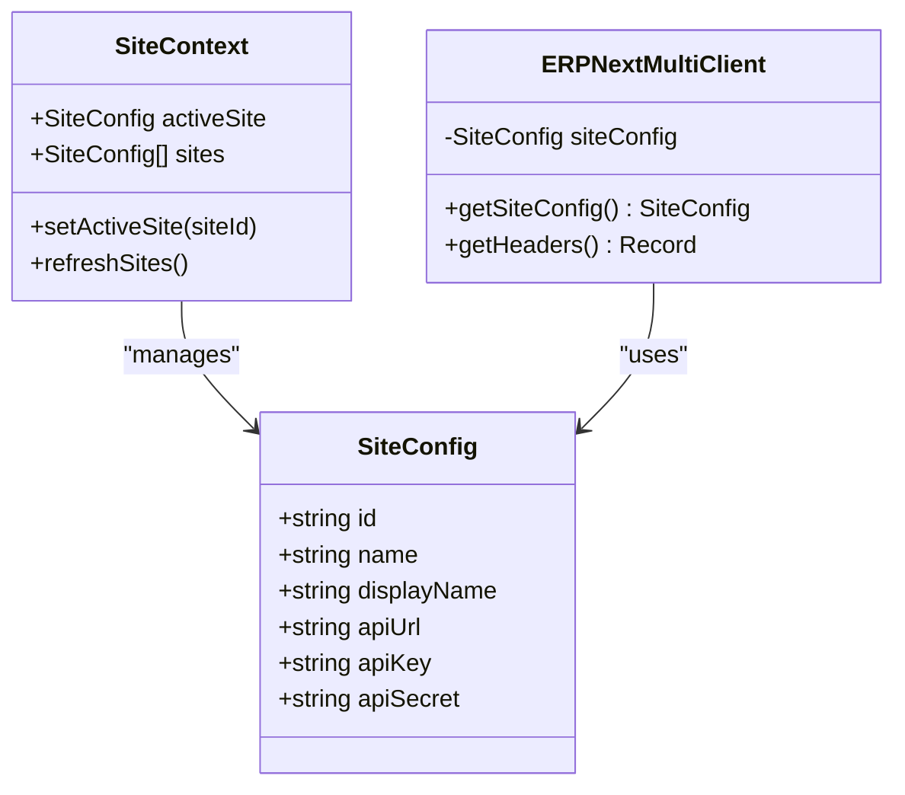
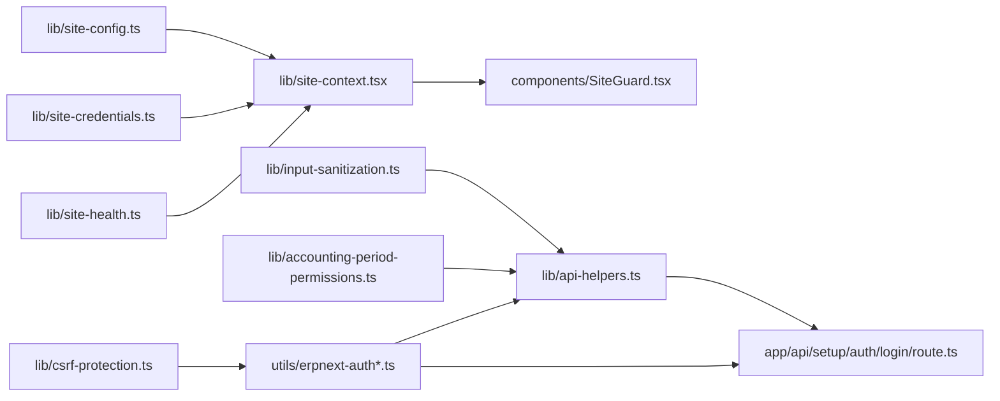

# Security and Authentication

<cite>
**Referenced Files in This Document**
- [csrf-protection.ts](file://lib/csrf-protection.ts)
- [input-sanitization.ts](file://lib/input-sanitization.ts)
- [site-credentials.ts](file://lib/site-credentials.ts)
- [site-context.tsx](file://lib/site-context.tsx)
- [site-config.ts](file://lib/site-config.ts)
- [erpnext-auth.ts](file://utils/erpnext-auth.ts)
- [erpnext-auth-multi.ts](file://utils/erpnext-auth-multi.ts)
- [api-helpers.ts](file://lib/api-helpers.ts)
- [env-config.ts](file://lib/env-config.ts)
- [accounting-period-permissions.ts](file://lib/accounting-period-permissions.ts)
- [report-auth-helper.ts](file://lib/report-auth-helper.ts)
- [route.ts](file://app/api/setup/auth/login/route.ts)
- [SiteGuard.tsx](file://components/SiteGuard.tsx)
- [site-health.ts](file://lib/site-health.ts)
- [csrf-protection.test.ts](file://__tests__/csrf-protection.test.ts)
- [input-sanitization.test.ts](file://__tests__/input-sanitization.test.ts)
</cite>

## Table of Contents
1. [Introduction](#introduction)
2. [Project Structure](#project-structure)
3. [Core Components](#core-components)
4. [Architecture Overview](#architecture-overview)
5. [Detailed Component Analysis](#detailed-component-analysis)
6. [Dependency Analysis](#dependency-analysis)
7. [Performance Considerations](#performance-considerations)
8. [Troubleshooting Guide](#troubleshooting-guide)
9. [Conclusion](#conclusion)

## Introduction
This document explains the security and authentication architecture of the ERPNext system, focusing on CSRF protection, input sanitization, role-based access control (RBAC), and site-aware authorization. It covers authentication mechanisms, authorization patterns, secure credential management, and practical guidance for maintaining application security across multi-site deployments.

## Project Structure
Security-related capabilities are implemented across several modules:
- CSRF protection utilities and validation
- Input sanitization helpers for XSS and injection prevention
- Site configuration and credential management
- Authentication helpers supporting dual-mode (API key and session)
- RBAC utilities for accounting period operations
- Site context and guards for enforcing site isolation
- Health monitoring for operational security visibility

**Diagram sources**
- [csrf-protection.ts](file://lib/csrf-protection.ts#L1-L238)
- [input-sanitization.ts](file://lib/input-sanitization.ts#L1-L280)
- [erpnext-auth.ts](file://utils/erpnext-auth.ts#L1-L157)
- [erpnext-auth-multi.ts](file://utils/erpnext-auth-multi.ts#L1-L279)
- [accounting-period-permissions.ts](file://lib/accounting-period-permissions.ts#L1-L356)
- [site-config.ts](file://lib/site-config.ts#L1-L322)
- [site-credentials.ts](file://lib/site-credentials.ts#L1-L97)
- [site-context.tsx](file://lib/site-context.tsx#L1-L353)
- [SiteGuard.tsx](file://components/SiteGuard.tsx#L1-L89)
- [site-health.ts](file://lib/site-health.ts#L1-L409)
- [api-helpers.ts](file://lib/api-helpers.ts#L1-L186)
- [route.ts](file://app/api/setup/auth/login/route.ts#L1-L176)

**Section sources**
- [csrf-protection.ts](file://lib/csrf-protection.ts#L1-L238)
- [input-sanitization.ts](file://lib/input-sanitization.ts#L1-L280)
- [site-credentials.ts](file://lib/site-credentials.ts#L1-L97)
- [site-context.tsx](file://lib/site-context.tsx#L1-L353)
- [site-config.ts](file://lib/site-config.ts#L1-L322)
- [erpnext-auth.ts](file://utils/erpnext-auth.ts#L1-L157)
- [erpnext-auth-multi.ts](file://utils/erpnext-auth-multi.ts#L1-L279)
- [api-helpers.ts](file://lib/api-helpers.ts#L1-L186)
- [env-config.ts](file://lib/env-config.ts#L1-L342)
- [accounting-period-permissions.ts](file://lib/accounting-period-permissions.ts#L1-L356)
- [report-auth-helper.ts](file://lib/report-auth-helper.ts#L1-L21)
- [route.ts](file://app/api/setup/auth/login/route.ts#L1-L176)
- [SiteGuard.tsx](file://components/SiteGuard.tsx#L1-L89)
- [site-health.ts](file://lib/site-health.ts#L1-L409)

## Core Components
- CSRF Protection: Detects authentication mode and conditionally enforces CSRF token presence for session-based requests; immunities for API key-based auth.
- Input Sanitization: Provides robust sanitization for strings, HTML, emails, URLs, dates, filenames, numbers, booleans, arrays, and request bodies.
- Authentication: Dual-mode authentication with API key (primary) and session cookie fallback; site-specific session cookies for multi-site isolation.
- Authorization: Role-based access control for accounting period operations with explicit role checks and middleware-style permission gating.
- Site Awareness: Site configuration store, credential loader, site context provider, and guards ensuring site isolation and correct routing.

**Section sources**
- [csrf-protection.ts](file://lib/csrf-protection.ts#L71-L232)
- [input-sanitization.ts](file://lib/input-sanitization.ts#L12-L280)
- [erpnext-auth.ts](file://utils/erpnext-auth.ts#L28-L120)
- [erpnext-auth-multi.ts](file://utils/erpnext-auth-multi.ts#L34-L122)
- [accounting-period-permissions.ts](file://lib/accounting-period-permissions.ts#L37-L355)
- [site-config.ts](file://lib/site-config.ts#L97-L172)
- [site-credentials.ts](file://lib/site-credentials.ts#L25-L73)
- [site-context.tsx](file://lib/site-context.tsx#L59-L184)

## Architecture Overview
The system implements layered security:
- Transport and session security: API key authentication (immunity to CSRF) and site-scoped session cookies.
- Request-time protections: CSRF validation for session-based state-changing requests; input sanitization for all user-supplied data.
- Authorization: RBAC checks against ERPNext roles for sensitive operations.
- Site isolation: Site-aware routing, credentials, and session cookies to prevent cross-site leakage.

**Diagram sources**
- [SiteGuard.tsx](file://components/SiteGuard.tsx#L22-L88)
- [route.ts](file://app/api/setup/auth/login/route.ts#L9-L176)
- [erpnext-auth.ts](file://utils/erpnext-auth.ts#L64-L78)
- [erpnext-auth-multi.ts](file://utils/erpnext-auth-multi.ts#L54-L72)

## Detailed Component Analysis

### CSRF Protection
- Detection: Determines whether API key or session-based authentication is active.
- Immunity: API key authentication is inherently immune to CSRF.
- Token enforcement: For session-based auth, CSRF tokens are required for state-changing requests; GET/OPTIONS are exempt.
- Middleware validation: Validates CSRF protection on API routes for state-changing operations.

**Diagram sources**
- [csrf-protection.ts](file://lib/csrf-protection.ts#L184-L211)

**Section sources**
- [csrf-protection.ts](file://lib/csrf-protection.ts#L28-L92)
- [csrf-protection.ts](file://lib/csrf-protection.ts#L140-L159)
- [csrf-protection.ts](file://lib/csrf-protection.ts#L184-L211)
- [csrf-protection.test.ts](file://__tests__/csrf-protection.test.ts#L84-L206)

### Input Validation and Sanitization
- String sanitization removes script tags, iframe, object/embed, and event handlers; encodes HTML entities; trims whitespace.
- Object sanitization recursively sanitizes nested strings.
- HTML sanitization removes dangerous tags and attributes while allowing safe formatting.
- Email, URL, date, filename, number, boolean, and array sanitization enforce strict formats and reject unsafe inputs.
- Middleware and request body sanitizers ensure consistent cleaning across endpoints.

**Diagram sources**
- [input-sanitization.ts](file://lib/input-sanitization.ts#L12-L65)
- [input-sanitization.ts](file://lib/input-sanitization.ts#L71-L90)
- [input-sanitization.ts](file://lib/input-sanitization.ts#L114-L154)
- [input-sanitization.ts](file://lib/input-sanitization.ts#L264-L279)

**Section sources**
- [input-sanitization.ts](file://lib/input-sanitization.ts#L12-L280)
- [input-sanitization.test.ts](file://__tests__/input-sanitization.test.ts#L50-L305)

### Authentication Mechanisms and Session Management
- Dual authentication: API key (primary) and session cookie (fallback). API key headers take precedence.
- Site-specific sessions: Session cookies are named with site prefixes (e.g., sid_bac-batasku) to prevent cross-site leakage.
- Login flow: Authenticates against ERPNext, captures session cookie, resolves user roles, and sets site-scoped cookies.
- Authentication helpers: Provide standardized header construction and session cookie extraction/set/clear utilities.

**Diagram sources**
- [route.ts](file://app/api/setup/auth/login/route.ts#L53-L176)
- [erpnext-auth.ts](file://utils/erpnext-auth.ts#L64-L78)
- [erpnext-auth-multi.ts](file://utils/erpnext-auth-multi.ts#L54-L72)

**Section sources**
- [erpnext-auth.ts](file://utils/erpnext-auth.ts#L28-L120)
- [erpnext-auth-multi.ts](file://utils/erpnext-auth-multi.ts#L34-L122)
- [route.ts](file://app/api/setup/auth/login/route.ts#L9-L176)

### Role-Based Access Control (RBAC)
- User discovery: Retrieves current user via session cookie and fetches roles from ERPNext User document.
- Permission checks: Explicit checks for period closing, reopening, permanent closing, configuration modification, and audit log viewing.
- Middleware-style gating: Helper functions to require authentication and enforce specific permissions with structured error responses.

**Diagram sources**
- [accounting-period-permissions.ts](file://lib/accounting-period-permissions.ts#L37-L86)
- [accounting-period-permissions.ts](file://lib/accounting-period-permissions.ts#L131-L159)
- [accounting-period-permissions.ts](file://lib/accounting-period-permissions.ts#L332-L355)

**Section sources**
- [accounting-period-permissions.ts](file://lib/accounting-period-permissions.ts#L37-L355)

### Site-Aware Authorization and Isolation
- Site configuration store: Persistent site list with validation and environment-driven defaults.
- Credential loading: Loads per-site API credentials from environment variables without storing secrets in browser storage.
- Site context provider: Manages active site, persists selection, clears caches on site switch, and sets active_site cookie.
- Guards: SiteGuard enforces site selection and authentication before rendering protected pages.
- Multi-site client: Extends ERPNext client to route requests to the correct site with site-specific authentication.

**Diagram sources**
- [env-config.ts](file://lib/env-config.ts#L11-L23)
- [site-context.tsx](file://lib/site-context.tsx#L21-L44)
- [site-config.ts](file://lib/site-config.ts#L97-L172)
- [site-credentials.ts](file://lib/site-credentials.ts#L25-L73)
- [site-health.ts](file://lib/site-health.ts#L35-L68)

**Section sources**
- [site-config.ts](file://lib/site-config.ts#L97-L172)
- [site-credentials.ts](file://lib/site-credentials.ts#L25-L73)
- [site-context.tsx](file://lib/site-context.tsx#L59-L184)
- [SiteGuard.tsx](file://components/SiteGuard.tsx#L22-L88)
- [erpnext-multi.ts](file://lib/erpnext-multi.ts#L24-L69)

### Secure Credential Management
- Environment-based credentials: Per-site API keys/secrets loaded from environment variables (e.g., SITE_<ID>_API_KEY).
- Never stored in browser: Credentials are not persisted in localStorage or cookies; only site metadata is stored locally.
- Placeholder markers: Sites can mark credentials as 'env' and load them at runtime.

**Section sources**
- [site-credentials.ts](file://lib/site-credentials.ts#L25-L73)
- [env-config.ts](file://lib/env-config.ts#L244-L259)

### Security Monitoring and Observability
- Site health monitor: Periodic health checks with failure tracking, history, and subscriber notifications; persists status to localStorage.
- Site-aware error logging: API helpers classify and log errors with site context for troubleshooting.

**Section sources**
- [site-health.ts](file://lib/site-health.ts#L35-L164)
- [site-health.ts](file://lib/site-health.ts#L388-L409)
- [api-helpers.ts](file://lib/api-helpers.ts#L167-L185)

## Dependency Analysis

**Diagram sources**
- [csrf-protection.ts](file://lib/csrf-protection.ts#L1-L238)
- [input-sanitization.ts](file://lib/input-sanitization.ts#L1-L280)
- [erpnext-auth.ts](file://utils/erpnext-auth.ts#L1-L157)
- [erpnext-auth-multi.ts](file://utils/erpnext-auth-multi.ts#L1-L279)
- [accounting-period-permissions.ts](file://lib/accounting-period-permissions.ts#L1-L356)
- [site-config.ts](file://lib/site-config.ts#L1-L322)
- [site-credentials.ts](file://lib/site-credentials.ts#L1-L97)
- [site-context.tsx](file://lib/site-context.tsx#L1-L353)
- [SiteGuard.tsx](file://components/SiteGuard.tsx#L1-L89)
- [api-helpers.ts](file://lib/api-helpers.ts#L1-L186)
- [route.ts](file://app/api/setup/auth/login/route.ts#L1-L176)
- [site-health.ts](file://lib/site-health.ts#L1-L409)

**Section sources**
- [csrf-protection.ts](file://lib/csrf-protection.ts#L1-L238)
- [input-sanitization.ts](file://lib/input-sanitization.ts#L1-L280)
- [erpnext-auth.ts](file://utils/erpnext-auth.ts#L1-L157)
- [erpnext-auth-multi.ts](file://utils/erpnext-auth-multi.ts#L1-L279)
- [accounting-period-permissions.ts](file://lib/accounting-period-permissions.ts#L1-L356)
- [site-config.ts](file://lib/site-config.ts#L1-L322)
- [site-credentials.ts](file://lib/site-credentials.ts#L1-L97)
- [site-context.tsx](file://lib/site-context.tsx#L1-L353)
- [SiteGuard.tsx](file://components/SiteGuard.tsx#L1-L89)
- [api-helpers.ts](file://lib/api-helpers.ts#L1-L186)
- [route.ts](file://app/api/setup/auth/login/route.ts#L1-L176)
- [site-health.ts](file://lib/site-health.ts#L1-L409)

## Performance Considerations
- Prefer API key authentication for server-to-server operations to avoid CSRF overhead and reduce request complexity.
- Use input sanitization judiciously; apply only where necessary to minimize processing overhead.
- Cache site health checks and status to reduce repeated network calls; leverage built-in persistence and history limits.
- Ensure site-specific cookies are scoped appropriately to avoid unnecessary cookie transfer on cross-site requests.

## Troubleshooting Guide
- CSRF failures on state-changing requests:
  - Verify authentication mode; API key requests are immune.
  - For session-based requests, ensure CSRF token is present in headers.
  - Confirm request method is not read-only (GET/OPTIONS/HEAD).
- Authentication errors:
  - Check that API key and secret are configured when using API key mode.
  - For session mode, verify site-scoped cookie sid_${siteId} is present and valid.
- Permission denials:
  - Confirm user roles in ERPNext and that required roles are granted.
  - Use RBAC helper functions to inspect required roles and user roles.
- Site switching issues:
  - Ensure active_site cookie is set and site credentials are available in environment.
  - Clear caches on site switch to prevent stale data leakage.
- Input sanitization rejections:
  - Review sanitized formats for emails, URLs, dates, and filenames.
  - Apply appropriate sanitization before storing or processing user input.

**Section sources**
- [csrf-protection.ts](file://lib/csrf-protection.ts#L140-L211)
- [erpnext-auth.ts](file://utils/erpnext-auth.ts#L154-L156)
- [accounting-period-permissions.ts](file://lib/accounting-period-permissions.ts#L332-L355)
- [site-context.tsx](file://lib/site-context.tsx#L152-L184)
- [input-sanitization.ts](file://lib/input-sanitization.ts#L95-L154)

## Conclusion
The system employs a layered security model combining CSRF immunity via API key authentication, robust input sanitization, strict RBAC for sensitive operations, and strong site isolation through per-site credentials and session cookies. The architecture emphasizes secure defaults, clear separation of concerns, and observability to maintain safety and reliability across multi-site deployments.