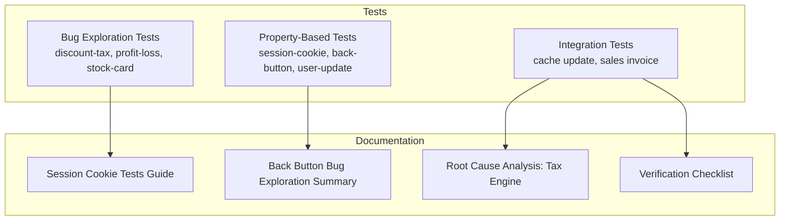
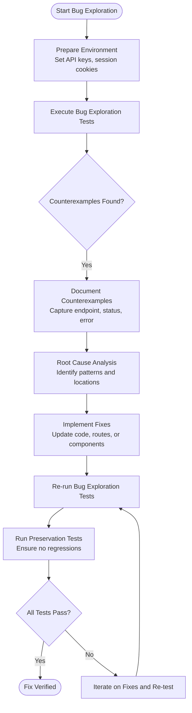
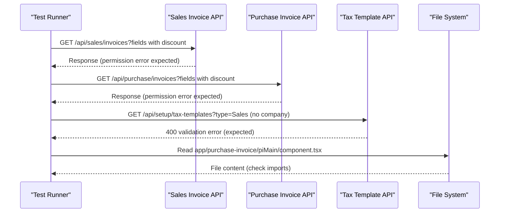
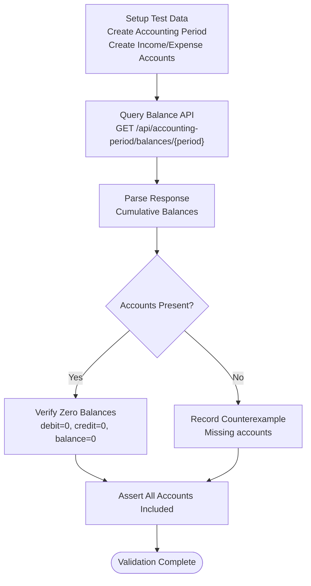
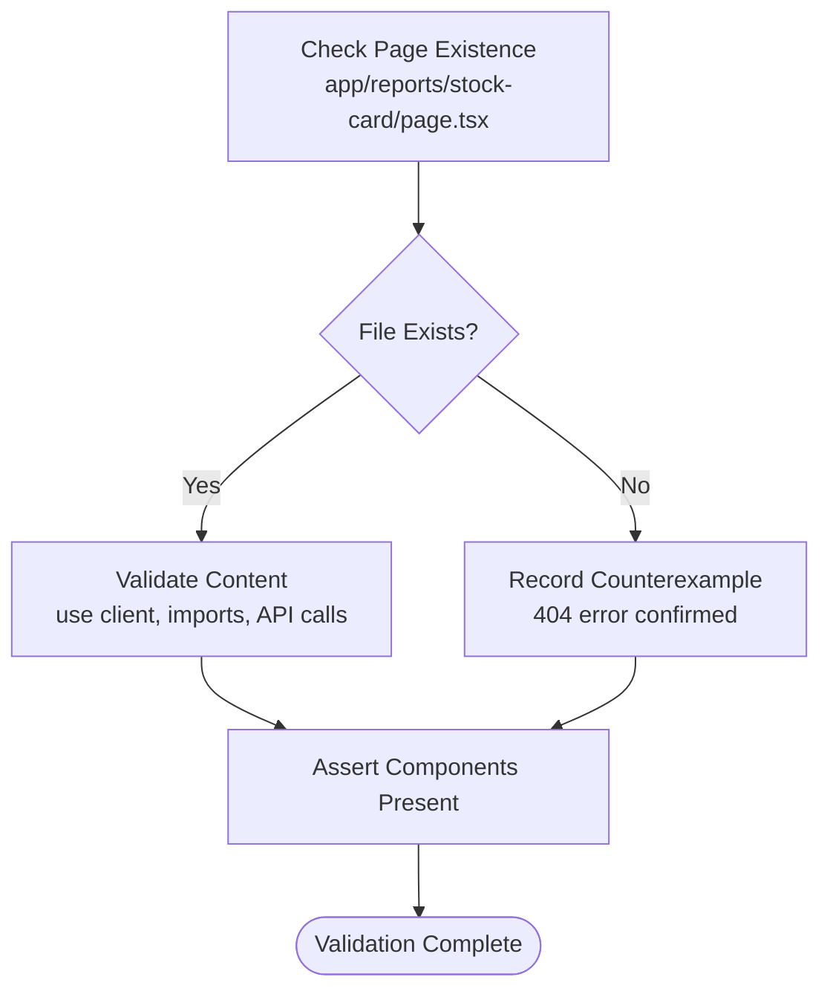
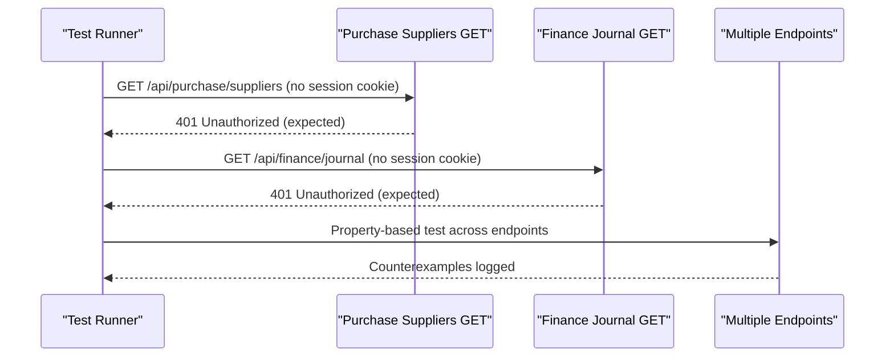
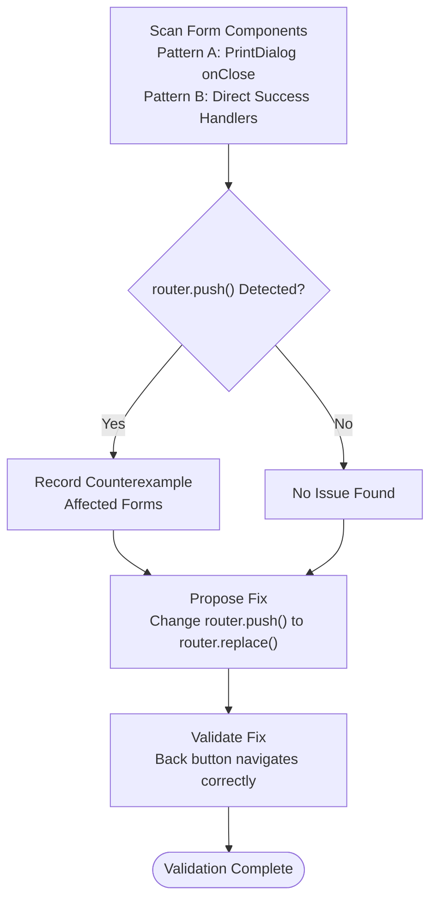
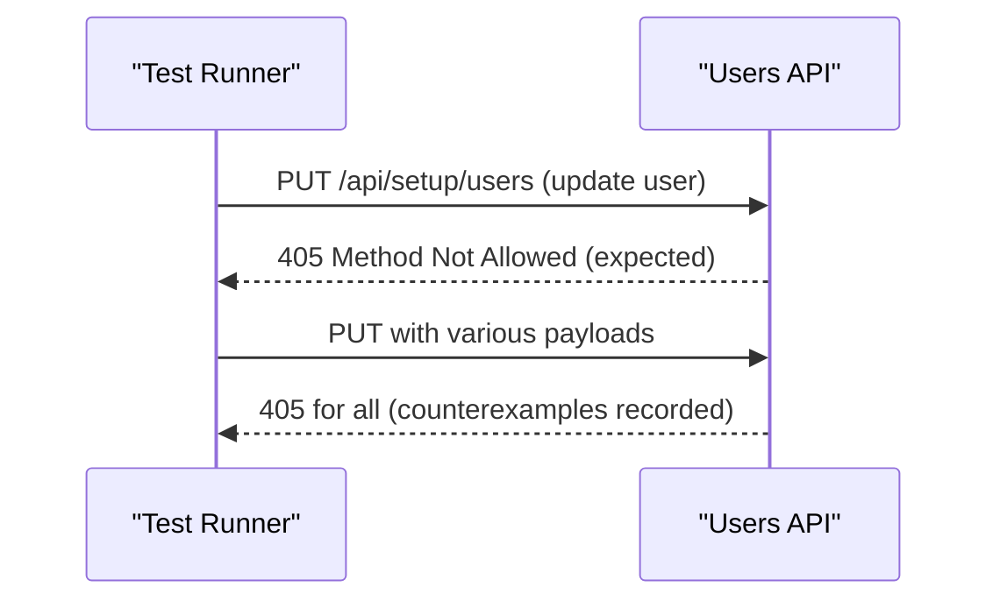
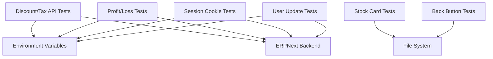

# Bug Exploration Testing

<cite>
**Referenced Files in This Document**
- [tests/README.md](file://tests/README.md)
- [tests/bug-exploration-discount-tax-api.test.ts](file://tests/bug-exploration-discount-tax-api.test.ts)
- [tests/bug-exploration-profit-loss-zero-values.test.ts](file://tests/bug-exploration-profit-loss-zero-values.test.ts)
- [tests/bug-exploration-stock-card-page-missing.test.ts](file://tests/bug-exploration-stock-card-page-missing.test.ts)
- [tests/session-cookie-blocks-api-key-bug-exploration.pbt.test.ts](file://tests/session-cookie-blocks-api-key-bug-exploration.pbt.test.ts)
- [tests/back-button-after-form-submission-bug-exploration.pbt.test.ts](file://tests/back-button-after-form-submission-bug-exploration.pbt.test.ts)
- [tests/user-update-405-bug-exploration.pbt.test.ts](file://tests/user-update-405-bug-exploration.pbt.test.ts)
- [tests/README-session-cookie-tests.md](file://tests/README-session-cookie-tests.md)
- [tests/README-back-button-bug-exploration.md](file://tests/README-back-button-bug-exploration.md)
- [docs/bugs-fixes/ROOT_CAUSE_ANALYSIS_TAX_ENGINE.md](file://docs/bugs-fixes/ROOT_CAUSE_ANALYSIS_TAX_ENGINE.md)
- [__tests__/README-INTEGRATION-TESTS.md](file://__tests__/README-INTEGRATION-TESTS.md)
- [tests/sales-invoice-cache-update-integration.test.ts](file://tests/sales-invoice-cache-update-integration.test.ts)
</cite>

## Table of Contents
1. [Introduction](#introduction)
2. [Project Structure](#project-structure)
3. [Core Components](#core-components)
4. [Architecture Overview](#architecture-overview)
5. [Detailed Component Analysis](#detailed-component-analysis)
6. [Dependency Analysis](#dependency-analysis)
7. [Performance Considerations](#performance-considerations)
8. [Troubleshooting Guide](#troubleshooting-guide)
9. [Conclusion](#conclusion)
10. [Appendices](#appendices)

## Introduction
This document presents a comprehensive methodology for bug exploration testing in the ERP Next System. It focuses on discovering and validating edge cases, regressions, and unexpected behaviors across key functional areas: discount and tax APIs, profit and loss calculations, missing pages, session cookie handling, back button preservation, and user update error scenarios. The methodology leverages property-based testing, targeted bug exploration tests, and structured validation to ensure robust detection and reproducibility of issues, while providing clear guidance for fixing, regression prevention, and documentation.

## Project Structure
The repository organizes bug exploration and related testing under the tests directory, with supporting documentation and integration tests that validate end-to-end behavior. Key areas include:
- Bug exploration tests for discount/tax API issues, profit/loss calculation anomalies, and missing page scenarios
- Property-based tests for session cookie authentication and back button navigation
- User update 405 error exploration and preservation tests
- Supporting documentation for environment setup, test workflows, and verification checklists

**Section sources**
- [tests/README.md](file://tests/README.md#L1-L162)
- [tests/README-session-cookie-tests.md](file://tests/README-session-cookie-tests.md#L1-L225)
- [tests/README-back-button-bug-exploration.md](file://tests/README-back-button-bug-exploration.md#L1-L132)

## Core Components
This section outlines the core testing components used for bug exploration, highlighting their purpose, execution model, and validation criteria.

- Discount and Tax API Bug Exploration
  - Purpose: Confirm production API errors for discount fields, tax template validation, and import path issues
  - Execution: Runs against live endpoints and file system to document counterexamples
  - Validation: Assertions designed to fail on unfixed code, documenting root causes and expected fixes

- Profit and Loss Zero Values Bug Exploration
  - Purpose: Validate inclusion of zero-balance Income/Expense accounts in balance API responses
  - Execution: Creates test accounting periods and accounts, queries balance API, and asserts presence and zero balances
  - Validation: Identifies missing accounts and documents expected fix behavior

- Stock Card Page Missing Bug Exploration
  - Purpose: Detect missing page component causing 404 errors
  - Execution: Checks for existence of page file and verifies API route and component presence
  - Validation: Confirms backend infrastructure exists while frontend integration is missing

- Session Cookie Authentication Bug Exploration
  - Purpose: Demonstrate that inline session cookie checks block API Key fallback
  - Execution: Property-based testing across multiple endpoints with randomized parameters
  - Validation: Documents counterexamples where 401 Unauthorized is returned despite valid API Key

- Back Button After Form Submission Bug Exploration
  - Purpose: Identify forms that use router.push() instead of router.replace(), leaving form pages in history
  - Execution: Pattern-based analysis across form components to detect router.push() usage
  - Validation: Enumerates affected forms and proposes replacement with router.replace()

- User Update 405 Bug Exploration
  - Purpose: Confirm PUT requests to /api/setup/users return 405 due to missing PUT handler
  - Execution: Property-based testing with varied user update payloads
  - Validation: Documents counterexamples and isolates the bug to missing PUT method

**Section sources**
- [tests/bug-exploration-discount-tax-api.test.ts](file://tests/bug-exploration-discount-tax-api.test.ts#L1-L229)
- [tests/bug-exploration-profit-loss-zero-values.test.ts](file://tests/bug-exploration-profit-loss-zero-values.test.ts#L1-L449)
- [tests/bug-exploration-stock-card-page-missing.test.ts](file://tests/bug-exploration-stock-card-page-missing.test.ts#L1-L189)
- [tests/session-cookie-blocks-api-key-bug-exploration.pbt.test.ts](file://tests/session-cookie-blocks-api-key-bug-exploration.pbt.test.ts#L1-L435)
- [tests/back-button-after-form-submission-bug-exploration.pbt.test.ts](file://tests/back-button-after-form-submission-bug-exploration.pbt.test.ts#L1-L469)
- [tests/user-update-405-bug-exploration.pbt.test.ts](file://tests/user-update-405-bug-exploration.pbt.test.ts#L1-L502)

## Architecture Overview
The bug exploration methodology follows a consistent workflow across components:
- Environment preparation and prerequisite validation
- Execution of targeted tests that intentionally fail on unfixed code
- Counterexample documentation and root cause analysis
- Fix validation via re-execution and preservation tests
- Regression prevention through property-based and integration tests

**Diagram sources**
- [tests/README-session-cookie-tests.md](file://tests/README-session-cookie-tests.md#L74-L108)
- [tests/README-back-button-bug-exploration.md](file://tests/README-back-button-bug-exploration.md#L106-L132)

## Detailed Component Analysis

### Discount and Tax API Bug Exploration
This component targets three primary issues:
- Invoice API field permission errors for discount fields
- Tax template API validation errors for missing company parameter
- Purchase Invoice form import path errors

**Diagram sources**
- [tests/bug-exploration-discount-tax-api.test.ts](file://tests/bug-exploration-discount-tax-api.test.ts#L41-L229)

Key validation steps:
- Confirm permission errors for discount fields in GET requests
- Validate 400 error for missing company parameter in tax template API
- Verify incorrect import paths in Purchase Invoice form and document correct locations

**Section sources**
- [tests/bug-exploration-discount-tax-api.test.ts](file://tests/bug-exploration-discount-tax-api.test.ts#L1-L229)

### Profit and Loss Zero Values Bug Exploration
This component validates that zero-balance Income/Expense accounts are included in balance API responses with zero balances.

**Diagram sources**
- [tests/bug-exploration-profit-loss-zero-values.test.ts](file://tests/bug-exploration-profit-loss-zero-values.test.ts#L139-L449)

Root cause analysis highlights that the balance API currently excludes Income/Expense accounts without GL entries, requiring a fix to include all accounts from the Chart of Accounts and initialize balances appropriately.

**Section sources**
- [tests/bug-exploration-profit-loss-zero-values.test.ts](file://tests/bug-exploration-profit-loss-zero-values.test.ts#L1-L449)
- [docs/bugs-fixes/ROOT_CAUSE_ANALYSIS_TAX_ENGINE.md](file://docs/bugs-fixes/ROOT_CAUSE_ANALYSIS_TAX_ENGINE.md#L1-L299)

### Stock Card Page Missing Bug Exploration
This component detects missing page components causing 404 errors by verifying file existence and content.

**Diagram sources**
- [tests/bug-exploration-stock-card-page-missing.test.ts](file://tests/bug-exploration-stock-card-page-missing.test.ts#L39-L189)

The test confirms that API routes and components exist, but the page integration is missing, leading to navigation failures.

**Section sources**
- [tests/bug-exploration-stock-card-page-missing.test.ts](file://tests/bug-exploration-stock-card-page-missing.test.ts#L1-L189)

### Session Cookie Authentication Bug Exploration
This component demonstrates that inline session cookie checks block API Key fallback across multiple endpoints.

**Diagram sources**
- [tests/session-cookie-blocks-api-key-bug-exploration.pbt.test.ts](file://tests/session-cookie-blocks-api-key-bug-exploration.pbt.test.ts#L94-L435)

The fix involves replacing inline session cookie checks with centralized dual authentication that prioritizes API Key and falls back to session cookies.

**Section sources**
- [tests/session-cookie-blocks-api-key-bug-exploration.pbt.test.ts](file://tests/session-cookie-blocks-api-key-bug-exploration.pbt.test.ts#L1-L435)
- [tests/README-session-cookie-tests.md](file://tests/README-session-cookie-tests.md#L1-L225)

### Back Button After Form Submission Bug Exploration
This component identifies forms using router.push() instead of router.replace(), allowing back navigation to submitted forms.

**Diagram sources**
- [tests/back-button-after-form-submission-bug-exploration.pbt.test.ts](file://tests/back-button-after-form-submission-bug-exploration.pbt.test.ts#L125-L469)

The fix ensures that after successful submission, forms use router.replace() to avoid leaving form pages in browser history.

**Section sources**
- [tests/back-button-after-form-submission-bug-exploration.pbt.test.ts](file://tests/back-button-after-form-submission-bug-exploration.pbt.test.ts#L1-L469)
- [tests/README-back-button-bug-exploration.md](file://tests/README-back-button-bug-exploration.md#L1-L132)

### User Update 405 Bug Exploration
This component confirms PUT requests to /api/setup/users return 405 due to missing PUT handler.

**Diagram sources**
- [tests/user-update-405-bug-exploration.pbt.test.ts](file://tests/user-update-405-bug-exploration.pbt.test.ts#L1-L502)

The fix requires adding a PUT handler to the route to enable user updates.

**Section sources**
- [tests/user-update-405-bug-exploration.pbt.test.ts](file://tests/user-update-405-bug-exploration.pbt.test.ts#L1-L502)

## Dependency Analysis
The bug exploration tests depend on:
- Environment configuration (API keys, session cookies)
- Live ERPNext backend services
- File system for import path validation
- Property-based libraries for randomized testing

**Diagram sources**
- [tests/README-session-cookie-tests.md](file://tests/README-session-cookie-tests.md#L36-L73)
- [tests/bug-exploration-profit-loss-zero-values.test.ts](file://tests/bug-exploration-profit-loss-zero-values.test.ts#L19-L449)
- [tests/bug-exploration-stock-card-page-missing.test.ts](file://tests/bug-exploration-stock-card-page-missing.test.ts#L12-L189)

**Section sources**
- [tests/README-session-cookie-tests.md](file://tests/README-session-cookie-tests.md#L1-L225)
- [tests/README-back-button-bug-exploration.md](file://tests/README-back-button-bug-exploration.md#L1-L132)

## Performance Considerations
- Property-based tests generate many randomized inputs to increase coverage and uncover edge cases efficiently
- File system checks are lightweight and fast, suitable for local development environments
- API-based tests rely on network performance; timeouts and retries should be considered in CI/CD pipelines
- Prefer targeted tests over broad sweeps to minimize runtime and focus on high-risk areas

## Troubleshooting Guide
Common issues and resolutions:
- Missing environment variables for API Key or session cookies
  - Ensure ERP_API_KEY, ERP_API_SECRET, and optional TEST_SESSION_COOKIE are configured
  - Refer to the session cookie tests guide for environment setup and cookie extraction
- Network connectivity and service availability
  - Verify ERPNext backend and Next.js server are running
  - Use curl commands to test endpoints and collect detailed error messages
- File path discrepancies
  - Validate import paths in form components and ensure correct component locations
- Test failures indicating bugs exist
  - Intentional failures confirm bug presence; document counterexamples and proceed with fixes
- Preservation tests after fixes
  - Re-run preservation tests to ensure no regressions in session cookie auth or business logic

**Section sources**
- [tests/README-session-cookie-tests.md](file://tests/README-session-cookie-tests.md#L167-L225)
- [__tests__/README-INTEGRATION-TESTS.md](file://__tests__/README-INTEGRATION-TESTS.md#L132-L224)

## Conclusion
The bug exploration methodology provides a structured approach to discovering edge cases, regressions, and unexpected behaviors across critical ERP Next System components. By leveraging intentional failures, counterexample documentation, and property-based testing, teams can systematically validate fixes, prevent future issues, and maintain high-quality integrations. The outlined workflows ensure reproducibility, clear validation criteria, and actionable next steps for continuous improvement.

## Appendices

### Practical Examples and Patterns
- Testing session cookie handling
  - Use property-based tests to validate API Key authentication across multiple endpoints with randomized parameters
  - Document counterexamples and verify centralized dual authentication implementation
- Back button preservation
  - Scan form components for router.push() usage and replace with router.replace() after successful submissions
  - Validate navigation behavior and ensure preservation of cancel and error handling patterns
- User update error scenarios
  - Confirm PUT requests return 405 and document affected payloads
  - Implement PUT handler and re-validate with property-based tests

### Validation of Bug Fixes
- Re-run bug exploration tests to confirm failures are resolved
- Execute preservation tests to ensure no regressions
- Perform integration tests for end-to-end workflows (e.g., cache update for sales invoices)
- Maintain verification checklists for critical fields and business flows

**Section sources**
- [tests/README-session-cookie-tests.md](file://tests/README-session-cookie-tests.md#L146-L225)
- [tests/README-back-button-bug-exploration.md](file://tests/README-back-button-bug-exploration.md#L85-L132)
- [__tests__/README-INTEGRATION-TESTS.md](file://__tests__/README-INTEGRATION-TESTS.md#L203-L224)