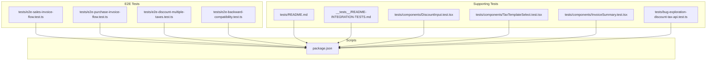
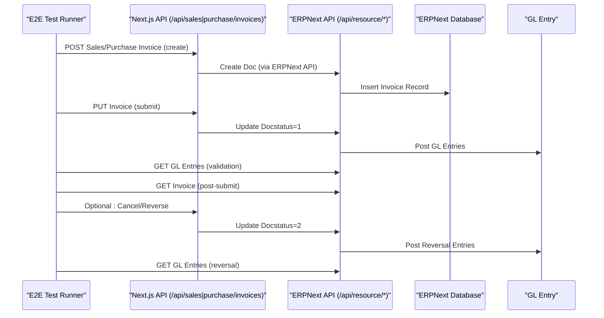
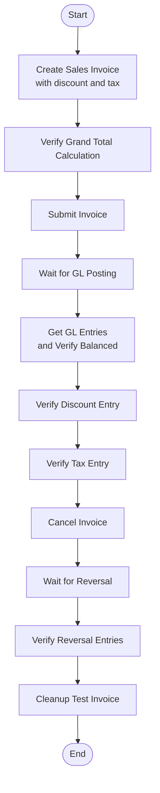
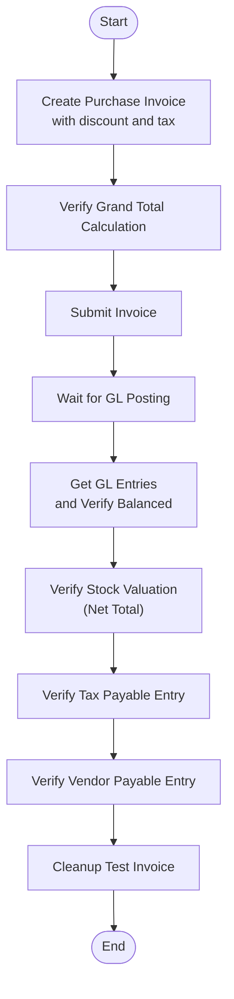
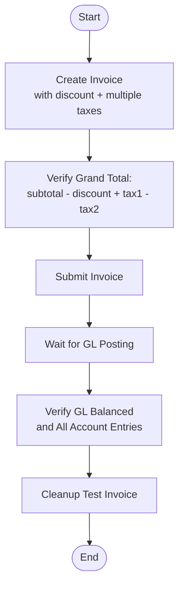
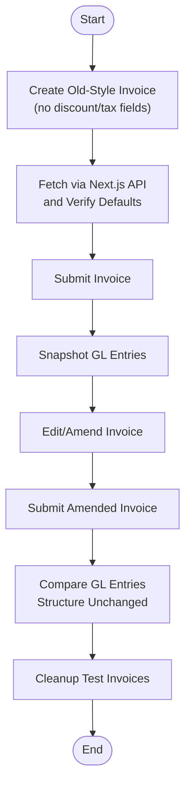
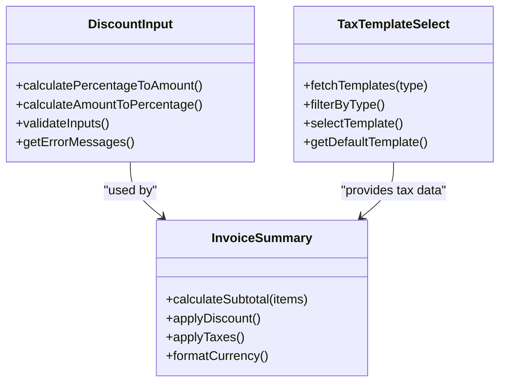
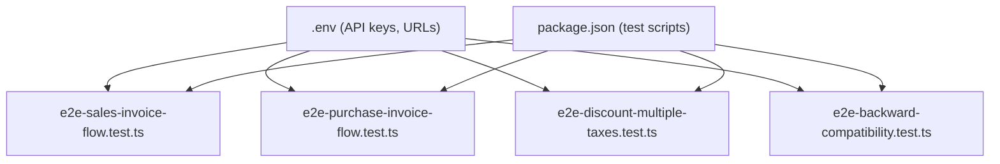

# End-to-End Testing

<cite>
**Referenced Files in This Document**
- [e2e-sales-invoice-flow.test.ts](file://tests/e2e-sales-invoice-flow.test.ts)
- [e2e-purchase-invoice-flow.test.ts](file://tests/e2e-purchase-invoice-flow.test.ts)
- [e2e-discount-multiple-taxes.test.ts](file://tests/e2e-discount-multiple-taxes.test.ts)
- [e2e-backward-compatibility.test.ts](file://tests/e2e-backward-compatibility.test.ts)
- [README.md](file://tests/README.md)
- [package.json](file://package.json)
- [README-INTEGRATION-TESTS.md](file://__tests__/README-INTEGRATION-TESTS.md)
- [bug-exploration-discount-tax-api.test.ts](file://tests/bug-exploration-discount-tax-api.test.ts)
- [DiscountInput.test.tsx](file://tests/components/DiscountInput.test.tsx)
- [TaxTemplateSelect.test.tsx](file://tests/components/TaxTemplateSelect.test.tsx)
- [InvoiceSummary.test.tsx](file://tests/components/InvoiceSummary.test.tsx)
</cite>

## Table of Contents
1. [Introduction](#introduction)
2. [Project Structure](#project-structure)
3. [Core Components](#core-components)
4. [Architecture Overview](#architecture-overview)
5. [Detailed Component Analysis](#detailed-component-analysis)
6. [Dependency Analysis](#dependency-analysis)
7. [Performance Considerations](#performance-considerations)
8. [Troubleshooting Guide](#troubleshooting-guide)
9. [Conclusion](#conclusion)
10. [Appendices](#appendices)

## Introduction
This document provides comprehensive end-to-end (E2E) testing strategies for ERPNext, focusing on complete user workflows, business process validation, and system integration testing. It covers:
- Sales invoice creation and submission with discount and taxes
- Purchase invoice processing with discount and taxes
- Multi-tax and multi-discount scenarios
- Backward compatibility validation
- UI and API integration validation
- Session preservation and error handling
- Test environment setup, browser automation, test data management, and flaky test mitigation

The strategies leverage the existing E2E test suite and related property-based and component tests to ensure robust coverage across user interactions, API processing, and database persistence.

## Project Structure
The E2E testing framework is organized under the tests directory with dedicated suites for sales, purchase, multi-tax scenarios, and backward compatibility. Supporting property-based and component tests validate UI calculations and API behaviors.

**Diagram sources**
- [e2e-sales-invoice-flow.test.ts](file://tests/e2e-sales-invoice-flow.test.ts#L1-L386)
- [e2e-purchase-invoice-flow.test.ts](file://tests/e2e-purchase-invoice-flow.test.ts#L1-L358)
- [e2e-discount-multiple-taxes.test.ts](file://tests/e2e-discount-multiple-taxes.test.ts#L1-L395)
- [e2e-backward-compatibility.test.ts](file://tests/e2e-backward-compatibility.test.ts#L1-L429)
- [README.md](file://tests/README.md#L1-L162)
- [README-INTEGRATION-TESTS.md](file://__tests__/README-INTEGRATION-TESTS.md#L1-L224)
- [DiscountInput.test.tsx](file://tests/components/DiscountInput.test.tsx#L1-L250)
- [TaxTemplateSelect.test.tsx](file://tests/components/TaxTemplateSelect.test.tsx#L1-L331)
- [InvoiceSummary.test.tsx](file://tests/components/InvoiceSummary.test.tsx#L1-L436)
- [bug-exploration-discount-tax-api.test.ts](file://tests/bug-exploration-discount-tax-api.test.ts#L1-L229)
- [package.json](file://package.json#L1-L152)

**Section sources**
- [package.json](file://package.json#L46-L49)
- [README.md](file://tests/README.md#L1-L162)
- [README-INTEGRATION-TESTS.md](file://__tests__/README-INTEGRATION-TESTS.md#L1-L224)

## Core Components
- Sales invoice E2E flow: Validates creation, submission, GL posting, and reversal.
- Purchase invoice E2E flow: Validates creation, submission, GL posting, stock valuation, and tax accounts.
- Multi-tax and discount E2E flow: Validates complex calculation scenarios and GL posting.
- Backward compatibility E2E flow: Ensures legacy invoices remain functional and GL structure remains unchanged after edits.
- Component tests: Validate discount calculation, tax template selection, and invoice summary computation.
- Bug exploration tests: Surface production API issues to guide fixes.

Key execution commands:
- Sales invoice E2E: npm run test:e2e-sales-invoice
- Purchase invoice E2E: npm run test:e2e-purchase-invoice
- Multi-tax E2E: npm run test:e2e-discount-multiple-taxes
- Backward compatibility E2E: npm run test:e2e-backward-compatibility

**Section sources**
- [package.json](file://package.json#L46-L49)
- [e2e-sales-invoice-flow.test.ts](file://tests/e2e-sales-invoice-flow.test.ts#L1-L386)
- [e2e-purchase-invoice-flow.test.ts](file://tests/e2e-purchase-invoice-flow.test.ts#L1-L358)
- [e2e-discount-multiple-taxes.test.ts](file://tests/e2e-discount-multiple-taxes.test.ts#L1-L395)
- [e2e-backward-compatibility.test.ts](file://tests/e2e-backward-compatibility.test.ts#L1-L429)
- [DiscountInput.test.tsx](file://tests/components/DiscountInput.test.tsx#L1-L250)
- [TaxTemplateSelect.test.tsx](file://tests/components/TaxTemplateSelect.test.tsx#L1-L331)
- [InvoiceSummary.test.tsx](file://tests/components/InvoiceSummary.test.tsx#L1-L436)
- [bug-exploration-discount-tax-api.test.ts](file://tests/bug-exploration-discount-tax-api.test.ts#L1-L229)

## Architecture Overview
The E2E tests orchestrate a complete business flow from API creation to database persistence and financial reporting. They validate:
- API endpoints for invoice creation and submission
- GL posting and reversal
- Tax engine behavior across sales and purchase contexts
- UI/API compatibility and backward compatibility

**Diagram sources**
- [e2e-sales-invoice-flow.test.ts](file://tests/e2e-sales-invoice-flow.test.ts#L45-L116)
- [e2e-purchase-invoice-flow.test.ts](file://tests/e2e-purchase-invoice-flow.test.ts#L44-L114)
- [e2e-discount-multiple-taxes.test.ts](file://tests/e2e-discount-multiple-taxes.test.ts#L41-L112)
- [e2e-backward-compatibility.test.ts](file://tests/e2e-backward-compatibility.test.ts#L43-L160)

## Detailed Component Analysis

### Sales Invoice E2E Flow
Validates end-to-end sales invoice creation with discount and tax, submission, GL posting, and reversal.

**Diagram sources**
- [e2e-sales-invoice-flow.test.ts](file://tests/e2e-sales-invoice-flow.test.ts#L208-L330)

**Section sources**
- [e2e-sales-invoice-flow.test.ts](file://tests/e2e-sales-invoice-flow.test.ts#L1-L386)

### Purchase Invoice E2E Flow
Validates end-to-end purchase invoice creation with discount and tax, submission, GL posting, stock valuation, and tax accounts.

**Diagram sources**
- [e2e-purchase-invoice-flow.test.ts](file://tests/e2e-purchase-invoice-flow.test.ts#L184-L302)

**Section sources**
- [e2e-purchase-invoice-flow.test.ts](file://tests/e2e-purchase-invoice-flow.test.ts#L1-L358)

### Multi-Tax and Discount E2E Flow
Validates complex scenarios combining discount and multiple taxes, ensuring accurate grand total calculation and GL posting.

**Diagram sources**
- [e2e-discount-multiple-taxes.test.ts](file://tests/e2e-discount-multiple-taxes.test.ts#L182-L340)

**Section sources**
- [e2e-discount-multiple-taxes.test.ts](file://tests/e2e-discount-multiple-taxes.test.ts#L1-L395)

### Backward Compatibility E2E Flow
Ensures legacy invoices continue to work and GL structure remains unchanged after edits.

**Diagram sources**
- [e2e-backward-compatibility.test.ts](file://tests/e2e-backward-compatibility.test.ts#L255-L370)

**Section sources**
- [e2e-backward-compatibility.test.ts](file://tests/e2e-backward-compatibility.test.ts#L1-L429)

### Component-Level Validation
- DiscountInput: Percentage/amount conversion, validation bounds, and error messaging.
- TaxTemplateSelect: Fetching templates, filtering by type, and selection behavior.
- InvoiceSummary: Grand total formula, currency formatting, and real-time updates.

**Diagram sources**
- [DiscountInput.test.tsx](file://tests/components/DiscountInput.test.tsx#L25-L200)
- [TaxTemplateSelect.test.tsx](file://tests/components/TaxTemplateSelect.test.tsx#L102-L242)
- [InvoiceSummary.test.tsx](file://tests/components/InvoiceSummary.test.tsx#L36-L88)

**Section sources**
- [DiscountInput.test.tsx](file://tests/components/DiscountInput.test.tsx#L1-L250)
- [TaxTemplateSelect.test.tsx](file://tests/components/TaxTemplateSelect.test.tsx#L1-L331)
- [InvoiceSummary.test.tsx](file://tests/components/InvoiceSummary.test.tsx#L1-L436)

## Dependency Analysis
The E2E tests depend on:
- Environment configuration (.env) for API keys and URLs
- Next.js API endpoints for invoice creation and retrieval
- ERPNext API endpoints for resource manipulation and GL queries
- Database records and GL entries for validation

**Diagram sources**
- [package.json](file://package.json#L46-L49)
- [e2e-sales-invoice-flow.test.ts](file://tests/e2e-sales-invoice-flow.test.ts#L21-L36)
- [e2e-purchase-invoice-flow.test.ts](file://tests/e2e-purchase-invoice-flow.test.ts#L20-L35)
- [e2e-discount-multiple-taxes.test.ts](file://tests/e2e-discount-multiple-taxes.test.ts#L17-L32)
- [e2e-backward-compatibility.test.ts](file://tests/e2e-backward-compatibility.test.ts#L19-L34)

**Section sources**
- [package.json](file://package.json#L46-L49)
- [README.md](file://tests/README.md#L56-L82)

## Performance Considerations
- Asynchronous waits: Tests include deliberate waits for GL posting and cache updates to ensure deterministic validations.
- Cleanup: Tests delete temporary invoices to avoid accumulating test data.
- Parallelism: E2E tests are designed as standalone scripts; coordinate execution to avoid resource contention.
- Environment readiness: Ensure ERPNext and Next.js servers are running and responsive before executing tests.

[No sources needed since this section provides general guidance]

## Troubleshooting Guide
Common issues and resolutions:
- Missing environment variables: Ensure ERP_API_KEY, ERP_API_SECRET, and URLs are configured.
- API connectivity: Verify ERPNext backend and Next.js server availability.
- Field permission errors: Some APIs restrict certain fields in GET requests; adjust queries accordingly.
- Import path errors: Verify component import paths resolve correctly in forms.
- Timeout issues: Increase timeouts for slow environments or databases.

**Section sources**
- [README-INTEGRATION-TESTS.md](file://__tests__/README-INTEGRATION-TESTS.md#L132-L173)
- [bug-exploration-discount-tax-api.test.ts](file://tests/bug-exploration-discount-tax-api.test.ts#L132-L153)

## Conclusion
The E2E testing suite comprehensively validates ERPNext business flows across sales and purchase domains, multi-tax scenarios, and backward compatibility. By combining API-driven validations with GL posting checks and UI/API compatibility tests, the suite ensures robust system integration and reliable business process outcomes.

[No sources needed since this section summarizes without analyzing specific files]

## Appendices

### Test Environment Setup
- Create .env with ERPNext API credentials and URLs.
- Start ERPNext backend and Next.js development server.
- Install dependencies and run targeted E2E scripts via npm.

**Section sources**
- [README-INTEGRATION-TESTS.md](file://__tests__/README-INTEGRATION-TESTS.md#L13-L34)
- [README.md](file://tests/README.md#L56-L82)

### Browser Automation and Test Data Management
- Use the existing scripts to run E2E tests locally.
- Manage test data by leveraging automatic cleanup in tests.
- For UI automation, integrate browser automation frameworks with the Next.js UI routes validated by these tests.

[No sources needed since this section provides general guidance]

### Handling Flaky Tests
- Add retries for transient failures (network, DB).
- Normalize environment timing (waits, indexing).
- Isolate tests and use deterministic data creation.

[No sources needed since this section provides general guidance]