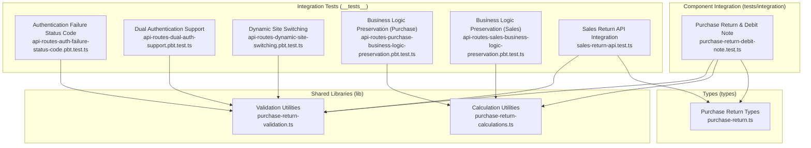
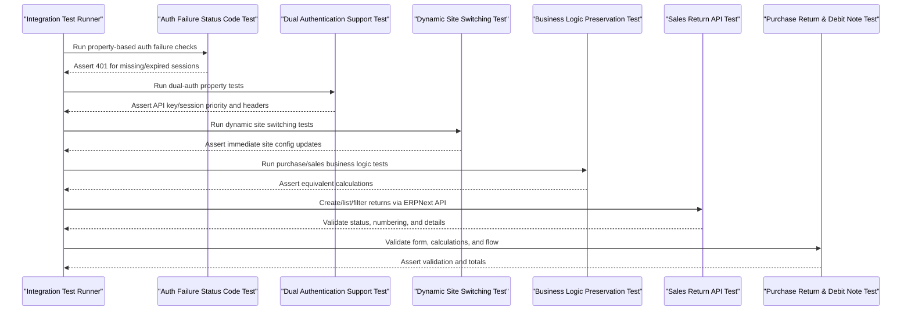
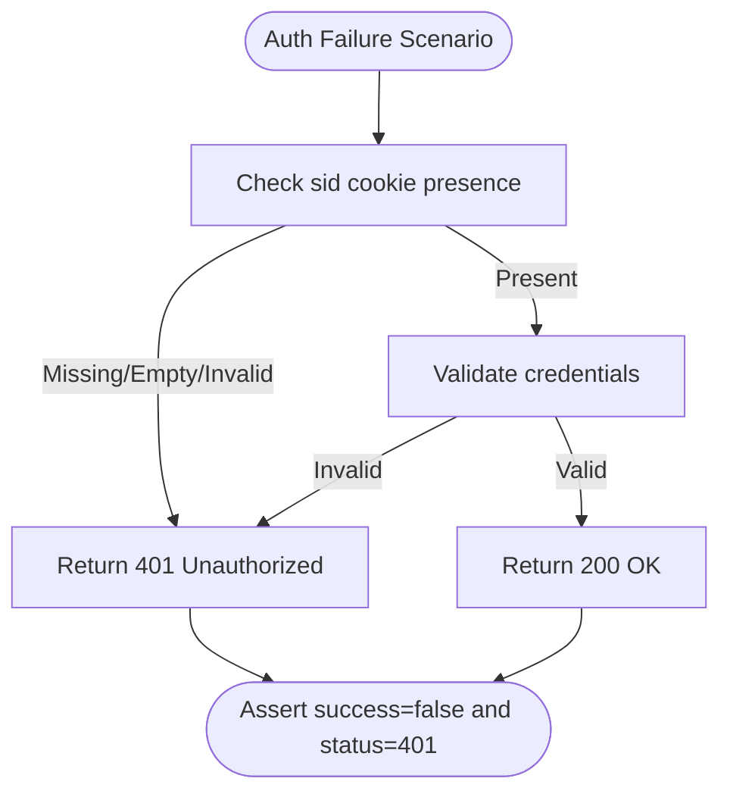
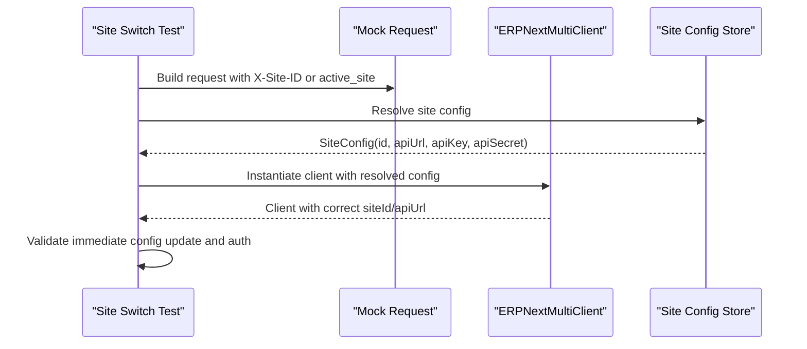
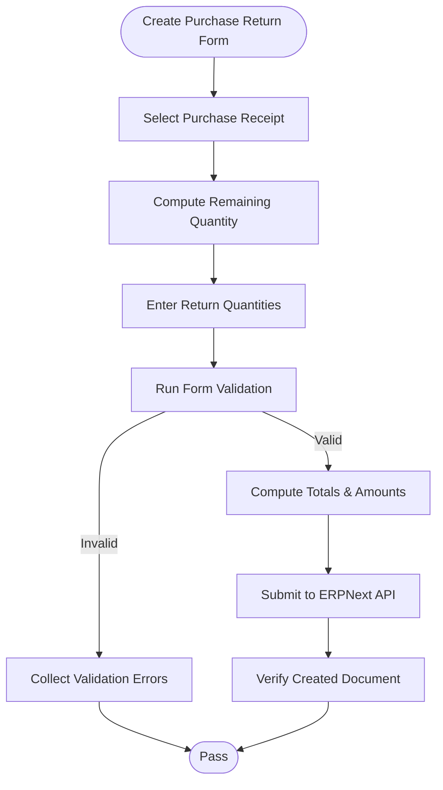
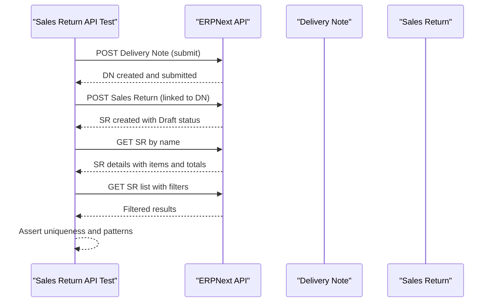
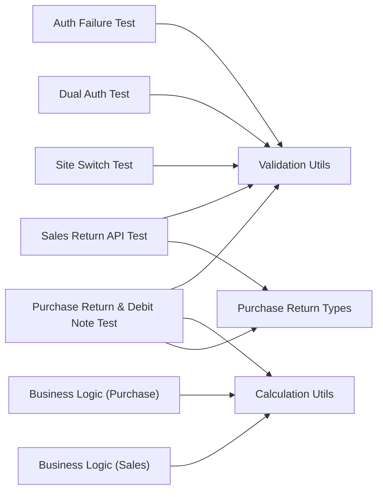

# Integration Testing

<cite>
**Referenced Files in This Document**
- [README-INTEGRATION-TESTS.md](file://__tests__/README-INTEGRATION-TESTS.md)
- [api-routes-auth-failure-status-code.pbt.test.ts](file://__tests__/api-routes-auth-failure-status-code.pbt.test.ts)
- [api-routes-dual-auth-support.pbt.test.ts](file://__tests__/api-routes-dual-auth-support.pbt.test.ts)
- [api-routes-dynamic-site-switching.pbt.test.ts](file://__tests__/api-routes-dynamic-site-switching.pbt.test.ts)
- [api-routes-purchase-business-logic-preservation.pbt.test.ts](file://__tests__/api-routes-purchase-business-logic-preservation.pbt.test.ts)
- [api-routes-sales-business-logic-preservation.pbt.test.ts](file://__tests__/api-routes-sales-business-logic-preservation.pbt.test.ts)
- [sales-return-api.test.ts](file://__tests__/sales-return-api.test.ts)
- [purchase-return-debit-note.test.ts](file://tests/integration/purchase-return-debit-note.test.ts)
- [purchase-return-validation.ts](file://lib/purchase-return-validation.ts)
- [purchase-return-calculations.ts](file://lib/purchase-return-calculations.ts)
- [purchase-return.ts](file://types/purchase-return.ts)
</cite>

## Table of Contents
1. [Introduction](#introduction)
2. [Project Structure](#project-structure)
3. [Core Components](#core-components)
4. [Architecture Overview](#architecture-overview)
5. [Detailed Component Analysis](#detailed-component-analysis)
6. [Dependency Analysis](#dependency-analysis)
7. [Performance Considerations](#performance-considerations)
8. [Troubleshooting Guide](#troubleshooting-guide)
9. [Conclusion](#conclusion)
10. [Appendices](#appendices)

## Introduction
This document provides comprehensive integration testing guidance for the ERPNext system, focusing on:
- API route testing across multi-site contexts
- Multi-site scenario validation
- Business workflow integration (accounting period workflows, purchase return processing, debit note validation)
- End-to-end testing patterns for ERPNext API integrations, site-aware operations, and cross-component data flows
- Authentication flows, session management, and error propagation strategies
- Environment setup, test data management, and validation of complex business processes

The repository includes property-based tests, integration tests against live ERPNext instances, and reusable libraries for validation and calculations.

## Project Structure
The integration testing assets are organized under:
- __tests__: Property-based and integration tests for API routes, authentication, multi-site switching, and business logic preservation
- tests/integration: Component-level integration tests for purchase return and debit note flows
- lib: Shared validation and calculation utilities used by UI and integration tests
- types: Strongly typed interfaces for purchase return, debit note, and related APIs

**Diagram sources**
- [api-routes-auth-failure-status-code.pbt.test.ts](file://__tests__/api-routes-auth-failure-status-code.pbt.test.ts#L1-L613)
- [api-routes-dual-auth-support.pbt.test.ts](file://__tests__/api-routes-dual-auth-support.pbt.test.ts#L1-L760)
- [api-routes-dynamic-site-switching.pbt.test.ts](file://__tests__/api-routes-dynamic-site-switching.pbt.test.ts#L1-L809)
- [api-routes-purchase-business-logic-preservation.pbt.test.ts](file://__tests__/api-routes-purchase-business-logic-preservation.pbt.test.ts#L1-L624)
- [api-routes-sales-business-logic-preservation.pbt.test.ts](file://__tests__/api-routes-sales-business-logic-preservation.pbt.test.ts#L1-L624)
- [sales-return-api.test.ts](file://__tests__/sales-return-api.test.ts#L1-L1257)
- [purchase-return-debit-note.test.ts](file://tests/integration/purchase-return-debit-note.test.ts#L1-L446)
- [purchase-return-validation.ts](file://lib/purchase-return-validation.ts#L1-L223)
- [purchase-return-calculations.ts](file://lib/purchase-return-calculations.ts#L1-L80)
- [purchase-return.ts](file://types/purchase-return.ts#L1-L276)

**Section sources**
- [README-INTEGRATION-TESTS.md](file://__tests__/README-INTEGRATION-TESTS.md#L1-L224)

## Core Components
- Authentication and session management tests validate consistent 401 responses for missing/expired sessions and proper dual-auth support (API key/session) across routes and methods.
- Multi-site switching tests validate dynamic site selection via headers or cookies, immediate configuration updates, and authentication preservation across sites.
- Business logic preservation tests ensure migrated routes produce identical calculations and validations compared to legacy routes for purchase and sales workflows.
- Sales return integration tests validate end-to-end creation, filtering, uniqueness of numbering, and detailed display of return documents.
- Purchase return and debit note integration tests validate form validation, calculations, remaining quantity computation, and end-to-end flow.

**Section sources**
- [api-routes-auth-failure-status-code.pbt.test.ts](file://__tests__/api-routes-auth-failure-status-code.pbt.test.ts#L1-L613)
- [api-routes-dual-auth-support.pbt.test.ts](file://__tests__/api-routes-dual-auth-support.pbt.test.ts#L1-L760)
- [api-routes-dynamic-site-switching.pbt.test.ts](file://__tests__/api-routes-dynamic-site-switching.pbt.test.ts#L1-L809)
- [api-routes-purchase-business-logic-preservation.pbt.test.ts](file://__tests__/api-routes-purchase-business-logic-preservation.pbt.test.ts#L1-L624)
- [api-routes-sales-business-logic-preservation.pbt.test.ts](file://__tests__/api-routes-sales-business-logic-preservation.pbt.test.ts#L1-L624)
- [sales-return-api.test.ts](file://__tests__/sales-return-api.test.ts#L1-L1257)
- [purchase-return-debit-note.test.ts](file://tests/integration/purchase-return-debit-note.test.ts#L1-L446)

## Architecture Overview
The integration testing architecture spans three layers:
- Property-based tests: Validate behavioral guarantees across large input spaces (authentication, site switching, business logic).
- Integration tests: Exercise real ERPNext endpoints with live data and validate cross-component flows (returns, debit notes).
- Shared libraries: Provide reusable validation and calculation utilities to ensure consistency across UI and tests.

**Diagram sources**
- [api-routes-auth-failure-status-code.pbt.test.ts](file://__tests__/api-routes-auth-failure-status-code.pbt.test.ts#L145-L270)
- [api-routes-dual-auth-support.pbt.test.ts](file://__tests__/api-routes-dual-auth-support.pbt.test.ts#L193-L310)
- [api-routes-dynamic-site-switching.pbt.test.ts](file://__tests__/api-routes-dynamic-site-switching.pbt.test.ts#L247-L298)
- [api-routes-purchase-business-logic-preservation.pbt.test.ts](file://__tests__/api-routes-purchase-business-logic-preservation.pbt.test.ts#L298-L334)
- [api-routes-sales-business-logic-preservation.pbt.test.ts](file://__tests__/api-routes-sales-business-logic-preservation.pbt.test.ts#L298-L334)
- [sales-return-api.test.ts](file://__tests__/sales-return-api.test.ts#L326-L376)
- [purchase-return-debit-note.test.ts](file://tests/integration/purchase-return-debit-note.test.ts#L68-L83)

## Detailed Component Analysis

### Authentication and Session Management
- Validates that authentication failures consistently return 401 across routes and methods.
- Ensures dual authentication support (API key and session) with correct header formatting and priority.
- Tests robustness across missing, empty, and invalid credentials.

**Diagram sources**
- [api-routes-auth-failure-status-code.pbt.test.ts](file://__tests__/api-routes-auth-failure-status-code.pbt.test.ts#L57-L92)
- [api-routes-auth-failure-status-code.pbt.test.ts](file://__tests__/api-routes-auth-failure-status-code.pbt.test.ts#L145-L172)

**Section sources**
- [api-routes-auth-failure-status-code.pbt.test.ts](file://__tests__/api-routes-auth-failure-status-code.pbt.test.ts#L145-L270)
- [api-routes-dual-auth-support.pbt.test.ts](file://__tests__/api-routes-dual-auth-support.pbt.test.ts#L193-L310)

### Multi-Site Scenario Validation
- Validates dynamic site switching via X-Site-ID header or active_site cookie.
- Ensures immediate configuration updates and authentication preservation across sites.
- Tests rapid switching and consistency across multiple sites.

**Diagram sources**
- [api-routes-dynamic-site-switching.pbt.test.ts](file://__tests__/api-routes-dynamic-site-switching.pbt.test.ts#L107-L182)
- [api-routes-dynamic-site-switching.pbt.test.ts](file://__tests__/api-routes-dynamic-site-switching.pbt.test.ts#L247-L298)

**Section sources**
- [api-routes-dynamic-site-switching.pbt.test.ts](file://__tests__/api-routes-dynamic-site-switching.pbt.test.ts#L247-L356)

### Business Workflow Integration: Purchase Return and Debit Note
- Validates form-level validation (quantities, reasons, notes), calculations (line amount, total, remaining quantity), and end-to-end flow.
- Uses shared validation and calculation utilities to ensure consistency.

**Diagram sources**
- [purchase-return-debit-note.test.ts](file://tests/integration/purchase-return-debit-note.test.ts#L365-L431)
- [purchase-return-validation.ts](file://lib/purchase-return-validation.ts#L34-L85)
- [purchase-return-calculations.ts](file://lib/purchase-return-calculations.ts#L21-L33)

**Section sources**
- [purchase-return-debit-note.test.ts](file://tests/integration/purchase-return-debit-note.test.ts#L68-L83)
- [purchase-return-debit-note.test.ts](file://tests/integration/purchase-return-debit-note.test.ts#L365-L431)
- [purchase-return-validation.ts](file://lib/purchase-return-validation.ts#L34-L85)
- [purchase-return-calculations.ts](file://lib/purchase-return-calculations.ts#L21-L33)

### Sales Return API Integration
- Validates initial draft status, list filtering, unique numbering generation, delivery note linkage, and complete detail display.
- Exercises real ERPNext endpoints for creation, retrieval, and filtering.

**Diagram sources**
- [sales-return-api.test.ts](file://__tests__/sales-return-api.test.ts#L326-L376)
- [sales-return-api.test.ts](file://__tests__/sales-return-api.test.ts#L599-L664)
- [sales-return-api.test.ts](file://__tests__/sales-return-api.test.ts#L189-L235)

**Section sources**
- [sales-return-api.test.ts](file://__tests__/sales-return-api.test.ts#L326-L376)
- [sales-return-api.test.ts](file://__tests__/sales-return-api.test.ts#L599-L664)
- [sales-return-api.test.ts](file://__tests__/sales-return-api.test.ts#L189-L235)

### Accounting Period Workflows (Conceptual Guidance)
- Use property-based tests to validate closing entries, restrictions, and notifications across multiple sites and scenarios.
- Validate site-aware error handling and context preservation during period operations.
- Integrate with multi-site switching tests to ensure immediate site context updates during period actions.

[No sources needed since this section provides conceptual guidance]

### Debit Note Validation (Conceptual Guidance)
- Extend validation patterns from purchase return validation to debit note forms.
- Ensure required fields, quantity limits, and reason/note requirements are enforced.
- Validate calculations mirror purchase return computations for consistency.

[No sources needed since this section provides conceptual guidance]

## Dependency Analysis
The integration tests depend on shared libraries and types to ensure consistent validation and calculations across UI and test layers.

**Diagram sources**
- [api-routes-auth-failure-status-code.pbt.test.ts](file://__tests__/api-routes-auth-failure-status-code.pbt.test.ts#L1-L613)
- [api-routes-dual-auth-support.pbt.test.ts](file://__tests__/api-routes-dual-auth-support.pbt.test.ts#L1-L760)
- [api-routes-dynamic-site-switching.pbt.test.ts](file://__tests__/api-routes-dynamic-site-switching.pbt.test.ts#L1-L809)
- [api-routes-purchase-business-logic-preservation.pbt.test.ts](file://__tests__/api-routes-purchase-business-logic-preservation.pbt.test.ts#L1-L624)
- [api-routes-sales-business-logic-preservation.pbt.test.ts](file://__tests__/api-routes-sales-business-logic-preservation.pbt.test.ts#L1-L624)
- [sales-return-api.test.ts](file://__tests__/sales-return-api.test.ts#L1-L1257)
- [purchase-return-debit-note.test.ts](file://tests/integration/purchase-return-debit-note.test.ts#L1-L446)
- [purchase-return-validation.ts](file://lib/purchase-return-validation.ts#L1-L223)
- [purchase-return-calculations.ts](file://lib/purchase-return-calculations.ts#L1-L80)
- [purchase-return.ts](file://types/purchase-return.ts#L1-L276)

**Section sources**
- [purchase-return-validation.ts](file://lib/purchase-return-validation.ts#L1-L223)
- [purchase-return-calculations.ts](file://lib/purchase-return-calculations.ts#L1-L80)
- [purchase-return.ts](file://types/purchase-return.ts#L1-L276)

## Performance Considerations
- Prefer property-based tests for broad coverage with minimal runtime overhead.
- Use caching for test data (e.g., warehouse/customer/item) to reduce repeated lookups in integration tests.
- Batch requests and minimize network latency by reusing authenticated sessions and avoiding redundant validations.
- Monitor ERPNext endpoint performance and tune timeouts accordingly.

[No sources needed since this section provides general guidance]

## Troubleshooting Guide
Common issues and resolutions:
- Missing environment variables: Ensure ERPNEXT_API_URL, ERP_API_KEY, ERP_API_SECRET are configured.
- Authentication failures: Verify ERPNext is reachable, credentials are correct, and session cookies are valid.
- Timeout errors: Increase test timeouts and optimize ERPNext database performance.
- Data cleanup: Remove test invoices and returns created during tests if interrupted.

**Section sources**
- [README-INTEGRATION-TESTS.md](file://__tests__/README-INTEGRATION-TESTS.md#L134-L181)

## Conclusion
The integration testing strategy leverages property-based tests for robust behavioral guarantees, integration tests for end-to-end validation against live ERPNext instances, and shared libraries for consistent validation and calculations. This approach ensures reliable authentication flows, seamless multi-site operations, and accurate business logic preservation across complex workflows like purchase returns, debit notes, and sales returns.

[No sources needed since this section summarizes without analyzing specific files]

## Appendices

### Setting Up Integration Test Environments
- Start ERPNext backend and Next.js development server locally.
- Configure environment variables for ERPNext API access.
- Use property-based tests to validate authentication, site switching, and business logic across varied inputs.
- Run integration tests that exercise real ERPNext endpoints for returns and debit notes.

**Section sources**
- [README-INTEGRATION-TESTS.md](file://__tests__/README-INTEGRATION-TESTS.md#L13-L51)

### Managing Test Data Dependencies
- Integration tests create and clean up test data automatically.
- Cache frequently used entities (warehouse, customer, item) to avoid repeated lookups.
- Ensure test data isolation by prefixing identifiers and cleaning up after tests.

**Section sources**
- [sales-return-api.test.ts](file://__tests__/sales-return-api.test.ts#L37-L58)
- [sales-return-api.test.ts](file://__tests__/sales-return-api.test.ts#L116-L186)

### Validating End-to-End Business Processes
- Use property-based tests to validate consistent outcomes across large input spaces.
- Combine multi-site switching tests with business logic preservation tests to ensure site-aware operations maintain fidelity.
- Validate cross-component flows by asserting data integrity and business rules at each step.

**Section sources**
- [api-routes-dynamic-site-switching.pbt.test.ts](file://__tests__/api-routes-dynamic-site-switching.pbt.test.ts#L512-L571)
- [api-routes-purchase-business-logic-preservation.pbt.test.ts](file://__tests__/api-routes-purchase-business-logic-preservation.pbt.test.ts#L490-L562)
- [api-routes-sales-business-logic-preservation.pbt.test.ts](file://__tests__/api-routes-sales-business-logic-preservation.pbt.test.ts#L490-L562)