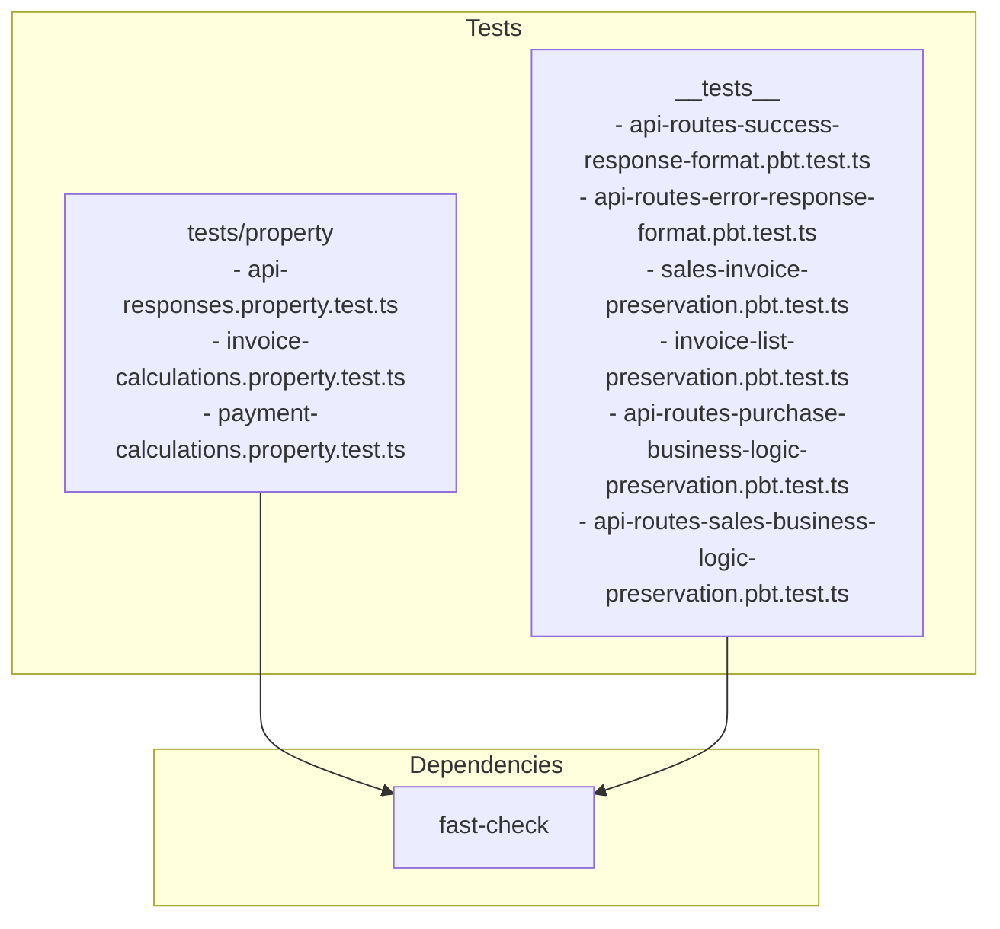
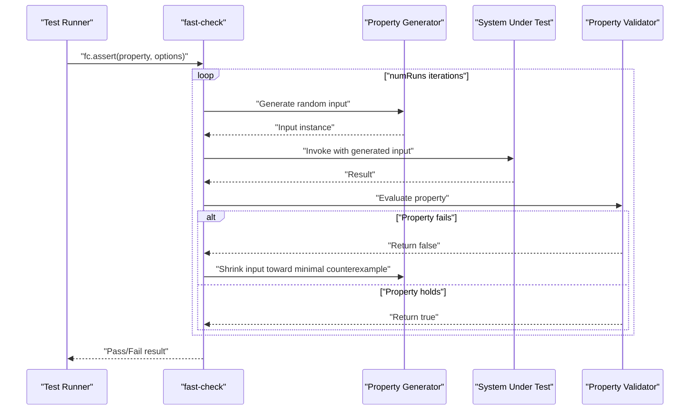
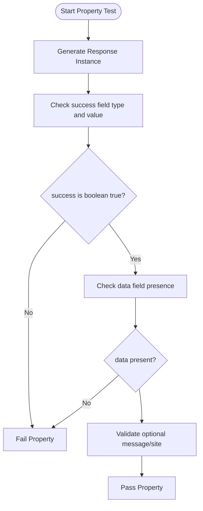
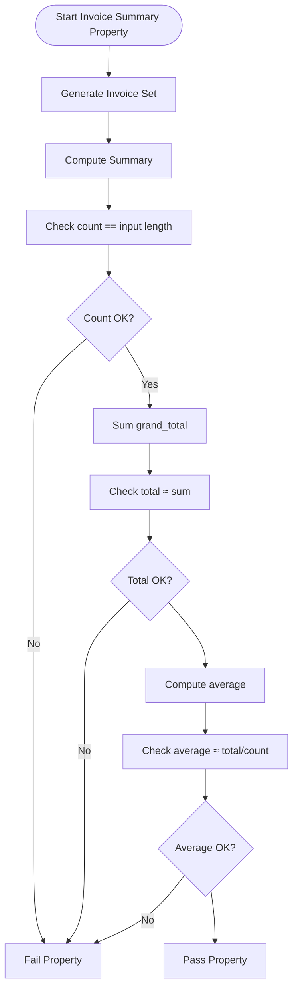
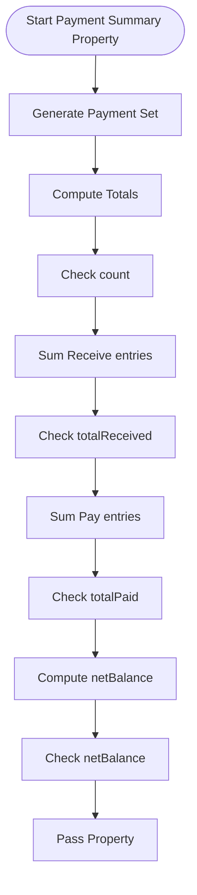
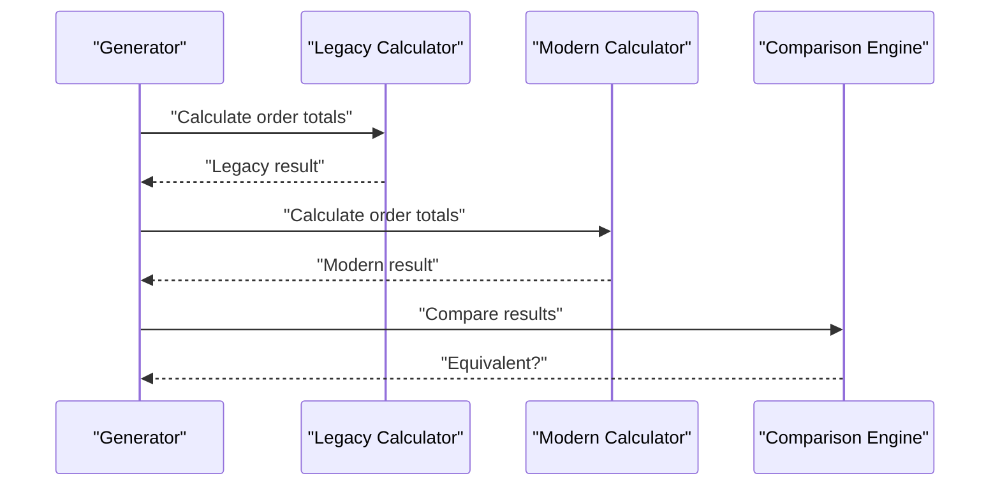
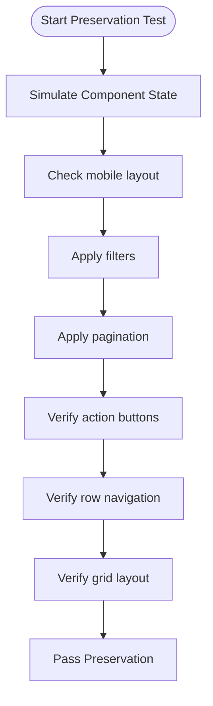
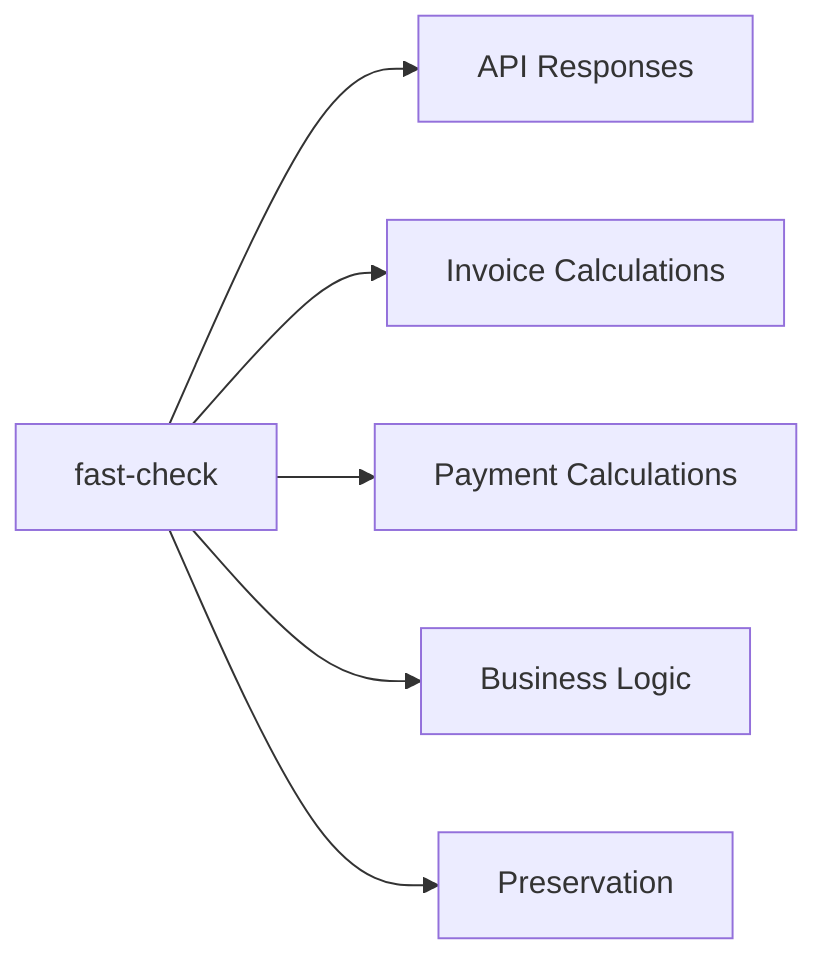

# Property-Based Testing

<cite>
**Referenced Files in This Document**
- [api-responses.property.test.ts](file://tests/property/api-responses.property.test.ts)
- [invoice-calculations.property.test.ts](file://tests/property/invoice-calculations.property.test.ts)
- [payment-calculations.property.test.ts](file://tests/property/payment-calculations.property.test.ts)
- [api-routes-success-response-format.pbt.test.ts](file://__tests__/api-routes-success-response-format.pbt.test.ts)
- [api-routes-error-response-format.pbt.test.ts](file://__tests__/api-routes-error-response-format.pbt.test.ts)
- [sales-invoice-preservation.pbt.test.ts](file://__tests__/sales-invoice-preservation.pbt.test.ts)
- [invoice-list-preservation.pbt.test.ts](file://__tests__/invoice-list-preservation.pbt.test.ts)
- [api-routes-purchase-business-logic-preservation.pbt.test.ts](file://__tests__/api-routes-purchase-business-logic-preservation.pbt.test.ts)
- [api-routes-sales-business-logic-preservation.pbt.test.ts](file://__tests__/api-routes-sales-business-logic-preservation.pbt.test.ts)
- [package.json](file://package.json)
</cite>

## Table of Contents
1. [Introduction](#introduction)
2. [Project Structure](#project-structure)
3. [Core Components](#core-components)
4. [Architecture Overview](#architecture-overview)
5. [Detailed Component Analysis](#detailed-component-analysis)
6. [Dependency Analysis](#dependency-analysis)
7. [Performance Considerations](#performance-considerations)
8. [Troubleshooting Guide](#troubleshooting-guide)
9. [Conclusion](#conclusion)

## Introduction
This document explains the property-based testing (PBT) implementation in the ERP Next system. It focuses on validating mathematical and logical properties across API responses, invoice calculations, and payment computations. The suite demonstrates how to define properties that must hold for all valid inputs, including edge cases and boundary conditions. It also covers strategies for generating test cases, shrinking techniques for minimal counterexamples, and maintaining robust property-based test suites.

## Project Structure
The property-based tests are organized under two primary locations:
- tests/property: Lightweight property tests for calculations and response shape validation
- __tests__: Extensive property-based tests for API response formats, business logic preservation, and preservation of UI/UX behaviors

Key characteristics:
- Uses fast-check for property generation and shrinking
- Emphasizes universal properties that must hold across large input domains
- Integrates with the broader test suite and CI via npm scripts

**Diagram sources**
- [api-responses.property.test.ts](file://tests/property/api-responses.property.test.ts#L1-L225)
- [invoice-calculations.property.test.ts](file://tests/property/invoice-calculations.property.test.ts#L1-L89)
- [payment-calculations.property.test.ts](file://tests/property/payment-calculations.property.test.ts#L1-L151)
- [api-routes-success-response-format.pbt.test.ts](file://__tests__/api-routes-success-response-format.pbt.test.ts#L1-L533)
- [api-routes-error-response-format.pbt.test.ts](file://__tests__/api-routes-error-response-format.pbt.test.ts#L1-L657)
- [sales-invoice-preservation.pbt.test.ts](file://__tests__/sales-invoice-preservation.pbt.test.ts#L1-L685)
- [invoice-list-preservation.pbt.test.ts](file://__tests__/invoice-list-preservation.pbt.test.ts#L1-L800)
- [api-routes-purchase-business-logic-preservation.pbt.test.ts](file://__tests__/api-routes-purchase-business-logic-preservation.pbt.test.ts#L1-L624)
- [api-routes-sales-business-logic-preservation.pbt.test.ts](file://__tests__/api-routes-sales-business-logic-preservation.pbt.test.ts#L1-L624)

**Section sources**
- [package.json](file://package.json#L118-L151)

## Core Components
This section outlines the core property-based testing components and their roles.

- API Response Shape Properties
  - Validates consistent success/error response structures across all API routes
  - Ensures success: true and error fields meet strict type requirements
  - Tests optional fields and cross-operation consistency

- Invoice Calculation Properties
  - Validates summary statistics (count, total, average) for arbitrary invoice sets
  - Handles empty arrays, single-item arrays, and numeric precision

- Payment Calculation Properties
  - Validates counts, totals, and net balances for payment entries
  - Handles mixed Receive/Pay entries and boundary conditions

- Business Logic Preservation
  - Ensures migrated routes produce equivalent calculations to legacy routes
  - Covers sales and purchase order totals, taxes, discounts, and rounding

- Preservation Properties
  - Confirms non-buggy behaviors remain unchanged after fixes
  - Validates UI/UX behaviors such as mobile card layouts and filters

**Section sources**
- [api-responses.property.test.ts](file://tests/property/api-responses.property.test.ts#L1-L225)
- [invoice-calculations.property.test.ts](file://tests/property/invoice-calculations.property.test.ts#L1-L89)
- [payment-calculations.property.test.ts](file://tests/property/payment-calculations.property.test.ts#L1-L151)
- [api-routes-success-response-format.pbt.test.ts](file://__tests__/api-routes-success-response-format.pbt.test.ts#L1-L533)
- [api-routes-error-response-format.pbt.test.ts](file://__tests__/api-routes-error-response-format.pbt.test.ts#L1-L657)
- [sales-invoice-preservation.pbt.test.ts](file://__tests__/sales-invoice-preservation.pbt.test.ts#L1-L685)
- [invoice-list-preservation.pbt.test.ts](file://__tests__/invoice-list-preservation.pbt.test.ts#L1-L800)
- [api-routes-purchase-business-logic-preservation.pbt.test.ts](file://__tests__/api-routes-purchase-business-logic-preservation.pbt.test.ts#L1-L624)
- [api-routes-sales-business-logic-preservation.pbt.test.ts](file://__tests__/api-routes-sales-business-logic-preservation.pbt.test.ts#L1-L624)

## Architecture Overview
The property-based testing architecture centers on fast-check generators and shrinkers to explore large input spaces and minimize failing cases.

**Diagram sources**
- [api-responses.property.test.ts](file://tests/property/api-responses.property.test.ts#L20-L36)
- [invoice-calculations.property.test.ts](file://tests/property/invoice-calculations.property.test.ts#L21-L31)
- [payment-calculations.property.test.ts](file://tests/property/payment-calculations.property.test.ts#L40-L50)
- [api-routes-success-response-format.pbt.test.ts](file://__tests__/api-routes-success-response-format.pbt.test.ts#L270-L327)
- [api-routes-error-response-format.pbt.test.ts](file://__tests__/api-routes-error-response-format.pbt.test.ts#L338-L396)

## Detailed Component Analysis

### API Response Shape Properties
These tests define universal properties for API response structures:
- Success responses must include success: true and a data field
- Error responses must include success: false, an error type, and a non-empty message
- Properties enforce strict boolean typing for success fields
- Optional fields (message/site) are validated when present

**Diagram sources**
- [api-responses.property.test.ts](file://tests/property/api-responses.property.test.ts#L13-L37)
- [api-routes-success-response-format.pbt.test.ts](file://__tests__/api-routes-success-response-format.pbt.test.ts#L266-L327)
- [api-routes-error-response-format.pbt.test.ts](file://__tests__/api-routes-error-response-format.pbt.test.ts#L334-L396)

**Section sources**
- [api-responses.property.test.ts](file://tests/property/api-responses.property.test.ts#L10-L87)
- [api-routes-success-response-format.pbt.test.ts](file://__tests__/api-routes-success-response-format.pbt.test.ts#L99-L118)
- [api-routes-error-response-format.pbt.test.ts](file://__tests__/api-routes-error-response-format.pbt.test.ts#L133-L153)

### Invoice Calculation Properties
Validates invoice summary computation properties:
- Count equals input length
- Total equals sum of grand_total across invoices
- Average equals total divided by count (or 0 for empty input)
- Handles empty arrays and single-item arrays

**Diagram sources**
- [invoice-calculations.property.test.ts](file://tests/property/invoice-calculations.property.test.ts#L20-L62)

**Section sources**
- [invoice-calculations.property.test.ts](file://tests/property/invoice-calculations.property.test.ts#L10-L86)

### Payment Calculation Properties
Validates payment summary computation properties:
- Count equals input length
- Total received equals sum of paid_amount for Receive entries
- Total paid equals sum of paid_amount for Pay entries
- Net balance equals total received minus total paid
- Handles empty arrays, only Receive, and only Pay scenarios

**Diagram sources**
- [payment-calculations.property.test.ts](file://tests/property/payment-calculations.property.test.ts#L39-L103)

**Section sources**
- [payment-calculations.property.test.ts](file://tests/property/payment-calculations.property.test.ts#L28-L148)

### Business Logic Preservation (Sales and Purchase)
Ensures migrated routes produce equivalent calculations to legacy routes:
- Item-level amounts, discounts, and net amounts
- Order-level totals, taxes, and rounding
- Comparison tolerances for floating-point equality
- Property-based generation of realistic order datasets

**Diagram sources**
- [api-routes-sales-business-logic-preservation.pbt.test.ts](file://__tests__/api-routes-sales-business-logic-preservation.pbt.test.ts#L490-L561)
- [api-routes-purchase-business-logic-preservation.pbt.test.ts](file://__tests__/api-routes-purchase-business-logic-preservation.pbt.test.ts#L494-L561)

**Section sources**
- [api-routes-sales-business-logic-preservation.pbt.test.ts](file://__tests__/api-routes-sales-business-logic-preservation.pbt.test.ts#L199-L292)
- [api-routes-purchase-business-logic-preservation.pbt.test.ts](file://__tests__/api-routes-purchase-business-logic-preservation.pbt.test.ts#L199-L292)

### Preservation Properties (UI/UX and Behaviors)
Confirms non-buggy features remain unchanged after fixes:
- Mobile card layout status badges and styling
- Filtering, pagination, and action buttons
- Row navigation and grid layout
- Baseline behavior validation before and after fixes

**Diagram sources**
- [sales-invoice-preservation.pbt.test.ts](file://__tests__/sales-invoice-preservation.pbt.test.ts#L430-L487)
- [invoice-list-preservation.pbt.test.ts](file://__tests__/invoice-list-preservation.pbt.test.ts#L207-L302)

**Section sources**
- [sales-invoice-preservation.pbt.test.ts](file://__tests__/sales-invoice-preservation.pbt.test.ts#L257-L303)
- [invoice-list-preservation.pbt.test.ts](file://__tests__/invoice-list-preservation.pbt.test.ts#L207-L302)

## Dependency Analysis
The property-based tests depend on fast-check for:
- Random input generation
- Shrinking toward minimal counterexamples
- Async property evaluation

Integration points:
- API response tests rely on simulated response structures
- Calculation tests rely on local summary functions
- Business logic tests rely on legacy and modern calculation simulators
- Preservation tests rely on UI/UX simulation helpers

**Diagram sources**
- [api-responses.property.test.ts](file://tests/property/api-responses.property.test.ts#L8)
- [invoice-calculations.property.test.ts](file://tests/property/invoice-calculations.property.test.ts#L7)
- [payment-calculations.property.test.ts](file://tests/property/payment-calculations.property.test.ts#L7)
- [api-routes-success-response-format.pbt.test.ts](file://__tests__/api-routes-success-response-format.pbt.test.ts#L20)
- [api-routes-error-response-format.pbt.test.ts](file://__tests__/api-routes-error-response-format.pbt.test.ts#L20)
- [api-routes-sales-business-logic-preservation.pbt.test.ts](file://__tests__/api-routes-sales-business-logic-preservation.pbt.test.ts#L22)
- [api-routes-purchase-business-logic-preservation.pbt.test.ts](file://__tests__/api-routes-purchase-business-logic-preservation.pbt.test.ts#L22)
- [sales-invoice-preservation.pbt.test.ts](file://__tests__/sales-invoice-preservation.pbt.test.ts#L20)
- [invoice-list-preservation.pbt.test.ts](file://__tests__/invoice-list-preservation.pbt.test.ts#L22)

**Section sources**
- [package.json](file://package.json#L143)

## Performance Considerations
- Use appropriate numRuns to balance coverage and runtime
- Prefer narrowing generators to reduce search space
- Leverage shrinking to quickly isolate minimal failing cases
- Separate heavy property tests into dedicated suites to avoid CI timeouts

## Troubleshooting Guide
Common issues and resolutions:
- Random test failures
  - Increase numRuns to reduce flakiness
  - Use deterministic seeds for reproducibility
  - Narrow generators to focus on problematic regions
- Slow property tests
  - Reduce numRuns or split into focused subsets
  - Simplify generators while preserving coverage
- Minimal counterexamples
  - Enable verbose mode to inspect shrinking steps
  - Add targeted unit tests for edge cases revealed by shrinking
- Maintaining property suites
  - Keep properties orthogonal and focused
  - Document assumptions and invariants
  - Regularly review and refine generators

## Conclusion
The ERP Next system’s property-based testing suite demonstrates robust validation of API response formats, financial calculations, and business logic preservation. By leveraging fast-check’s generators and shrinkers, the suite efficiently explores large input domains, enforces mathematical and logical properties, and maintains confidence in system correctness across migrations and feature changes.