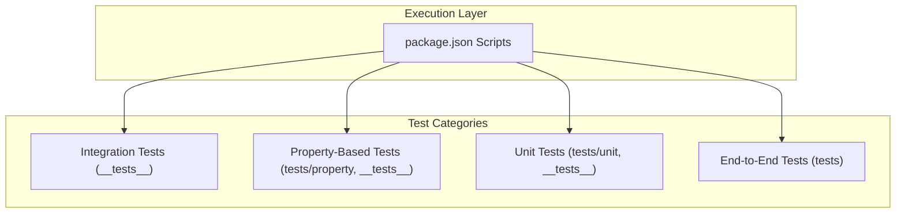
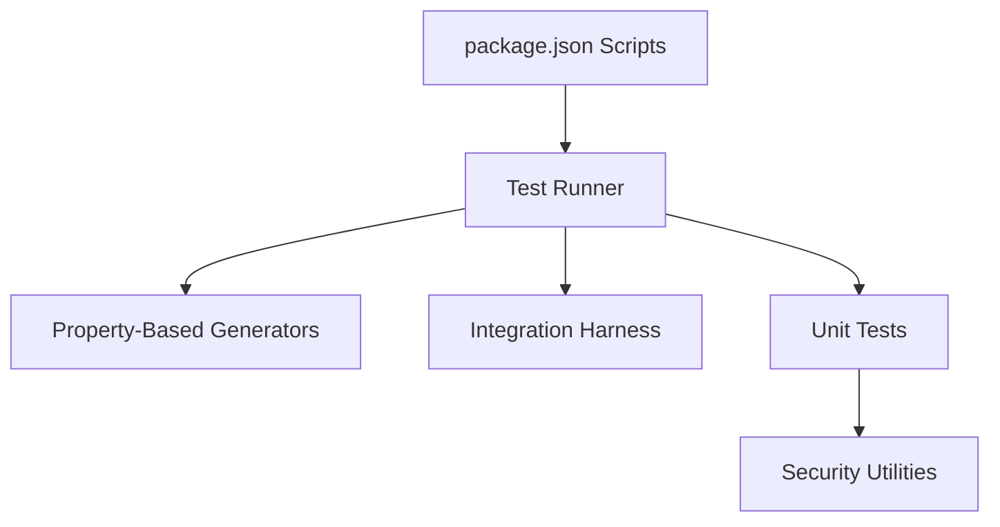
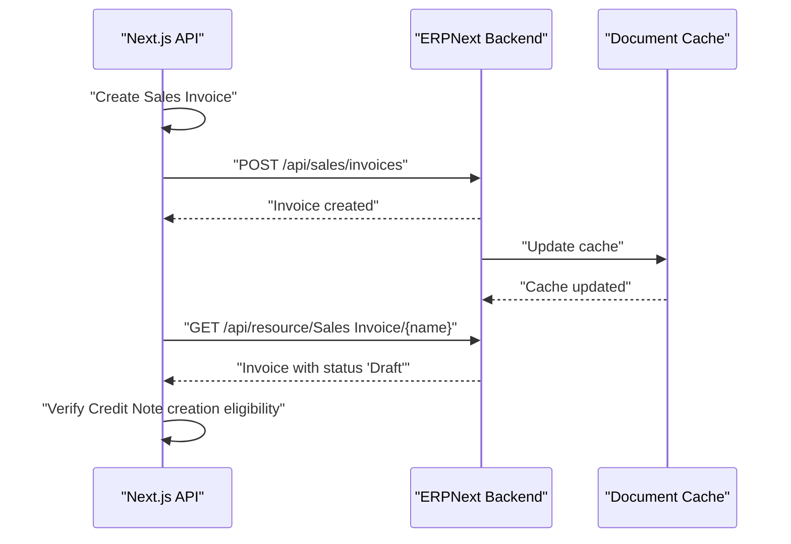
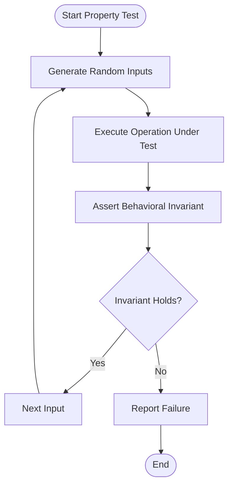
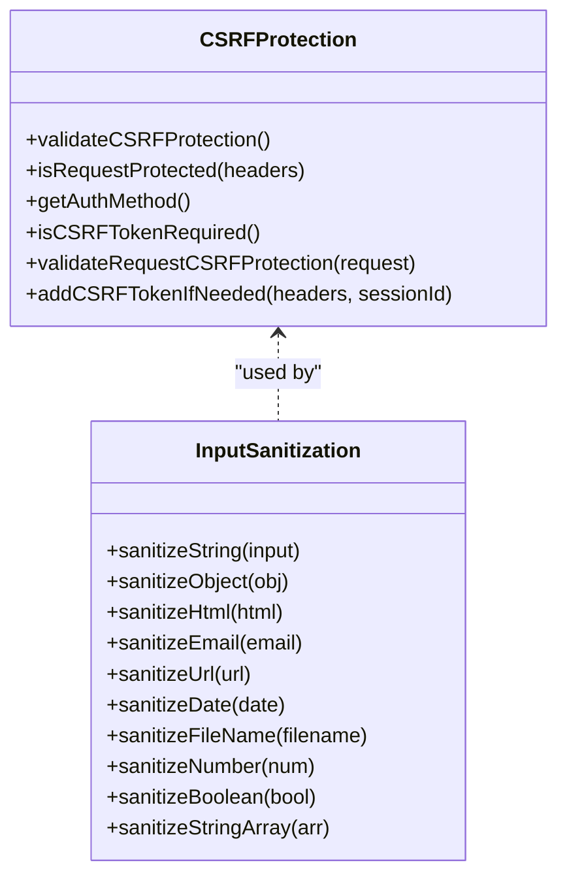
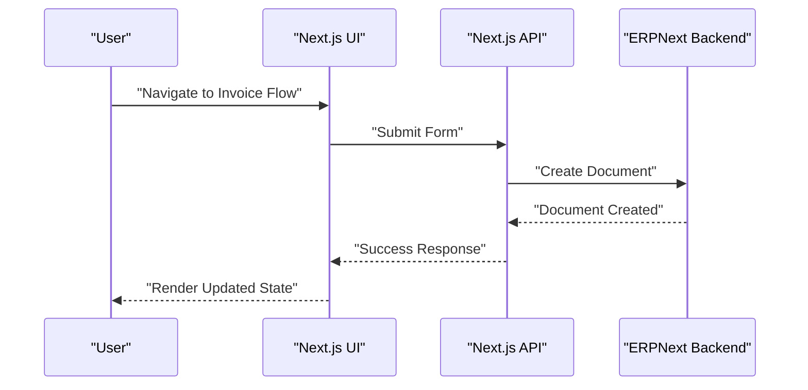
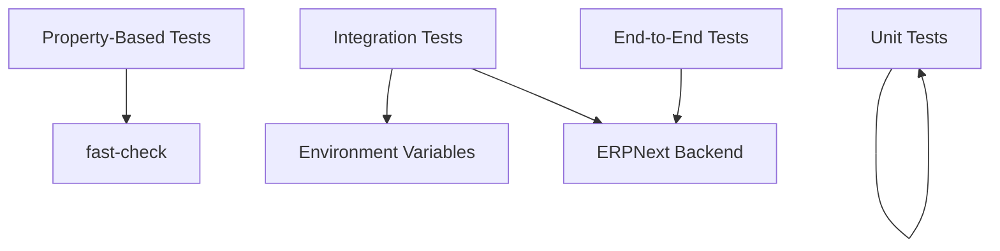

# Testing Strategy

<cite>
**Referenced Files in This Document**
- [README-INTEGRATION-TESTS.md](file://__tests__/README-INTEGRATION-TESTS.md)
- [sales-invoice-cache-update-integration.test.ts](file://__tests__/sales-invoice-cache-update-integration.test.ts)
- [sales-return-api.test.ts](file://__tests__/sales-return-api.test.ts)
- [sales-return-ui.test.ts](file://__tests__/sales-return-ui.test.ts)
- [csrf-protection.test.ts](file://__tests__/csrf-protection.test.ts)
- [input-sanitization.test.ts](file://__tests__/input-sanitization.test.ts)
- [api-routes-utility-backward-compatibility.pbt.test.ts](file://__tests__/api-routes-utility-backward-compatibility.pbt.test.ts)
- [api-routes-session-auth-preservation.pbt.test.ts](file://__tests__/api-routes-session-auth-preservation.pbt.test.ts)
- [invoice-list-preservation.pbt.test.ts](file://__tests__/invoice-list-preservation.pbt.test.ts)
- [tests/README.md](file://tests/README.md)
- [package.json](file://package.json)
</cite>

## Table of Contents
1. [Introduction](#introduction)
2. [Project Structure](#project-structure)
3. [Core Components](#core-components)
4. [Architecture Overview](#architecture-overview)
5. [Detailed Component Analysis](#detailed-component-analysis)
6. [Dependency Analysis](#dependency-analysis)
7. [Performance Considerations](#performance-considerations)
8. [Troubleshooting Guide](#troubleshooting-guide)
9. [Conclusion](#conclusion)
10. [Appendices](#appendices)

## Introduction
This document presents a comprehensive testing strategy for the ERP Next system, covering unit testing, integration testing, property-based testing, and end-to-end testing. It explains the testing architecture, test organization, quality assurance processes, and provides practical guidance for implementing robust tests across business logic, APIs, UI components, and workflows. The strategy emphasizes backward compatibility, multi-site support, and resilience under concurrent operations.

## Project Structure
The testing system is organized into focused categories:
- Integration tests: Full workflow validations across UI/API boundaries
- Property-based tests: Behavioral guarantees across large input spaces
- Unit tests: Business logic, sanitization, and CSRF protection
- End-to-end tests: Complete user journeys and report/print flows

Key directories and files:
- Integration tests: __tests__ directory with workflow-focused suites
- Property-based tests: tests/property and __tests__ property-based suites
- Unit tests: tests/unit and __tests__ for utilities and security
- Scripts and commands: package.json scripts for running targeted tests

**Diagram sources**
- [package.json](file://package.json#L5-L117)

**Section sources**
- [package.json](file://package.json#L5-L117)

## Core Components
The testing framework comprises:
- Fast-check property-based testing for broad behavioral validation
- Integration tests orchestrating UI and ERPNext backend interactions
- Unit tests for security utilities and input sanitization
- End-to-end tests validating complete user flows

Representative capabilities:
- Backward compatibility validation for migrated API routes
- Session authentication preservation across operations
- Preservation of UI features (mobile cards, filters, pagination)
- CSRF protection enforcement and validation
- Input sanitization for XSS prevention and data integrity

**Section sources**
- [api-routes-utility-backward-compatibility.pbt.test.ts](file://__tests__/api-routes-utility-backward-compatibility.pbt.test.ts#L1-L724)
- [api-routes-session-auth-preservation.pbt.test.ts](file://__tests__/api-routes-session-auth-preservation.pbt.test.ts#L1-L595)
- [invoice-list-preservation.pbt.test.ts](file://__tests__/invoice-list-preservation.pbt.test.ts#L1-L800)
- [csrf-protection.test.ts](file://__tests__/csrf-protection.test.ts#L1-L206)
- [input-sanitization.test.ts](file://__tests__/input-sanitization.test.ts#L1-L305)

## Architecture Overview
The testing architecture integrates multiple layers:
- Test runners orchestrated via npm/yarn scripts
- Property-based generators driving large-scale input coverage
- Integration test harnesses validating cross-service behavior
- Security and sanitization checks embedded in unit tests

**Diagram sources**
- [package.json](file://package.json#L5-L117)

**Section sources**
- [package.json](file://package.json#L5-L117)

## Detailed Component Analysis

### Integration Testing: Sales Invoice Cache Update
This suite validates the end-to-end workflow from API creation to ERPNext UI status display, including:
- Successful cache update flow
- Graceful degradation on cache update failure
- Concurrent invoice creation and race condition handling
- Cross-module integration with Delivery Notes
- Property-based validation across varied inputs

**Diagram sources**
- [sales-invoice-cache-update-integration.test.ts](file://__tests__/sales-invoice-cache-update-integration.test.ts#L1-L655)

**Section sources**
- [README-INTEGRATION-TESTS.md](file://__tests__/README-INTEGRATION-TESTS.md#L1-L224)
- [sales-invoice-cache-update-integration.test.ts](file://__tests__/sales-invoice-cache-update-integration.test.ts#L1-L655)

### Property-Based Testing: API Routes and Multi-Site Scenarios
Property-based tests ensure behavioral invariants across large input domains:
- Backward compatibility of utility route responses
- Session authentication preservation across operations and cookie variations
- Preservation of UI features (mobile card layout, filters, pagination)

**Diagram sources**
- [api-routes-utility-backward-compatibility.pbt.test.ts](file://__tests__/api-routes-utility-backward-compatibility.pbt.test.ts#L388-L467)
- [api-routes-session-auth-preservation.pbt.test.ts](file://__tests__/api-routes-session-auth-preservation.pbt.test.ts#L307-L378)
- [invoice-list-preservation.pbt.test.ts](file://__tests__/invoice-list-preservation.pbt.test.ts#L207-L303)

**Section sources**
- [tests/README.md](file://tests/README.md#L1-L162)
- [api-routes-utility-backward-compatibility.pbt.test.ts](file://__tests__/api-routes-utility-backward-compatibility.pbt.test.ts#L1-L724)
- [api-routes-session-auth-preservation.pbt.test.ts](file://__tests__/api-routes-session-auth-preservation.pbt.test.ts#L1-L595)
- [invoice-list-preservation.pbt.test.ts](file://__tests__/invoice-list-preservation.pbt.test.ts#L1-L800)

### Unit Testing: Business Logic, Components, and Utilities
Unit tests validate:
- CSRF protection logic and request validation
- Input sanitization for XSS prevention and data normalization
- Sales Return API and UI component behaviors

**Diagram sources**
- [csrf-protection.test.ts](file://__tests__/csrf-protection.test.ts#L8-L15)
- [input-sanitization.test.ts](file://__tests__/input-sanitization.test.ts#L1-L12)

**Section sources**
- [csrf-protection.test.ts](file://__tests__/csrf-protection.test.ts#L1-L206)
- [input-sanitization.test.ts](file://__tests__/input-sanitization.test.ts#L1-L305)

### End-to-End Testing: Workflows and Reports
End-to-end tests cover:
- Sales/Purchase invoice creation and validation
- Report generation and printing flows
- Backward compatibility across environments

**Diagram sources**
- [sales-return-api.test.ts](file://__tests__/sales-return-api.test.ts#L1-L1257)
- [sales-return-ui.test.ts](file://__tests__/sales-return-ui.test.ts#L1-L1545)

**Section sources**
- [sales-return-api.test.ts](file://__tests__/sales-return-api.test.ts#L1-L1257)
- [sales-return-ui.test.ts](file://__tests__/sales-return-ui.test.ts#L1-L1545)

## Dependency Analysis
Testing dependencies and relationships:
- Property-based tests rely on fast-check for input generation
- Integration tests depend on environment variables and external services (ERPNext backend)
- Unit tests validate isolated utilities and security logic
- End-to-end tests coordinate multiple subsystems

**Diagram sources**
- [package.json](file://package.json#L143-L149)
- [sales-invoice-cache-update-integration.test.ts](file://__tests__/sales-invoice-cache-update-integration.test.ts#L14-L20)

**Section sources**
- [package.json](file://package.json#L143-L149)
- [sales-invoice-cache-update-integration.test.ts](file://__tests__/sales-invoice-cache-update-integration.test.ts#L14-L20)

## Performance Considerations
- Property-based tests: Tune numRuns and verbose settings to balance coverage and runtime
- Integration tests: Use timeouts and retries judiciously; isolate flaky network-dependent steps
- End-to-end tests: Prefer deterministic fixtures and avoid heavy computations in test bodies
- Security tests: Keep sanitization checks efficient while maintaining thoroughness

## Troubleshooting Guide
Common issues and resolutions:
- Missing environment variables: Ensure ERPNEXT_API_URL, ERP_API_KEY, ERP_API_SECRET are set
- ERPNext service availability: Verify backend responsiveness and API credentials
- Timeout handling: Increase test timeouts for slower environments
- Cleanup procedures: Remove test data programmatically to avoid clutter

**Section sources**
- [README-INTEGRATION-TESTS.md](file://__tests__/README-INTEGRATION-TESTS.md#L132-L182)

## Conclusion
The testing strategy leverages property-based, integration, unit, and end-to-end approaches to ensure reliability, backward compatibility, and robustness across multi-site and concurrent scenarios. By combining automated property checks with targeted integration and end-to-end validations, the system maintains high confidence in business workflows and security.

## Appendices

### Practical Examples and Commands
- Run integration tests for Sales Invoice cache update workflow
  - Command: `pnpm test:sales-invoice-cache-integration`
- Run property-based tests for Sales Return
  - Command: `pnpm test:sales-return-properties`
- Run CSRF protection tests
  - Command: `pnpm test:csrf-protection`
- Run input sanitization tests
  - Command: `pnpm test:utility-functions`

**Section sources**
- [README-INTEGRATION-TESTS.md](file://__tests__/README-INTEGRATION-TESTS.md#L192-L201)
- [package.json](file://package.json#L67-L106)