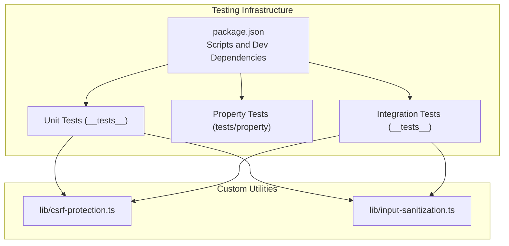
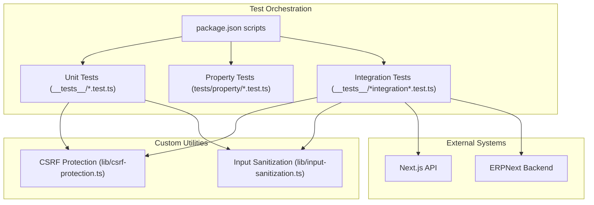
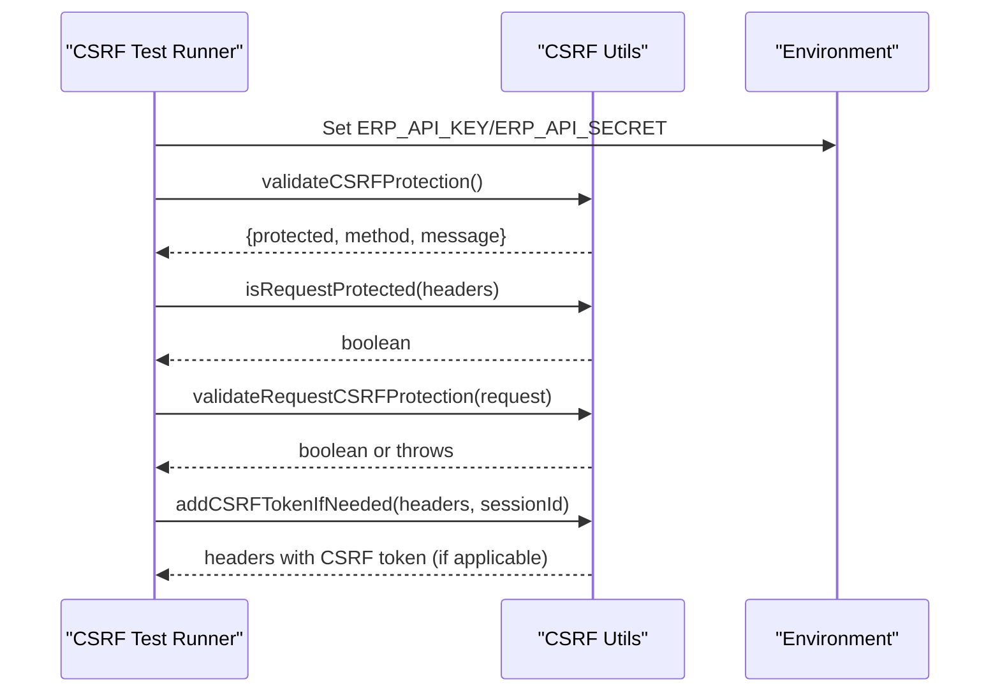
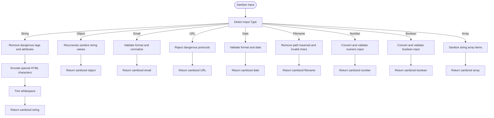
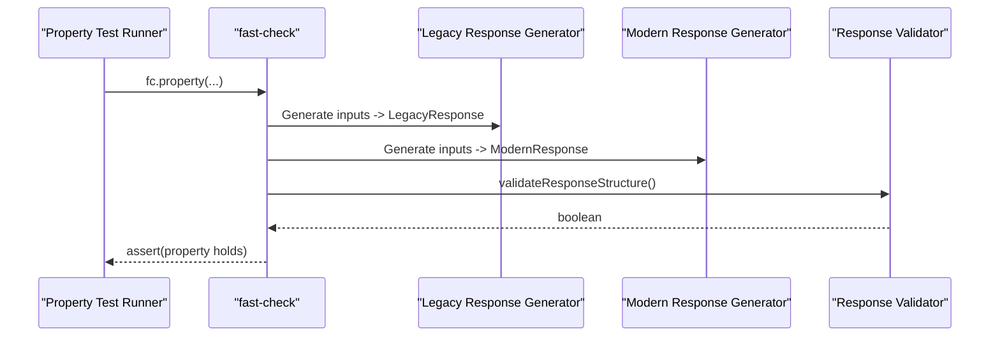
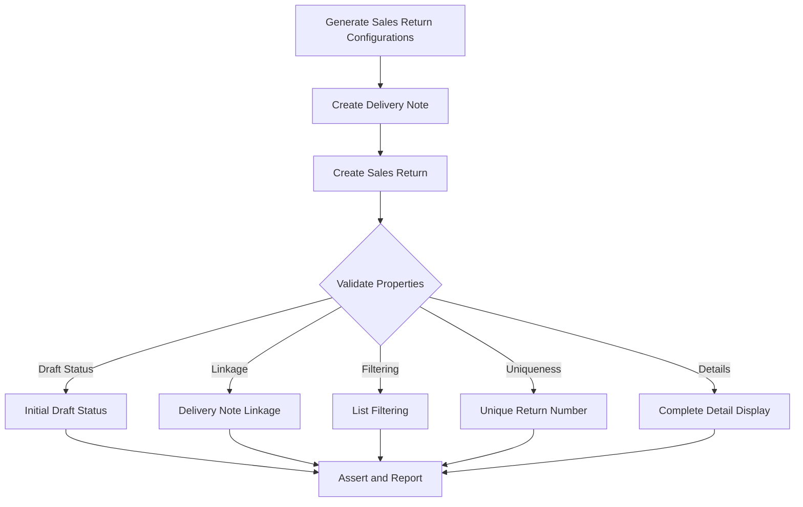
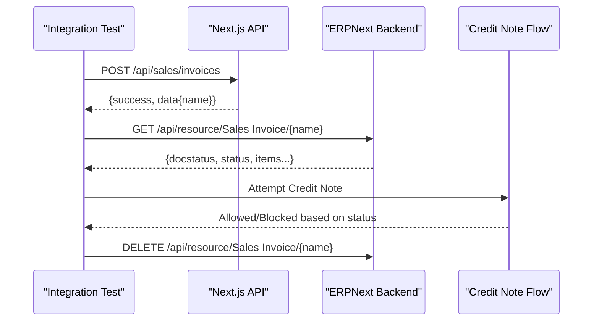
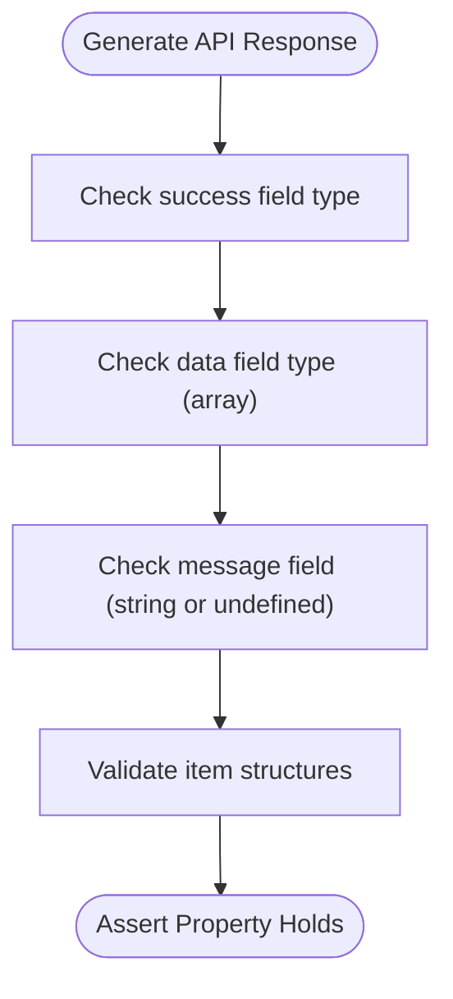
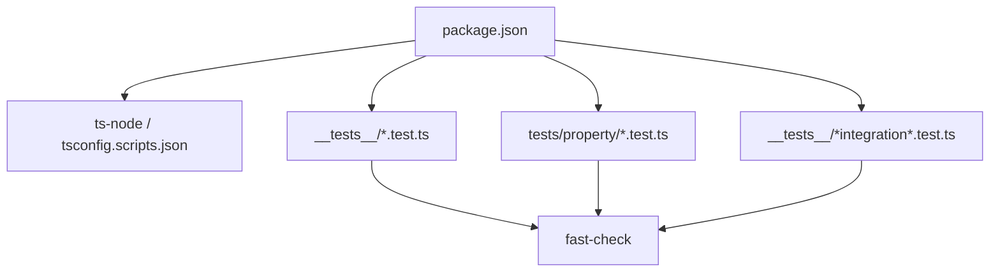

# Testing Tools and Frameworks

<cite>
**Referenced Files in This Document**
- [package.json](file://package.json)
- [README-INTEGRATION-TESTS.md](file://__tests__/README-INTEGRATION-TESTS.md)
- [csrf-protection.test.ts](file://__tests__/csrf-protection.test.ts)
- [input-sanitization.test.ts](file://__tests__/input-sanitization.test.ts)
- [sales-return-api.test.ts](file://__tests__/sales-return-api.test.ts)
- [sales-return-ui.test.ts](file://__tests__/sales-return-ui.test.ts)
- [sales-invoice-cache-update-integration.test.ts](file://__tests__/sales-invoice-cache-update-integration.test.ts)
- [api-routes-utility-backward-compatibility.pbt.test.ts](file://__tests__/api-routes-utility-backward-compatibility.pbt.test.ts)
- [csrf-protection.ts](file://lib/csrf-protection.ts)
- [input-sanitization.ts](file://lib/input-sanitization.ts)
- [api-responses.property.test.ts](file://tests/property/api-responses.property.test.ts)
</cite>

## Table of Contents
1. [Introduction](#introduction)
2. [Project Structure](#project-structure)
3. [Core Components](#core-components)
4. [Architecture Overview](#architecture-overview)
5. [Detailed Component Analysis](#detailed-component-analysis)
6. [Dependency Analysis](#dependency-analysis)
7. [Performance Considerations](#performance-considerations)
8. [Troubleshooting Guide](#troubleshooting-guide)
9. [Conclusion](#conclusion)
10. [Appendices](#appendices)

## Introduction
This document describes the testing tools, frameworks, and utilities used in the ERP Next System testing strategy. It covers the testing infrastructure, custom utilities for CSRF protection validation, input sanitization testing, and API route auditing. It also explains property-based testing, mocking frameworks, and test data generation, along with continuous integration setup, test coverage reporting, and automated testing pipelines. Guidance is provided for test environment configuration, debugging test failures, and maintaining the test infrastructure, including best practices, performance testing approaches, and scalability considerations for large test suites.

## Project Structure
The testing strategy is organized across several areas:
- Unit and custom utilities tests under __tests__/
- Property-based tests leveraging fast-check
- Integration tests validating end-to-end workflows
- Property tests for API response consistency under tests/property/

Key characteristics:
- Property-based tests are implemented using fast-check for broad input coverage.
- Custom test runners are used for specific utilities (CSRF protection, input sanitization).
- Integration tests coordinate between Next.js APIs and ERPNext backend services.
- Scripts in package.json orchestrate targeted test runs.

**Diagram sources**
- [package.json](file://package.json#L1-L152)
- [csrf-protection.ts](file://lib/csrf-protection.ts#L1-L238)
- [input-sanitization.ts](file://lib/input-sanitization.ts#L1-L280)

**Section sources**
- [package.json](file://package.json#L1-L152)

## Core Components
This section outlines the primary testing components and their roles.

- Custom CSRF Protection Utilities
  - Validates authentication method and CSRF token requirements.
  - Adds CSRF tokens when needed and enforces protection on state-changing requests.
  - Used by both unit and integration tests to ensure secure API interactions.

- Input Sanitization Utilities
  - Provides functions to sanitize strings, objects, emails, URLs, dates, filenames, numbers, booleans, and arrays.
  - Includes middleware and request body sanitization helpers.
  - Tested via dedicated unit tests to ensure XSS prevention and data integrity.

- Property-Based Testing Libraries
  - fast-check is used extensively for property-based tests across API responses and utility route compatibility.
  - Enables broad input space exploration and robustness validation.

- Mocking and Test Data Generation
  - While explicit mocking frameworks are not imported in the referenced files, property-based tests generate synthetic data to validate behavior across inputs.
  - Integration tests simulate external service interactions (ERPNext backend) and validate responses.

- API Route Auditing
  - Property-based tests validate response structure, field names, and data types for migrated utility routes.
  - Ensures backward compatibility with legacy implementations.

**Section sources**
- [csrf-protection.ts](file://lib/csrf-protection.ts#L1-L238)
- [input-sanitization.ts](file://lib/input-sanitization.ts#L1-L280)
- [api-routes-utility-backward-compatibility.pbt.test.ts](file://__tests__/api-routes-utility-backward-compatibility.pbt.test.ts#L1-L724)
- [api-responses.property.test.ts](file://tests/property/api-responses.property.test.ts#L1-L225)

## Architecture Overview
The testing architecture integrates custom utilities, property-based tests, and integration tests to validate both internal logic and external API interactions.

**Diagram sources**
- [package.json](file://package.json#L1-L152)
- [csrf-protection.ts](file://lib/csrf-protection.ts#L1-L238)
- [input-sanitization.ts](file://lib/input-sanitization.ts#L1-L280)
- [sales-invoice-cache-update-integration.test.ts](file://__tests__/sales-invoice-cache-update-integration.test.ts#L1-L655)

## Detailed Component Analysis

### CSRF Protection Validation
The CSRF protection utilities validate authentication method detection, CSRF token requirement, and enforcement on state-changing requests. The unit tests exercise these functions with various scenarios, including API key authentication (immune to CSRF), session-based authentication requiring CSRF tokens, and GET vs POST protections.

**Diagram sources**
- [csrf-protection.test.ts](file://__tests__/csrf-protection.test.ts#L1-L206)
- [csrf-protection.ts](file://lib/csrf-protection.ts#L1-L238)

**Section sources**
- [csrf-protection.test.ts](file://__tests__/csrf-protection.test.ts#L1-L206)
- [csrf-protection.ts](file://lib/csrf-protection.ts#L1-L238)

### Input Sanitization Testing
The input sanitization utilities provide robust sanitization for strings, objects, HTML, emails, URLs, dates, filenames, numbers, booleans, and arrays. The unit tests validate XSS prevention, data type handling, and error conditions.

**Diagram sources**
- [input-sanitization.test.ts](file://__tests__/input-sanitization.test.ts#L1-L305)
- [input-sanitization.ts](file://lib/input-sanitization.ts#L1-L280)

**Section sources**
- [input-sanitization.test.ts](file://__tests__/input-sanitization.test.ts#L1-L305)
- [input-sanitization.ts](file://lib/input-sanitization.ts#L1-L280)

### API Route Auditing (Property-Based)
Property-based tests validate response structure, field names, and data types for migrated utility routes, ensuring backward compatibility with legacy implementations. They generate synthetic inputs and assert properties across many combinations.

**Diagram sources**
- [api-routes-utility-backward-compatibility.pbt.test.ts](file://__tests__/api-routes-utility-backward-compatibility.pbt.test.ts#L1-L724)

**Section sources**
- [api-routes-utility-backward-compatibility.pbt.test.ts](file://__tests__/api-routes-utility-backward-compatibility.pbt.test.ts#L1-L724)

### Sales Return Management (Property-Based)
Property-based tests validate core business properties for sales returns, including delivery note linkage, initial draft status, list filtering, unique return number generation, and detailed display.

**Diagram sources**
- [sales-return-api.test.ts](file://__tests__/sales-return-api.test.ts#L1-L1257)
- [sales-return-ui.test.ts](file://__tests__/sales-return-ui.test.ts#L1-L1545)

**Section sources**
- [sales-return-api.test.ts](file://__tests__/sales-return-api.test.ts#L1-L1257)
- [sales-return-ui.test.ts](file://__tests__/sales-return-ui.test.ts#L1-L1545)

### Sales Invoice Cache Update Integration
Integration tests validate the end-to-end workflow from API creation to ERPNext UI display, including error handling, concurrent operations, and cross-module integration. They also include property-based tests across many invoice configurations.

**Diagram sources**
- [sales-invoice-cache-update-integration.test.ts](file://__tests__/sales-invoice-cache-update-integration.test.ts#L1-L655)

**Section sources**
- [sales-invoice-cache-update-integration.test.ts](file://__tests__/sales-invoice-cache-update-integration.test.ts#L1-L655)
- [README-INTEGRATION-TESTS.md](file://__tests__/README-INTEGRATION-TESTS.md#L1-L224)

### API Response Consistency (Property-Based)
Property-based tests validate universal API response properties, including standardized success/data/message fields, consistent data types, and graceful error handling.

**Diagram sources**
- [api-responses.property.test.ts](file://tests/property/api-responses.property.test.ts#L1-L225)

**Section sources**
- [api-responses.property.test.ts](file://tests/property/api-responses.property.test.ts#L1-L225)

## Dependency Analysis
The testing stack relies on:
- fast-check for property-based testing across multiple test suites.
- Custom test runners for CSRF and input sanitization utilities.
- Integration tests orchestrated via package.json scripts that call ts-node with project configuration.

**Diagram sources**
- [package.json](file://package.json#L1-L152)
- [api-responses.property.test.ts](file://tests/property/api-responses.property.test.ts#L1-L225)
- [api-routes-utility-backward-compatibility.pbt.test.ts](file://__tests__/api-routes-utility-backward-compatibility.pbt.test.ts#L1-L724)

**Section sources**
- [package.json](file://package.json#L1-L152)

## Performance Considerations
- Property-based tests use fast-check with configurable numRuns to balance coverage and runtime.
- Integration tests coordinate multiple HTTP requests; timeouts and retries should be considered for CI stability.
- Use targeted scripts to run subsets of tests during development and full suites in CI.
- Prefer synthetic data generation over heavy fixtures to reduce setup overhead.

## Troubleshooting Guide
Common issues and resolutions:
- Missing environment variables for integration tests:
  - Ensure ERPNEXT_API_URL, ERP_API_KEY, ERP_API_SECRET, and NEXT_API_URL are set.
  - Refer to the integration test README for environment setup and prerequisites.

- ERPNext backend connectivity:
  - Verify ERPNext is reachable and responds to API calls.
  - Check credentials and network connectivity.

- Test timeouts:
  - Increase timeouts in test files if backend is slow.
  - Optimize database and network performance.

- Cleanup of test data:
  - Integration tests include cleanup routines; manual cleanup may be required if interrupted.

- Debugging property-based failures:
  - Reduce numRuns temporarily to isolate failing cases.
  - Use verbose logging to inspect generated inputs and assertions.

**Section sources**
- [README-INTEGRATION-TESTS.md](file://__tests__/README-INTEGRATION-TESTS.md#L132-L224)
- [sales-invoice-cache-update-integration.test.ts](file://__tests__/sales-invoice-cache-update-integration.test.ts#L578-L655)

## Conclusion
The ERP Next System employs a comprehensive testing strategy combining custom utilities, property-based testing, and integration tests. fast-check ensures broad input coverage, while custom CSRF and sanitization utilities are validated through dedicated unit tests. Integration tests coordinate with ERPNext to validate end-to-end workflows and cross-module behavior. Scripts in package.json streamline test execution, and the architecture supports scalable growth with targeted and property-based approaches.

## Appendices
- Continuous Integration Setup:
  - Configure environment variables in CI (ERPNEXT_API_URL, ERP_API_KEY, ERP_API_SECRET).
  - Start ERPNext and Next.js services prior to running tests.
  - Execute targeted scripts via pnpm test:<suite-name> to run specific test suites.

- Test Coverage Reporting:
  - No coverage configuration is present in the referenced files; consider integrating a coverage tool if needed.

- Maintaining Test Infrastructure:
  - Keep property-based tests focused on invariant properties.
  - Regularly update integration tests to reflect backend changes.
  - Maintain clear separation between unit, property, and integration tests for easier maintenance and debugging.