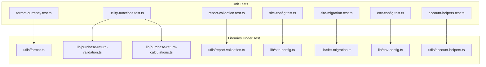
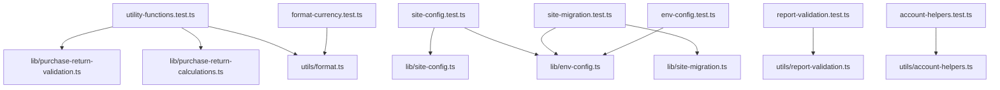
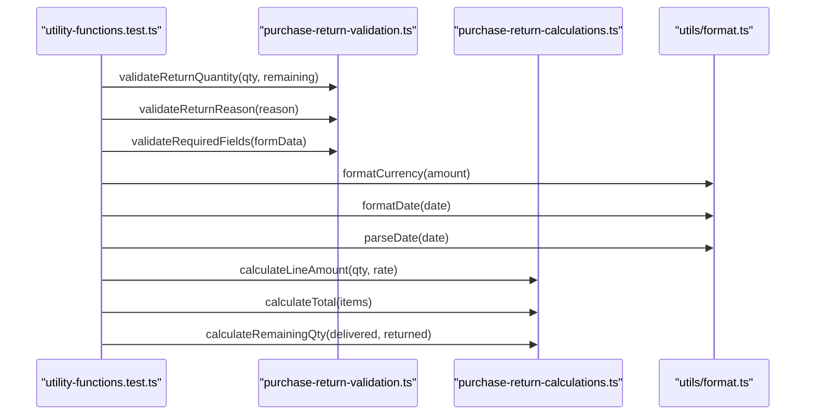
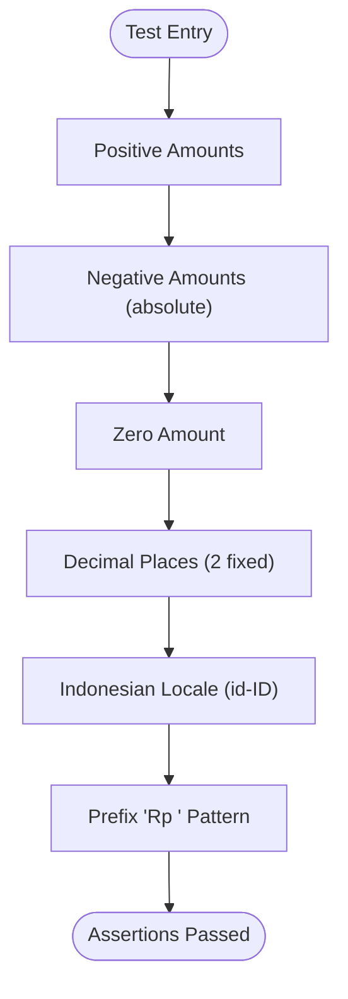
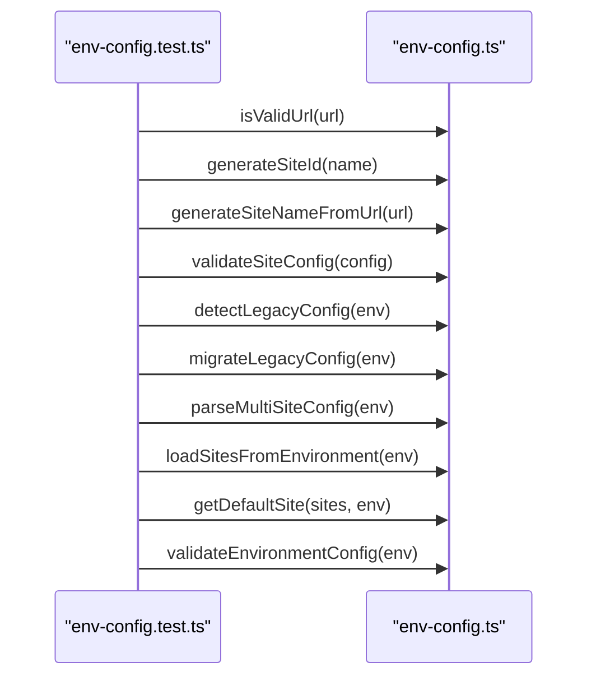
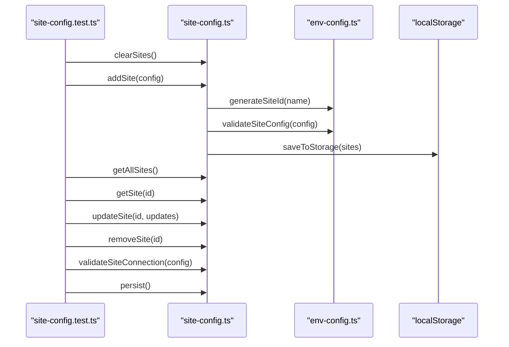
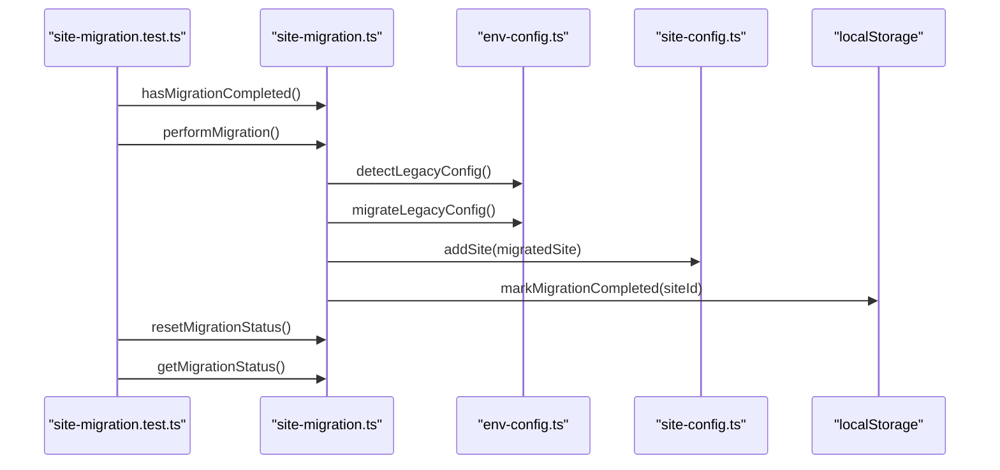
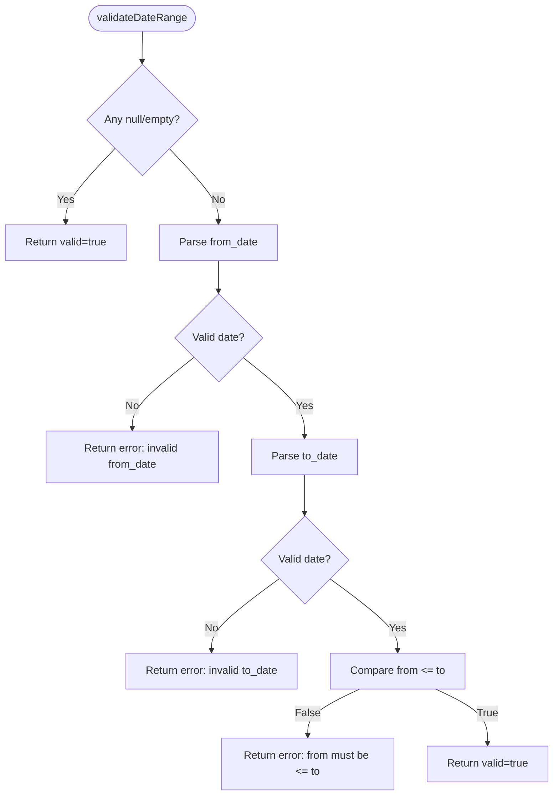
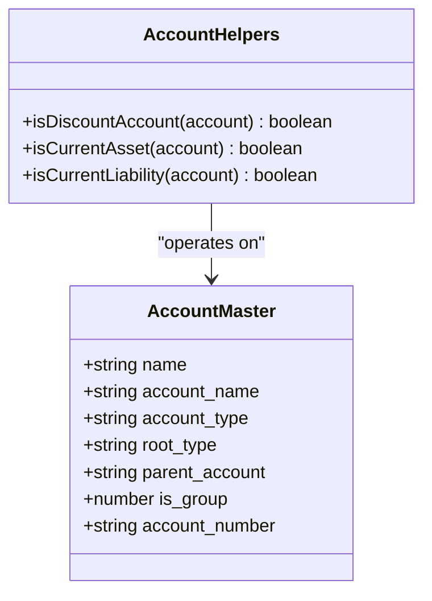
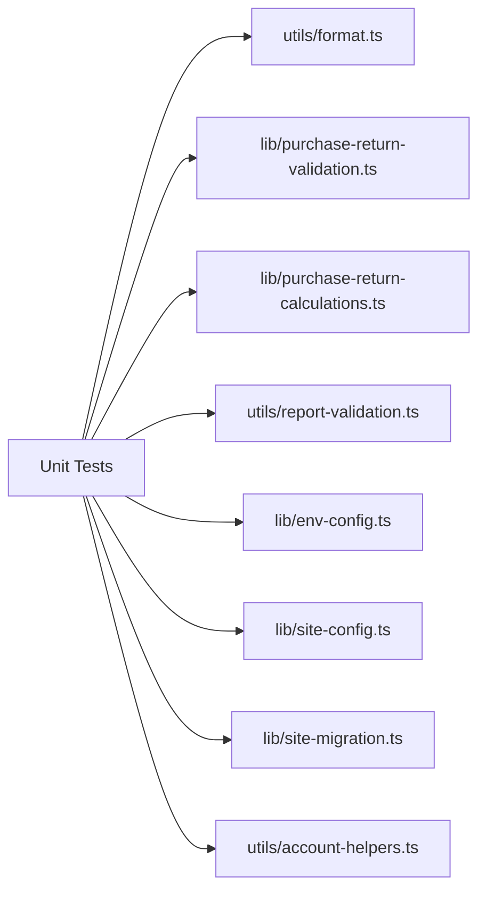

# Unit Testing

<cite>
**Referenced Files in This Document**
- [tests/unit/utility-functions.test.ts](file://tests/unit/utility-functions.test.ts)
- [tests/unit/format-currency.test.ts](file://tests/unit/format-currency.test.ts)
- [tests/unit/site-config.test.ts](file://tests/unit/site-config.test.ts)
- [tests/unit/site-migration.test.ts](file://tests/unit/site-migration.test.ts)
- [tests/unit/report-validation.test.ts](file://tests/unit/report-validation.test.ts)
- [tests/unit/env-config.test.ts](file://tests/unit/env-config.test.ts)
- [tests/unit/account-helpers.test.ts](file://tests/unit/account-helpers.test.ts)
- [utils/format.ts](file://utils/format.ts)
- [lib/purchase-return-validation.ts](file://lib/purchase-return-validation.ts)
- [lib/purchase-return-calculations.ts](file://lib/purchase-return-calculations.ts)
- [utils/report-validation.ts](file://utils/report-validation.ts)
- [lib/site-config.ts](file://lib/site-config.ts)
- [lib/site-migration.ts](file://lib/site-migration.ts)
- [lib/env-config.ts](file://lib/env-config.ts)
- [utils/account-helpers.ts](file://utils/account-helpers.ts)
</cite>

## Table of Contents
1. [Introduction](#introduction)
2. [Project Structure](#project-structure)
3. [Core Components](#core-components)
4. [Architecture Overview](#architecture-overview)
5. [Detailed Component Analysis](#detailed-component-analysis)
6. [Dependency Analysis](#dependency-analysis)
7. [Performance Considerations](#performance-considerations)
8. [Troubleshooting Guide](#troubleshooting-guide)
9. [Conclusion](#conclusion)

## Introduction
This document describes the unit testing implementation in the ERP Next System. It explains the testing architecture, organization patterns, and methodologies used to validate business logic across utility functions, API helpers, formatting utilities, and report validation components. It also covers environment configuration, site migration logic, and currency formatting, with guidance on test isolation, mock strategies, assertion patterns, maintainability, coverage expectations, and debugging failed tests.

## Project Structure
The unit tests are organized under a dedicated tests directory with focused suites:
- tests/unit: Contains isolated unit tests for utilities, formatting, environment configuration, site configuration, migration, and report validation.
- tests/components: React component unit tests using Vitest (e.g., account-helpers.test.ts).
- tests/integration: Integration tests for cross-module flows (e.g., purchase return debit note).
- Property-based tests: Property tests for calculations and API responses under tests/property.

**Diagram sources**
- [tests/unit/utility-functions.test.ts](file://tests/unit/utility-functions.test.ts#L1-L299)
- [tests/unit/format-currency.test.ts](file://tests/unit/format-currency.test.ts#L1-L67)
- [tests/unit/site-config.test.ts](file://tests/unit/site-config.test.ts#L1-L504)
- [tests/unit/site-migration.test.ts](file://tests/unit/site-migration.test.ts#L1-L360)
- [tests/unit/report-validation.test.ts](file://tests/unit/report-validation.test.ts#L1-L95)
- [tests/unit/env-config.test.ts](file://tests/unit/env-config.test.ts#L1-L499)
- [tests/unit/account-helpers.test.ts](file://tests/unit/account-helpers.test.ts#L1-L200)
- [utils/format.ts](file://utils/format.ts#L1-L102)
- [lib/purchase-return-validation.ts](file://lib/purchase-return-validation.ts#L1-L223)
- [lib/purchase-return-calculations.ts](file://lib/purchase-return-calculations.ts#L1-L80)
- [utils/report-validation.ts](file://utils/report-validation.ts#L1-L54)
- [lib/site-config.ts](file://lib/site-config.ts#L1-L322)
- [lib/site-migration.ts](file://lib/site-migration.ts#L1-L195)
- [lib/env-config.ts](file://lib/env-config.ts#L1-L342)
- [utils/account-helpers.ts](file://utils/account-helpers.ts#L1-L72)

**Section sources**
- [tests/unit/utility-functions.test.ts](file://tests/unit/utility-functions.test.ts#L1-L299)
- [tests/unit/format-currency.test.ts](file://tests/unit/format-currency.test.ts#L1-L67)
- [tests/unit/site-config.test.ts](file://tests/unit/site-config.test.ts#L1-L504)
- [tests/unit/site-migration.test.ts](file://tests/unit/site-migration.test.ts#L1-L360)
- [tests/unit/report-validation.test.ts](file://tests/unit/report-validation.test.ts#L1-L95)
- [tests/unit/env-config.test.ts](file://tests/unit/env-config.test.ts#L1-L499)
- [tests/unit/account-helpers.test.ts](file://tests/unit/account-helpers.test.ts#L1-L200)

## Core Components
This section outlines the primary units under test and their roles in business logic validation.

- Formatting Utilities
  - formatCurrency: Formats amounts in Indonesian Rupiah with consistent separators and two decimals.
  - formatDate and parseDate: Convert between display and API date formats with validation.
  - formatNumber: Formats numbers with locale-specific thousand separators.
  - formatAddress: Converts HTML address strings to plain text.

- Validation Utilities
  - validateReturnQuantity, validateReturnReason, validateRequiredFields: Enforce purchase return business rules.
  - validateDateRange: Ensures report date ranges are valid and properly formatted.

- Calculation Utilities
  - calculateLineAmount, calculateTotal, calculateRemainingQty: Compute totals and remaining quantities for purchase returns and debit notes.

- Environment Configuration
  - isValidUrl, generateSiteId, generateSiteNameFromUrl, validateSiteConfig, detectLegacyConfig, migrateLegacyConfig, parseMultiSiteConfig, loadSitesFromEnvironment, getDefaultSite, validateEnvironmentConfig: Parse, validate, and migrate environment-based site configurations.

- Site Configuration Store
  - getAllSites, getSite, addSite, updateSite, removeSite, validateSiteConnection, persist, clearSites, fetchCompanyName, loadFromEnvironment: Manage persistent site configurations with localStorage and validation.

- Site Migration
  - hasMigrationCompleted, performMigration, resetMigrationStatus, getMigrationStatus: Detect, execute, and persist migration from legacy to multi-site configuration.

- Account Helpers
  - isDiscountAccount, isCurrentAsset, isCurrentLiability: Identify accounts for financial reporting based on metadata.

**Section sources**
- [utils/format.ts](file://utils/format.ts#L20-L102)
- [lib/purchase-return-validation.ts](file://lib/purchase-return-validation.ts#L13-L128)
- [lib/purchase-return-calculations.ts](file://lib/purchase-return-calculations.ts#L9-L80)
- [utils/report-validation.ts](file://utils/report-validation.ts#L17-L54)
- [lib/env-config.ts](file://lib/env-config.ts#L50-L342)
- [lib/site-config.ts](file://lib/site-config.ts#L27-L322)
- [lib/site-migration.ts](file://lib/site-migration.ts#L25-L195)
- [utils/account-helpers.ts](file://utils/account-helpers.ts#L19-L72)

## Architecture Overview
The unit tests follow a layered approach:
- Test Layer: Each test suite validates a single unit (utility function or small module).
- Assertion Layer: Uses either a minimal built-in runner or Vitest for richer assertions and mocking.
- Mock Layer: Global mocks for DOM APIs (localStorage, window, fetch) enable deterministic Node.js execution.
- Subject Under Test: Pure functions or small modules are imported directly for isolation.

**Diagram sources**
- [tests/unit/utility-functions.test.ts](file://tests/unit/utility-functions.test.ts#L1-L299)
- [tests/unit/format-currency.test.ts](file://tests/unit/format-currency.test.ts#L1-L67)
- [tests/unit/site-config.test.ts](file://tests/unit/site-config.test.ts#L1-L504)
- [tests/unit/site-migration.test.ts](file://tests/unit/site-migration.test.ts#L1-L360)
- [tests/unit/report-validation.test.ts](file://tests/unit/report-validation.test.ts#L1-L95)
- [tests/unit/env-config.test.ts](file://tests/unit/env-config.test.ts#L1-L499)
- [tests/unit/account-helpers.test.ts](file://tests/unit/account-helpers.test.ts#L1-L200)
- [utils/format.ts](file://utils/format.ts#L1-L102)
- [lib/purchase-return-validation.ts](file://lib/purchase-return-validation.ts#L1-L223)
- [lib/purchase-return-calculations.ts](file://lib/purchase-return-calculations.ts#L1-L80)
- [utils/report-validation.ts](file://utils/report-validation.ts#L1-L54)
- [lib/env-config.ts](file://lib/env-config.ts#L1-L342)
- [lib/site-config.ts](file://lib/site-config.ts#L1-L322)
- [lib/site-migration.ts](file://lib/site-migration.ts#L1-L195)
- [utils/account-helpers.ts](file://utils/account-helpers.ts#L1-L72)

## Detailed Component Analysis

### Utility Functions and Calculations
This suite validates purchase return validation, formatting, and calculation utilities.

**Diagram sources**
- [tests/unit/utility-functions.test.ts](file://tests/unit/utility-functions.test.ts#L61-L295)
- [lib/purchase-return-validation.ts](file://lib/purchase-return-validation.ts#L17-L85)
- [lib/purchase-return-calculations.ts](file://lib/purchase-return-calculations.ts#L13-L33)
- [utils/format.ts](file://utils/format.ts#L26-L101)

Key testing patterns:
- Assertion styles vary: expect-style in one runner and custom expect-like in another.
- Comprehensive coverage of boundary conditions (zero, negatives, empty arrays).
- Business rule validations for quantities, reasons, and required fields.

Practical examples:
- Currency formatting: Positive, negative, zero, and decimal rounding behavior.
- Date conversions: Display-to-API and vice versa with validation.
- Totals and remainders: Selected items only, rounding considerations.

**Section sources**
- [tests/unit/utility-functions.test.ts](file://tests/unit/utility-functions.test.ts#L1-L299)
- [lib/purchase-return-validation.ts](file://lib/purchase-return-validation.ts#L1-L223)
- [lib/purchase-return-calculations.ts](file://lib/purchase-return-calculations.ts#L1-L80)
- [utils/format.ts](file://utils/format.ts#L1-L102)

### Currency Formatting
This suite focuses on formatCurrency with strict assertions and logging.

**Diagram sources**
- [tests/unit/format-currency.test.ts](file://tests/unit/format-currency.test.ts#L8-L67)
- [utils/format.ts](file://utils/format.ts#L26-L34)

Guidance:
- Use assertEqual for exact string comparisons.
- Validate separators and prefixes.
- Confirm consistent two-decimal formatting.

**Section sources**
- [tests/unit/format-currency.test.ts](file://tests/unit/format-currency.test.ts#L1-L67)
- [utils/format.ts](file://utils/format.ts#L26-L34)

### Environment Configuration
Validates environment parsing, migration, and defaults.

**Diagram sources**
- [tests/unit/env-config.test.ts](file://tests/unit/env-config.test.ts#L66-L499)
- [lib/env-config.ts](file://lib/env-config.ts#L50-L342)

Mock strategies:
- Global mocks for URL validation and ID/name generation.
- Environment variable simulation via process.env manipulation.

**Section sources**
- [tests/unit/env-config.test.ts](file://tests/unit/env-config.test.ts#L1-L499)
- [lib/env-config.ts](file://lib/env-config.ts#L1-L342)

### Site Configuration Store
Tests CRUD operations, validation, persistence, and edge cases.

**Diagram sources**
- [tests/unit/site-config.test.ts](file://tests/unit/site-config.test.ts#L63-L436)
- [lib/site-config.ts](file://lib/site-config.ts#L27-L322)
- [lib/env-config.ts](file://lib/env-config.ts#L50-L121)

Mock strategies:
- localStorageMock simulates browser storage in Node.js.
- fetch mock simulates connection validation responses.

**Section sources**
- [tests/unit/site-config.test.ts](file://tests/unit/site-config.test.ts#L1-L504)
- [lib/site-config.ts](file://lib/site-config.ts#L1-L322)
- [lib/env-config.ts](file://lib/env-config.ts#L1-L121)

### Site Migration
Validates migration detection, execution, and status persistence.

**Diagram sources**
- [tests/unit/site-migration.test.ts](file://tests/unit/site-migration.test.ts#L58-L360)
- [lib/site-migration.ts](file://lib/site-migration.ts#L25-L195)
- [lib/env-config.ts](file://lib/env-config.ts#L122-L193)
- [lib/site-config.ts](file://lib/site-config.ts#L127-L172)

Mock strategies:
- localStorageMock for migration status.
- process.env mock for environment variables.
- fetch mock for connection checks.

**Section sources**
- [tests/unit/site-migration.test.ts](file://tests/unit/site-migration.test.ts#L1-L360)
- [lib/site-migration.ts](file://lib/site-migration.ts#L1-L195)
- [lib/env-config.ts](file://lib/env-config.ts#L122-L193)
- [lib/site-config.ts](file://lib/site-config.ts#L127-L172)

### Report Validation
Validates date range logic for financial reports.

**Diagram sources**
- [tests/unit/report-validation.test.ts](file://tests/unit/report-validation.test.ts#L10-L95)
- [utils/report-validation.ts](file://utils/report-validation.ts#L17-L54)

**Section sources**
- [tests/unit/report-validation.test.ts](file://tests/unit/report-validation.test.ts#L1-L95)
- [utils/report-validation.ts](file://utils/report-validation.ts#L1-L54)

### Account Helpers
Validates account categorization logic using Vitest.

**Diagram sources**
- [tests/unit/account-helpers.test.ts](file://tests/unit/account-helpers.test.ts#L13-L200)
- [utils/account-helpers.ts](file://utils/account-helpers.ts#L9-L72)

**Section sources**
- [tests/unit/account-helpers.test.ts](file://tests/unit/account-helpers.test.ts#L1-L200)
- [utils/account-helpers.ts](file://utils/account-helpers.ts#L1-L72)

## Dependency Analysis
The unit tests depend on pure functions and small modules. Coupling is low; most tests import modules directly without heavy frameworks. Mocks are centralized for DOM and environment APIs.

**Diagram sources**
- [tests/unit/utility-functions.test.ts](file://tests/unit/utility-functions.test.ts#L7-L22)
- [tests/unit/format-currency.test.ts](file://tests/unit/format-currency.test.ts#L1)
- [tests/unit/site-config.test.ts](file://tests/unit/site-config.test.ts#L8-L18)
- [tests/unit/site-migration.test.ts](file://tests/unit/site-migration.test.ts#L8-L14)
- [tests/unit/report-validation.test.ts](file://tests/unit/report-validation.test.ts#L6)
- [tests/unit/env-config.test.ts](file://tests/unit/env-config.test.ts#L8-L21)
- [tests/unit/account-helpers.test.ts](file://tests/unit/account-helpers.test.ts#L5-L11)
- [utils/format.ts](file://utils/format.ts#L1-L102)
- [lib/purchase-return-validation.ts](file://lib/purchase-return-validation.ts#L1-L223)
- [lib/purchase-return-calculations.ts](file://lib/purchase-return-calculations.ts#L1-L80)
- [utils/report-validation.ts](file://utils/report-validation.ts#L1-L54)
- [lib/env-config.ts](file://lib/env-config.ts#L1-L342)
- [lib/site-config.ts](file://lib/site-config.ts#L1-L322)
- [lib/site-migration.ts](file://lib/site-migration.ts#L1-L195)
- [utils/account-helpers.ts](file://utils/account-helpers.ts#L1-L72)

**Section sources**
- [tests/unit/utility-functions.test.ts](file://tests/unit/utility-functions.test.ts#L1-L299)
- [tests/unit/format-currency.test.ts](file://tests/unit/format-currency.test.ts#L1-L67)
- [tests/unit/site-config.test.ts](file://tests/unit/site-config.test.ts#L1-L504)
- [tests/unit/site-migration.test.ts](file://tests/unit/site-migration.test.ts#L1-L360)
- [tests/unit/report-validation.test.ts](file://tests/unit/report-validation.test.ts#L1-L95)
- [tests/unit/env-config.test.ts](file://tests/unit/env-config.test.ts#L1-L499)
- [tests/unit/account-helpers.test.ts](file://tests/unit/account-helpers.test.ts#L1-L200)

## Performance Considerations
- Prefer pure functions and avoid external I/O in unit tests; rely on mocks for network and storage.
- Keep test suites focused and fast; avoid unnecessary async waits.
- Use targeted mocks to minimize overhead and side effects.
- Validate edge cases without exhaustive permutations to keep suites maintainable.

## Troubleshooting Guide
Common issues and resolutions:
- Assertion failures
  - Use console logs or structured messages to capture expected vs actual values.
  - For decimal comparisons, prefer tolerance-based checks or integer arithmetic where applicable.
- Mock failures
  - Ensure global mocks are initialized before imports that use them.
  - Reset mocks between tests to avoid cross-contamination.
- Environment-dependent tests
  - Isolate process.env mutations per test and restore originals afterward.
  - Validate environment parsing with explicit test vectors for URLs, JSON, and defaults.
- Storage-related tests
  - Verify localStorage operations by checking both set and get paths.
  - Handle version mismatches and corrupted JSON gracefully.

**Section sources**
- [tests/unit/format-currency.test.ts](file://tests/unit/format-currency.test.ts#L8-L24)
- [tests/unit/site-config.test.ts](file://tests/unit/site-config.test.ts#L63-L84)
- [tests/unit/site-migration.test.ts](file://tests/unit/site-migration.test.ts#L86-L95)

## Conclusion
The ERP Next System’s unit testing framework demonstrates strong organization and clear separation of concerns. Tests validate critical business logic for formatting, calculations, environment configuration, site management, and report validation. By leveraging pure functions, targeted mocks, and consistent assertion patterns, the suite remains maintainable and effective at catching regressions. Adopting these patterns ensures reliable, high-quality extensions and modifications across the system.