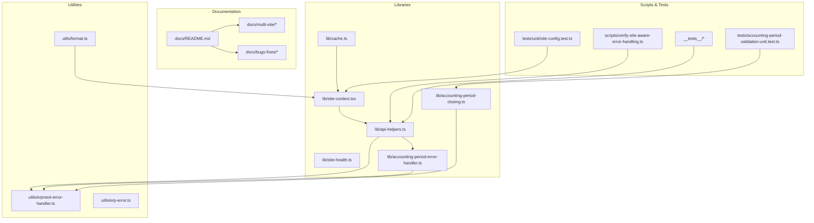
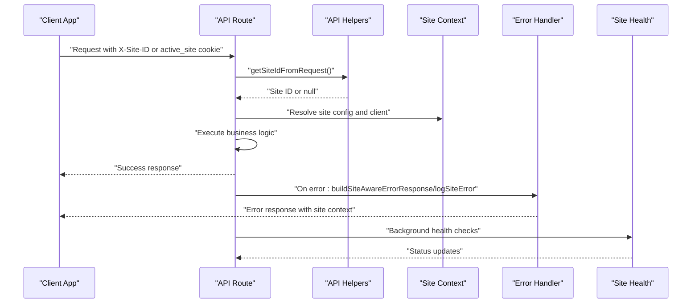
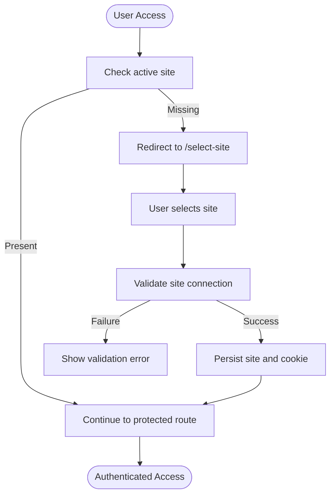
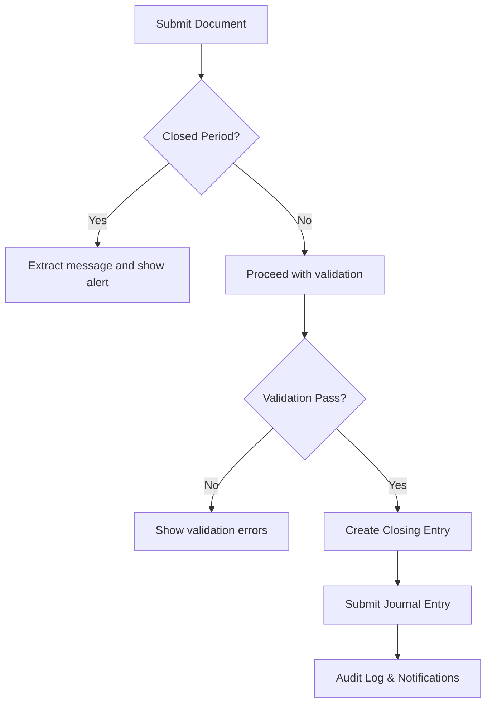
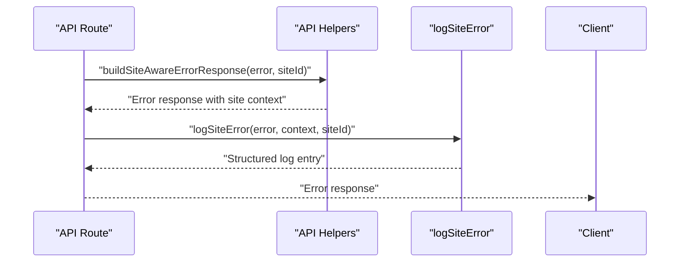
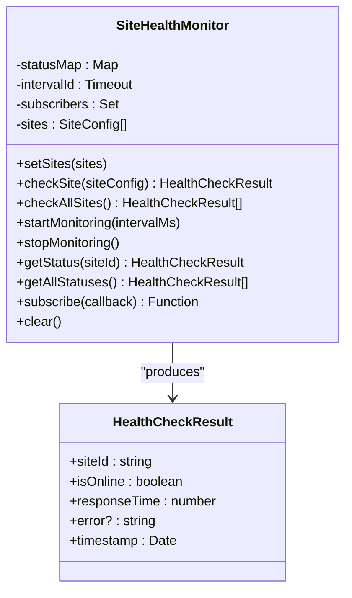
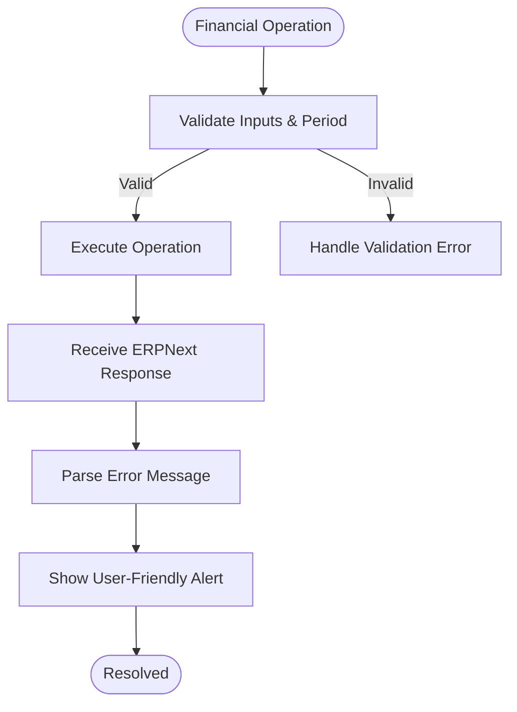
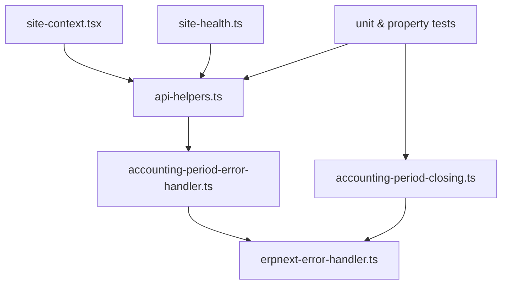

# Troubleshooting and Maintenance

<cite>
**Referenced Files in This Document**
- [docs/README.md](file://docs/README.md)
- [docs/multi-site/MULTI_SITE_FLOW.md](file://docs/multi-site/MULTI_SITE_FLOW.md)
- [docs/multi-site/site-aware-error-handling-coverage.md](file://docs/multi-site/site-aware-error-handling-coverage.md)
- [docs/bugs-fixes/closed-period-error-handling.md](file://docs/bugs-fixes/closed-period-error-handling.md)
- [lib/accounting-period-error-handler.ts](file://lib/accounting-period-error-handler.ts)
- [lib/accounting-period-closing.ts](file://lib/accounting-period-closing.ts)
- [lib/site-health.ts](file://lib/site-health.ts)
- [lib/site-context.tsx](file://lib/site-context.tsx)
- [lib/api-helpers.ts](file://lib/api-helpers.ts)
- [utils/erpnext-error-handler.ts](file://utils/erpnext-error-handler.ts)
- [utils/erp-error.ts](file://utils/erp-error.ts)
- [scripts/verify-site-aware-error-handling.ts](file://scripts/verify-site-aware-error-handling.ts)
- [__tests__/api-routes-error-response-site-context.pbt.test.ts](file://__tests__/api-routes-error-response-site-context.pbt.test.ts)
- [__tests__/api-routes-error-log-site-context.pbt.test.ts](file://__tests__/api-routes-error-log-site-context.pbt.test.ts)
- [tests/unit/site-config.test.ts](file://tests/unit/site-config.test.ts)
- [tests/accounting-period-validation-unit.test.ts](file://tests/accounting-period-validation-unit.test.ts)
- [lib/cache.ts](file://lib/cache.ts)
- [utils/format.ts](file://utils/format.ts)
</cite>

## Table of Contents
1. [Introduction](#introduction)
2. [Project Structure](#project-structure)
3. [Core Components](#core-components)
4. [Architecture Overview](#architecture-overview)
5. [Detailed Component Analysis](#detailed-component-analysis)
6. [Dependency Analysis](#dependency-analysis)
7. [Performance Considerations](#performance-considerations)
8. [Troubleshooting Guide](#troubleshooting-guide)
9. [Conclusion](#conclusion)
10. [Appendices](#appendices)

## Introduction
This document provides comprehensive troubleshooting and maintenance guidance for the ERPNext system. It focuses on diagnosing and resolving issues across multi-site environments, accounting period operations, financial document workflows, and reporting systems. It also covers error handling strategies, diagnostic tools, performance monitoring, maintenance procedures, escalation workflows, and proactive care practices.

## Project Structure
The repository organizes documentation and implementation artifacts to support multi-site operations, accounting period workflows, and robust error handling. Key areas include:
- Multi-site setup and runtime behavior
- Accounting period closing and validation
- Site-aware error handling and logging
- Health monitoring and diagnostics
- Formatting utilities and caching strategies

**Diagram sources**
- [docs/README.md](file://docs/README.md#L1-L125)
- [lib/site-context.tsx](file://lib/site-context.tsx#L1-L353)
- [lib/site-health.ts](file://lib/site-health.ts#L1-L409)
- [lib/api-helpers.ts](file://lib/api-helpers.ts#L1-L186)
- [lib/accounting-period-error-handler.ts](file://lib/accounting-period-error-handler.ts#L1-L552)
- [lib/accounting-period-closing.ts](file://lib/accounting-period-closing.ts#L1-L406)
- [lib/cache.ts](file://lib/cache.ts#L1-L95)
- [utils/erpnext-error-handler.ts](file://utils/erpnext-error-handler.ts#L1-L186)
- [utils/erp-error.ts](file://utils/erp-error.ts#L1-L51)
- [utils/format.ts](file://utils/format.ts#L1-L102)
- [scripts/verify-site-aware-error-handling.ts](file://scripts/verify-site-aware-error-handling.ts#L1-L309)
- [__tests__/api-routes-error-response-site-context.pbt.test.ts](file://__tests__/api-routes-error-response-site-context.pbt.test.ts#L1-L511)
- [__tests__/api-routes-error-log-site-context.pbt.test.ts](file://__tests__/api-routes-error-log-site-context.pbt.test.ts#L1-L629)
- [tests/unit/site-config.test.ts](file://tests/unit/site-config.test.ts#L1-L504)
- [tests/accounting-period-validation-unit.test.ts](file://tests/accounting-period-validation-unit.test.ts#L1-L449)

**Section sources**
- [docs/README.md](file://docs/README.md#L1-L125)

## Core Components
- Multi-site context provider and site selection flow
- Site-aware API helpers for error handling and logging
- Accounting period error handling and closing utilities
- Site health monitoring and diagnostics
- Formatting utilities and caching strategies
- Comprehensive test suites validating error handling and validation logic

**Section sources**
- [lib/site-context.tsx](file://lib/site-context.tsx#L1-L353)
- [lib/api-helpers.ts](file://lib/api-helpers.ts#L1-L186)
- [lib/accounting-period-error-handler.ts](file://lib/accounting-period-error-handler.ts#L1-L552)
- [lib/site-health.ts](file://lib/site-health.ts#L1-L409)
- [utils/erpnext-error-handler.ts](file://utils/erpnext-error-handler.ts#L1-L186)
- [utils/format.ts](file://utils/format.ts#L1-L102)
- [lib/cache.ts](file://lib/cache.ts#L1-L95)

## Architecture Overview
The system integrates multi-site awareness into API routes and front-end components. Site context is extracted from requests and cookies, and errors are handled consistently with site-aware responses and logs. Accounting period operations include validation, closing journal creation, and audit logging. Health monitoring provides background checks and status persistence.

**Diagram sources**
- [lib/api-helpers.ts](file://lib/api-helpers.ts#L30-L103)
- [lib/site-context.tsx](file://lib/site-context.tsx#L152-L184)
- [lib/accounting-period-error-handler.ts](file://lib/accounting-period-error-handler.ts#L114-L156)
- [lib/site-health.ts](file://lib/site-health.ts#L202-L213)

## Detailed Component Analysis

### Multi-Site Troubleshooting and Maintenance
Common issues include site selection loops, missing company names, and connectivity validation failures. The site context provider manages active site persistence and switching, while the site selector page validates connections and displays health indicators.

**Diagram sources**
- [docs/multi-site/MULTI_SITE_FLOW.md](file://docs/multi-site/MULTI_SITE_FLOW.md#L12-L31)
- [lib/site-context.tsx](file://lib/site-context.tsx#L152-L184)
- [tests/unit/site-config.test.ts](file://tests/unit/site-config.test.ts#L299-L340)

**Section sources**
- [docs/multi-site/MULTI_SITE_FLOW.md](file://docs/multi-site/MULTI_SITE_FLOW.md#L280-L334)
- [lib/site-context.tsx](file://lib/site-context.tsx#L1-L353)
- [tests/unit/site-config.test.ts](file://tests/unit/site-config.test.ts#L1-L504)

### Accounting Period Errors and Closing
Issues often involve closed period errors, validation failures, and journal entry creation problems. The centralized error handler maps domain-specific errors to user-friendly messages, while closing utilities compute balances and generate closing entries.

**Diagram sources**
- [docs/bugs-fixes/closed-period-error-handling.md](file://docs/bugs-fixes/closed-period-error-handling.md#L95-L136)
- [lib/accounting-period-error-handler.ts](file://lib/accounting-period-error-handler.ts#L119-L163)
- [lib/accounting-period-closing.ts](file://lib/accounting-period-closing.ts#L159-L247)

**Section sources**
- [docs/bugs-fixes/closed-period-error-handling.md](file://docs/bugs-fixes/closed-period-error-handling.md#L1-L180)
- [lib/accounting-period-error-handler.ts](file://lib/accounting-period-error-handler.ts#L1-L552)
- [lib/accounting-period-closing.ts](file://lib/accounting-period-closing.ts#L1-L406)
- [tests/accounting-period-validation-unit.test.ts](file://tests/accounting-period-validation-unit.test.ts#L1-L449)

### Site-Aware Error Handling and Logging
Site-aware error handling ensures error responses and logs include site context. Property-based tests validate that site context is preserved across error types and response/log formats.

**Diagram sources**
- [lib/api-helpers.ts](file://lib/api-helpers.ts#L114-L185)
- [__tests__/api-routes-error-response-site-context.pbt.test.ts](file://__tests__/api-routes-error-response-site-context.pbt.test.ts#L50-L92)
- [__tests__/api-routes-error-log-site-context.pbt.test.ts](file://__tests__/api-routes-error-log-site-context.pbt.test.ts#L88-L109)

**Section sources**
- [lib/api-helpers.ts](file://lib/api-helpers.ts#L1-L186)
- [docs/multi-site/site-aware-error-handling-coverage.md](file://docs/multi-site/site-aware-error-handling-coverage.md#L1-L334)
- [scripts/verify-site-aware-error-handling.ts](file://scripts/verify-site-aware-error-handling.ts#L1-L309)
- [__tests__/api-routes-error-response-site-context.pbt.test.ts](file://__tests__/api-routes-error-response-site-context.pbt.test.ts#L1-L511)
- [__tests__/api-routes-error-log-site-context.pbt.test.ts](file://__tests__/api-routes-error-log-site-context.pbt.test.ts#L1-L629)

### Site Health Monitoring and Diagnostics
Site health monitoring performs periodic checks against configured sites, tracks consecutive failures, persists status, and notifies subscribers. It supports both browser and server-side checks and integrates with a backend API to avoid CORS issues.

**Diagram sources**
- [lib/site-health.ts](file://lib/site-health.ts#L10-L285)

**Section sources**
- [lib/site-health.ts](file://lib/site-health.ts#L1-L409)

### Financial Operations and Reporting Failures
Financial operations commonly fail due to closed periods, validation errors, or data inconsistencies. The error handler extracts meaningful messages from ERPNext responses and provides actionable guidance. Formatting utilities ensure consistent display and parsing of dates, currencies, and addresses.

**Diagram sources**
- [utils/erpnext-error-handler.ts](file://utils/erpnext-error-handler.ts#L11-L186)
- [utils/erp-error.ts](file://utils/erp-error.ts#L5-L51)
- [utils/format.ts](file://utils/format.ts#L26-L101)

**Section sources**
- [utils/erpnext-error-handler.ts](file://utils/erpnext-error-handler.ts#L1-L186)
- [utils/erp-error.ts](file://utils/erp-error.ts#L1-L51)
- [utils/format.ts](file://utils/format.ts#L1-L102)

## Dependency Analysis
The system exhibits clear separation of concerns:
- Site context and health depend on environment configuration and local storage
- API routes depend on site-aware helpers for client instantiation and error handling
- Accounting period utilities depend on ERPNext client for GL queries and submissions
- Tests validate site-aware error handling and validation logic

**Diagram sources**
- [lib/site-context.tsx](file://lib/site-context.tsx#L1-L353)
- [lib/api-helpers.ts](file://lib/api-helpers.ts#L1-L186)
- [lib/accounting-period-error-handler.ts](file://lib/accounting-period-error-handler.ts#L1-L552)
- [utils/erpnext-error-handler.ts](file://utils/erpnext-error-handler.ts#L1-L186)
- [lib/site-health.ts](file://lib/site-health.ts#L1-L409)
- [lib/accounting-period-closing.ts](file://lib/accounting-period-closing.ts#L1-L406)
- [tests/unit/site-config.test.ts](file://tests/unit/site-config.test.ts#L1-L504)
- [tests/accounting-period-validation-unit.test.ts](file://tests/accounting-period-validation-unit.test.ts#L1-L449)

**Section sources**
- [lib/site-context.tsx](file://lib/site-context.tsx#L1-L353)
- [lib/api-helpers.ts](file://lib/api-helpers.ts#L1-L186)
- [lib/accounting-period-error-handler.ts](file://lib/accounting-period-error-handler.ts#L1-L552)
- [utils/erpnext-error-handler.ts](file://utils/erpnext-error-handler.ts#L1-L186)
- [lib/site-health.ts](file://lib/site-health.ts#L1-L409)
- [lib/accounting-period-closing.ts](file://lib/accounting-period-closing.ts#L1-L406)
- [tests/unit/site-config.test.ts](file://tests/unit/site-config.test.ts#L1-L504)
- [tests/accounting-period-validation-unit.test.ts](file://tests/accounting-period-validation-unit.test.ts#L1-L449)

## Performance Considerations
- Caching: In-memory caches with TTL reduce repeated API calls for static data (tax templates, payment terms, warehouses, items, customers/suppliers).
- Formatting: Efficient formatting utilities minimize DOM manipulation and string processing overhead.
- Health Monitoring: Background checks are scheduled with configurable intervals to balance responsiveness and resource usage.

Recommendations:
- Tune cache TTLs based on data volatility.
- Monitor cache hit rates and adjust TTLs accordingly.
- Use health check intervals aligned with SLAs and site traffic patterns.

**Section sources**
- [lib/cache.ts](file://lib/cache.ts#L1-L95)
- [utils/format.ts](file://utils/format.ts#L1-L102)
- [lib/site-health.ts](file://lib/site-health.ts#L202-L213)

## Troubleshooting Guide

### Multi-Site Issues
Symptoms:
- Redirect loop to /select-site
- Company name shows "Unknown"
- Site does not appear in list

Resolution steps:
- Clear browser localStorage and reload to reset active site
- Verify site credentials and connectivity
- Confirm site is added via UI and validated

**Section sources**
- [docs/multi-site/MULTI_SITE_FLOW.md](file://docs/multi-site/MULTI_SITE_FLOW.md#L280-L334)
- [tests/unit/site-config.test.ts](file://tests/unit/site-config.test.ts#L400-L435)

### Accounting Period Errors
Symptoms:
- Closed period error when creating documents
- Validation failures preventing closing

Resolution steps:
- Adjust posting date to an open period
- Review validation results and resolve flagged issues
- Use audit logs to track closure actions

**Section sources**
- [docs/bugs-fixes/closed-period-error-handling.md](file://docs/bugs-fixes/closed-period-error-handling.md#L95-L136)
- [tests/accounting-period-validation-unit.test.ts](file://tests/accounting-period-validation-unit.test.ts#L95-L290)

### Financial Operations Problems
Symptoms:
- Generic error popups with unclear causes
- Inconsistent error messages

Resolution steps:
- Use the error handler to extract and display user-friendly messages
- Inspect console logs for structured error entries with site context
- Validate input formats using formatting utilities

**Section sources**
- [utils/erpnext-error-handler.ts](file://utils/erpnext-error-handler.ts#L11-L186)
- [utils/erp-error.ts](file://utils/erp-error.ts#L5-L51)
- [__tests__/api-routes-error-log-site-context.pbt.test.ts](file://__tests__/api-routes-error-log-site-context.pbt.test.ts#L161-L235)

### Reporting Failures
Symptoms:
- Reports not displaying expected data
- Formatting inconsistencies

Resolution steps:
- Verify date parsing and currency formatting
- Check cache invalidation for dynamic reports
- Validate report filters and permissions

**Section sources**
- [utils/format.ts](file://utils/format.ts#L26-L101)
- [lib/cache.ts](file://lib/cache.ts#L53-L75)

### System Health Checks
- Monitor site availability and response times
- Investigate consecutive failures and persistent offline states
- Subscribe to health updates for proactive alerts

**Section sources**
- [lib/site-health.ts](file://lib/site-health.ts#L1-L409)

### Escalation Procedures and Support Workflows
- Use property-based tests to validate site-aware error handling and logging
- Generate coverage reports to identify non-compliant routes
- Document error classifications and retry strategies for transient errors

**Section sources**
- [scripts/verify-site-aware-error-handling.ts](file://scripts/verify-site-aware-error-handling.ts#L1-L309)
- [docs/multi-site/site-aware-error-handling-coverage.md](file://docs/multi-site/site-aware-error-handling-coverage.md#L1-L334)
- [lib/accounting-period-error-handler.ts](file://lib/accounting-period-error-handler.ts#L308-L380)

### Knowledge Base Maintenance
- Maintain documentation categories and update as new issues arise
- Track closed period error handling implementations across documents
- Preserve test coverage for error handling and validation logic

**Section sources**
- [docs/README.md](file://docs/README.md#L1-L125)
- [docs/bugs-fixes/closed-period-error-handling.md](file://docs/bugs-fixes/closed-period-error-handling.md#L164-L180)

## Conclusion
This troubleshooting and maintenance guide consolidates strategies for diagnosing and resolving issues across multi-site operations, accounting periods, financial workflows, and reporting systems. By leveraging site-aware error handling, health monitoring, validation tests, and formatting utilities, teams can maintain system reliability, improve user experience, and streamline support processes.

## Appendices

### Diagnostic Tools and Scripts
- Property-based tests validate site context in error responses and logs
- Verification script audits API routes for site-aware error handling compliance
- Health monitor provides background checks and status persistence

**Section sources**
- [__tests__/api-routes-error-response-site-context.pbt.test.ts](file://__tests__/api-routes-error-response-site-context.pbt.test.ts#L1-L511)
- [__tests__/api-routes-error-log-site-context.pbt.test.ts](file://__tests__/api-routes-error-log-site-context.pbt.test.ts#L1-L629)
- [scripts/verify-site-aware-error-handling.ts](file://scripts/verify-site-aware-error-handling.ts#L1-L309)
- [lib/site-health.ts](file://lib/site-health.ts#L1-L409)