# Dialog Components

<cite>
**Referenced Files in This Document**
- [AccountSearchDialog.tsx](file://components/AccountSearchDialog.tsx)
- [CustomerDialog.tsx](file://app/components/CustomerDialog.tsx)
- [ItemDialog.tsx](file://app/components/ItemDialog.tsx)
- [SalesInvoiceDialog.tsx](file://components/credit-note/SalesInvoiceDialog.tsx)
- [PurchaseInvoiceDialog.tsx](file://components/debit-note/PurchaseInvoiceDialog.tsx)
- [PurchaseReceiptDialog.tsx](file://components/purchase-return/PurchaseReceiptDialog.tsx)
- [SearchableSelectDialog.tsx](file://app/components/SearchableSelectDialog.tsx)
- [PaymentCustomerDialog.tsx](file://app/components/PaymentCustomerDialog.tsx)
- [PaymentSupplierDialog.tsx](file://app/components/PaymentSupplierDialog.tsx)
- [credit-note.ts](file://types/credit-note.ts)
- [debit-note.ts](file://types/debit-note.ts)
- [purchase-return.ts](file://types/purchase-return.ts)
</cite>

## Table of Contents
1. [Introduction](#introduction)
2. [Project Structure](#project-structure)
3. [Core Components](#core-components)
4. [Architecture Overview](#architecture-overview)
5. [Detailed Component Analysis](#detailed-component-analysis)
6. [Dependency Analysis](#dependency-analysis)
7. [Performance Considerations](#performance-considerations)
8. [Troubleshooting Guide](#troubleshooting-guide)
9. [Conclusion](#conclusion)

## Introduction
This document describes the dialog components used for search, selection, and confirmation workflows across the ERP system. It covers:
- AccountSearchDialog for financial account lookup
- CustomerDialog for customer selection
- ItemDialog for inventory item selection
- Specialized dialogs: SalesInvoiceDialog, PurchaseInvoiceDialog, and PurchaseReceiptDialog
It explains dialog lifecycle, modal behavior, search functionality, data binding patterns, integration examples, event handling, state management, accessibility, keyboard navigation, and responsive behavior.

## Project Structure
The dialog components are organized by domain and shared patterns:
- Shared dialogs under app/components: CustomerDialog, ItemDialog, SearchableSelectDialog, PaymentCustomerDialog, PaymentSupplierDialog
- Domain-specific dialogs under components: AccountSearchDialog, SalesInvoiceDialog, PurchaseInvoiceDialog, PurchaseReceiptDialog
- Type definitions under types for specialized workflows (credit note, debit note, purchase return)

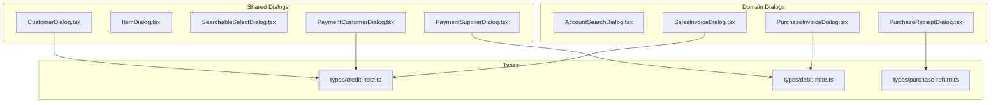

**Diagram sources**
- [CustomerDialog.tsx](file://app/components/CustomerDialog.tsx#L1-L213)
- [ItemDialog.tsx](file://app/components/ItemDialog.tsx#L1-L213)
- [SearchableSelectDialog.tsx](file://app/components/SearchableSelectDialog.tsx#L1-L105)
- [PaymentCustomerDialog.tsx](file://app/components/PaymentCustomerDialog.tsx#L1-L222)
- [PaymentSupplierDialog.tsx](file://app/components/PaymentSupplierDialog.tsx#L1-L128)
- [AccountSearchDialog.tsx](file://components/AccountSearchDialog.tsx#L1-L130)
- [SalesInvoiceDialog.tsx](file://components/credit-note/SalesInvoiceDialog.tsx#L1-L267)
- [PurchaseInvoiceDialog.tsx](file://components/debit-note/PurchaseInvoiceDialog.tsx#L1-L352)
- [PurchaseReceiptDialog.tsx](file://components/purchase-return/PurchaseReceiptDialog.tsx#L1-L360)
- [credit-note.ts](file://types/credit-note.ts#L1-L278)
- [debit-note.ts](file://types/debit-note.ts#L1-L272)
- [purchase-return.ts](file://types/purchase-return.ts#L1-L276)

**Section sources**
- [AccountSearchDialog.tsx](file://components/AccountSearchDialog.tsx#L1-L130)
- [CustomerDialog.tsx](file://app/components/CustomerDialog.tsx#L1-L213)
- [ItemDialog.tsx](file://app/components/ItemDialog.tsx#L1-L213)
- [SalesInvoiceDialog.tsx](file://components/credit-note/SalesInvoiceDialog.tsx#L1-L267)
- [PurchaseInvoiceDialog.tsx](file://components/debit-note/PurchaseInvoiceDialog.tsx#L1-L352)
- [PurchaseReceiptDialog.tsx](file://components/purchase-return/PurchaseReceiptDialog.tsx#L1-L360)
- [SearchableSelectDialog.tsx](file://app/components/SearchableSelectDialog.tsx#L1-L105)
- [PaymentCustomerDialog.tsx](file://app/components/PaymentCustomerDialog.tsx#L1-L222)
- [PaymentSupplierDialog.tsx](file://app/components/PaymentSupplierDialog.tsx#L1-L128)
- [credit-note.ts](file://types/credit-note.ts#L1-L278)
- [debit-note.ts](file://types/debit-note.ts#L1-L272)
- [purchase-return.ts](file://types/purchase-return.ts#L1-L276)

## Core Components
- AccountSearchDialog: Modal for selecting a financial account by number/name with live filtering and current selection highlighting.
- CustomerDialog: Modal for selecting a customer with debounced search, loading/error states, and fallback client-side filtering.
- ItemDialog: Modal for selecting an inventory item with dual filters (code/name), optional stock availability, and item details.
- SalesInvoiceDialog: Modal for selecting a paid Sales Invoice to create a Credit Note, with search and filters.
- PurchaseInvoiceDialog: Modal for selecting a paid Purchase Invoice to create a Debit Note, with advanced filters and keyboard support.
- PurchaseReceiptDialog: Modal for selecting a Purchase Receipt to create a Purchase Return, with advanced filters and keyboard support.
- SearchableSelectDialog: Generic searchable selection dialog for arbitrary option sets.
- PaymentCustomerDialog and PaymentSupplierDialog: Payment-related selection dialogs with optional company scoping.

Key patterns:
- Props contract: isOpen, onClose, onSelect
- Controlled state via props and local state
- Debounced search for remote APIs
- Loading/error states and user-friendly fallbacks
- Accessibility: roles, labels, keyboard navigation

**Section sources**
- [AccountSearchDialog.tsx](file://components/AccountSearchDialog.tsx#L11-L27)
- [CustomerDialog.tsx](file://app/components/CustomerDialog.tsx#L10-L14)
- [ItemDialog.tsx](file://app/components/ItemDialog.tsx#L23-L28)
- [SalesInvoiceDialog.tsx](file://components/credit-note/SalesInvoiceDialog.tsx#L16-L21)
- [PurchaseInvoiceDialog.tsx](file://components/debit-note/PurchaseInvoiceDialog.tsx#L8-L14)
- [PurchaseReceiptDialog.tsx](file://components/purchase-return/PurchaseReceiptDialog.tsx#L8-L14)
- [SearchableSelectDialog.tsx](file://app/components/SearchableSelectDialog.tsx#L5-L13)
- [PaymentCustomerDialog.tsx](file://app/components/PaymentCustomerDialog.tsx#L10-L15)
- [PaymentSupplierDialog.tsx](file://app/components/PaymentSupplierDialog.tsx#L10-L15)

## Architecture Overview
Dialogs follow a consistent pattern:
- Modal backdrop and container
- Header with title and close action
- Search/filter controls
- Results list with selection handlers
- Footer with actions

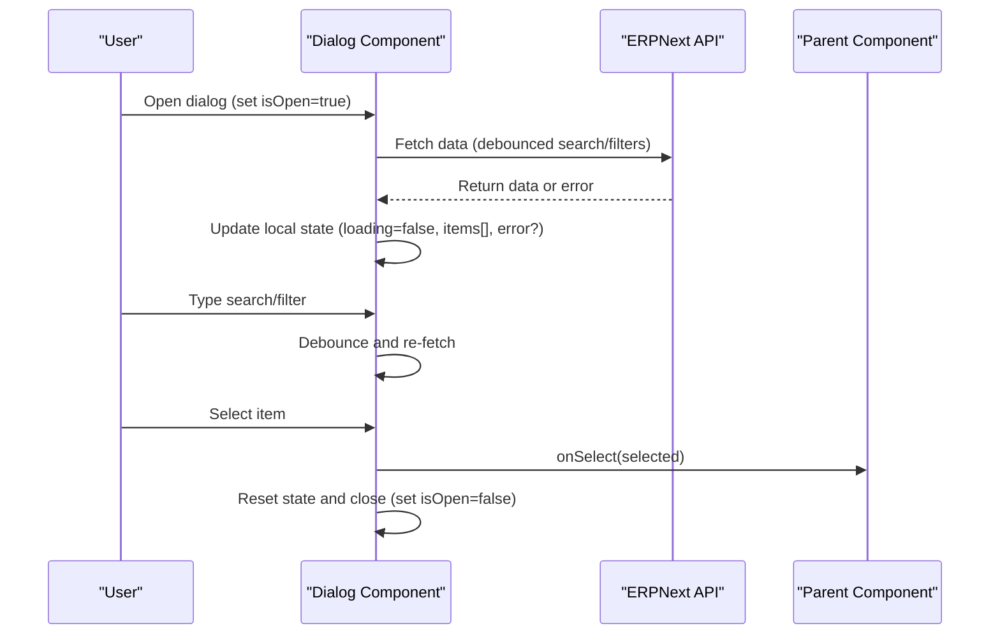

**Diagram sources**
- [CustomerDialog.tsx](file://app/components/CustomerDialog.tsx#L41-L113)
- [ItemDialog.tsx](file://app/components/ItemDialog.tsx#L52-L80)
- [SalesInvoiceDialog.tsx](file://components/credit-note/SalesInvoiceDialog.tsx#L49-L122)
- [PurchaseInvoiceDialog.tsx](file://components/debit-note/PurchaseInvoiceDialog.tsx#L37-L91)
- [PurchaseReceiptDialog.tsx](file://components/purchase-return/PurchaseReceiptDialog.tsx#L37-L99)

## Detailed Component Analysis

### AccountSearchDialog
- Purpose: Select a financial account by number or name.
- Lifecycle: Renders only when isOpen is true; clears search on selection; highlights current selection.
- Search: Live filter across account number, account name, and full name.
- Data binding: Receives accounts array and currentValue; onSelect returns the selected account name.
- Accessibility: Close button, autoFocus on input.

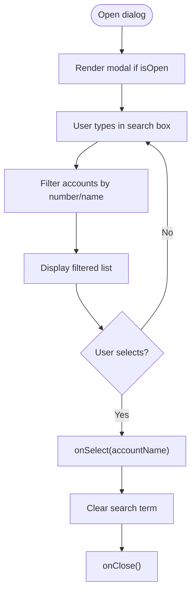

**Diagram sources**
- [AccountSearchDialog.tsx](file://components/AccountSearchDialog.tsx#L28-L51)

**Section sources**
- [AccountSearchDialog.tsx](file://components/AccountSearchDialog.tsx#L1-L130)

### CustomerDialog
- Purpose: Select a customer with robust search and fallback behavior.
- Lifecycle: Fetches data when opened; debounces search terms; handles network and API errors.
- Search: Debounced remote search; falls back to client-side filtering if server returns empty results.
- Data binding: onSelect receives the selected customer object; onClose resets filters and clears error.
- Accessibility: Close button; loading and error states with retry.

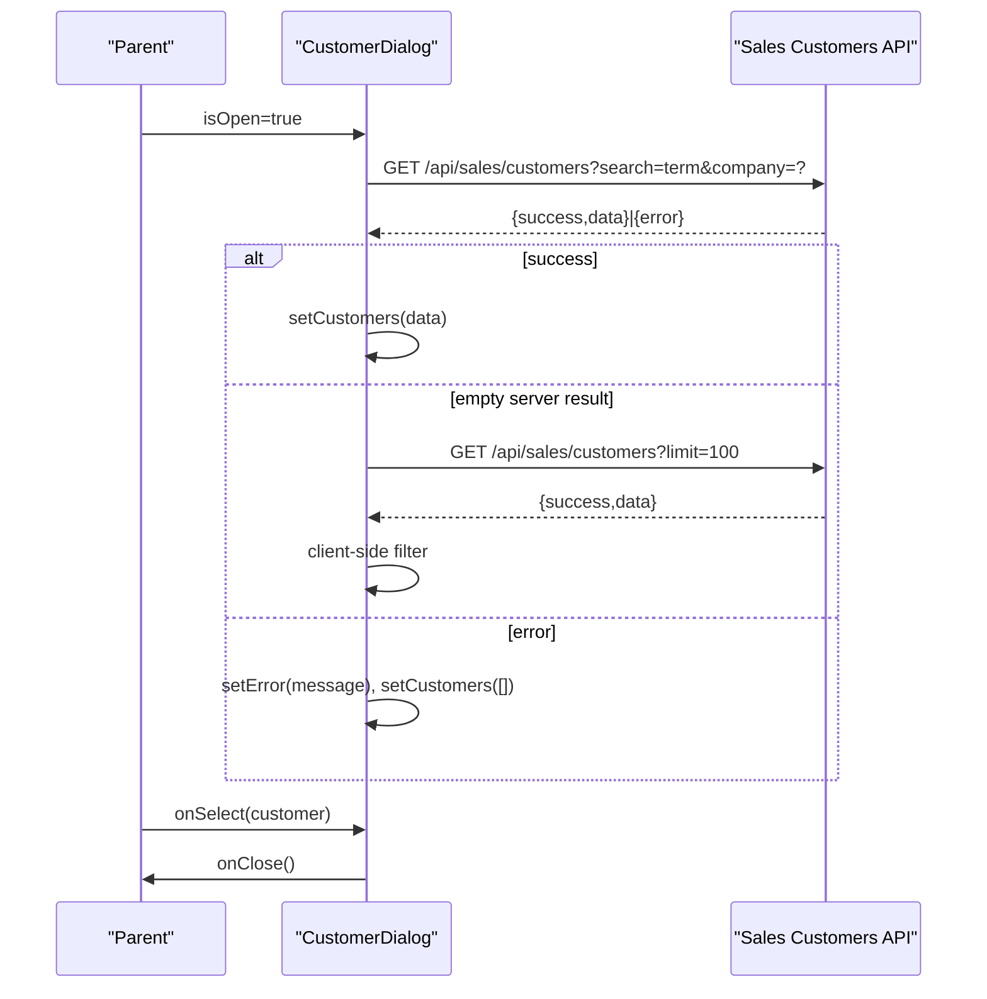

**Diagram sources**
- [CustomerDialog.tsx](file://app/components/CustomerDialog.tsx#L41-L113)

**Section sources**
- [CustomerDialog.tsx](file://app/components/CustomerDialog.tsx#L1-L213)

### ItemDialog
- Purpose: Select an inventory item with optional stock visibility.
- Lifecycle: Fetches items when opened; supports dual filters (item_code, item_name).
- Stock: Optional stock checks per item; aggregates available quantities.
- Data binding: onSelect returns the selected item; onClose clears filters.
- Responsive: Grid layout for filters; scrollable results.

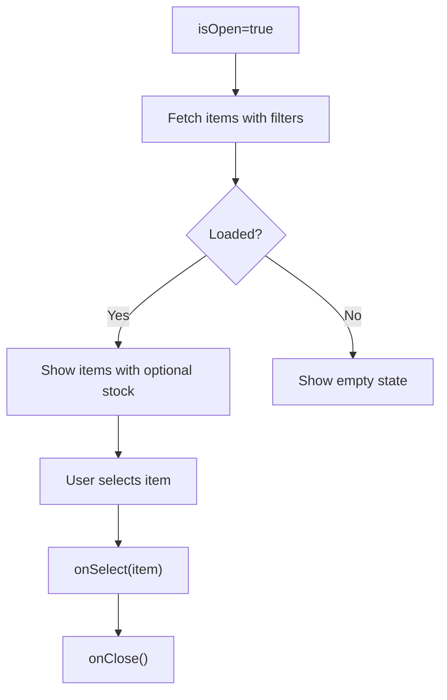

**Diagram sources**
- [ItemDialog.tsx](file://app/components/ItemDialog.tsx#L52-L93)

**Section sources**
- [ItemDialog.tsx](file://app/components/ItemDialog.tsx#L1-L213)

### SalesInvoiceDialog
- Purpose: Select a paid Sales Invoice to create a Credit Note.
- Lifecycle: Loads invoices when opened and company is set; filters out invoices with existing returns.
- Search: Local search by invoice number and customer name.
- Data binding: onSelect receives the full invoice details (with items) or falls back to the base invoice.
- Accessibility: Dialog role, close button, search icon.

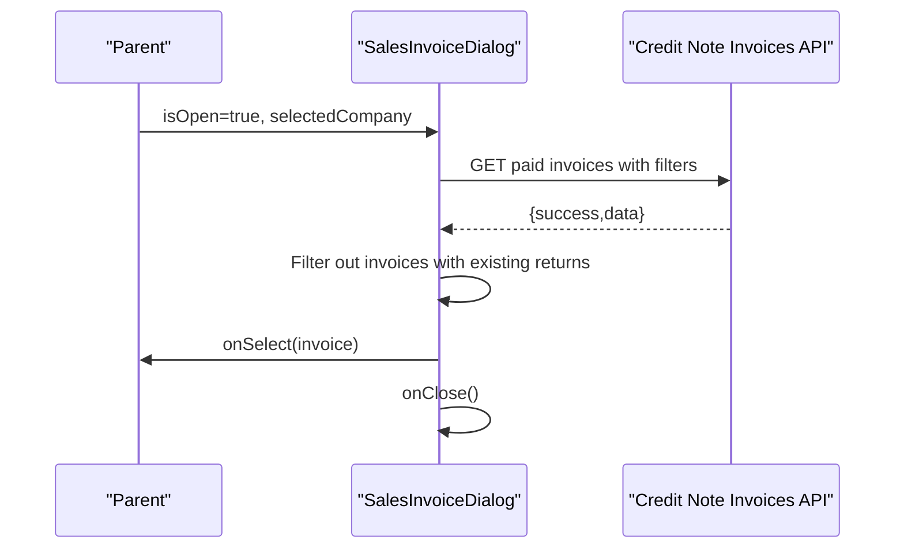

**Diagram sources**
- [SalesInvoiceDialog.tsx](file://components/credit-note/SalesInvoiceDialog.tsx#L49-L140)
- [credit-note.ts](file://types/credit-note.ts#L186-L203)

**Section sources**
- [SalesInvoiceDialog.tsx](file://components/credit-note/SalesInvoiceDialog.tsx#L1-L267)
- [credit-note.ts](file://types/credit-note.ts#L1-L278)

### PurchaseInvoiceDialog
- Purpose: Select a paid Purchase Invoice to create a Debit Note.
- Lifecycle: Supports filters (supplier, document number, date range), debounced fetch, keyboard navigation (Escape/Enter), and controlled selection state.
- Search: Remote search with multiple filter parameters.
- Data binding: onSelect(selectedInvoice) followed by onClose; onClose clears filters and selection.
- Accessibility: Dialog role, aria-modal, aria-labelledby, aria-pressed, focus management.

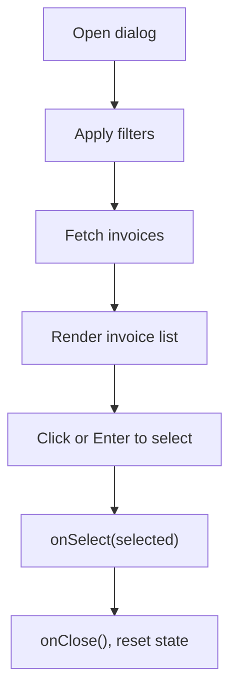

**Diagram sources**
- [PurchaseInvoiceDialog.tsx](file://components/debit-note/PurchaseInvoiceDialog.tsx#L37-L121)
- [debit-note.ts](file://types/debit-note.ts#L183-L198)

**Section sources**
- [PurchaseInvoiceDialog.tsx](file://components/debit-note/PurchaseInvoiceDialog.tsx#L1-L352)
- [debit-note.ts](file://types/debit-note.ts#L1-L272)

### PurchaseReceiptDialog
- Purpose: Select a Purchase Receipt to create a Purchase Return.
- Lifecycle: Supports filters (supplier, document number, date range), debounced fetch, keyboard navigation, and controlled selection state.
- Search: Builds ERPNext-style filters and applies them remotely.
- Data binding: onSelect(selectedReceipt) followed by onClose; onClose clears filters and selection.
- Accessibility: Dialog role, aria-modal, aria-labelledby, focus management.

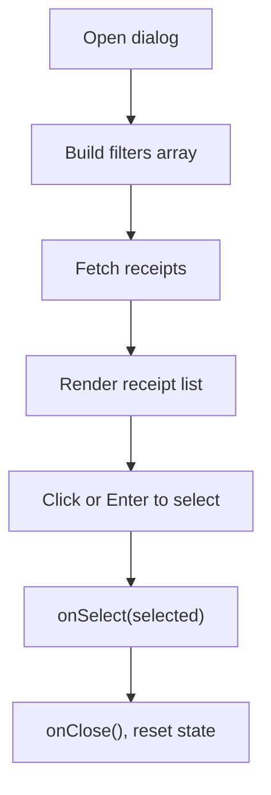

**Diagram sources**
- [PurchaseReceiptDialog.tsx](file://components/purchase-return/PurchaseReceiptDialog.tsx#L37-L129)
- [purchase-return.ts](file://types/purchase-return.ts#L187-L202)

**Section sources**
- [PurchaseReceiptDialog.tsx](file://components/purchase-return/PurchaseReceiptDialog.tsx#L1-L360)
- [purchase-return.ts](file://types/purchase-return.ts#L1-L276)

### SearchableSelectDialog
- Purpose: Generic dialog for selecting a value from a list of options with search.
- Lifecycle: Renders only when isOpen is true; filters options locally; supports selectedValue highlighting.
- Data binding: onSelect returns the selected option name; onClose clears search.

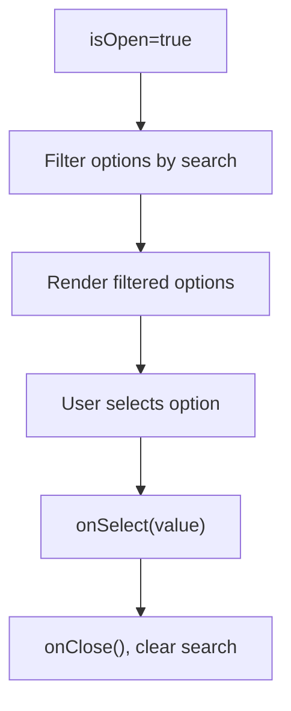

**Diagram sources**
- [SearchableSelectDialog.tsx](file://app/components/SearchableSelectDialog.tsx#L27-L38)

**Section sources**
- [SearchableSelectDialog.tsx](file://app/components/SearchableSelectDialog.tsx#L1-L105)

### PaymentCustomerDialog and PaymentSupplierDialog
- Purpose: Selection dialogs tailored for payment workflows with optional company scoping.
- Patterns: Debounced search (CustomerDialog), remote fetch with company filter, loading and error states, and selection callback.

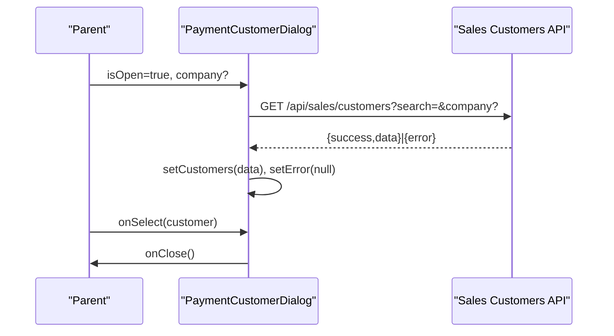

**Diagram sources**
- [PaymentCustomerDialog.tsx](file://app/components/PaymentCustomerDialog.tsx#L42-L125)

**Section sources**
- [PaymentCustomerDialog.tsx](file://app/components/PaymentCustomerDialog.tsx#L1-L222)
- [PaymentSupplierDialog.tsx](file://app/components/PaymentSupplierDialog.tsx#L1-L128)

## Dependency Analysis
- Shared dependencies: React hooks (useState, useEffect, useCallback), fetch-based API calls, debouncing utilities.
- Domain-specific dependencies:
  - SalesInvoiceDialog depends on Credit Note types and Sales Invoice types.
  - PurchaseInvoiceDialog and PurchaseReceiptDialog depend on Debit Note and Purchase Return types respectively.
- Parent components coordinate dialog state (isOpen, onClose, onSelect) and pass data (accounts, company, filters).

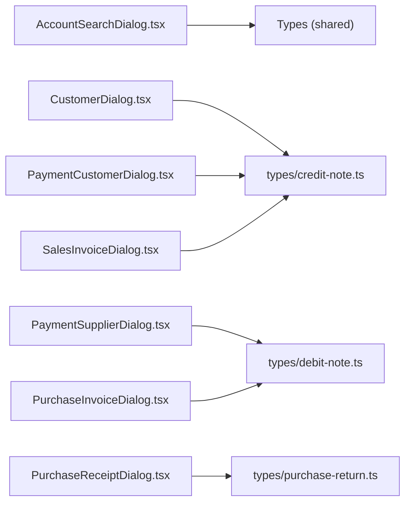

**Diagram sources**
- [AccountSearchDialog.tsx](file://components/AccountSearchDialog.tsx#L1-L130)
- [CustomerDialog.tsx](file://app/components/CustomerDialog.tsx#L1-L213)
- [PaymentCustomerDialog.tsx](file://app/components/PaymentCustomerDialog.tsx#L1-L222)
- [PaymentSupplierDialog.tsx](file://app/components/PaymentSupplierDialog.tsx#L1-L128)
- [SalesInvoiceDialog.tsx](file://components/credit-note/SalesInvoiceDialog.tsx#L1-L267)
- [PurchaseInvoiceDialog.tsx](file://components/debit-note/PurchaseInvoiceDialog.tsx#L1-L352)
- [PurchaseReceiptDialog.tsx](file://components/purchase-return/PurchaseReceiptDialog.tsx#L1-L360)
- [credit-note.ts](file://types/credit-note.ts#L1-L278)
- [debit-note.ts](file://types/debit-note.ts#L1-L272)
- [purchase-return.ts](file://types/purchase-return.ts#L1-L276)

**Section sources**
- [credit-note.ts](file://types/credit-note.ts#L1-L278)
- [debit-note.ts](file://types/debit-note.ts#L1-L272)
- [purchase-return.ts](file://types/purchase-return.ts#L1-L276)

## Performance Considerations
- Debounce search inputs to reduce API calls (CustomerDialog, PaymentCustomerDialog).
- Limit result sets with pagination parameters when supported by APIs.
- Use useMemo for derived data (e.g., filtered accounts) to avoid unnecessary renders.
- Lazy-load stock information only when requested (ItemDialog showStock).
- Avoid heavy computations in render; precompute totals and summaries when possible.
- Prefer controlled components to minimize re-renders in parent contexts.

## Troubleshooting Guide
Common issues and resolutions:
- Empty results after search:
  - Verify server-side filters and fallback client-side filtering (CustomerDialog).
  - Ensure debouncedSearchTerm is properly cleared on select/close.
- Network errors:
  - Display user-friendly error messages and provide retry actions.
  - Log detailed error context (status, message) for debugging.
- Dialog not closing:
  - Confirm that onClose is called after onSelect and state reset.
  - Ensure isOpen prop is toggled by the parent component.
- Keyboard navigation:
  - Implement Escape to close and Enter to confirm selections (PurchaseInvoiceDialog, PurchaseReceiptDialog).
  - Manage focus traps and visible focus indicators.
- Accessibility:
  - Add aria-modal, aria-labelledby, and aria-pressed where applicable.
  - Provide labels for icon-only buttons and ensure screen reader announcements.

**Section sources**
- [CustomerDialog.tsx](file://app/components/CustomerDialog.tsx#L115-L127)
- [PurchaseInvoiceDialog.tsx](file://components/debit-note/PurchaseInvoiceDialog.tsx#L123-L129)
- [PurchaseReceiptDialog.tsx](file://components/purchase-return/PurchaseReceiptDialog.tsx#L131-L137)

## Conclusion
These dialog components provide a consistent, accessible, and efficient way to perform search, selection, and confirmation tasks across the ERP system. By following the documented patterns—controlled state, debounced search, robust error handling, and strong accessibility—the dialogs integrate seamlessly with parent components and maintain a high-quality user experience across devices and interaction modes.