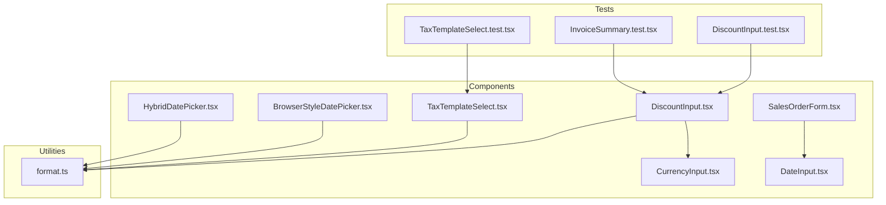
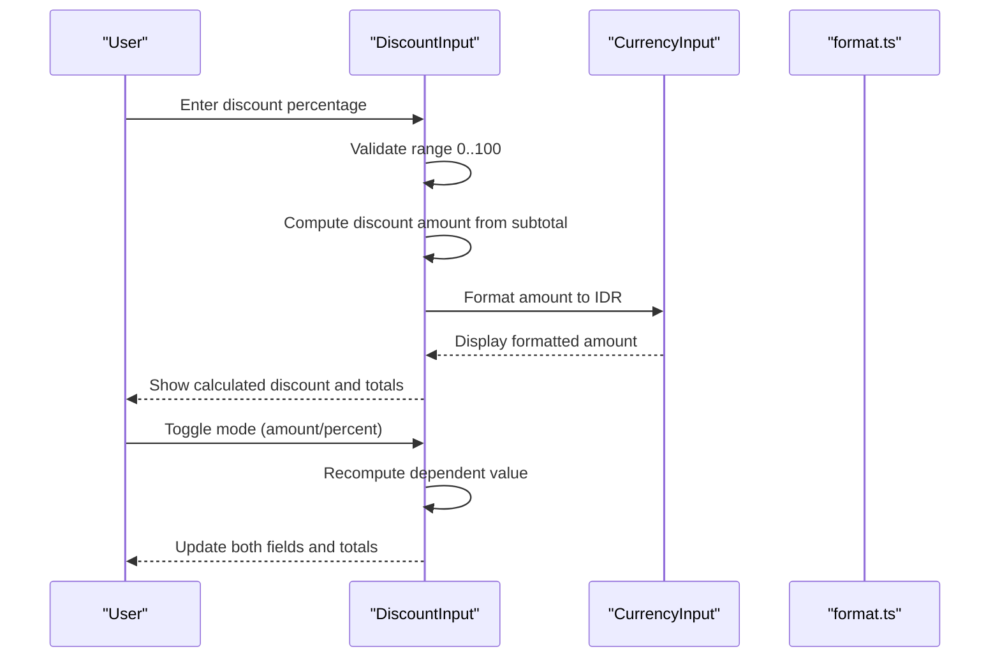
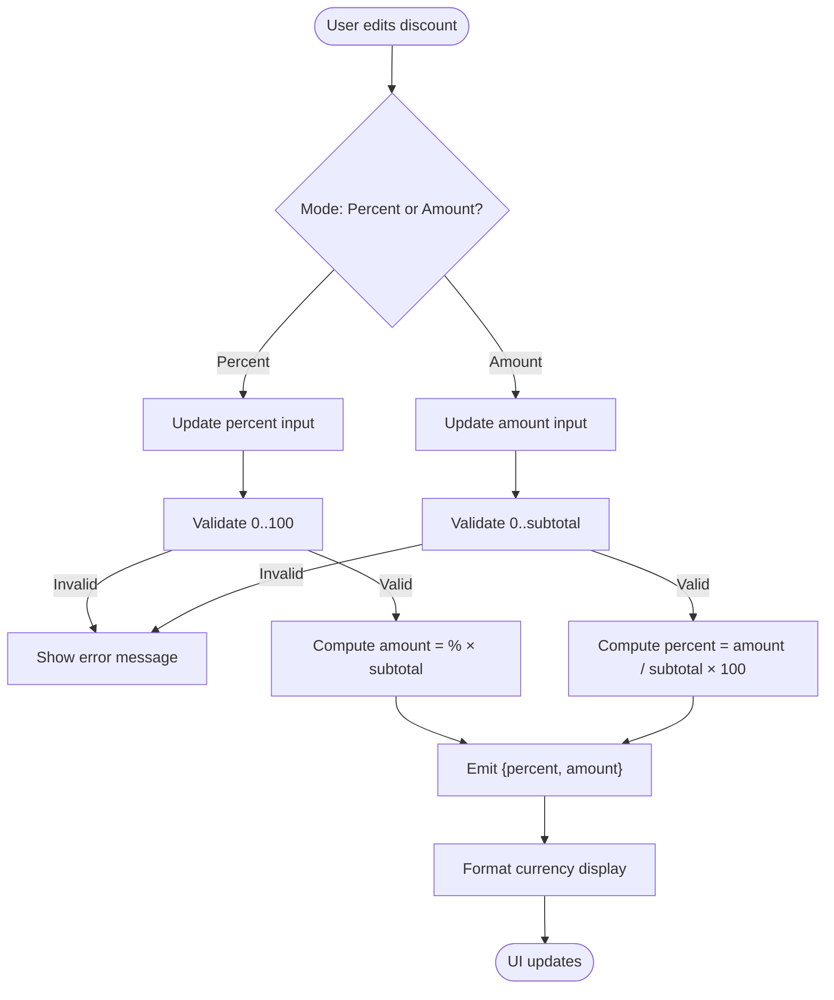
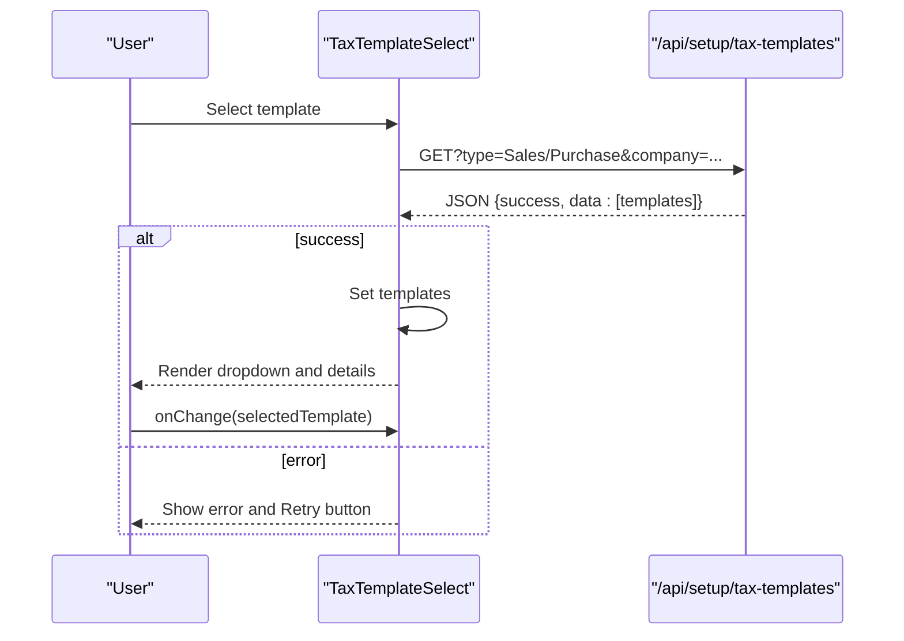
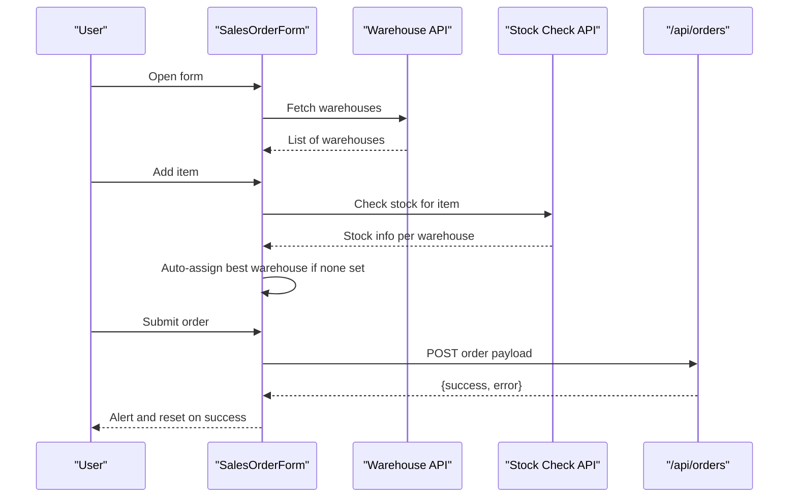
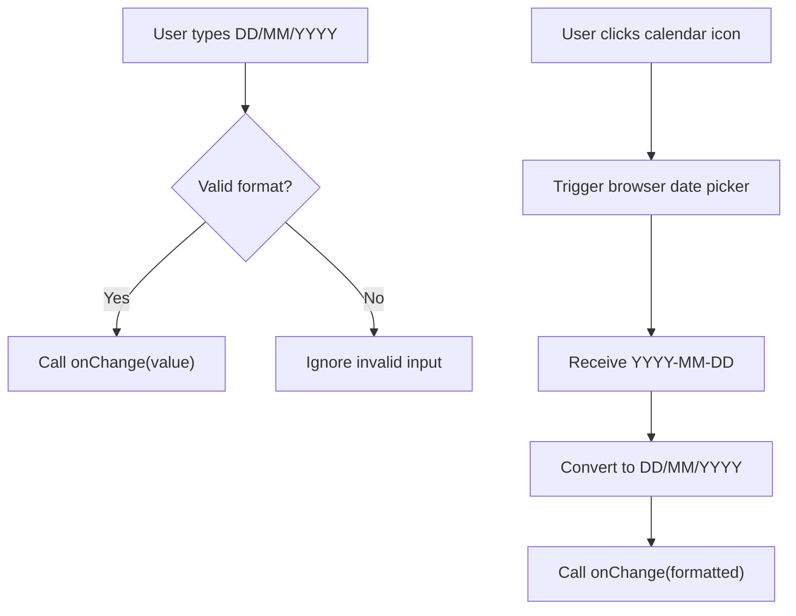
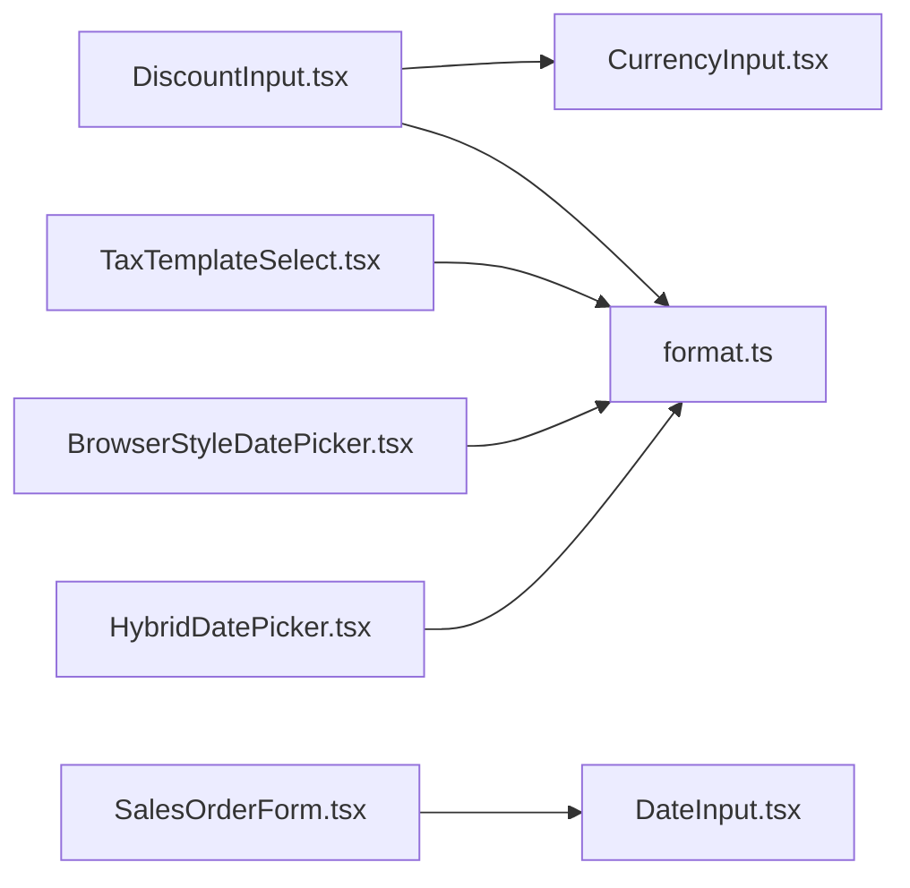

# Form Components

<cite>
**Referenced Files in This Document**
- [DiscountInput.tsx](file://components/invoice/DiscountInput.tsx)
- [TaxTemplateSelect.tsx](file://components/invoice/TaxTemplateSelect.tsx)
- [SalesOrderForm.tsx](file://components/SalesOrderForm.tsx)
- [CurrencyInput.tsx](file://app/components/CurrencyInput.tsx)
- [DateInput.tsx](file://components/DateInput.tsx)
- [BrowserStyleDatePicker.tsx](file://components/BrowserStyleDatePicker.tsx)
- [HybridDatePicker.tsx](file://components/HybridDatePicker.tsx)
- [DiscountInput.test.tsx](file://tests/components/DiscountInput.test.tsx)
- [TaxTemplateSelect.test.tsx](file://tests/components/TaxTemplateSelect.test.tsx)
- [InvoiceSummary.test.tsx](file://tests/components/InvoiceSummary.test.tsx)
- [format.ts](file://utils/format.ts)
</cite>

## Table of Contents
1. [Introduction](#introduction)
2. [Project Structure](#project-structure)
3. [Core Components](#core-components)
4. [Architecture Overview](#architecture-overview)
5. [Detailed Component Analysis](#detailed-component-analysis)
6. [Dependency Analysis](#dependency-analysis)
7. [Performance Considerations](#performance-considerations)
8. [Troubleshooting Guide](#troubleshooting-guide)
9. [Conclusion](#conclusion)
10. [Appendices](#appendices)

## Introduction
This document provides comprehensive documentation for form components focused on input validation, real-time calculations, and error handling. It covers:
- DiscountInput for tax-related discount calculations and currency formatting
- TaxTemplateSelect for dynamic tax template selection and display
- SalesOrderForm for complex business data entry with item cart, warehouse assignment, and submission
It also documents validation patterns, currency formatting, date pickers, input sanitization, state management, accessibility, responsive design, and guidelines for extending components and implementing custom validation rules.

## Project Structure
The form components are organized under the components directory, with supporting utilities and tests:
- components/invoice: DiscountInput, TaxTemplateSelect
- components: SalesOrderForm, DateInput, BrowserStyleDatePicker, HybridDatePicker
- app/components: CurrencyInput
- tests/components: Component-specific unit tests
- utils: Shared formatting helpers (parseDate)

**Diagram sources**
- [DiscountInput.tsx](file://components/invoice/DiscountInput.tsx#L1-L219)
- [TaxTemplateSelect.tsx](file://components/invoice/TaxTemplateSelect.tsx#L1-L192)
- [SalesOrderForm.tsx](file://components/SalesOrderForm.tsx#L1-L364)
- [CurrencyInput.tsx](file://app/components/CurrencyInput.tsx#L1-L100)
- [DateInput.tsx](file://components/DateInput.tsx#L1-L86)
- [BrowserStyleDatePicker.tsx](file://components/BrowserStyleDatePicker.tsx#L1-L144)
- [HybridDatePicker.tsx](file://components/HybridDatePicker.tsx#L1-L82)
- [DiscountInput.test.tsx](file://tests/components/DiscountInput.test.tsx#L1-L250)
- [TaxTemplateSelect.test.tsx](file://tests/components/TaxTemplateSelect.test.tsx#L1-L331)
- [InvoiceSummary.test.tsx](file://tests/components/InvoiceSummary.test.tsx#L1-L436)
- [format.ts](file://utils/format.ts)

**Section sources**
- [DiscountInput.tsx](file://components/invoice/DiscountInput.tsx#L1-L219)
- [TaxTemplateSelect.tsx](file://components/invoice/TaxTemplateSelect.tsx#L1-L192)
- [SalesOrderForm.tsx](file://components/SalesOrderForm.tsx#L1-L364)
- [CurrencyInput.tsx](file://app/components/CurrencyInput.tsx#L1-L100)
- [DateInput.tsx](file://components/DateInput.tsx#L1-L86)
- [BrowserStyleDatePicker.tsx](file://components/BrowserStyleDatePicker.tsx#L1-L144)
- [HybridDatePicker.tsx](file://components/HybridDatePicker.tsx#L1-L82)
- [DiscountInput.test.tsx](file://tests/components/DiscountInput.test.tsx#L1-L250)
- [TaxTemplateSelect.test.tsx](file://tests/components/TaxTemplateSelect.test.tsx#L1-L331)
- [InvoiceSummary.test.tsx](file://tests/components/InvoiceSummary.test.tsx#L1-L436)
- [format.ts](file://utils/format.ts)

## Core Components
- DiscountInput: Bidirectional discount input supporting percentage and amount modes with real-time calculations, validation, and Indonesian Rupiah formatting.
- TaxTemplateSelect: Dynamic selector for tax templates with loading, error handling, and detailed tax breakdown display.
- SalesOrderForm: Multi-field form with item cart, warehouse assignment, stock checks, and order submission.
- CurrencyInput: Number input with Indonesian locale formatting, sanitization, and blur/focus formatting behavior.
- DateInput: Text-based date input with DD/MM/YYYY display and browser-native date picker trigger.
- BrowserStyleDatePicker: Enhanced date picker with calendar icon, clear action, and robust fallbacks.
- HybridDatePicker: Lightweight hybrid with text input and hidden date input for native picker.

**Section sources**
- [DiscountInput.tsx](file://components/invoice/DiscountInput.tsx#L1-L219)
- [TaxTemplateSelect.tsx](file://components/invoice/TaxTemplateSelect.tsx#L1-L192)
- [SalesOrderForm.tsx](file://components/SalesOrderForm.tsx#L1-L364)
- [CurrencyInput.tsx](file://app/components/CurrencyInput.tsx#L1-L100)
- [DateInput.tsx](file://components/DateInput.tsx#L1-L86)
- [BrowserStyleDatePicker.tsx](file://components/BrowserStyleDatePicker.tsx#L1-L144)
- [HybridDatePicker.tsx](file://components/HybridDatePicker.tsx#L1-L82)

## Architecture Overview
The form components follow a unidirectional data flow pattern:
- Controlled inputs manage local state and propagate changes via callbacks.
- Validation occurs on change with immediate feedback.
- Real-time calculations update dependent fields (e.g., discount percentage ↔ amount).
- External APIs are accessed for dynamic data (tax templates, stock availability).
- Utilities centralize formatting and parsing logic.

**Diagram sources**
- [DiscountInput.tsx](file://components/invoice/DiscountInput.tsx#L66-L118)
- [CurrencyInput.tsx](file://app/components/CurrencyInput.tsx#L30-L76)
- [format.ts](file://utils/format.ts)

## Detailed Component Analysis

### DiscountInput
- Purpose: Real-time bidirectional discount input with validation and currency formatting.
- Key behaviors:
  - Toggle between percentage and amount modes.
  - Validate negative values and bounds (0–100% and 0–subtotal).
  - Compute dependent values automatically.
  - Format values using Indonesian locale for display.
- State management:
  - Local state tracks input type, percentage, amount, and error messages.
  - Synchronizes with external props to prevent stale values.
- Integration points:
  - Emits unified onChange and legacy handlers for compatibility.
  - Uses CurrencyInput for consistent formatting.
- Accessibility:
  - Disabled state support.
  - Clear error messaging.
- Responsive design:
  - Flexbox layout adapts to narrow widths.

**Diagram sources**
- [DiscountInput.tsx](file://components/invoice/DiscountInput.tsx#L66-L118)
- [CurrencyInput.tsx](file://app/components/CurrencyInput.tsx#L30-L76)

**Section sources**
- [DiscountInput.tsx](file://components/invoice/DiscountInput.tsx#L1-L219)
- [DiscountInput.test.tsx](file://tests/components/DiscountInput.test.tsx#L1-L250)
- [CurrencyInput.tsx](file://app/components/CurrencyInput.tsx#L1-L100)

### TaxTemplateSelect
- Purpose: Dynamic selection of tax templates filtered by transaction type and company.
- Key behaviors:
  - Fetch templates via GET /api/setup/tax-templates with query parameters.
  - Display combined tax rates (single or multiple) with descriptions and account heads.
  - Handle loading, error states, and retry.
- State management:
  - Maintains templates list, loading/error flags, and selected value.
  - Resets selection when value prop changes.
- Integration points:
  - Calls backend API and parses JSON response.
  - Propagates selected template to parent via onChange callback.
- Accessibility:
  - Disabled option handling.
  - Clear visual feedback for empty states.

**Diagram sources**
- [TaxTemplateSelect.tsx](file://components/invoice/TaxTemplateSelect.tsx#L38-L67)
- [TaxTemplateSelect.tsx](file://components/invoice/TaxTemplateSelect.tsx#L81-L103)

**Section sources**
- [TaxTemplateSelect.tsx](file://components/invoice/TaxTemplateSelect.tsx#L1-L192)
- [TaxTemplateSelect.test.tsx](file://tests/components/TaxTemplateSelect.test.tsx#L1-L331)

### SalesOrderForm
- Purpose: Complex business form for creating sales orders with item cart, warehouse assignment, and stock checks.
- Key behaviors:
  - Fetch available warehouses and auto-assign to items.
  - Check stock per item and suggest best warehouse.
  - Submit order payload to backend with validation.
- State management:
  - Tracks cart items, customer/sales person/delivery date, and header warehouse.
  - Manages item dialog open state and editing index.
- Integration points:
  - Fetch warehouses from ERP endpoint.
  - Stock check via /api/stock-check.
  - Submit order via POST /api/orders.
- Accessibility and UX:
  - Read-only SKU input with click-to-edit.
  - Clear indicators for default warehouse and stock availability.

**Diagram sources**
- [SalesOrderForm.tsx](file://components/SalesOrderForm.tsx#L38-L56)
- [SalesOrderForm.tsx](file://components/SalesOrderForm.tsx#L68-L91)
- [SalesOrderForm.tsx](file://components/SalesOrderForm.tsx#L132-L175)

**Section sources**
- [SalesOrderForm.tsx](file://components/SalesOrderForm.tsx#L1-L364)

### CurrencyInput
- Purpose: Number input with Indonesian locale formatting and sanitization.
- Key behaviors:
  - Format display using toLocaleString('id-ID').
  - Sanitize input to allow digits and comma.
  - Parse on change and clamp to max if provided.
  - Blur to reformat to currency; focus to show raw numeric value.
- Validation:
  - Enforces min/max boundaries.
  - Required/disabled flags supported.
- Integration:
  - Used by DiscountInput for consistent currency display.

**Section sources**
- [CurrencyInput.tsx](file://app/components/CurrencyInput.tsx#L1-L100)

### Date Inputs
- DateInput: Text input with DD/MM/YYYY placeholder and browser-native date picker trigger. Converts between display and internal YYYY-MM-DD formats.
- BrowserStyleDatePicker: Enhanced variant with calendar icon, clear action, and robust fallbacks for showPicker.
- HybridDatePicker: Minimal hybrid with visible text input and hidden date input.

**Diagram sources**
- [DateInput.tsx](file://components/DateInput.tsx#L23-L44)
- [BrowserStyleDatePicker.tsx](file://components/BrowserStyleDatePicker.tsx#L48-L60)
- [HybridDatePicker.tsx](file://components/HybridDatePicker.tsx#L38-L45)

**Section sources**
- [DateInput.tsx](file://components/DateInput.tsx#L1-L86)
- [BrowserStyleDatePicker.tsx](file://components/BrowserStyleDatePicker.tsx#L1-L144)
- [HybridDatePicker.tsx](file://components/HybridDatePicker.tsx#L1-L82)
- [format.ts](file://utils/format.ts)

## Dependency Analysis
- DiscountInput depends on:
  - CurrencyInput for formatting
  - format.ts for date parsing utilities (used indirectly via shared helpers)
- TaxTemplateSelect depends on:
  - Backend API for templates
  - format.ts for date parsing utilities
- SalesOrderForm depends on:
  - Warehouse API for dropdown options
  - Stock check API for inventory visibility
  - Order submission endpoint
- Date inputs depend on:
  - format.ts for parsing and converting dates

**Diagram sources**
- [DiscountInput.tsx](file://components/invoice/DiscountInput.tsx#L1-L219)
- [CurrencyInput.tsx](file://app/components/CurrencyInput.tsx#L1-L100)
- [TaxTemplateSelect.tsx](file://components/invoice/TaxTemplateSelect.tsx#L1-L192)
- [SalesOrderForm.tsx](file://components/SalesOrderForm.tsx#L1-L364)
- [DateInput.tsx](file://components/DateInput.tsx#L1-L86)
- [BrowserStyleDatePicker.tsx](file://components/BrowserStyleDatePicker.tsx#L1-L144)
- [HybridDatePicker.tsx](file://components/HybridDatePicker.tsx#L1-L82)
- [format.ts](file://utils/format.ts)

**Section sources**
- [DiscountInput.tsx](file://components/invoice/DiscountInput.tsx#L1-L219)
- [TaxTemplateSelect.tsx](file://components/invoice/TaxTemplateSelect.tsx#L1-L192)
- [SalesOrderForm.tsx](file://components/SalesOrderForm.tsx#L1-L364)
- [CurrencyInput.tsx](file://app/components/CurrencyInput.tsx#L1-L100)
- [DateInput.tsx](file://components/DateInput.tsx#L1-L86)
- [BrowserStyleDatePicker.tsx](file://components/BrowserStyleDatePicker.tsx#L1-L144)
- [HybridDatePicker.tsx](file://components/HybridDatePicker.tsx#L1-L82)
- [format.ts](file://utils/format.ts)

## Performance Considerations
- Minimize re-renders:
  - Use controlled inputs and avoid unnecessary state updates.
  - Debounce heavy computations if extended.
- API calls:
  - Cache tax templates and warehouses where appropriate.
  - Use request deduplication for stock checks.
- Formatting:
  - Keep formatting logic lightweight; memoize derived values.
- Accessibility:
  - Ensure keyboard navigation and screen reader compatibility.
- Responsive design:
  - Use flexible grids and adaptive layouts for mobile.

## Troubleshooting Guide
- DiscountInput validation errors:
  - Negative values or out-of-range inputs are rejected with localized messages.
  - Ensure subtotal is set before computing dependent values.
- TaxTemplateSelect API failures:
  - Confirm company and type parameters are provided.
  - Use the retry button to reattempt fetch.
- SalesOrderForm submission:
  - Validate required fields (customer name and items).
  - Inspect network errors and backend responses.
- Date input inconsistencies:
  - Verify DD/MM/YYYY vs YYYY-MM-DD conversions.
  - Use provided date pickers to avoid manual parsing errors.

**Section sources**
- [DiscountInput.tsx](file://components/invoice/DiscountInput.tsx#L74-L108)
- [TaxTemplateSelect.tsx](file://components/invoice/TaxTemplateSelect.tsx#L50-L66)
- [SalesOrderForm.tsx](file://components/SalesOrderForm.tsx#L133-L175)
- [DateInput.tsx](file://components/DateInput.tsx#L23-L44)

## Conclusion
These form components implement robust validation, real-time calculations, and consistent formatting tailored for Indonesian locales. They integrate seamlessly with backend APIs, provide clear user feedback, and offer extensibility for custom validation and business rules.

## Appendices

### Practical Usage Examples
- DiscountInput:
  - Bind subtotal and onChange to update invoice totals.
  - Support both unified onChange and legacy handlers for backward compatibility.
- TaxTemplateSelect:
  - Pass company and type props; handle null selection for clearing.
  - Display template details for transparency.
- SalesOrderForm:
  - Populate cart items and header fields; submit only when valid.
  - Use stock info to guide warehouse selection.

### Validation Strategies
- Use component-level validation for immediate feedback.
- Complement with backend validation for data integrity.
- Centralize common validators in utilities for reuse.

### Extending Components and Custom Validation
- Add custom validation rules by extending props and validation logic.
- Introduce new input types by following existing patterns (controlled inputs, sanitization, formatting).
- Maintain accessibility by preserving keyboard navigation and ARIA attributes.