# Loading States and Skeletons

<cite>
**Referenced Files in This Document**
- [LoadingSpinner.tsx](file://components/LoadingSpinner.tsx)
- [LoadingButton.tsx](file://components/LoadingButton.tsx)
- [LoadingOverlay.tsx](file://components/LoadingOverlay.tsx)
- [SkeletonLoader.tsx](file://components/SkeletonLoader.tsx)
- [SkeletonCard.tsx](file://components/SkeletonCard.tsx)
- [SkeletonList.tsx](file://components/SkeletonList.tsx)
- [SkeletonTableRow.tsx](file://components/SkeletonTableRow.tsx)
- [use-loading.ts](file://lib/use-loading.ts)
- [loading README.md](file://components/loading/README.md)
- [loading INTEGRATION_EXAMPLES.md](file://components/loading/INTEGRATION_EXAMPLES.md)
- [LoadingExample.tsx](file://app/accounting-period/components/LoadingExample.tsx)
- [loading demo page.tsx](file://app/accounting-period/loading-demo/page.tsx)
- [UI/UX Loading States Implementation doc](file://docs/ui-ux/LOADING_STATES_IMPLEMENTATION.md)
</cite>

## Table of Contents
1. [Introduction](#introduction)
2. [Project Structure](#project-structure)
3. [Core Components](#core-components)
4. [Architecture Overview](#architecture-overview)
5. [Detailed Component Analysis](#detailed-component-analysis)
6. [Dependency Analysis](#dependency-analysis)
7. [Performance Considerations](#performance-considerations)
8. [Troubleshooting Guide](#troubleshooting-guide)
9. [Conclusion](#conclusion)
10. [Appendices](#appendices)

## Introduction
This document provides comprehensive guidance for implementing loading states and skeleton components to improve perceived performance and user experience during asynchronous operations. It covers:
- LoadingSpinner, LoadingButton, and LoadingOverlay for inline, button, and overlay loading feedback
- Skeleton components (SkeletonCard, SkeletonList, SkeletonLoader, SkeletonTableRow) for progressive content rendering
- use-loading hook for centralized loading state management across components
- Practical integration examples, accessibility, animation patterns, responsive behaviors, and performance best practices

## Project Structure
The loading and skeleton systems are organized under two main areas:
- Components: Reusable UI elements for loading and skeleton states
- lib: Centralized hook for loading state management

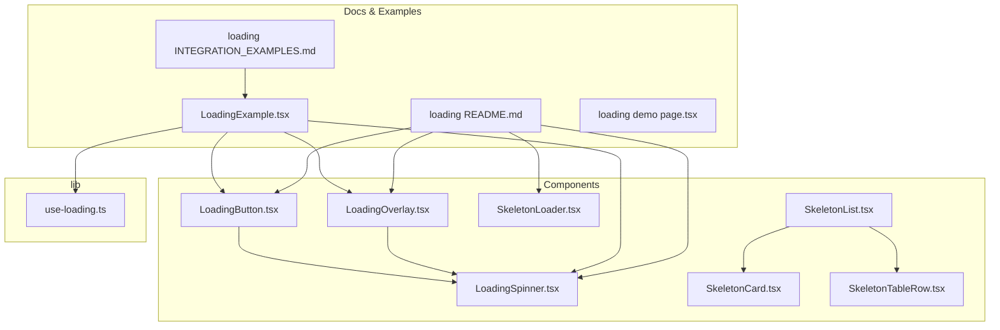

**Diagram sources**
- [LoadingSpinner.tsx](file://components/LoadingSpinner.tsx#L1-L63)
- [LoadingButton.tsx](file://components/LoadingButton.tsx#L1-L73)
- [LoadingOverlay.tsx](file://components/LoadingOverlay.tsx#L1-L54)
- [SkeletonLoader.tsx](file://components/SkeletonLoader.tsx#L1-L178)
- [SkeletonCard.tsx](file://components/SkeletonCard.tsx#L1-L66)
- [SkeletonList.tsx](file://components/SkeletonList.tsx#L1-L101)
- [SkeletonTableRow.tsx](file://components/SkeletonTableRow.tsx#L1-L46)
- [use-loading.ts](file://lib/use-loading.ts#L1-L95)
- [loading README.md](file://components/loading/README.md#L1-L385)
- [loading INTEGRATION_EXAMPLES.md](file://components/loading/INTEGRATION_EXAMPLES.md#L1-L508)
- [LoadingExample.tsx](file://app/accounting-period/components/LoadingExample.tsx#L1-L314)
- [loading demo page.tsx](file://app/accounting-period/loading-demo/page.tsx#L1-L6)

**Section sources**
- [loading README.md](file://components/loading/README.md#L1-L385)
- [loading INTEGRATION_EXAMPLES.md](file://components/loading/INTEGRATION_EXAMPLES.md#L1-L508)
- [use-loading.ts](file://lib/use-loading.ts#L1-L95)

## Core Components
This section summarizes the primary loading and skeleton components and their responsibilities.

- LoadingSpinner: Lightweight animated spinner with configurable size, variant, optional message, and accessibility attributes.
- LoadingButton: Button variant that disables itself and displays an inline spinner with optional loading text.
- LoadingOverlay: Full-screen or container overlay with spinner and message, preventing interaction during async operations.
- SkeletonLoader: Collection of skeleton placeholders including base Skeleton, SkeletonText, SkeletonCard, SkeletonTable, SkeletonList, and domain-specific skeletons.
- SkeletonCard: Mobile-friendly skeleton for list cards with customizable info lines, actions, and widths.
- SkeletonList: Adaptive skeleton list generator that renders either cards or table rows depending on mode and device.
- SkeletonTableRow: Desktop table row skeleton with configurable columns and action column support.
- use-loading: Hook providing single and multiple loading state management with automatic lifecycle handling.

**Section sources**
- [LoadingSpinner.tsx](file://components/LoadingSpinner.tsx#L1-L63)
- [LoadingButton.tsx](file://components/LoadingButton.tsx#L1-L73)
- [LoadingOverlay.tsx](file://components/LoadingOverlay.tsx#L1-L54)
- [SkeletonLoader.tsx](file://components/SkeletonLoader.tsx#L1-L178)
- [SkeletonCard.tsx](file://components/SkeletonCard.tsx#L1-L66)
- [SkeletonList.tsx](file://components/SkeletonList.tsx#L1-L101)
- [SkeletonTableRow.tsx](file://components/SkeletonTableRow.tsx#L1-L46)
- [use-loading.ts](file://lib/use-loading.ts#L1-L95)

## Architecture Overview
The loading system follows a layered architecture:
- Presentation layer: LoadingSpinner, LoadingButton, LoadingOverlay, and Skeleton components
- State management layer: use-loading hook for centralized loading state
- Documentation and examples: README and integration examples guide usage and best practices

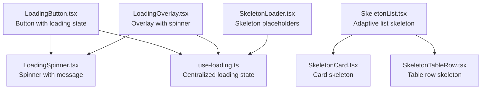

**Diagram sources**
- [use-loading.ts](file://lib/use-loading.ts#L1-L95)
- [LoadingButton.tsx](file://components/LoadingButton.tsx#L1-L73)
- [LoadingOverlay.tsx](file://components/LoadingOverlay.tsx#L1-L54)
- [LoadingSpinner.tsx](file://components/LoadingSpinner.tsx#L1-L63)
- [SkeletonLoader.tsx](file://components/SkeletonLoader.tsx#L1-L178)
- [SkeletonCard.tsx](file://components/SkeletonCard.tsx#L1-L66)
- [SkeletonList.tsx](file://components/SkeletonList.tsx#L1-L101)
- [SkeletonTableRow.tsx](file://components/SkeletonTableRow.tsx#L1-L46)

## Detailed Component Analysis

### LoadingSpinner
- Purpose: Provide lightweight, accessible spinner feedback with optional message.
- Key props: size, variant, className, message.
- Accessibility: role="status", aria-label, and screen-reader-only text included.
- Animation: Uses Tailwind-based spin animation.

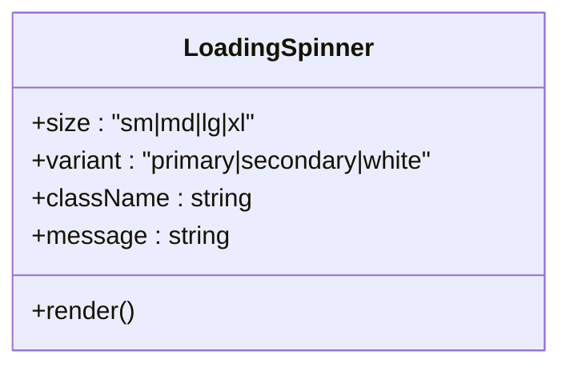

**Diagram sources**
- [LoadingSpinner.tsx](file://components/LoadingSpinner.tsx#L10-L22)

**Section sources**
- [LoadingSpinner.tsx](file://components/LoadingSpinner.tsx#L1-L63)
- [loading README.md](file://components/loading/README.md#L7-L32)

### LoadingButton
- Purpose: Button that disables itself and shows an inline spinner with optional loading text.
- Key props: loading, loadingText, variant, size, children, and standard button attributes.
- Behavior: Disables when loading is true; renders an internal LoadingSpinner sized appropriately to button size.

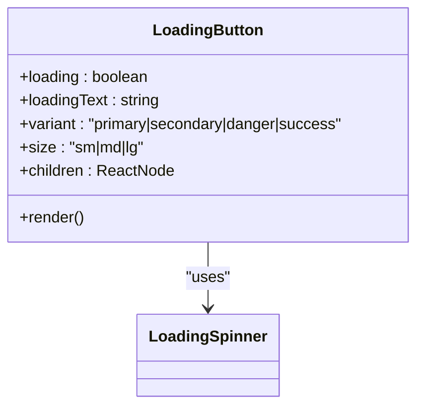

**Diagram sources**
- [LoadingButton.tsx](file://components/LoadingButton.tsx#L12-L29)
- [LoadingSpinner.tsx](file://components/LoadingSpinner.tsx#L1-L63)

**Section sources**
- [LoadingButton.tsx](file://components/LoadingButton.tsx#L1-L73)
- [loading README.md](file://components/loading/README.md#L34-L74)

### LoadingOverlay
- Purpose: Full-screen or container overlay displaying a spinner and message while blocking interaction.
- Key props: isLoading, message, fullScreen, className.
- Accessibility: role="status", aria-live="polite", aria-busy="true".

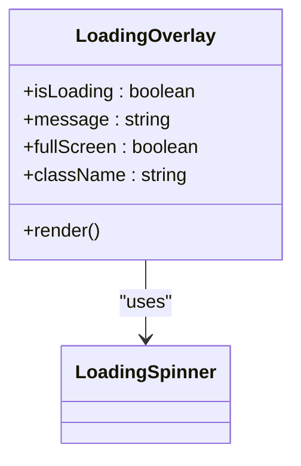

**Diagram sources**
- [LoadingOverlay.tsx](file://components/LoadingOverlay.tsx#L12-L24)
- [LoadingSpinner.tsx](file://components/LoadingSpinner.tsx#L1-L63)

**Section sources**
- [LoadingOverlay.tsx](file://components/LoadingOverlay.tsx#L1-L54)
- [loading README.md](file://components/loading/README.md#L76-L113)

### SkeletonLoader Family
- Skeleton: Base animated placeholder element.
- SkeletonText: Multi-line text skeleton with last line shorter.
- SkeletonCard: Card skeleton with title, subtitle, info lines, and action placeholders.
- SkeletonTable: Grid-based table header and rows skeleton.
- SkeletonList: Vertical list of avatar + text skeletons.
- SkeletonPeriodDashboard: Domain-specific dashboard skeleton.
- SkeletonPeriodDetail: Domain-specific detail skeleton.

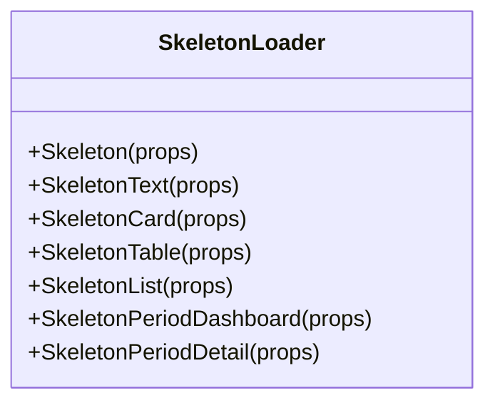

**Diagram sources**
- [SkeletonLoader.tsx](file://components/SkeletonLoader.tsx#L14-L177)

**Section sources**
- [SkeletonLoader.tsx](file://components/SkeletonLoader.tsx#L1-L178)
- [loading README.md](file://components/loading/README.md#L115-L159)

### SkeletonCard
- Purpose: Mobile-friendly skeleton for list cards.
- Customization: infoLines, showActions, actionCount, titleWidth, subtitleWidth, className.

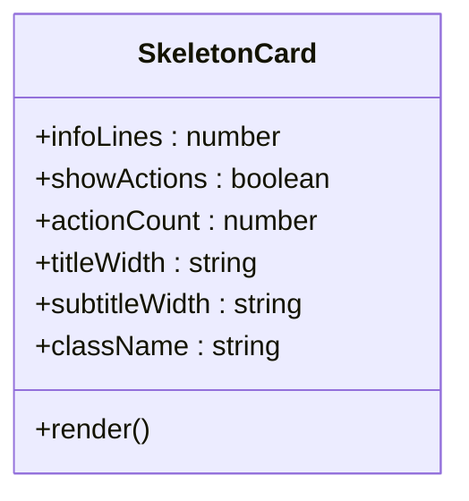

**Diagram sources**
- [SkeletonCard.tsx](file://components/SkeletonCard.tsx#L3-L29)

**Section sources**
- [SkeletonCard.tsx](file://components/SkeletonCard.tsx#L1-L66)

### SkeletonList
- Purpose: Adaptive skeleton list that renders either cards or table rows based on mode and device.
- Features: mode ('auto'|'card'|'table'), isMobile, count/itemCount, cardProps, tableProps, asWrapper, loading, children.

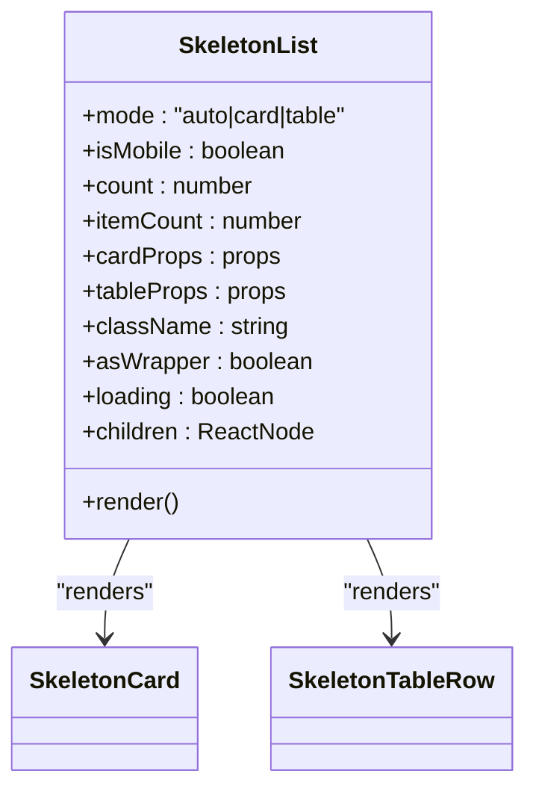

**Diagram sources**
- [SkeletonList.tsx](file://components/SkeletonList.tsx#L5-L42)
- [SkeletonCard.tsx](file://components/SkeletonCard.tsx#L1-L66)
- [SkeletonTableRow.tsx](file://components/SkeletonTableRow.tsx#L1-L46)

**Section sources**
- [SkeletonList.tsx](file://components/SkeletonList.tsx#L1-L101)

### SkeletonTableRow
- Purpose: Single desktop table row skeleton with configurable columns and action column.
- Customization: columns, firstColWidth, showActions.

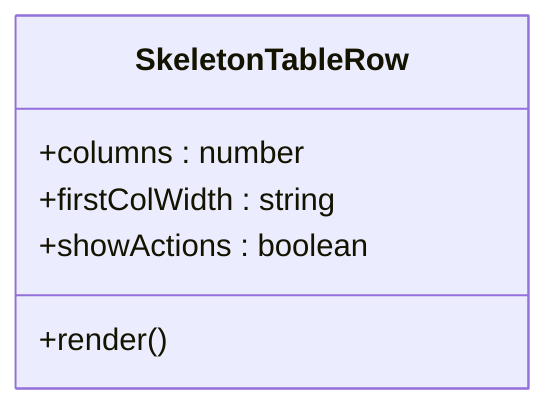

**Diagram sources**
- [SkeletonTableRow.tsx](file://components/SkeletonTableRow.tsx#L3-L20)

**Section sources**
- [SkeletonTableRow.tsx](file://components/SkeletonTableRow.tsx#L1-L46)

### use-loading Hook
- Purpose: Centralized loading state management for single and multiple async operations.
- Functions:
  - useLoading: isLoading, startLoading, stopLoading, withLoading(fn)
  - useMultipleLoading: isLoading(key), isAnyLoading, startLoading(key), stopLoading(key), withLoading(key, fn)

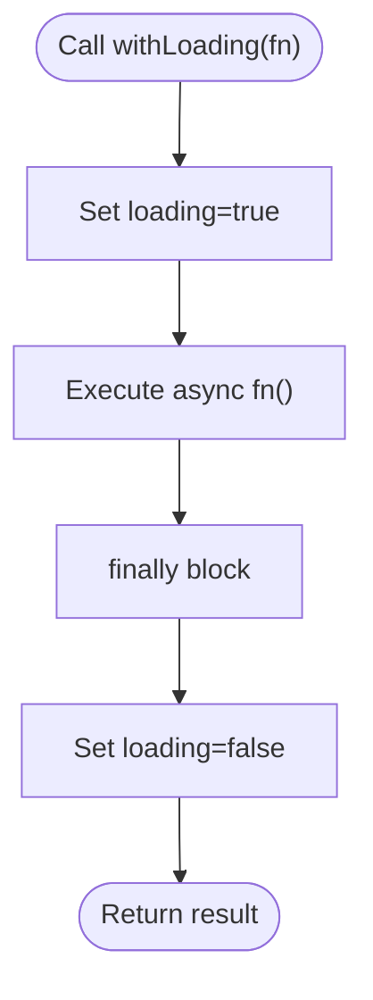

**Diagram sources**
- [use-loading.ts](file://lib/use-loading.ts#L33-L40)
- [use-loading.ts](file://lib/use-loading.ts#L78-L85)

**Section sources**
- [use-loading.ts](file://lib/use-loading.ts#L1-L95)
- [loading README.md](file://components/loading/README.md#L161-L244)

## Dependency Analysis
- LoadingButton depends on LoadingSpinner for inline spinner rendering.
- LoadingOverlay depends on LoadingSpinner for overlay spinner.
- SkeletonList composes SkeletonCard and SkeletonTableRow for adaptive rendering.
- LoadingExample demonstrates integration of all components and hooks.

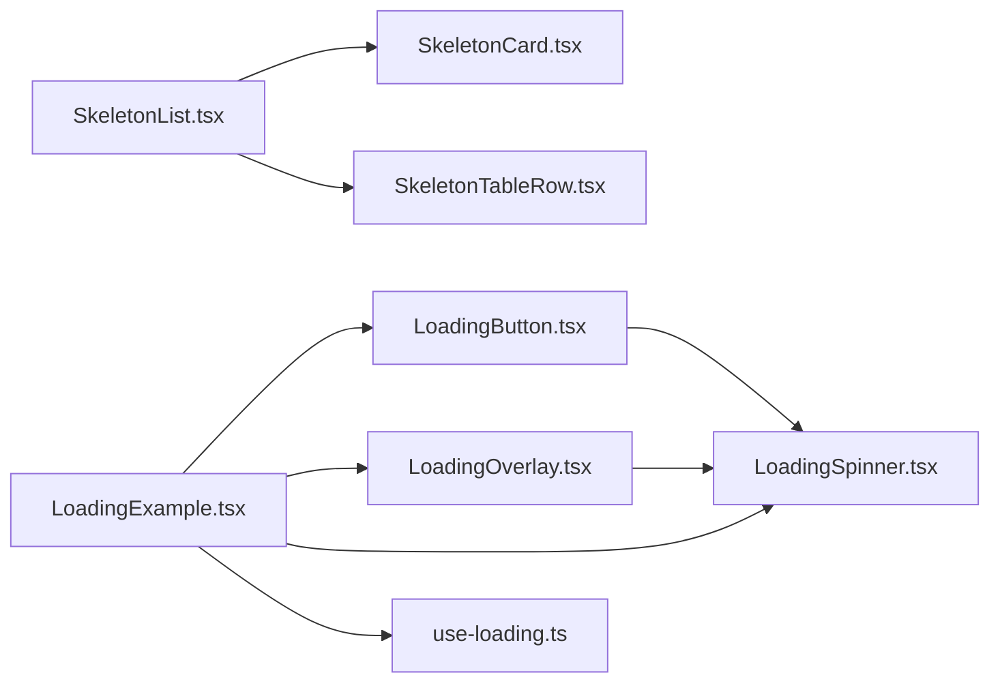

**Diagram sources**
- [LoadingButton.tsx](file://components/LoadingButton.tsx#L10-L10)
- [LoadingOverlay.tsx](file://components/LoadingOverlay.tsx#L10-L10)
- [SkeletonList.tsx](file://components/SkeletonList.tsx#L2-L3)
- [SkeletonCard.tsx](file://components/SkeletonCard.tsx#L1-L1)
- [SkeletonTableRow.tsx](file://components/SkeletonTableRow.tsx#L1-L1)
- [LoadingExample.tsx](file://app/accounting-period/components/LoadingExample.tsx#L10-L21)
- [use-loading.ts](file://lib/use-loading.ts#L1-L1)

**Section sources**
- [LoadingExample.tsx](file://app/accounting-period/components/LoadingExample.tsx#L1-L314)

## Performance Considerations
- Prefer skeleton loaders for initial data loads to maintain perceived performance and reduce layout shifts.
- Use LoadingOverlay sparingly; reserve for long-running operations that require full-screen focus.
- Keep LoadingButton disabled during async operations to prevent redundant submissions.
- Use use-loading withLoading helpers to ensure loading states are consistently toggled even on errors.
- Minimize re-renders by structuring loading state updates efficiently (e.g., avoid unnecessary state churn).

[No sources needed since this section provides general guidance]

## Troubleshooting Guide
Common issues and resolutions:
- Buttons remain enabled after async failure: Use withLoading to guarantee cleanup.
- Overlays not dismissing: Ensure isLoading is toggled in finally blocks or use withLoading.
- Skeletons not adapting to device: Verify SkeletonList mode and isMobile props.
- Accessibility warnings: Confirm role, aria-label, aria-live, and aria-busy are present on status-bearing components.

**Section sources**
- [use-loading.ts](file://lib/use-loading.ts#L33-L40)
- [use-loading.ts](file://lib/use-loading.ts#L78-L85)
- [LoadingOverlay.tsx](file://components/LoadingOverlay.tsx#L39-L41)
- [SkeletonList.tsx](file://components/SkeletonList.tsx#L31-L78)

## Conclusion
The loading and skeleton system provides a cohesive, accessible, and performant way to communicate async operations to users. By combining LoadingSpinner, LoadingButton, LoadingOverlay, and Skeleton components with the use-loading hook, teams can deliver consistent UX patterns across features. Integrate with toast notifications for complete feedback loops and follow best practices for accessibility and responsiveness.

[No sources needed since this section summarizes without analyzing specific files]

## Appendices

### Integration Examples and Best Practices
- Skeleton for initial loads vs. spinners
- Disable form elements during processing
- Provide meaningful loading messages
- Use withLoading helper for automatic state management
- Combine loading states with toast notifications

**Section sources**
- [loading README.md](file://components/loading/README.md#L246-L384)
- [loading INTEGRATION_EXAMPLES.md](file://components/loading/INTEGRATION_EXAMPLES.md#L499-L508)

### Live Demo Page
- The loading demo page renders LoadingExample, which showcases all components and patterns.

**Section sources**
- [loading demo page.tsx](file://app/accounting-period/loading-demo/page.tsx#L1-L6)
- [LoadingExample.tsx](file://app/accounting-period/components/LoadingExample.tsx#L23-L62)