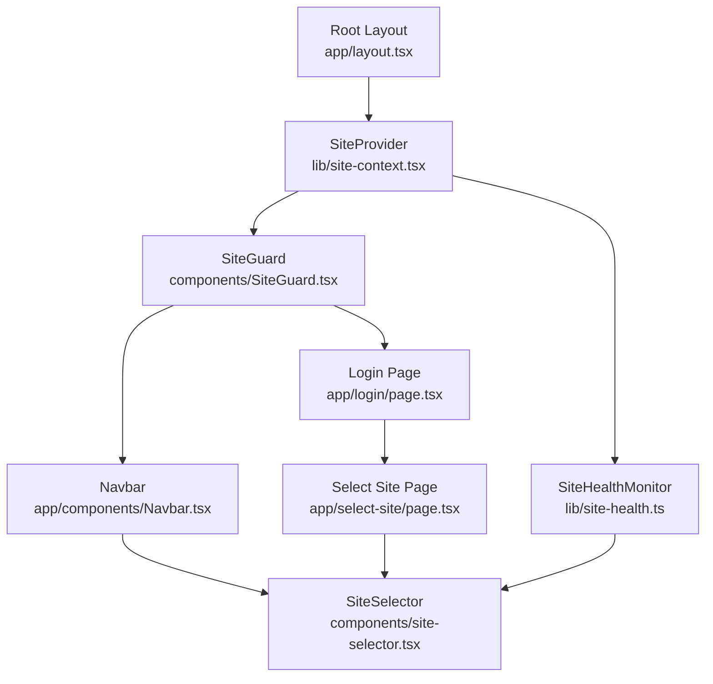
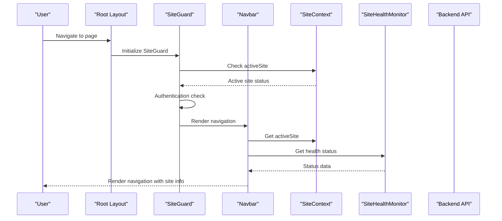
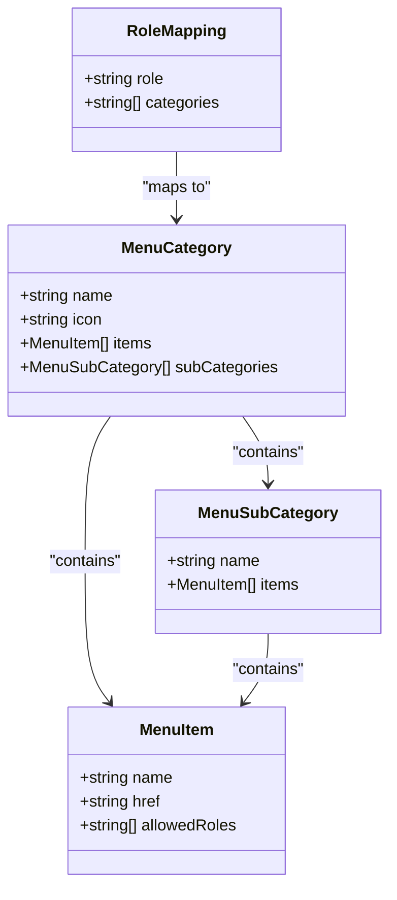
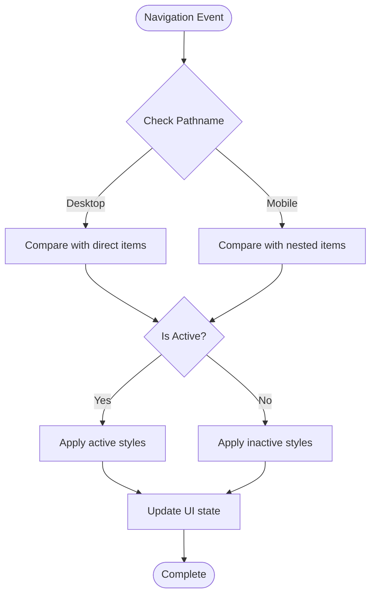
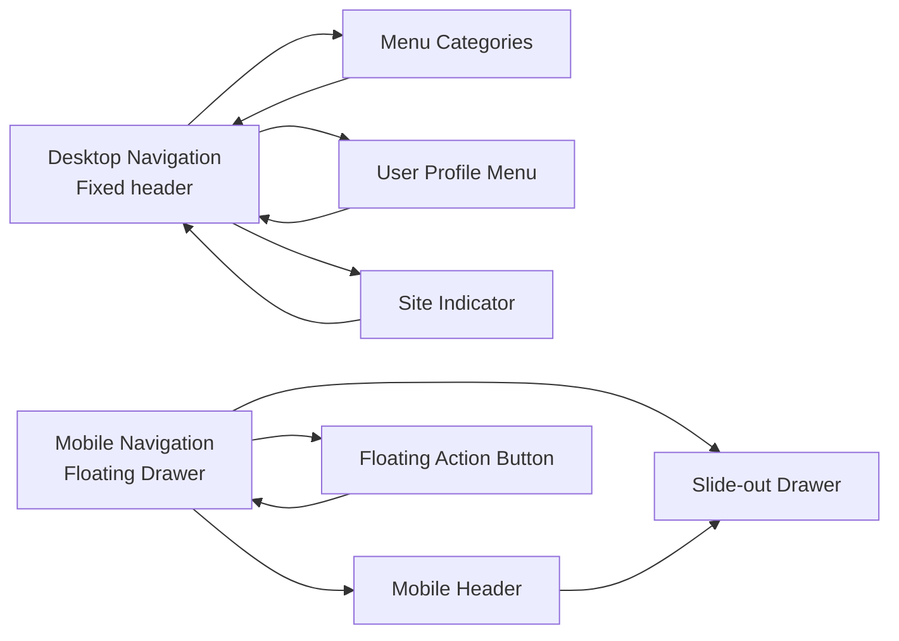
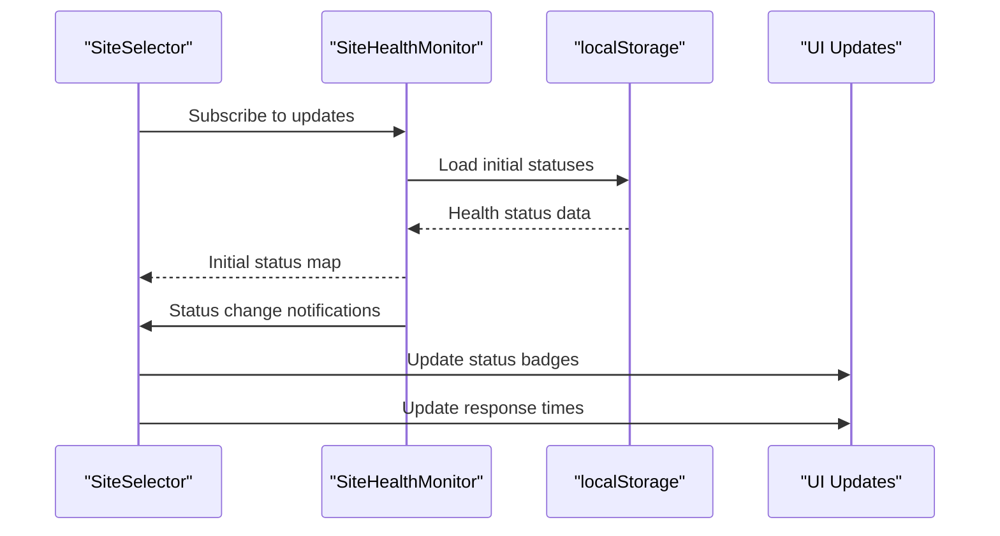
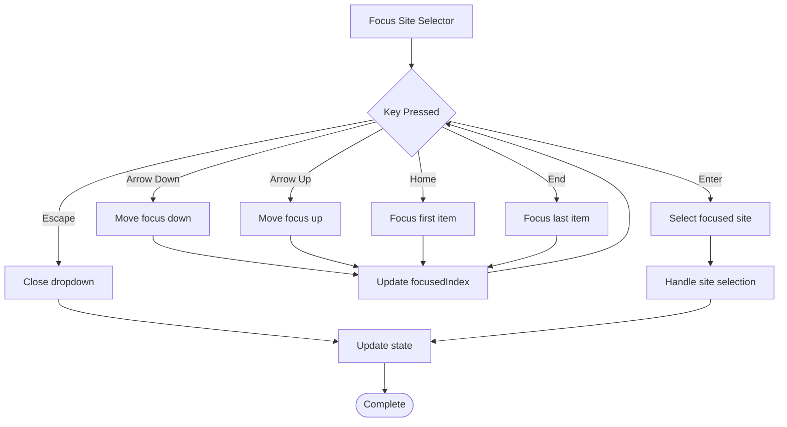
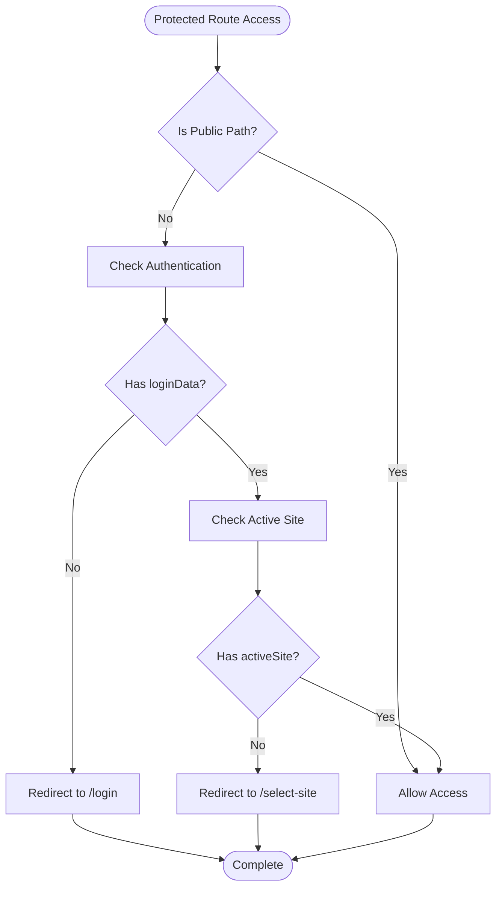
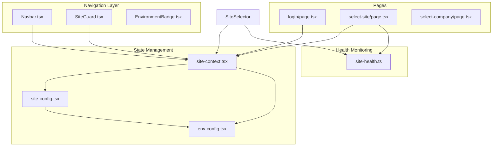

# Navigation Components

<cite>
**Referenced Files in This Document**
- [Navbar.tsx](file://app/components/Navbar.tsx)
- [site-selector.tsx](file://components/site-selector.tsx)
- [SiteGuard.tsx](file://components/SiteGuard.tsx)
- [EnvironmentBadge.tsx](file://components/EnvironmentBadge.tsx)
- [navigation.tsx](file://app/components/navigation.tsx)
- [site-context.tsx](file://lib/site-context.tsx)
- [site-health.ts](file://lib/site-health.ts)
- [site-config.ts](file://lib/site-config.ts)
- [env-config.ts](file://lib/env-config.ts)
- [layout.tsx](file://app/layout.tsx)
- [select-site/page.tsx](file://app/select-site/page.tsx)
- [select-company/page.tsx](file://app/select-company/page.tsx)
- [login/page.tsx](file://app/login/page.tsx)
</cite>

## Table of Contents
1. [Introduction](#introduction)
2. [Project Structure](#project-structure)
3. [Core Components](#core-components)
4. [Architecture Overview](#architecture-overview)
5. [Detailed Component Analysis](#detailed-component-analysis)
6. [Dependency Analysis](#dependency-analysis)
7. [Performance Considerations](#performance-considerations)
8. [Troubleshooting Guide](#troubleshooting-guide)
9. [Conclusion](#conclusion)

## Introduction
This document provides comprehensive documentation for the navigation components in the ERPNext system, focusing on the main navbar, site selector, environment indicators, and route protection mechanisms. It covers menu structure, active state management, responsive behavior, multi-site navigation, route protection, and environment indication. The guide includes integration examples, route handling, state synchronization, accessibility considerations, keyboard shortcuts, and mobile-responsive design patterns.

## Project Structure
The navigation system spans several key areas:
- Application-level layout integrates the navigation stack
- Site context manages multi-site state and persistence
- Site selector provides multi-site switching with health monitoring
- Site guard enforces authentication and site selection policies
- Environment badge displays environment status
- Legacy navigation component remains for reference

**Diagram sources**
- [layout.tsx](file://app/layout.tsx#L30-L53)
- [site-context.tsx](file://lib/site-context.tsx#L59-L336)
- [SiteGuard.tsx](file://components/SiteGuard.tsx#L22-L88)
- [Navbar.tsx](file://app/components/Navbar.tsx#L33-L772)
- [site-selector.tsx](file://components/site-selector.tsx#L28-L326)
- [site-health.ts](file://lib/site-health.ts#L35-L409)
- [login/page.tsx](file://app/login/page.tsx#L7-L202)
- [select-site/page.tsx](file://app/select-site/page.tsx#L16-L590)

**Section sources**
- [layout.tsx](file://app/layout.tsx#L30-L53)
- [site-context.tsx](file://lib/site-context.tsx#L59-L336)

## Core Components
This section documents the primary navigation components and their responsibilities:

### Navbar Component
The main navigation bar provides:
- Role-based menu filtering and visibility
- Active state management for menu items
- Responsive desktop/mobile navigation
- User profile and logout functionality
- Site indicator display

Key features include:
- Dynamic menu generation from role permissions
- Nested subcategories for reports
- Mobile drawer navigation with floating action button
- Cross-tab synchronization via localStorage events

### Site Selector Component
Provides multi-site switching capabilities:
- Health status monitoring with online/offline indicators
- Keyboard navigation support (arrow keys, enter, escape)
- Loading states during site switching
- Mobile-responsive design
- Status badges with response time display

### SiteGuard Component
Route protection mechanism:
- Ensures authentication before accessing protected pages
- Redirects to site selection when no active site is set
- Handles public paths separately (/select-site, /login, /select-company)
- Loading states during authentication checks

### Environment Badge Component
Displays environment status:
- Shows environment indicator in development and staging
- Hidden in production per configuration
- Fixed position badge with color coding

**Section sources**
- [Navbar.tsx](file://app/components/Navbar.tsx#L33-L772)
- [site-selector.tsx](file://components/site-selector.tsx#L28-L326)
- [SiteGuard.tsx](file://components/SiteGuard.tsx#L22-L88)
- [EnvironmentBadge.tsx](file://components/EnvironmentBadge.tsx#L3-L22)

## Architecture Overview
The navigation system follows a layered architecture with clear separation of concerns:

**Diagram sources**
- [layout.tsx](file://app/layout.tsx#L38-L49)
- [SiteGuard.tsx](file://components/SiteGuard.tsx#L22-L88)
- [site-context.tsx](file://lib/site-context.tsx#L322-L330)
- [site-health.ts](file://lib/site-health.ts#L109-L164)

The architecture ensures:
- Centralized site state management
- Decoupled authentication and navigation logic
- Real-time health monitoring
- Seamless multi-site transitions

## Detailed Component Analysis

### Navbar Component Analysis
The Navbar component serves as the primary navigation hub with sophisticated role-based access control and responsive design.

#### Menu Structure and Role-Based Filtering
The navbar defines a hierarchical menu structure with role-based filtering:

**Diagram sources**
- [Navbar.tsx](file://app/components/Navbar.tsx#L8-L31)
- [Navbar.tsx](file://app/components/Navbar.tsx#L331-L349)

#### Active State Management
Active state detection uses Next.js routing with pathname comparison:

**Diagram sources**
- [Navbar.tsx](file://app/components/Navbar.tsx#L164-L165)
- [Navbar.tsx](file://app/components/Navbar.tsx#L526-L536)

#### Responsive Behavior Implementation
The navbar implements a hybrid desktop/mobile navigation pattern:

**Diagram sources**
- [Navbar.tsx](file://app/components/Navbar.tsx#L510-L642)
- [Navbar.tsx](file://app/components/Navbar.tsx#L656-L770)

#### Cross-Tab Synchronization
The navbar implements localStorage event listeners for cross-tab synchronization:

**Section sources**
- [Navbar.tsx](file://app/components/Navbar.tsx#L44-L140)
- [Navbar.tsx](file://app/components/Navbar.tsx#L166-L305)

### Site Selector Component Analysis
The Site Selector provides comprehensive multi-site management with health monitoring and accessibility features.

#### Health Monitoring Integration
The component integrates with the SiteHealthMonitor for real-time status updates:

**Diagram sources**
- [site-selector.tsx](file://components/site-selector.tsx#L39-L57)
- [site-health.ts](file://lib/site-health.ts#L260-L280)

#### Keyboard Navigation Implementation
Full keyboard accessibility support with arrow keys, enter, and escape:

**Diagram sources**
- [site-selector.tsx](file://components/site-selector.tsx#L77-L122)

#### Status Badge Rendering
Dynamic status badge generation based on health monitoring results:

**Section sources**
- [site-selector.tsx](file://components/site-selector.tsx#L124-L195)
- [site-health.ts](file://lib/site-health.ts#L169-L197)

### SiteGuard Component Analysis
The SiteGuard provides comprehensive route protection with authentication and site selection enforcement.

#### Authentication Flow
Authentication verification and redirection logic:

**Diagram sources**
- [SiteGuard.tsx](file://components/SiteGuard.tsx#L30-L68)

#### Loading States and Error Handling
Graceful handling of loading states and authentication errors:

**Section sources**
- [SiteGuard.tsx](file://components/SiteGuard.tsx#L70-L87)

### Environment Badge Component Analysis
The Environment Badge provides environment awareness with configurable visibility.

#### Environment Detection and Display
Environment badge logic with conditional rendering:

**Section sources**
- [EnvironmentBadge.tsx](file://components/EnvironmentBadge.tsx#L3-L22)

## Dependency Analysis
The navigation system exhibits well-structured dependencies with clear separation of concerns.

**Diagram sources**
- [site-context.tsx](file://lib/site-context.tsx#L10-L13)
- [site-config.tsx](file://lib/site-config.tsx#L8-L11)
- [env-config.ts](file://lib/env-config.ts#L11-L23)

### Component Coupling Analysis
The system demonstrates low coupling through:
- Centralized site context management
- Event-driven health monitoring
- Role-based permission systems
- Clean separation between UI and business logic

### Potential Circular Dependencies
No circular dependencies detected in the navigation system. All dependencies flow from UI components toward utility modules.

**Section sources**
- [site-context.tsx](file://lib/site-context.tsx#L10-L13)
- [site-config.tsx](file://lib/site-config.tsx#L8-L11)
- [env-config.ts](file://lib/env-config.ts#L11-L23)

## Performance Considerations
The navigation system implements several performance optimizations:

### State Management Optimizations
- **Lazy loading**: Site context initializes asynchronously
- **Memory caching**: Site configurations cached in memory
- **Event debouncing**: Health status updates throttled to 60-second intervals
- **Conditional rendering**: Navigation components rendered only when needed

### Network Optimization
- **Batch health checks**: All sites checked in single API call
- **CORS bypass**: Backend proxy eliminates CORS overhead
- **Connection pooling**: Reused fetch connections for health checks
- **Timeout handling**: 5-second timeouts prevent hanging requests

### UI Performance
- **Virtual scrolling**: Long lists paginated or virtualized
- **Debounced updates**: Input fields debounced to reduce re-renders
- **CSS animations**: Hardware-accelerated transitions
- **Image optimization**: SVG icons for crisp rendering

## Troubleshooting Guide

### Common Navigation Issues
**Issue**: Menu items not appearing for specific roles
- **Cause**: Role permissions not properly configured
- **Solution**: Verify role-to-category mappings in Navbar component
- **Debug**: Check localStorage for loginData and roles field

**Issue**: Site selector not showing health status
- **Cause**: Health monitor not initialized
- **Solution**: Ensure SiteHealthMonitor is started with site list
- **Debug**: Check health status map in component state

**Issue**: Cross-tab synchronization not working
- **Cause**: localStorage event listener not attached
- **Solution**: Verify useEffect cleanup and event registration
- **Debug**: Check for "storage" event handlers in browser dev tools

### Authentication Problems
**Issue**: Users redirected to login despite being authenticated
- **Cause**: Missing or expired loginData in localStorage
- **Solution**: Verify loginData structure and expiration
- **Debug**: Check localStorage keys: 'loginData'

**Issue**: SiteGuard blocking legitimate access
- **Cause**: Public path misconfiguration
- **Solution**: Review PUBLIC_PATHS array in SiteGuard
- **Debug**: Verify pathname.startsWith() logic

### Mobile Responsiveness Issues
**Issue**: Mobile menu not closing properly
- **Cause**: Event handler conflicts
- **Solution**: Ensure proper event delegation and cleanup
- **Debug**: Check clickOutside handler and event propagation

**Section sources**
- [Navbar.tsx](file://app/components/Navbar.tsx#L98-L139)
- [SiteGuard.tsx](file://components/SiteGuard.tsx#L30-L68)
- [site-selector.tsx](file://components/site-selector.tsx#L59-L75)

## Conclusion
The navigation system provides a robust, scalable foundation for multi-site ERPNext applications. Key strengths include comprehensive role-based access control, real-time health monitoring, seamless cross-tab synchronization, and excellent mobile responsiveness. The architecture supports future enhancements while maintaining clean separation of concerns and optimal performance characteristics.

The system successfully addresses enterprise requirements for multi-site management, security enforcement, and user experience across various devices and environments. The documented patterns and best practices provide a solid foundation for extending and maintaining the navigation components.