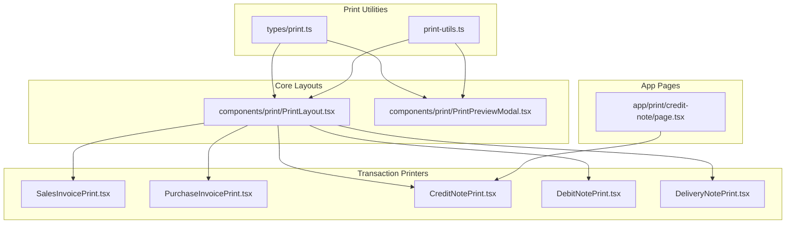
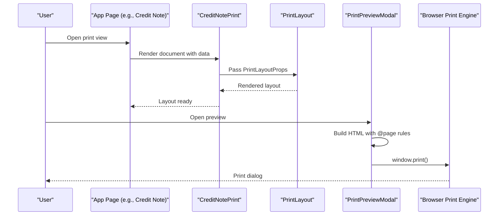
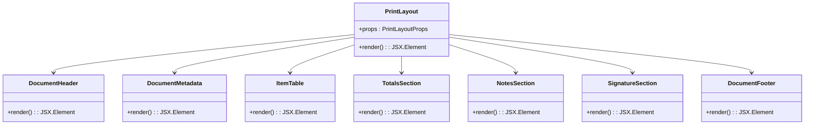
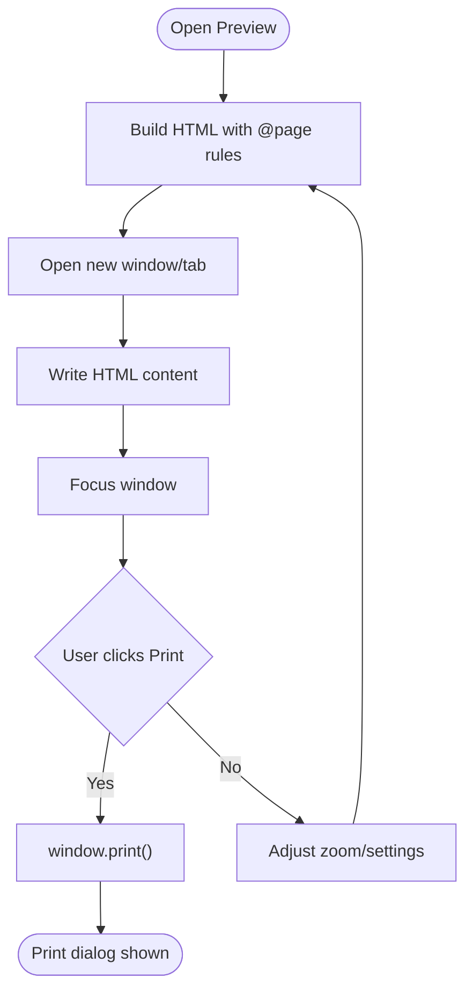
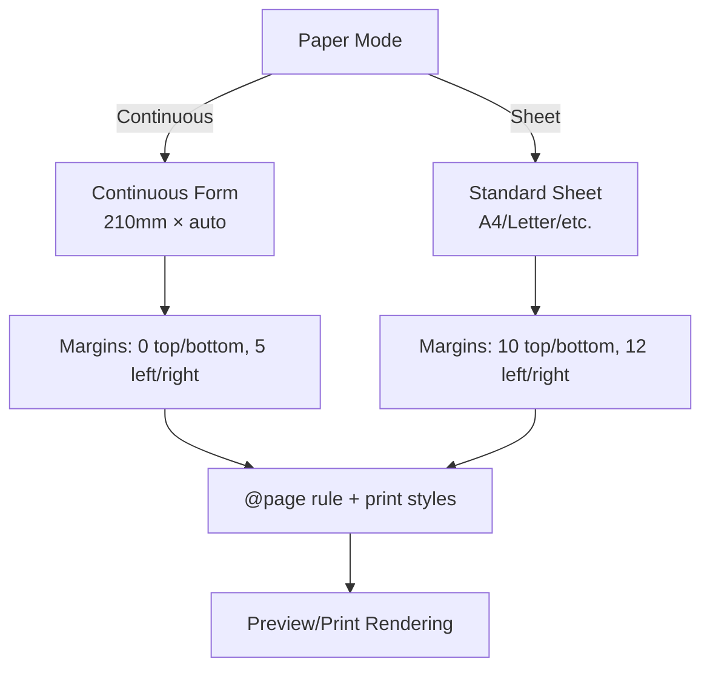
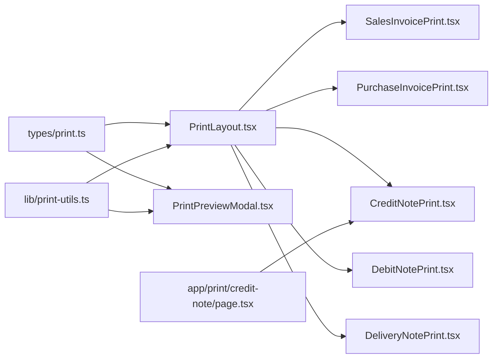

# Print Components

<cite>
**Referenced Files in This Document**
- [PrintLayout.tsx](file://components/print/PrintLayout.tsx)
- [PrintPreviewModal.tsx](file://components/print/PrintPreviewModal.tsx)
- [CreditNotePrint.tsx](file://components/print/CreditNotePrint.tsx)
- [PurchaseInvoicePrint.tsx](file://components/print/PurchaseInvoicePrint.tsx)
- [SalesInvoicePrint.tsx](file://components/print/SalesInvoicePrint.tsx)
- [DebitNotePrint.tsx](file://components/print/DebitNotePrint.tsx)
- [DeliveryNotePrint.tsx](file://components/print/DeliveryNotePrint.tsx)
- [print-utils.ts](file://lib/print-utils.ts)
- [print.ts](file://types/print.ts)
- [page.tsx](file://app/print/credit-note/page.tsx)
</cite>

## Table of Contents
1. [Introduction](#introduction)
2. [Project Structure](#project-structure)
3. [Core Components](#core-components)
4. [Architecture Overview](#architecture-overview)
5. [Detailed Component Analysis](#detailed-component-analysis)
6. [Dependency Analysis](#dependency-analysis)
7. [Performance Considerations](#performance-considerations)
8. [Troubleshooting Guide](#troubleshooting-guide)
9. [Conclusion](#conclusion)
10. [Appendices](#appendices)

## Introduction
This document describes the print system components used to generate transaction documents and financial reports. It covers:
- Document layouts for transaction documents (PrintLayout)
- Print preview and printing orchestration (PrintPreviewModal)
- Specialized print components for sales invoices, purchase invoices, credit notes, debit notes, and delivery notes
- Print utilities supporting A4 sheet mode and continuous form mode
- Print optimization, accessibility, cross-browser compatibility, and responsive print layouts

## Project Structure
The print system is organized around reusable layout components, specialized document printers, a unified preview modal, and shared utilities/types.

**Diagram sources**
- [print-utils.ts](file://lib/print-utils.ts#L1-L574)
- [print.ts](file://types/print.ts#L1-L327)
- [PrintLayout.tsx](file://components/print/PrintLayout.tsx#L1-L401)
- [PrintPreviewModal.tsx](file://components/print/PrintPreviewModal.tsx#L1-L352)
- [SalesInvoicePrint.tsx](file://components/print/SalesInvoicePrint.tsx#L1-L135)
- [PurchaseInvoicePrint.tsx](file://components/print/PurchaseInvoicePrint.tsx#L1-L120)
- [CreditNotePrint.tsx](file://components/print/CreditNotePrint.tsx#L1-L111)
- [DebitNotePrint.tsx](file://components/print/DebitNotePrint.tsx#L1-L112)
- [DeliveryNotePrint.tsx](file://components/print/DeliveryNotePrint.tsx#L1-L87)
- [page.tsx](file://app/print/credit-note/page.tsx#L66-L90)

**Section sources**
- [print-utils.ts](file://lib/print-utils.ts#L1-L574)
- [print.ts](file://types/print.ts#L1-L327)
- [PrintLayout.tsx](file://components/print/PrintLayout.tsx#L1-L401)
- [PrintPreviewModal.tsx](file://components/print/PrintPreviewModal.tsx#L1-L352)
- [SalesInvoicePrint.tsx](file://components/print/SalesInvoicePrint.tsx#L1-L135)
- [PurchaseInvoicePrint.tsx](file://components/print/PurchaseInvoicePrint.tsx#L1-L120)
- [CreditNotePrint.tsx](file://components/print/CreditNotePrint.tsx#L1-L111)
- [DebitNotePrint.tsx](file://components/print/DebitNotePrint.tsx#L1-L112)
- [DeliveryNotePrint.tsx](file://components/print/DeliveryNotePrint.tsx#L1-L87)
- [page.tsx](file://app/print/credit-note/page.tsx#L66-L90)

## Core Components
- PrintLayout: Reusable layout for transaction documents with continuous form support, structured sections (header, metadata, items, totals, notes, signatures, footer).
- PrintPreviewModal: Unified modal for previewing and printing with zoom, paper size selection, continuous/sheet modes, and print/save-to-PDF actions.
- Print utilities: Dimension conversions, paper mode validation, CSS @page rule generation, Indonesian localization helpers.
- Specialized printers: SalesInvoicePrint, PurchaseInvoicePrint, CreditNotePrint, DebitNotePrint, DeliveryNotePrint, each mapping domain data to PrintLayout props.

Key capabilities:
- Dual paper modes: continuous form (210mm width, flexible height) for transactions; A4 sheet mode for reports.
- Responsive print layouts using CSS media queries and scalable preview frames.
- Accessibility and cross-browser compatibility via explicit print color adjustments and standardized typography.

**Section sources**
- [PrintLayout.tsx](file://components/print/PrintLayout.tsx#L505-L621)
- [PrintPreviewModal.tsx](file://components/print/PrintPreviewModal.tsx#L42-L58)
- [print-utils.ts](file://lib/print-utils.ts#L153-L276)
- [print.ts](file://types/print.ts#L17-L64)

## Architecture Overview
The print system follows a layered architecture:
- Types define paper modes, sizes, orientations, and component props.
- Utilities encapsulate dimension calculations and localization.
- Core layout components provide reusable structure.
- Specialized printers adapt domain data to layout props.
- Preview modal orchestrates rendering and printing.

**Diagram sources**
- [page.tsx](file://app/print/credit-note/page.tsx#L66-L90)
- [CreditNotePrint.tsx](file://components/print/CreditNotePrint.tsx#L50-L110)
- [PrintLayout.tsx](file://components/print/PrintLayout.tsx#L72-L93)
- [PrintPreviewModal.tsx](file://components/print/PrintPreviewModal.tsx#L92-L172)

## Detailed Component Analysis

### PrintLayout (Transaction Documents)
PrintLayout renders transaction documents with continuous form format. It composes:
- DocumentHeader: Company branding and document title with status badge
- DocumentMetadata: Document number/date, party info, and optional fields
- ItemTable: Dynamic columns with row numbers and aligned values
- TotalsSection: Subtotal/tax/total with currency formatting and terbilang
- NotesSection: Optional notes block
- SignatureSection: Signature boxes with labels
- DocumentFooter: Timestamp and attribution

Design highlights:
- Uses CSS-in-JS for print-friendly styles and page-break avoidance
- Supports localized labels and currency formatting
- Enforces continuous form dimensions (210mm width, flexible height)

**Diagram sources**
- [PrintLayout.tsx](file://components/print/PrintLayout.tsx#L29-L466)

**Section sources**
- [PrintLayout.tsx](file://components/print/PrintLayout.tsx#L505-L621)

### PrintPreviewModal (Preview and Printing)
PrintPreviewModal provides:
- Zoom controls (min/max configurable)
- Paper mode selector (continuous vs sheet)
- Paper size and orientation controls (sheet mode)
- Print and Save as PDF actions
- Content frame with customizable padding/background/shadow
- Automatic @page rule generation and CSS injection

Behavior:
- Builds a complete HTML document with embedded styles for accurate print rendering
- Opens a new window/tab, writes the HTML, and triggers the browser’s print dialog
- Supports continuous form mode with fixed width and auto height

**Diagram sources**
- [PrintPreviewModal.tsx](file://components/print/PrintPreviewModal.tsx#L92-L172)

**Section sources**
- [PrintPreviewModal.tsx](file://components/print/PrintPreviewModal.tsx#L42-L352)

### Print Utilities (A4 vs Continuous Form)
Utilities centralize:
- Conversions between mm and px (96 DPI)
- Paper dimensions for A4 and international sizes
- Continuous form constants (printable width, margins, total width)
- Page dimension calculation and CSS @page rule generation
- Localization helpers (labels, currency, dates, terbilang)
- Paper mode validation (transactions vs reports)

**Diagram sources**
- [print-utils.ts](file://lib/print-utils.ts#L153-L276)

**Section sources**
- [print-utils.ts](file://lib/print-utils.ts#L1-L574)
- [print.ts](file://types/print.ts#L17-L64)

### Specialized Print Components

#### SalesInvoicePrint
- Purpose: Print sales invoices with NPWP, tax breakdown, due date, and bank account notes
- Key props: documentTitle, documentNumber, documentDate, status, company info, party info, items, pricing, terbilang, notes, signatures
- Paper mode: continuous

Integration example path:
- [page.tsx](file://app/print/credit-note/page.tsx#L66-L90) demonstrates how a page constructs PrintLayout props and renders the layout inside the preview modal

**Section sources**
- [SalesInvoicePrint.tsx](file://components/print/SalesInvoicePrint.tsx#L50-L135)
- [page.tsx](file://app/print/credit-note/page.tsx#L66-L90)

#### PurchaseInvoicePrint
- Purpose: Print purchase invoices with supplier invoice reference, related PR, and due date
- Key props: similar to sales invoice with supplier info and reference fields
- Paper mode: continuous

**Section sources**
- [PurchaseInvoicePrint.tsx](file://components/print/PurchaseInvoicePrint.tsx#L49-L120)

#### CreditNotePrint
- Purpose: Print credit notes with return reference and terbilang normalization
- Key props: customer info, items, totals, notes, signatures
- Paper mode: continuous

**Section sources**
- [CreditNotePrint.tsx](file://components/print/CreditNotePrint.tsx#L50-L111)

#### DebitNotePrint
- Purpose: Print debit notes referencing purchase invoices
- Key props: supplier info, items, totals, notes, signatures
- Paper mode: continuous

**Section sources**
- [DebitNotePrint.tsx](file://components/print/DebitNotePrint.tsx#L49-L112)

#### DeliveryNotePrint
- Purpose: Print delivery notes without pricing; includes driver, vehicle, and warehouse info
- Key props: customer info, items with warehouse, driver/vehicle, delivery date, signatures
- Paper mode: continuous

**Section sources**
- [DeliveryNotePrint.tsx](file://components/print/DeliveryNotePrint.tsx#L37-L87)

## Dependency Analysis
The print system exhibits low coupling and high cohesion:
- PrintLayout depends on types for props and localization utilities
- PrintPreviewModal depends on print-utils for dimension and CSS generation
- Specialized printers depend on PrintLayout and types
- App pages orchestrate data fetching and pass props to printers

**Diagram sources**
- [print.ts](file://types/print.ts#L1-L327)
- [PrintLayout.tsx](file://components/print/PrintLayout.tsx#L1-L401)
- [PrintPreviewModal.tsx](file://components/print/PrintPreviewModal.tsx#L1-L352)
- [print-utils.ts](file://lib/print-utils.ts#L1-L574)
- [SalesInvoicePrint.tsx](file://components/print/SalesInvoicePrint.tsx#L1-L135)
- [PurchaseInvoicePrint.tsx](file://components/print/PurchaseInvoicePrint.tsx#L1-L120)
- [CreditNotePrint.tsx](file://components/print/CreditNotePrint.tsx#L1-L111)
- [DebitNotePrint.tsx](file://components/print/DebitNotePrint.tsx#L1-L112)
- [DeliveryNotePrint.tsx](file://components/print/DeliveryNotePrint.tsx#L1-L87)
- [page.tsx](file://app/print/credit-note/page.tsx#L66-L90)

**Section sources**
- [print.ts](file://types/print.ts#L1-L327)
- [print-utils.ts](file://lib/print-utils.ts#L1-L574)
- [PrintLayout.tsx](file://components/print/PrintLayout.tsx#L1-L401)
- [PrintPreviewModal.tsx](file://components/print/PrintPreviewModal.tsx#L1-L352)
- [SalesInvoicePrint.tsx](file://components/print/SalesInvoicePrint.tsx#L1-L135)
- [PurchaseInvoicePrint.tsx](file://components/print/PurchaseInvoicePrint.tsx#L1-L120)
- [CreditNotePrint.tsx](file://components/print/CreditNotePrint.tsx#L1-L111)
- [DebitNotePrint.tsx](file://components/print/DebitNotePrint.tsx#L1-L112)
- [DeliveryNotePrint.tsx](file://components/print/DeliveryNotePrint.tsx#L1-L87)
- [page.tsx](file://app/print/credit-note/page.tsx#L66-L90)

## Performance Considerations
- Minimize DOM in preview: Render only necessary sections and avoid heavy images in preview mode
- Prefer CSS transforms for zoom to reduce reflows
- Use fixed widths for columns to prevent layout thrashing during print
- Cache formatted currency/date strings to avoid repeated formatting
- Avoid unnecessary re-renders by passing memoized props to PrintLayout
- Use print-color-adjust to ensure accurate color reproduction on thermal/dot-matrix printers

## Troubleshooting Guide
Common issues and resolutions:
- Continuous form misalignment: Verify tractor margins and printable width; ensure @page rule sets size to 210mm width with auto height
- Sheet mode cropping: Confirm paper size and orientation; adjust margins if content overflows
- Print quality degradation: Set print-color-adjust to exact; disable browser print optimizations that alter colors
- Cross-browser differences: Test across browsers; ensure CSS @page rules are supported; provide fallbacks for unsupported features
- Large documents: Break content into pages using page-break properties; avoid long tables without pagination
- Accessibility: Provide alt text for logos; ensure sufficient contrast; test with screen readers

## Conclusion
The print system provides a robust, extensible foundation for generating transaction documents and reports. By separating concerns across utilities, layouts, and specialized printers, it achieves maintainability and consistency. The dual paper mode design ensures optimal output for both continuous forms and A4 sheets, while utilities and modal components streamline preview and printing workflows.

## Appendices

### Print Integration Example Path
- Credit Note print page constructs PrintLayout props and renders the layout inside the preview modal
  - [page.tsx](file://app/print/credit-note/page.tsx#L66-L90)

### Print Quality Optimization Checklist
- Use mm-based dimensions and 96 DPI conversion
- Apply print-color-adjust: exact
- Keep fonts simple and legible
- Avoid transparency and complex backgrounds
- Validate page breaks and column widths
- Test with target printers (dot matrix, thermal)