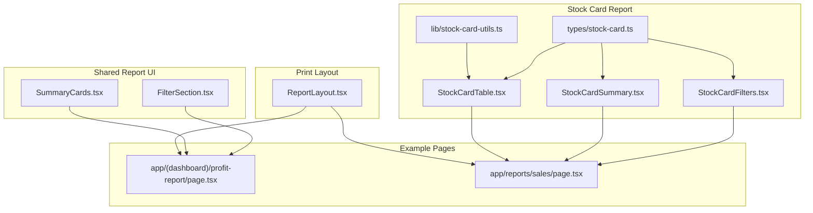
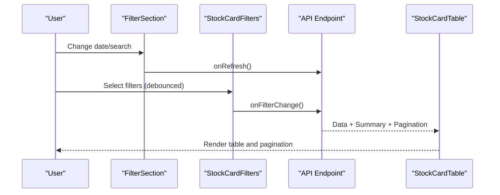
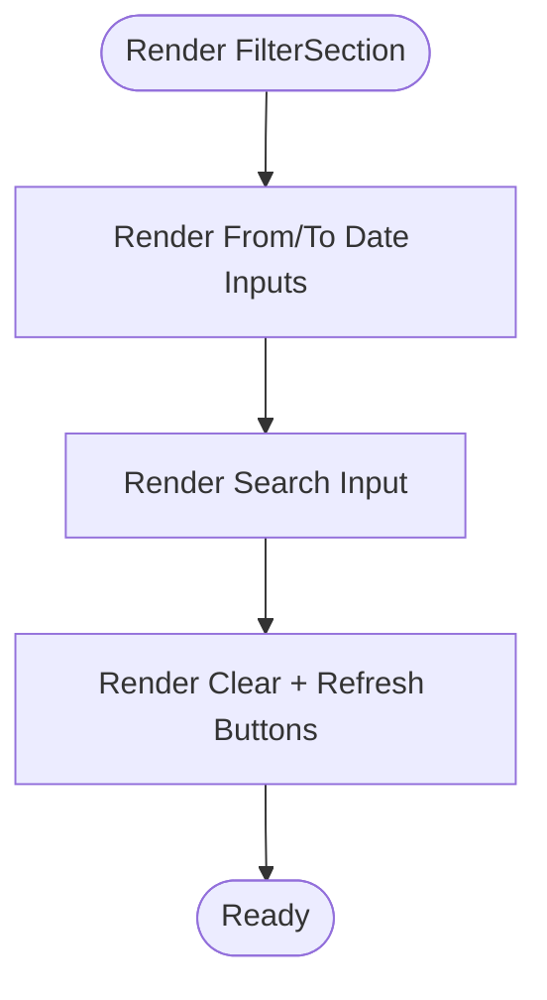
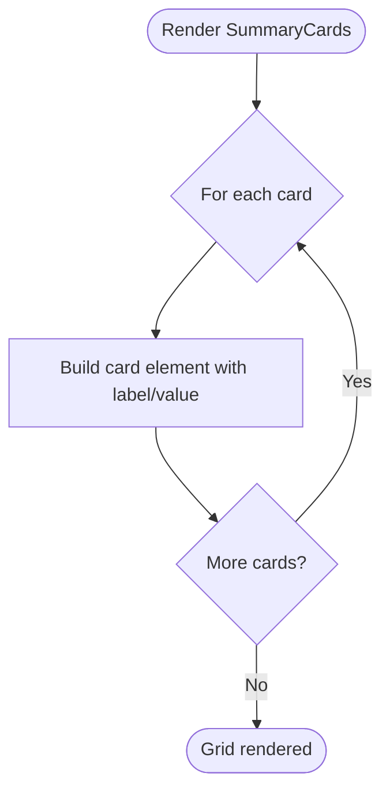
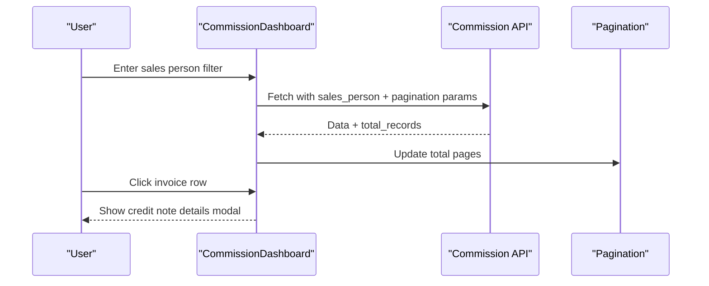
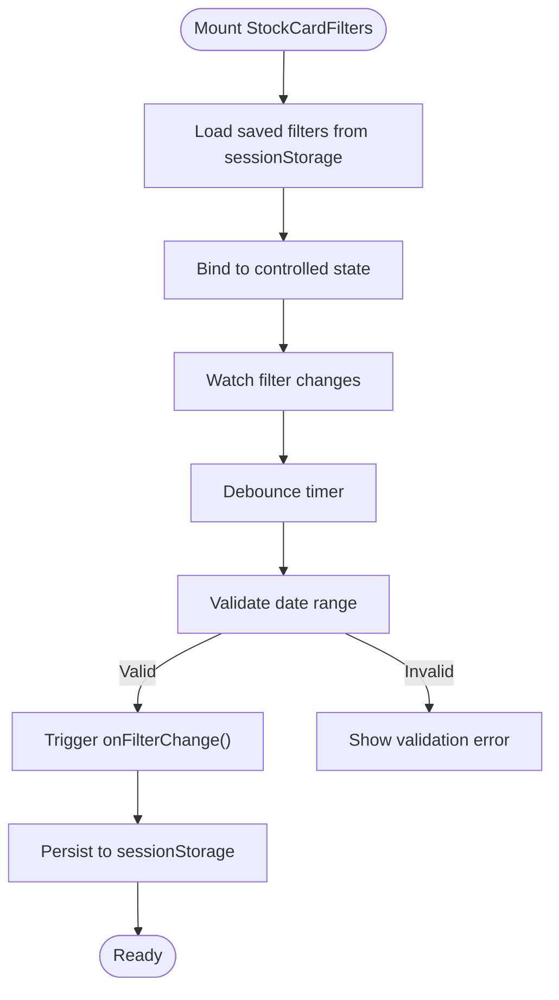
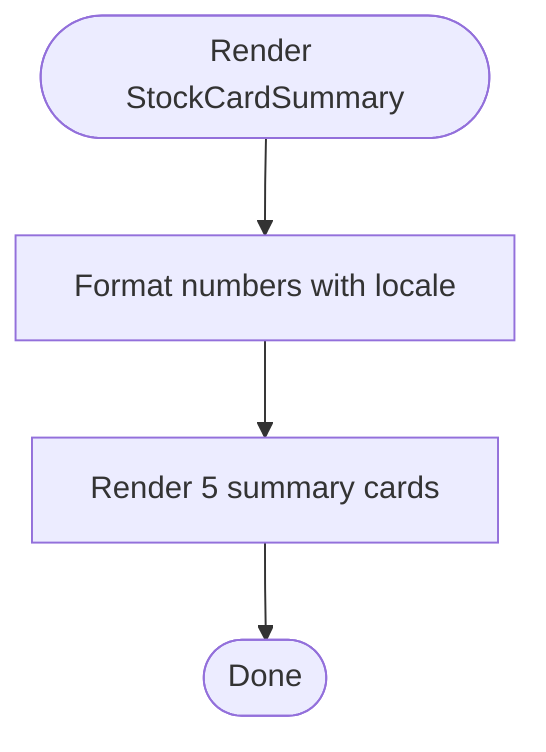
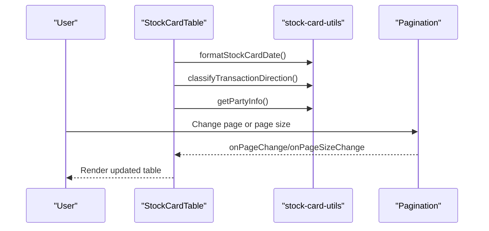
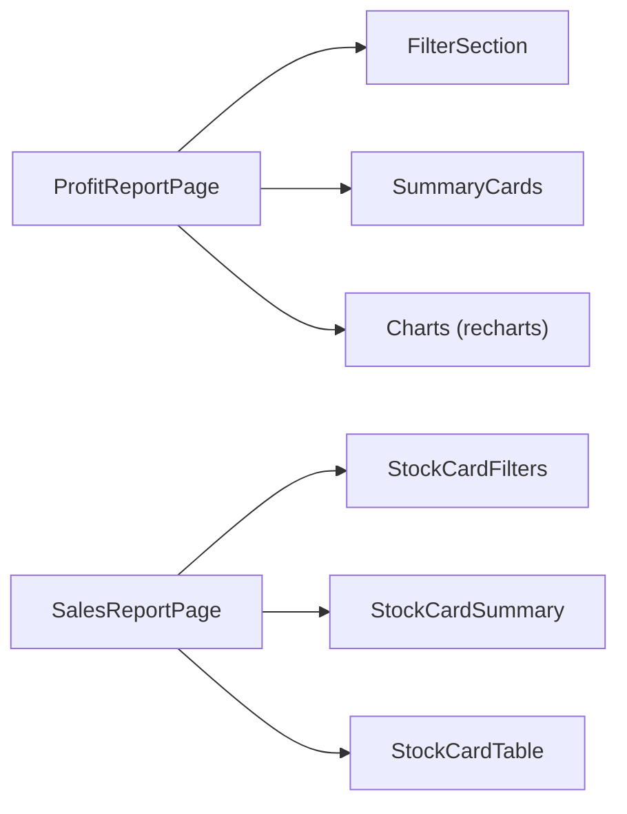
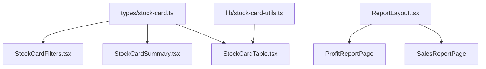

# Report Components

<cite>
**Referenced Files in This Document**
- [FilterSection.tsx](file://components/reports/FilterSection.tsx)
- [SummaryCards.tsx](file://components/reports/SummaryCards.tsx)
- [CommissionDashboard.tsx](file://components/CommissionDashboard.tsx)
- [StockCardFilters.tsx](file://components/stock-card/StockCardFilters.tsx)
- [StockCardSummary.tsx](file://components/stock-card/StockCardSummary.tsx)
- [StockCardTable.tsx](file://components/stock-card/StockCardTable.tsx)
- [stock-card.ts](file://types/stock-card.ts)
- [stock-card-utils.ts](file://lib/stock-card-utils.ts)
- [ReportLayout.tsx](file://components/print/ReportLayout.tsx)
- [page.tsx](file://app/(dashboard)/profit-report/page.tsx)
- [page.tsx](file://app/reports/sales/page.tsx)
</cite>

## Table of Contents
1. [Introduction](#introduction)
2. [Project Structure](#project-structure)
3. [Core Components](#core-components)
4. [Architecture Overview](#architecture-overview)
5. [Detailed Component Analysis](#detailed-component-analysis)
6. [Dependency Analysis](#dependency-analysis)
7. [Performance Considerations](#performance-considerations)
8. [Troubleshooting Guide](#troubleshooting-guide)
9. [Conclusion](#conclusion)
10. [Appendices](#appendices)

## Introduction
This document explains the report components used across the system, focusing on:
- FilterSection for report filtering
- SummaryCards for key metrics display
- CommissionDashboard for business analytics
- Stock card components: filters, summary calculations, and transaction tables

It also covers integration patterns, data visualization, responsive design, performance optimization for large datasets, and accessibility considerations for data presentation.

## Project Structure
The report components are organized by domain:
- Shared report UI building blocks under components/reports
- Stock card report under components/stock-card
- Print/report layout under components/print
- Example report pages under app/reports and app/(dashboard)

**Diagram sources**
- [FilterSection.tsx](file://components/reports/FilterSection.tsx#L1-L92)
- [SummaryCards.tsx](file://components/reports/SummaryCards.tsx#L1-L46)
- [StockCardFilters.tsx](file://components/stock-card/StockCardFilters.tsx#L1-L645)
- [StockCardSummary.tsx](file://components/stock-card/StockCardSummary.tsx#L1-L140)
- [StockCardTable.tsx](file://components/stock-card/StockCardTable.tsx#L1-L426)
- [stock-card.ts](file://types/stock-card.ts#L1-L364)
- [stock-card-utils.ts](file://lib/stock-card-utils.ts#L1-L321)
- [ReportLayout.tsx](file://components/print/ReportLayout.tsx#L1-L381)
- [page.tsx](file://app/(dashboard)/profit-report/page.tsx#L1-L910)
- [page.tsx](file://app/reports/sales/page.tsx#L1-L550)

**Section sources**
- [FilterSection.tsx](file://components/reports/FilterSection.tsx#L1-L92)
- [SummaryCards.tsx](file://components/reports/SummaryCards.tsx#L1-L46)
- [StockCardFilters.tsx](file://components/stock-card/StockCardFilters.tsx#L1-L645)
- [StockCardSummary.tsx](file://components/stock-card/StockCardSummary.tsx#L1-L140)
- [StockCardTable.tsx](file://components/stock-card/StockCardTable.tsx#L1-L426)
- [stock-card.ts](file://types/stock-card.ts#L1-L364)
- [stock-card-utils.ts](file://lib/stock-card-utils.ts#L1-L321)
- [ReportLayout.tsx](file://components/print/ReportLayout.tsx#L1-L381)
- [page.tsx](file://app/(dashboard)/profit-report/page.tsx#L1-L910)
- [page.tsx](file://app/reports/sales/page.tsx#L1-L550)

## Core Components
- FilterSection: A reusable filter bar with date range, search, optional additional filters, and action buttons (clear and refresh).
- SummaryCards: A grid of metric cards with color-coded categories.
- CommissionDashboard: A specialized analytics dashboard with summary cards, recent sales orders, paid invoices, credit note details, and pagination.
- StockCardFilters: A comprehensive filter panel for stock card reports with debounced updates, validation, and persistent state.
- StockCardSummary: Summary cards for opening/closing balances, total in/out, and transaction count.
- StockCardTable: A responsive, paginated table for stock ledger entries with progress bars and drill-down capabilities.

**Section sources**
- [FilterSection.tsx](file://components/reports/FilterSection.tsx#L1-L92)
- [SummaryCards.tsx](file://components/reports/SummaryCards.tsx#L1-L46)
- [CommissionDashboard.tsx](file://components/CommissionDashboard.tsx#L1-L349)
- [StockCardFilters.tsx](file://components/stock-card/StockCardFilters.tsx#L1-L645)
- [StockCardSummary.tsx](file://components/stock-card/StockCardSummary.tsx#L1-L140)
- [StockCardTable.tsx](file://components/stock-card/StockCardTable.tsx#L1-L426)

## Architecture Overview
The report components follow a pattern:
- Props-driven UI with controlled state
- Debounced API calls and validation
- Utility modules for formatting and calculations
- Print/report layout for A4 exports

**Diagram sources**
- [FilterSection.tsx](file://components/reports/FilterSection.tsx#L16-L91)
- [StockCardFilters.tsx](file://components/stock-card/StockCardFilters.tsx#L122-L147)
- [StockCardTable.tsx](file://components/stock-card/StockCardTable.tsx#L75-L81)

## Detailed Component Analysis

### FilterSection
- Purpose: Provide a standardized filter bar for reports.
- Inputs: from/to dates, search term, optional additional filters, callbacks for clear/refresh.
- Behavior: Two-column layout on small screens, four-column on larger screens; action buttons for quick actions.

**Diagram sources**
- [FilterSection.tsx](file://components/reports/FilterSection.tsx#L28-L91)

**Section sources**
- [FilterSection.tsx](file://components/reports/FilterSection.tsx#L1-L92)

### SummaryCards
- Purpose: Display KPIs in visually distinct cards.
- Inputs: array of cards with label, value, and color category.
- Behavior: Responsive grid with color classes mapped to semantic colors.

**Diagram sources**
- [SummaryCards.tsx](file://components/reports/SummaryCards.tsx#L27-L45)

**Section sources**
- [SummaryCards.tsx](file://components/reports/SummaryCards.tsx#L1-L46)

### CommissionDashboard
- Purpose: Business analytics for commission reporting.
- Data model: summary metrics, sales orders, paid invoices with credit note adjustments.
- Interactions: sales person filter, pagination, expandable credit note details.
- Rendering: summary cards, two-column layout for recent orders and paid invoices, detailed modal for credit notes.

**Diagram sources**
- [CommissionDashboard.tsx](file://components/CommissionDashboard.tsx#L36-L84)
- [CommissionDashboard.tsx](file://components/CommissionDashboard.tsx#L48-L80)
- [CommissionDashboard.tsx](file://components/CommissionDashboard.tsx#L336-L345)

**Section sources**
- [CommissionDashboard.tsx](file://components/CommissionDashboard.tsx#L1-L349)

### StockCardFilters
- Purpose: Advanced filters for stock card reports with robust validation and persistence.
- Features:
  - Debounced filter updates to reduce API calls
  - Date range validation with localized error messages
  - Persistent filters in sessionStorage
  - Multi-select dropdowns with search and clear
  - Required item filter enforced
- Types: Strongly typed filters, dropdown options, and API parameters.

**Diagram sources**
- [StockCardFilters.tsx](file://components/stock-card/StockCardFilters.tsx#L48-L72)
- [StockCardFilters.tsx](file://components/stock-card/StockCardFilters.tsx#L122-L147)
- [StockCardFilters.tsx](file://components/stock-card/StockCardFilters.tsx#L158-L164)

**Section sources**
- [StockCardFilters.tsx](file://components/stock-card/StockCardFilters.tsx#L1-L645)
- [stock-card.ts](file://types/stock-card.ts#L87-L115)

### StockCardSummary
- Purpose: Present summarized stock metrics with icons and units.
- Inputs: opening/closing balances, total in/out, transaction count, item name, and unit of measure.
- Formatting: Uses Indonesian locale for thousands separators.

**Diagram sources**
- [StockCardSummary.tsx](file://components/stock-card/StockCardSummary.tsx#L35-L40)
- [StockCardSummary.tsx](file://components/stock-card/StockCardSummary.tsx#L103-L136)

**Section sources**
- [StockCardSummary.tsx](file://components/stock-card/StockCardSummary.tsx#L1-L140)
- [stock-card.ts](file://types/stock-card.ts#L289-L310)

### StockCardTable
- Purpose: Display stock ledger entries with responsive design and pagination.
- Features:
  - Desktop/tablet and mobile views
  - Progress bars for quantities
  - Drill-down via links to source documents
  - Pagination controls with page size selector
  - Loading skeleton and empty state
- Utilities: date formatting, direction classification, party info extraction.

**Diagram sources**
- [StockCardTable.tsx](file://components/stock-card/StockCardTable.tsx#L75-L81)
- [stock-card-utils.ts](file://lib/stock-card-utils.ts#L74-L95)
- [stock-card-utils.ts](file://lib/stock-card-utils.ts#L117-L124)
- [stock-card-utils.ts](file://lib/stock-card-utils.ts#L145-L170)

**Section sources**
- [StockCardTable.tsx](file://components/stock-card/StockCardTable.tsx#L1-L426)
- [stock-card-utils.ts](file://lib/stock-card-utils.ts#L1-L321)
- [stock-card.ts](file://types/stock-card.ts#L289-L363)

### Example Integrations and Visualization Patterns
- Profit Report page integrates:
  - FilterSection-like filters
  - SummaryCards for KPIs
  - Charts (recharts) for comparative insights
  - Drilldown tables and print/export
- Sales Report page demonstrates:
  - Responsive tables with progress indicators
  - Summary cards for totals and averages
  - Pagination and print preview modal

**Diagram sources**
- [page.tsx](file://app/(dashboard)/profit-report/page.tsx#L390-L483)
- [page.tsx](file://app/(dashboard)/profit-report/page.tsx#L495-L515)
- [page.tsx](file://app/(dashboard)/profit-report/page.tsx#L517-L530)
- [page.tsx](file://app/reports/sales/page.tsx#L320-L399)
- [page.tsx](file://app/reports/sales/page.tsx#L401-L419)
- [page.tsx](file://app/reports/sales/page.tsx#L421-L539)

**Section sources**
- [page.tsx](file://app/(dashboard)/profit-report/page.tsx#L1-L910)
- [page.tsx](file://app/reports/sales/page.tsx#L1-L550)

## Dependency Analysis
- Data types: stock-card.ts defines interfaces for filters, ledger entries, summaries, pagination, and API params.
- Utilities: stock-card-utils.ts provides formatting, direction classification, party info, and date range validation.
- Print/report layout: ReportLayout.tsx standardizes A4 printing with pagination and headers/footers.

**Diagram sources**
- [stock-card.ts](file://types/stock-card.ts#L1-L364)
- [stock-card-utils.ts](file://lib/stock-card-utils.ts#L1-L321)
- [ReportLayout.tsx](file://components/print/ReportLayout.tsx#L1-L381)
- [page.tsx](file://app/(dashboard)/profit-report/page.tsx#L1-L910)
- [page.tsx](file://app/reports/sales/page.tsx#L1-L550)

**Section sources**
- [stock-card.ts](file://types/stock-card.ts#L1-L364)
- [stock-card-utils.ts](file://lib/stock-card-utils.ts#L1-L321)
- [ReportLayout.tsx](file://components/print/ReportLayout.tsx#L1-L381)

## Performance Considerations
- Debounced filter updates: StockCardFilters uses a debounce timer to avoid excessive API calls during typing.
- Client-side pagination: SalesReportPage caches full dataset and slices for pagination to reduce server load.
- Skeleton and empty states: StockCardTable renders skeletons while loading and empty state when no data is returned.
- Responsive rendering: StockCardTable switches to a mobile-friendly card layout on smaller screens.
- Formatting: Using locale-aware number formatting avoids expensive reflows by delegating to browser APIs.

[No sources needed since this section provides general guidance]

## Troubleshooting Guide
- Date range validation errors: StockCardFilters displays localized error messages when to_date precedes from_date.
- Missing or invalid dates: stock-card-utils.validateDateRange ensures both dates are present and valid before enabling filters.
- API failures: CommissionDashboard sets loading to false and shows a failure message when data cannot be fetched.
- Empty states: StockCardTable shows a neutral icon and message when no transactions match the filters.

**Section sources**
- [StockCardFilters.tsx](file://components/stock-card/StockCardFilters.tsx#L158-L164)
- [stock-card-utils.ts](file://lib/stock-card-utils.ts#L193-L276)
- [CommissionDashboard.tsx](file://components/CommissionDashboard.tsx#L75-L80)
- [StockCardTable.tsx](file://components/stock-card/StockCardTable.tsx#L140-L166)

## Conclusion
These report components provide a consistent, accessible, and performant foundation for analytical views. They emphasize:
- Clear filtering and validation
- Responsive layouts and pagination
- Rich summaries and drilldowns
- Print-ready layouts
- Strong typing and utility functions for data transformations

[No sources needed since this section summarizes without analyzing specific files]

## Appendices

### Accessibility Considerations
- Semantic HTML: Tables use proper headers and captions; progress bars use accessible ARIA attributes.
- Keyboard navigation: Focus states and tab order preserved across modals and dialogs.
- Screen reader support: Status badges and progress indicators include concise labels.
- Color contrast: Summary cards use sufficient contrast for text and backgrounds.

[No sources needed since this section provides general guidance]

### Data Visualization Patterns
- Summary metrics: SummaryCards and StockCardSummary present KPIs with color-coded emphasis.
- Comparative charts: ProfitReportPage uses recharts for bar charts with tooltips and legends.
- Progress indicators: SalesReportPage shows percentage completion with progress bars.

**Section sources**
- [SummaryCards.tsx](file://components/reports/SummaryCards.tsx#L27-L45)
- [StockCardSummary.tsx](file://components/stock-card/StockCardSummary.tsx#L45-L86)
- [page.tsx](file://app/(dashboard)/profit-report/page.tsx#L517-L530)
- [page.tsx](file://app/reports/sales/page.tsx#L448-L529)