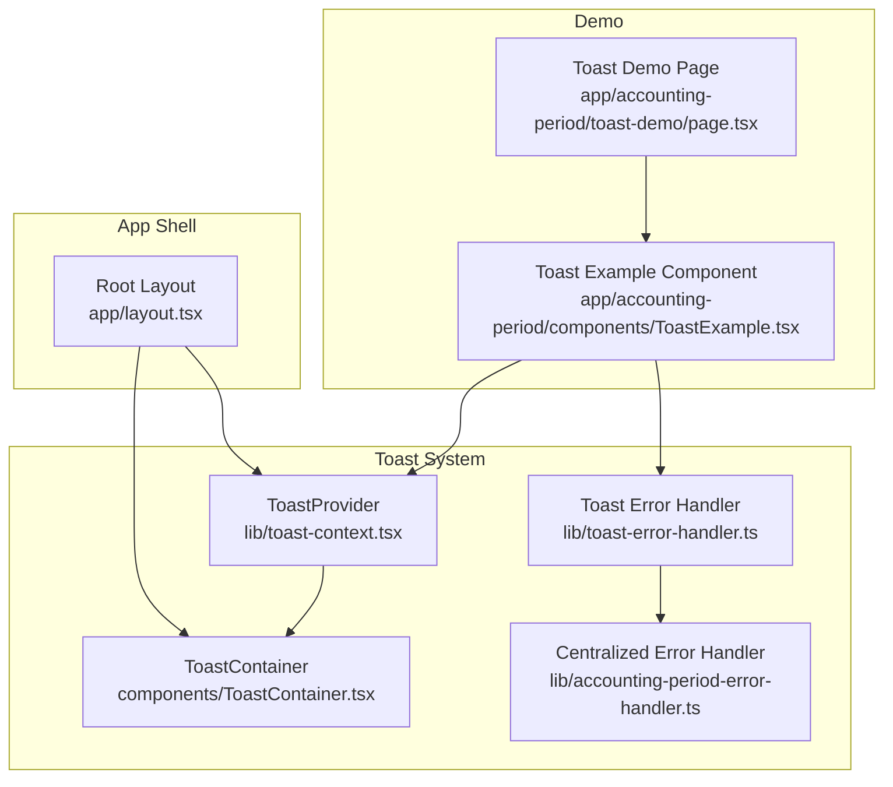
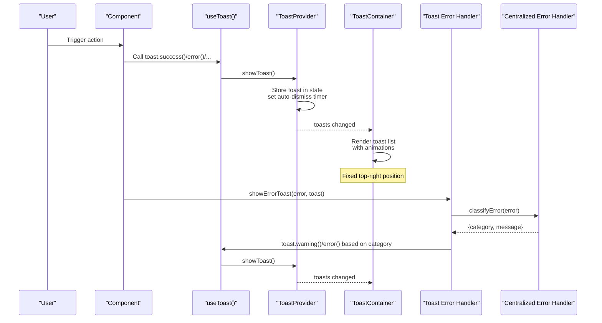
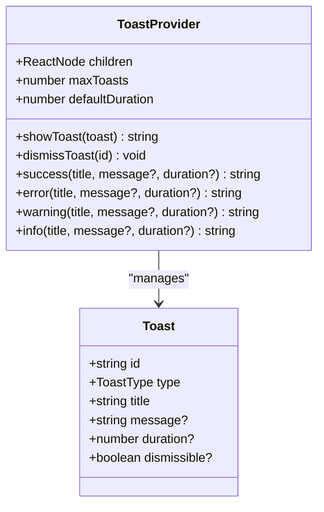
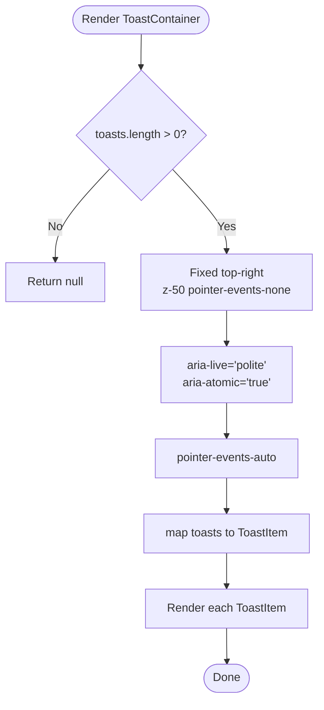
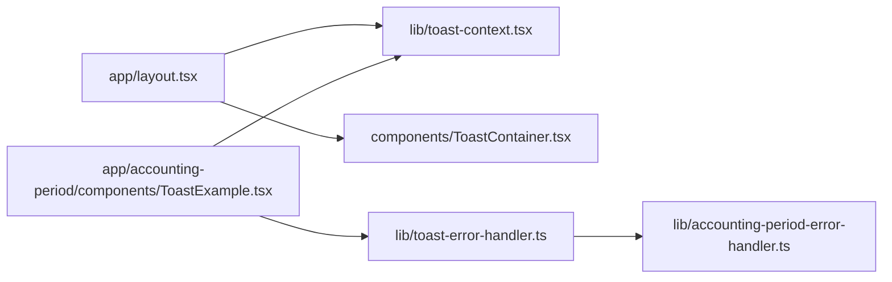

# Toast Notifications

<cite>
**Referenced Files in This Document**
- [README.md](file://components/toast/README.md)
- [toast-context.tsx](file://lib/toast-context.tsx)
- [toast-error-handler.ts](file://lib/toast-error-handler.ts)
- [ToastContainer.tsx](file://components/ToastContainer.tsx)
- [layout.tsx](file://app/layout.tsx)
- [ToastExample.tsx](file://app/accounting-period/components/ToastExample.tsx)
- [TOAST_USAGE_EXAMPLES.md](file://lib/TOAST_USAGE_EXAMPLES.md)
- [accounting-period-error-handler.ts](file://lib/accounting-period-error-handler.ts)
- [toast-demo/page.tsx](file://app/accounting-period/toast-demo/page.tsx)
</cite>

## Table of Contents
1. [Introduction](#introduction)
2. [Project Structure](#project-structure)
3. [Core Components](#core-components)
4. [Architecture Overview](#architecture-overview)
5. [Detailed Component Analysis](#detailed-component-analysis)
6. [Dependency Analysis](#dependency-analysis)
7. [Performance Considerations](#performance-considerations)
8. [Troubleshooting Guide](#troubleshooting-guide)
9. [Conclusion](#conclusion)
10. [Appendices](#appendices)

## Introduction
This document describes the toast notification system used across the ERP Next application. It covers the ToastContainer setup, error handling integration, notification lifecycle, types, positioning, auto-dismiss behavior, customization options, accessibility, and practical usage patterns in business operations.

## Project Structure
The toast system is composed of:
- A React Context provider that manages state and exposes convenience APIs
- A container component that renders toasts in a fixed position
- An error handler integration that maps application errors to user-friendly toasts
- A demo page showcasing usage patterns

**Diagram sources**
- [layout.tsx](file://app/layout.tsx#L30-L52)
- [toast-context.tsx](file://lib/toast-context.tsx#L53-L126)
- [ToastContainer.tsx](file://components/ToastContainer.tsx#L147-L171)
- [toast-error-handler.ts](file://lib/toast-error-handler.ts#L1-L211)
- [accounting-period-error-handler.ts](file://lib/accounting-period-error-handler.ts#L1-L552)
- [toast-demo/page.tsx](file://app/accounting-period/toast-demo/page.tsx#L1-L6)
- [ToastExample.tsx](file://app/accounting-period/components/ToastExample.tsx#L1-L216)

**Section sources**
- [layout.tsx](file://app/layout.tsx#L30-L52)
- [README.md](file://components/toast/README.md#L1-L305)

## Core Components
- ToastProvider: React Context provider that manages the toast queue, auto-dismiss timers, and exposes convenience methods for showing toasts.
- ToastContainer: Renders all active toasts in a fixed top-right position with animations and accessibility attributes.
- Toast Error Handler: Bridges centralized error handling with toast notifications, mapping error categories to appropriate toast types and durations.
- Centralized Error Handler: Provides error classification, retry logic, structured error responses, and user-friendly messages.

Key capabilities:
- Four toast types: success, error, warning, info
- Auto-dismiss with configurable duration
- Manual dismissal
- Max toasts limit (default 5)
- Smooth slide-in animation
- Tailwind-based responsive styling
- Accessibility: ARIA roles and labels
- Integration with centralized error handling

**Section sources**
- [toast-context.tsx](file://lib/toast-context.tsx#L16-L138)
- [ToastContainer.tsx](file://components/ToastContainer.tsx#L17-L171)
- [toast-error-handler.ts](file://lib/toast-error-handler.ts#L18-L211)
- [accounting-period-error-handler.ts](file://lib/accounting-period-error-handler.ts#L17-L552)

## Architecture Overview
The toast system is initialized at the root layout level and consumed anywhere in the app via the useToast hook. Error flows leverage the centralized error handler to produce consistent, user-friendly toasts.

**Diagram sources**
- [layout.tsx](file://app/layout.tsx#L38-L49)
- [toast-context.tsx](file://lib/toast-context.tsx#L64-L93)
- [ToastContainer.tsx](file://components/ToastContainer.tsx#L147-L171)
- [toast-error-handler.ts](file://lib/toast-error-handler.ts#L32-L68)
- [accounting-period-error-handler.ts](file://lib/accounting-period-error-handler.ts#L172-L299)

## Detailed Component Analysis

### ToastProvider
Responsibilities:
- Maintains an array of active toasts
- Generates unique IDs and applies defaults (duration, dismissible)
- Enforces max toasts limit
- Schedules auto-dismiss timers
- Exposes convenience methods: success, error, warning, info
- Exposes low-level showToast and dismissToast

Implementation highlights:
- Uses React state and callbacks to manage immutable updates
- Limits toasts to the most recent N entries
- Auto-dismiss uses setTimeout with duration > 0
- Provides a typed context value for safe consumption

**Diagram sources**
- [toast-context.tsx](file://lib/toast-context.tsx#L47-L138)

**Section sources**
- [toast-context.tsx](file://lib/toast-context.tsx#L47-L138)

### ToastContainer
Responsibilities:
- Renders all active toasts from the context
- Fixed top-right position with z-index
- Accessibility: role="alert", aria-live="polite", aria-atomic="true"
- Per-toast dismissal button with ARIA label
- Color-coded styling per toast type
- Slide-in animation using Tailwind classes

Behavior:
- Hidden when no toasts are present
- Dismissal removes the toast from state
- Dismissible flag controls presence of close button

**Diagram sources**
- [ToastContainer.tsx](file://components/ToastContainer.tsx#L147-L171)

**Section sources**
- [ToastContainer.tsx](file://components/ToastContainer.tsx#L147-L171)

### Toast Error Handler Integration
Responsibilities:
- Maps application errors to appropriate toast types
- Provides convenience functions for common business actions
- Uses centralized error classification to decide warning vs error

Key functions:
- showErrorToast(error, toast, customTitle?)
- showApiErrorToast(errorResponse, toast, customTitle?)
- showSuccessToast(action, toast, details?)
- showValidationWarningToast(message, toast, details?)
- showInfoToast(message, toast, details?)
- showPeriodCreatedToast(periodName, toast)
- showPeriodClosedToast(periodName, toast)
- showPeriodReopenedToast(periodName, toast)
- showPeriodPermanentlyClosedToast(periodName, toast)
- showValidationResultsToast(passed, failedCount, toast)
- showConfigUpdatedToast(toast)

Classification logic:
- Validation and business logic errors -> warning
- Others -> error
- Duration tuned for readability (7000ms)

**Section sources**
- [toast-error-handler.ts](file://lib/toast-error-handler.ts#L32-L211)
- [accounting-period-error-handler.ts](file://lib/accounting-period-error-handler.ts#L172-L299)

### Centralized Error Handler
Provides:
- Error classification by category and status
- User-friendly messages mapped to error codes
- Retry logic for transient errors
- Structured API error responses
- Validation helpers for business rules

Used by the toast error handler to classify and present errors consistently.

**Section sources**
- [accounting-period-error-handler.ts](file://lib/accounting-period-error-handler.ts#L17-L552)

### Demo and Usage Patterns
- Demo page routes to a component that exercises all toast types and integration patterns
- Example component demonstrates basic toasts, period-specific actions, validation results, and error handling
- Usage examples document best practices and advanced configurations

**Section sources**
- [toast-demo/page.tsx](file://app/accounting-period/toast-demo/page.tsx#L1-L6)
- [ToastExample.tsx](file://app/accounting-period/components/ToastExample.tsx#L20-L216)
- [TOAST_USAGE_EXAMPLES.md](file://lib/TOAST_USAGE_EXAMPLES.md#L1-L329)

## Dependency Analysis
High-level dependencies:
- Root layout initializes ToastProvider and mounts ToastContainer
- Components consume useToast hook
- Toast error handler depends on centralized error handler
- Demo components depend on both providers and handlers

**Diagram sources**
- [layout.tsx](file://app/layout.tsx#L38-L49)
- [toast-context.tsx](file://lib/toast-context.tsx#L53-L126)
- [ToastContainer.tsx](file://components/ToastContainer.tsx#L147-L171)
- [ToastExample.tsx](file://app/accounting-period/components/ToastExample.tsx#L10-L18)
- [toast-error-handler.ts](file://lib/toast-error-handler.ts#L8-L12)
- [accounting-period-error-handler.ts](file://lib/accounting-period-error-handler.ts#L11-L11)

**Section sources**
- [layout.tsx](file://app/layout.tsx#L38-L49)
- [toast-error-handler.ts](file://lib/toast-error-handler.ts#L8-L12)

## Performance Considerations
- Auto-dismiss timers: Each active toast creates a timer; consider reducing maxToasts or duration for high-frequency operations.
- Rendering cost: ToastContainer maps over active toasts; keep the list bounded by maxToasts.
- Animations: Tailwind animations are lightweight; ensure they do not conflict with heavy page transitions.
- Memory: Toasts are removed from state on dismissal; no persistent memory leaks expected.

[No sources needed since this section provides general guidance]

## Troubleshooting Guide
Common issues and resolutions:
- Toasts not appearing
  - Ensure ToastProvider wraps the component tree
  - Confirm ToastContainer is rendered in the layout
  - Verify useToast is used inside a component under ToastProvider
- TypeScript errors
  - Import from correct paths
  - Ensure all required props are provided
  - Confirm the context is available
- Styling issues
  - Ensure Tailwind CSS is configured
  - Check z-index stacking (z-50)
  - Verify fixed positioning is not overridden
- Accessibility concerns
  - Confirm role="alert" and aria-live attributes are present
  - Ensure dismiss buttons have aria-label
  - Test with screen readers

**Section sources**
- [README.md](file://components/toast/README.md#L265-L281)
- [ToastContainer.tsx](file://components/ToastContainer.tsx#L156-L158)
- [ToastContainer.tsx](file://components/ToastContainer.tsx#L131-L131)

## Conclusion
The toast notification system provides a robust, accessible, and user-friendly feedback mechanism across the ERP Next application. It integrates seamlessly with the centralized error handling, supports multiple toast types with sensible defaults, and offers customization for duration and dismissal behavior. The demo and usage examples demonstrate practical integration patterns for forms, API calls, and business operations.

[No sources needed since this section summarizes without analyzing specific files]

## Appendices

### Notification Lifecycle
- Creation: showToast or convenience methods enqueue a toast with defaults
- Rendering: ToastContainer maps active toasts to ToastItem components
- Auto-dismiss: Timers remove toasts after duration (unless duration is 0)
- Manual dismissal: Close button triggers dismissToast
- Cleanup: Removed toasts are purged from state

**Section sources**
- [toast-context.tsx](file://lib/toast-context.tsx#L64-L93)
- [ToastContainer.tsx](file://components/ToastContainer.tsx#L147-L171)

### Accessibility and Keyboard Navigation
- role="alert" on each toast
- aria-live="polite" and aria-atomic="true" on container
- Dismiss button has aria-label
- Focus ring per toast type for keyboard users
- Screen reader announcements supported

**Section sources**
- [ToastContainer.tsx](file://components/ToastContainer.tsx#L104-L104)
- [ToastContainer.tsx](file://components/ToastContainer.tsx#L157-L158)
- [ToastContainer.tsx](file://components/ToastContainer.tsx#L131-L131)
- [ToastContainer.tsx](file://components/ToastContainer.tsx#L125-L129)

### Responsive Behavior
- Toasts use max-w-md and responsive grid layouts in demos
- Fixed positioning remains consistent across breakpoints
- Tailwind utilities ensure readable typography and spacing

**Section sources**
- [ToastContainer.tsx](file://components/ToastContainer.tsx#L98-L103)
- [ToastExample.tsx](file://app/accounting-period/components/ToastExample.tsx#L89-L216)

### Practical Integration Examples
- Form submission: Show success on completion, warning for validation, error for failures
- API calls with retry: Use withRetry to surface progress and final outcomes
- Validation results: Display pass/fail with counts
- Period actions: Use period-specific success toasts for create/close/reopen

**Section sources**
- [TOAST_USAGE_EXAMPLES.md](file://lib/TOAST_USAGE_EXAMPLES.md#L206-L273)
- [toast-error-handler.ts](file://lib/toast-error-handler.ts#L140-L210)
- [ToastExample.tsx](file://app/accounting-period/components/ToastExample.tsx#L20-L86)