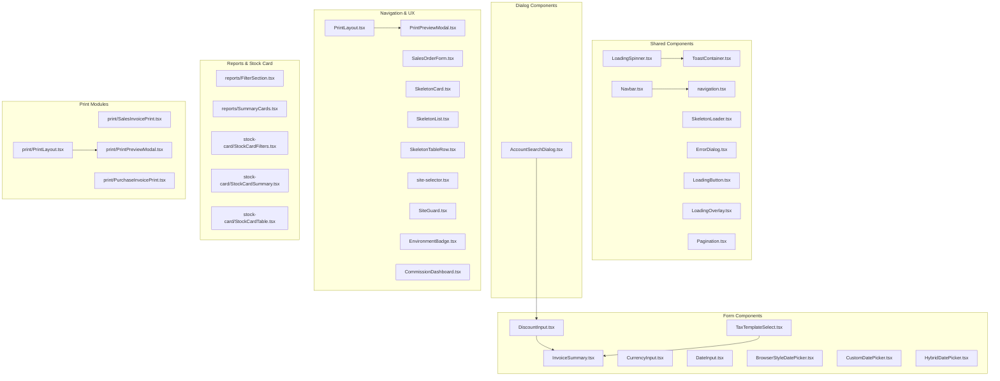
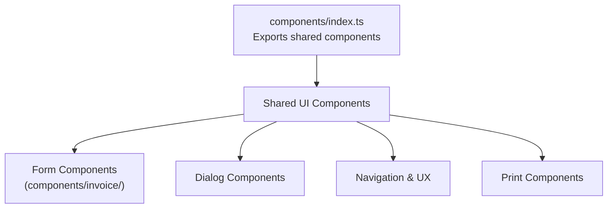
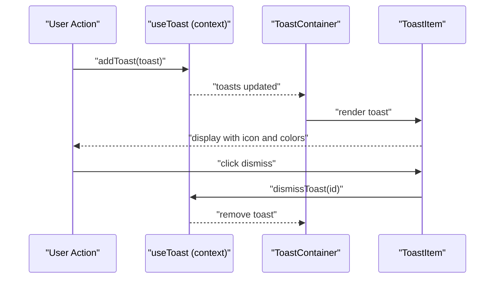
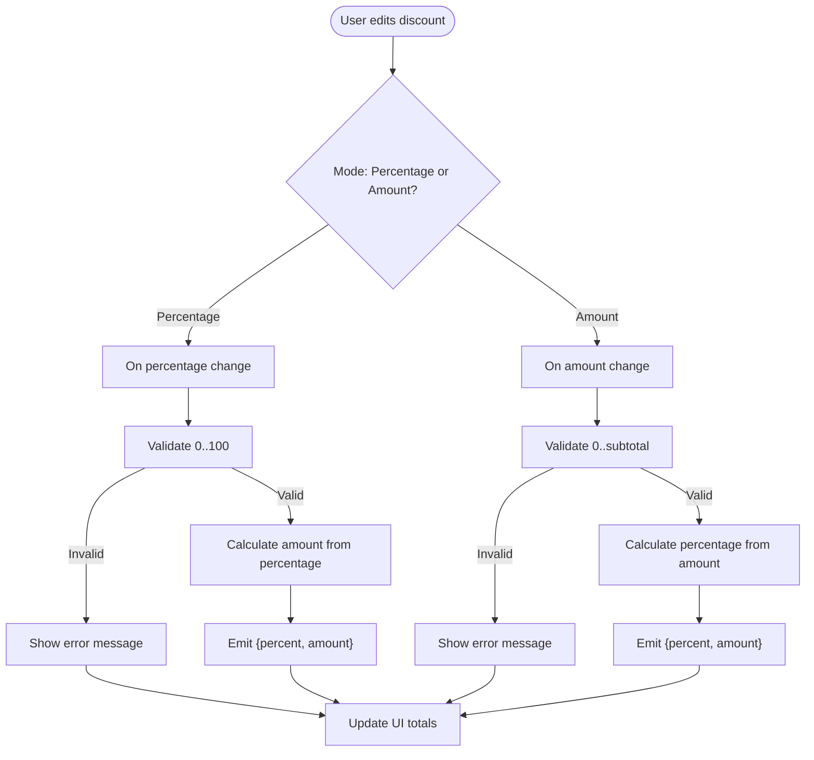
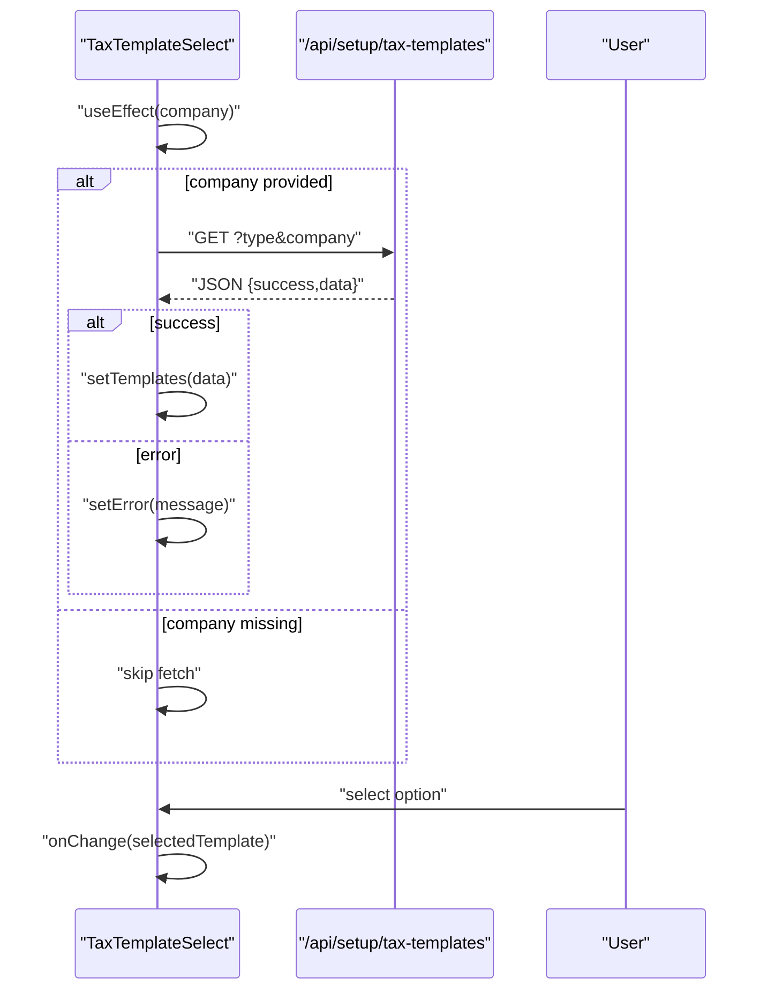
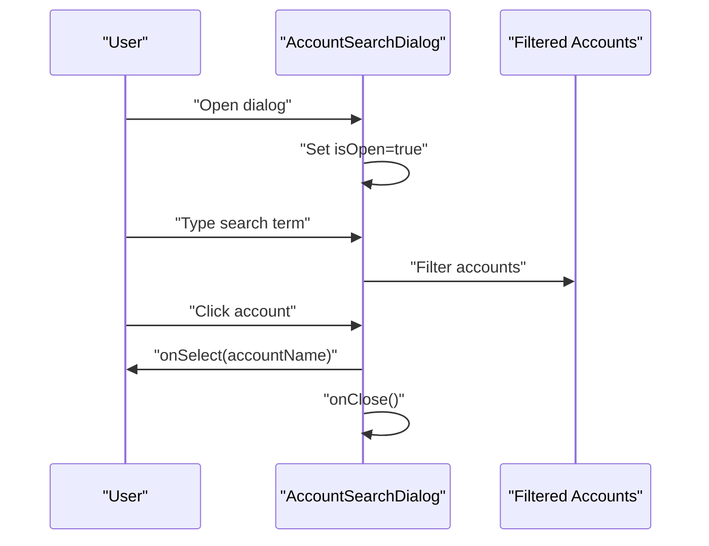
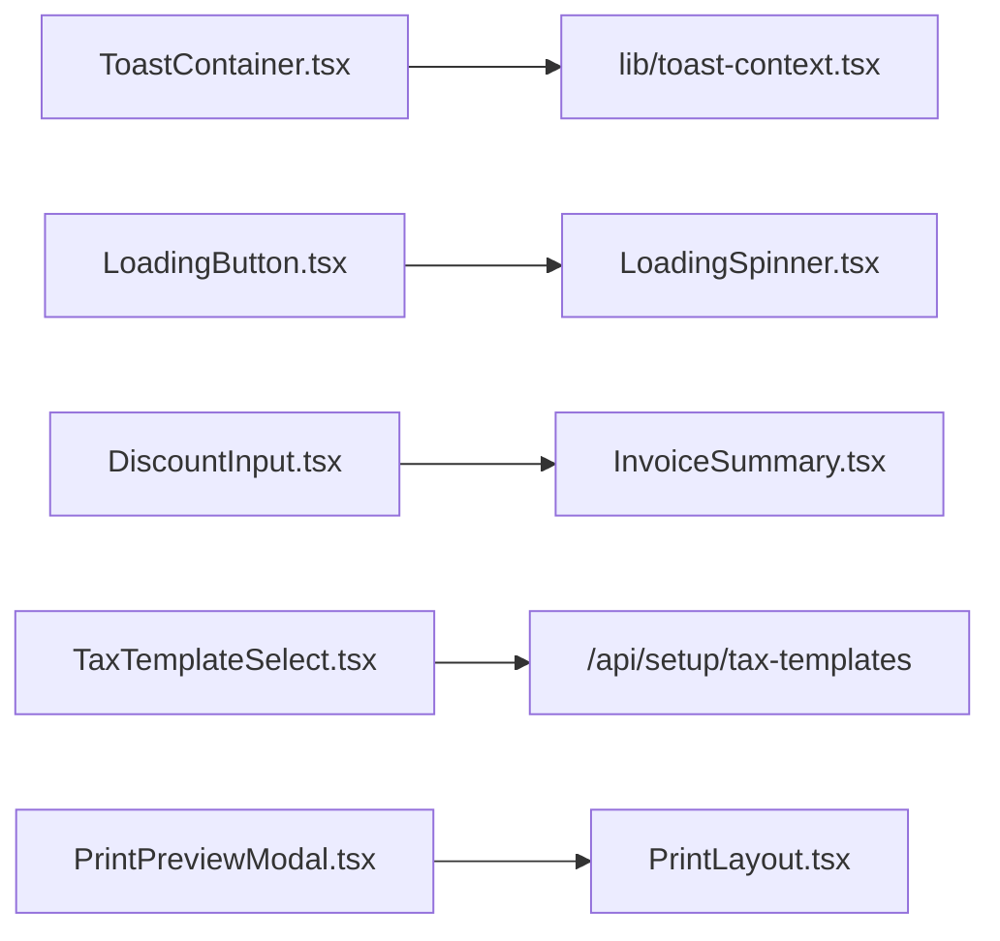

# UI Component Library

<cite>
**Referenced Files in This Document**
- [components/index.ts](file://components/index.ts)
- [components/LoadingSpinner.tsx](file://components/LoadingSpinner.tsx)
- [components/SkeletonLoader.tsx](file://components/SkeletonLoader.tsx)
- [components/ToastContainer.tsx](file://components/ToastContainer.tsx)
- [components/ErrorDialog.tsx](file://components/ErrorDialog.tsx)
- [components/LoadingButton.tsx](file://components/LoadingButton.tsx)
- [components/LoadingOverlay.tsx](file://components/LoadingOverlay.tsx)
- [components/invoice/DiscountInput.tsx](file://components/invoice/DiscountInput.tsx)
- [components/invoice/TaxTemplateSelect.tsx](file://components/invoice/TaxTemplateSelect.tsx)
- [components/invoice/InvoiceSummary.tsx](file://components/invoice/InvoiceSummary.tsx)
- [components/AccountSearchDialog.tsx](file://components/AccountSearchDialog.tsx)
- [components/Navbar.tsx](file://app/components/Navbar.tsx)
- [components/Pagination.tsx](file://app/components/Pagination.tsx)
- [components/navigation.tsx](file://app/components/navigation.tsx)
- [components/CurrencyInput.tsx](file://app/components/CurrencyInput.tsx)
- [components/DateInput.tsx](file://app/components/DateInput.tsx)
- [components/BrowserStyleDatePicker.tsx](file://components/BrowserStyleDatePicker.tsx)
- [components/CustomDatePicker.tsx](file://components/CustomDatePicker.tsx)
- [components/HybridDatePicker.tsx](file://components/HybridDatePicker.tsx)
- [components/PrintLayout.tsx](file://components/PrintLayout.tsx)
- [components/PrintPreviewModal.tsx](file://components/PrintPreviewModal.tsx)
- [components/SalesOrderForm.tsx](file://components/SalesOrderForm.tsx)
- [components/SkeletonCard.tsx](file://components/SkeletonCard.tsx)
- [components/SkeletonList.tsx](file://components/SkeletonList.tsx)
- [components/SkeletonTableRow.tsx](file://components/SkeletonTableRow.tsx)
- [components/site-selector.tsx](file://components/site-selector.tsx)
- [components/SiteGuard.tsx](file://components/SiteGuard.tsx)
- [components/EnvironmentBadge.tsx](file://components/EnvironmentBadge.tsx)
- [components/CommissionDashboard.tsx](file://components/CommissionDashboard.tsx)
- [components/reports/FilterSection.tsx](file://components/reports/FilterSection.tsx)
- [components/reports/SummaryCards.tsx](file://components/reports/SummaryCards.tsx)
- [components/stock-card/StockCardFilters.tsx](file://components/stock-card/StockCardFilters.tsx)
- [components/stock-card/StockCardSummary.tsx](file://components/stock-card/StockCardSummary.tsx)
- [components/stock-card/StockCardTable.tsx](file://components/stock-card/StockCardTable.tsx)
- [components/print/SalesInvoicePrint.tsx](file://components/print/SalesInvoicePrint.tsx)
- [components/print/PurchaseInvoicePrint.tsx](file://components/print/PurchaseInvoicePrint.tsx)
- [components/print/PrintLayout.tsx](file://components/print/PrintLayout.tsx)
- [components/print/PrintPreviewModal.tsx](file://components/print/PrintPreviewModal.tsx)
- [lib/toast-context.tsx](file://lib/toast-context.tsx)
- [lib/use-loading.ts](file://lib/use-loading.ts)
- [hooks/useExpandableRows.ts](file://hooks/useExpandableRows.ts)
- [hooks/useInfiniteScroll.ts](file://hooks/useInfiniteScroll.ts)
- [hooks/useInvoiceCalculation.ts](file://hooks/useInvoiceCalculation.ts)
- [hooks/useIsMobile.ts](file://hooks/useIsMobile.ts)
- [app/accounting-period/components/NotificationCenter.tsx](file://app/accounting-period/components/NotificationCenter.tsx)
- [app/accounting-period/components/NotificationBadge.tsx](file://app/accounting-period/components/NotificationBadge.tsx)
- [app/accounting-period/components/LoadingExample.tsx](file://app/accounting-period/components/LoadingExample.tsx)
- [app/accounting-period/components/ToastExample.tsx](file://app/accounting-period/components/ToastExample.tsx)
- [app/dashboard/components/CompanySelector.tsx](file://app/dashboard/components/CompanySelector.tsx)
- [app/payment/paymentMain/CompactPaymentForm.tsx](file://app/payment/paymentMain/CompactPaymentForm.tsx)
- [app/payment/paymentMain/InvoiceAllocationTable.tsx](file://app/payment/paymentMain/InvoiceAllocationTable.tsx)
- [app/payment/paymentMain/PreviewAccordion.tsx](file://app/payment/paymentMain/PreviewAccordion.tsx)
- [app/payment/paymentMain/component-optimized.tsx](file://app/payment/paymentMain/component-optimized.tsx)
- [app/payment/paymentMain/component-original.tsx](file://app/payment/paymentMain/component-original.tsx)
</cite>

## Table of Contents
1. [Introduction](#introduction)
2. [Project Structure](#project-structure)
3. [Core Components](#core-components)
4. [Architecture Overview](#architecture-overview)
5. [Detailed Component Analysis](#detailed-component-analysis)
6. [Dependency Analysis](#dependency-analysis)
7. [Performance Considerations](#performance-considerations)
8. [Troubleshooting Guide](#troubleshooting-guide)
9. [Conclusion](#conclusion)
10. [Appendices](#appendices)

## Introduction
This document describes the UI Component Library used across the ERP Next system. It covers shared components, form components, dialog components, and navigation elements. It explains component architecture, prop interfaces, usage patterns, and integration points. It also documents form components including input validation, real-time calculations, and error handling; dialog components for search, selection, and confirmation workflows; navigation components; loading states and skeleton loaders; and toast notifications. Finally, it addresses customization, theming, responsive design, accessibility, cross-browser compatibility, and performance optimization.

## Project Structure
The UI component library is organized primarily under components/ and app/components/. Shared components are exported via components/index.ts. Form components live under components/invoice/, dialogs include AccountSearchDialog.tsx and several others, and navigation elements are located in app/components/.

**Diagram sources**
- [components/index.ts](file://components/index.ts#L1-L10)
- [components/LoadingSpinner.tsx](file://components/LoadingSpinner.tsx#L1-L63)
- [components/SkeletonLoader.tsx](file://components/SkeletonLoader.tsx#L1-L178)
- [components/ToastContainer.tsx](file://components/ToastContainer.tsx#L1-L172)
- [components/ErrorDialog.tsx](file://components/ErrorDialog.tsx#L1-L38)
- [components/LoadingButton.tsx](file://components/LoadingButton.tsx#L1-L73)
- [components/LoadingOverlay.tsx](file://components/LoadingOverlay.tsx#L1-L54)
- [components/invoice/DiscountInput.tsx](file://components/invoice/DiscountInput.tsx#L1-L219)
- [components/invoice/TaxTemplateSelect.tsx](file://components/invoice/TaxTemplateSelect.tsx#L1-L192)
- [components/invoice/InvoiceSummary.tsx](file://components/invoice/InvoiceSummary.tsx#L1-L185)
- [components/AccountSearchDialog.tsx](file://components/AccountSearchDialog.tsx#L1-L130)
- [components/Navbar.tsx](file://app/components/Navbar.tsx)
- [components/Pagination.tsx](file://app/components/Pagination.tsx)
- [components/navigation.tsx](file://app/components/navigation.tsx)
- [components/CurrencyInput.tsx](file://app/components/CurrencyInput.tsx)
- [components/DateInput.tsx](file://app/components/DateInput.tsx)
- [components/BrowserStyleDatePicker.tsx](file://components/BrowserStyleDatePicker.tsx)
- [components/CustomDatePicker.tsx](file://components/CustomDatePicker.tsx)
- [components/HybridDatePicker.tsx](file://components/HybridDatePicker.tsx)
- [components/PrintLayout.tsx](file://components/PrintLayout.tsx)
- [components/PrintPreviewModal.tsx](file://components/PrintPreviewModal.tsx)
- [components/SalesOrderForm.tsx](file://components/SalesOrderForm.tsx)
- [components/SkeletonCard.tsx](file://components/SkeletonCard.tsx)
- [components/SkeletonList.tsx](file://components/SkeletonList.tsx)
- [components/SkeletonTableRow.tsx](file://components/SkeletonTableRow.tsx)
- [components/site-selector.tsx](file://components/site-selector.tsx)
- [components/SiteGuard.tsx](file://components/SiteGuard.tsx)
- [components/EnvironmentBadge.tsx](file://components/EnvironmentBadge.tsx)
- [components/CommissionDashboard.tsx](file://components/CommissionDashboard.tsx)
- [components/reports/FilterSection.tsx](file://components/reports/FilterSection.tsx)
- [components/reports/SummaryCards.tsx](file://components/reports/SummaryCards.tsx)
- [components/stock-card/StockCardFilters.tsx](file://components/stock-card/StockCardFilters.tsx)
- [components/stock-card/StockCardSummary.tsx](file://components/stock-card/StockCardSummary.tsx)
- [components/stock-card/StockCardTable.tsx](file://components/stock-card/StockCardTable.tsx)
- [components/print/SalesInvoicePrint.tsx](file://components/print/SalesInvoicePrint.tsx)
- [components/print/PurchaseInvoicePrint.tsx](file://components/print/PurchaseInvoicePrint.tsx)
- [components/print/PrintLayout.tsx](file://components/print/PrintLayout.tsx)
- [components/print/PrintPreviewModal.tsx](file://components/print/PrintPreviewModal.tsx)

**Section sources**
- [components/index.ts](file://components/index.ts#L1-L10)

## Core Components
This section outlines the foundational UI building blocks: loading indicators, skeletons, toasts, overlays, buttons, and dialogs.

- LoadingSpinner: Configurable spinner with size, variant, optional message, and accessibility attributes.
- SkeletonLoader: Base skeleton plus specialized variants for cards, lists, tables, and domain-specific dashboards.
- ToastContainer: Renders multiple toasts with type-specific styling, icons, and dismissal behavior.
- ErrorDialog: Modal dialog for displaying error messages with a close action.
- LoadingButton: Button with loading state, variant and size options, and integrated spinner.
- LoadingOverlay: Full-screen or container overlay with spinner and optional message.

Usage patterns:
- Prefer LoadingSpinner for small inline indicators and LoadingOverlay for blocking operations.
- Use SkeletonLoader variants to provide perceived performance during data fetches.
- ToastContainer should wrap the app to manage global notifications; integrate with lib/toast-context.tsx.
- ErrorDialog is controlled via isOpen and onClose props; ensure proper focus management and keyboard handling.

**Section sources**
- [components/LoadingSpinner.tsx](file://components/LoadingSpinner.tsx#L10-L63)
- [components/SkeletonLoader.tsx](file://components/SkeletonLoader.tsx#L10-L178)
- [components/ToastContainer.tsx](file://components/ToastContainer.tsx#L10-L172)
- [components/ErrorDialog.tsx](file://components/ErrorDialog.tsx#L3-L38)
- [components/LoadingButton.tsx](file://components/LoadingButton.tsx#L10-L73)
- [components/LoadingOverlay.tsx](file://components/LoadingOverlay.tsx#L10-L54)

## Architecture Overview
The component library follows a modular, export-focused structure. Shared components are exported from components/index.ts. Form components are grouped under components/invoice/. Dialogs and navigation elements live under components/ and app/components/. Print components are split into general print utilities and document-specific print components.

**Diagram sources**
- [components/index.ts](file://components/index.ts#L1-L10)

## Detailed Component Analysis

### Loading and Skeleton Components
- LoadingSpinner: Props include size, variant, className, and message. Accessibility attributes include role and aria-label.
- SkeletonLoader: Base Skeleton, SkeletonText, SkeletonCard, SkeletonTable, SkeletonList, and domain-specific dashboards. Uses animation and semantic roles for accessibility.
- LoadingButton: Inherits button attributes, supports loading state, variant, size, and loadingText. Integrates LoadingSpinner with size scaling.
- LoadingOverlay: Full-screen or container overlay with backdrop blur and message. Announces loading state via aria-live and aria-busy.

Best practices:
- Use LoadingOverlay for destructive operations or page transitions.
- Use SkeletonLoader to maintain layout stability during async data loads.
- Keep LoadingSpinner small and unobtrusive; reserve large spinners for LoadingOverlay.

**Section sources**
- [components/LoadingSpinner.tsx](file://components/LoadingSpinner.tsx#L10-L63)
- [components/SkeletonLoader.tsx](file://components/SkeletonLoader.tsx#L10-L178)
- [components/LoadingButton.tsx](file://components/LoadingButton.tsx#L10-L73)
- [components/LoadingOverlay.tsx](file://components/LoadingOverlay.tsx#L10-L54)

### Toast Notifications
- ToastContainer renders all active toasts from a global context provider. Each toast item displays icon, title, optional message, and dismiss button when enabled. Uses type-specific colors and animations.
- Integration: Consumes lib/toast-context.tsx for state management.

**Diagram sources**
- [components/ToastContainer.tsx](file://components/ToastContainer.tsx#L147-L172)
- [lib/toast-context.tsx](file://lib/toast-context.tsx)

**Section sources**
- [components/ToastContainer.tsx](file://components/ToastContainer.tsx#L10-L172)

### Error Dialog
- Controlled via isOpen, title, message, and onClose. Renders an error icon, title, message, and a close button. Uses semantic colors and typography for clarity.

Accessibility:
- Dialog appears centered with backdrop; ensure focus moves into the dialog and trap focus until dismissed.

**Section sources**
- [components/ErrorDialog.tsx](file://components/ErrorDialog.tsx#L3-L38)

### Form Components

#### DiscountInput
- Purpose: Bidirectional discount input supporting percentage and amount modes with real-time calculation against subtotal.
- Props: subtotal, discountPercentage, discountAmount, onChange, legacy handlers, type, disabled.
- Validation: Prevents negative values and ensures percentage <= 100 and amount <= subtotal.
- Real-time calculation: Updates dependent field (percentage or amount) and emits unified change event.
- Formatting: Uses locale-aware currency formatting for display.

**Diagram sources**
- [components/invoice/DiscountInput.tsx](file://components/invoice/DiscountInput.tsx#L66-L118)

**Section sources**
- [components/invoice/DiscountInput.tsx](file://components/invoice/DiscountInput.tsx#L5-L219)

#### TaxTemplateSelect
- Purpose: Fetches and selects tax templates for Sales or Purchase based on company context.
- Props: type, value, onChange, company, disabled.
- Behavior: Loads templates on mount when company is present, handles loading/error states, and displays selected template details.
- API: Calls /api/setup/tax-templates with type and company query parameters.

**Diagram sources**
- [components/invoice/TaxTemplateSelect.tsx](file://components/invoice/TaxTemplateSelect.tsx#L38-L103)

**Section sources**
- [components/invoice/TaxTemplateSelect.tsx](file://components/invoice/TaxTemplateSelect.tsx#L18-L192)

#### InvoiceSummary
- Purpose: Computes and displays invoice totals including subtotal, discount, taxes, and grand total.
- Props: items, discountAmount, discountPercentage, taxes.
- Calculation: Uses useMemo to avoid unnecessary recalculation; supports multiple tax types and add/deduct behavior.
- Display: Formats currency using locale settings; shows summary info.

**Section sources**
- [components/invoice/InvoiceSummary.tsx](file://components/invoice/InvoiceSummary.tsx#L20-L185)

### Dialog Components

#### AccountSearchDialog
- Purpose: Searchable dialog to select an account from a list.
- Props: isOpen, onClose, onSelect, accounts, title, currentValue.
- Features: Live filtering by account number/name, selection feedback, and footer actions.

**Diagram sources**
- [components/AccountSearchDialog.tsx](file://components/AccountSearchDialog.tsx#L20-L51)

**Section sources**
- [components/AccountSearchDialog.tsx](file://components/AccountSearchDialog.tsx#L11-L130)

### Navigation Elements
- Navbar: Application navigation bar.
- Pagination: Page navigation controls.
- navigation.tsx: Navigation definitions/utilities.
- CompanySelector: Dashboard company selector.
- SiteGuard: Guards routes based on site context.
- SiteSelector: Switches site context.
- EnvironmentBadge: Displays environment indicator.
- CommissionDashboard: Dashboard for commission analytics.

**Section sources**
- [components/Navbar.tsx](file://app/components/Navbar.tsx)
- [components/Pagination.tsx](file://app/components/Pagination.tsx)
- [components/navigation.tsx](file://app/components/navigation.tsx)
- [app/dashboard/components/CompanySelector.tsx](file://app/dashboard/components/CompanySelector.tsx)
- [components/SiteGuard.tsx](file://components/SiteGuard.tsx)
- [components/site-selector.tsx](file://components/site-selector.tsx)
- [components/EnvironmentBadge.tsx](file://components/EnvironmentBadge.tsx)
- [components/CommissionDashboard.tsx](file://components/CommissionDashboard.tsx)

### Print Components
- PrintLayout: Layout wrapper for printable pages.
- PrintPreviewModal: Modal for previewing print content.
- Document-specific prints: SalesInvoicePrint, PurchaseInvoicePrint, and related report prints.

**Section sources**
- [components/PrintLayout.tsx](file://components/PrintLayout.tsx)
- [components/PrintPreviewModal.tsx](file://components/PrintPreviewModal.tsx)
- [components/print/SalesInvoicePrint.tsx](file://components/print/SalesInvoicePrint.tsx)
- [components/print/PurchaseInvoicePrint.tsx](file://components/print/PurchaseInvoicePrint.tsx)
- [components/print/PrintLayout.tsx](file://components/print/PrintLayout.tsx)
- [components/print/PrintPreviewModal.tsx](file://components/print/PrintPreviewModal.tsx)

### Reports and Stock Card Components
- reports/FilterSection.tsx and reports/SummaryCards.tsx: Filtering and summary cards for reports.
- stock-card/StockCardFilters.tsx, stock-card/StockCardSummary.tsx, stock-card/StockCardTable.tsx: Filters, summary, and table for stock card views.

**Section sources**
- [components/reports/FilterSection.tsx](file://components/reports/FilterSection.tsx)
- [components/reports/SummaryCards.tsx](file://components/reports/SummaryCards.tsx)
- [components/stock-card/StockCardFilters.tsx](file://components/stock-card/StockCardFilters.tsx)
- [components/stock-card/StockCardSummary.tsx](file://components/stock-card/StockCardSummary.tsx)
- [components/stock-card/StockCardTable.tsx](file://components/stock-card/StockCardTable.tsx)

### Additional Form Inputs
- CurrencyInput.tsx: Currency input with localization.
- DateInput.tsx: Generic date input.
- BrowserStyleDatePicker.tsx, CustomDatePicker.tsx, HybridDatePicker.tsx: Date pickers with different styles and behaviors.

**Section sources**
- [components/CurrencyInput.tsx](file://app/components/CurrencyInput.tsx)
- [components/DateInput.tsx](file://app/components/DateInput.tsx)
- [components/BrowserStyleDatePicker.tsx](file://components/BrowserStyleDatePicker.tsx)
- [components/CustomDatePicker.tsx](file://components/CustomDatePicker.tsx)
- [components/HybridDatePicker.tsx](file://components/HybridDatePicker.tsx)

### Skeleton Variants
- SkeletonCard, SkeletonList, SkeletonTableRow: Specialized skeleton loaders for cards, lists, and table rows.

**Section sources**
- [components/SkeletonCard.tsx](file://components/SkeletonCard.tsx)
- [components/SkeletonList.tsx](file://components/SkeletonList.tsx)
- [components/SkeletonTableRow.tsx](file://components/SkeletonTableRow.tsx)

## Dependency Analysis
Key internal dependencies:
- ToastContainer depends on lib/toast-context.tsx for state management.
- LoadingButton composes LoadingSpinner.
- DiscountInput integrates with InvoiceSummary via emitted values.
- TaxTemplateSelect performs API calls to /api/setup/tax-templates.
- Print components depend on print utilities and layouts.

**Diagram sources**
- [components/ToastContainer.tsx](file://components/ToastContainer.tsx#L10-L11)
- [components/LoadingButton.tsx](file://components/LoadingButton.tsx#L10)
- [components/LoadingSpinner.tsx](file://components/LoadingSpinner.tsx#L1-L63)
- [components/invoice/DiscountInput.tsx](file://components/invoice/DiscountInput.tsx#L52-L64)
- [components/invoice/InvoiceSummary.tsx](file://components/invoice/InvoiceSummary.tsx#L33-L97)
- [components/invoice/TaxTemplateSelect.tsx](file://components/invoice/TaxTemplateSelect.tsx#L48-L67)
- [components/PrintPreviewModal.tsx](file://components/PrintPreviewModal.tsx)
- [components/PrintLayout.tsx](file://components/PrintLayout.tsx)

**Section sources**
- [components/ToastContainer.tsx](file://components/ToastContainer.tsx#L10-L11)
- [components/LoadingButton.tsx](file://components/LoadingButton.tsx#L10)
- [components/invoice/DiscountInput.tsx](file://components/invoice/DiscountInput.tsx#L52-L64)
- [components/invoice/InvoiceSummary.tsx](file://components/invoice/InvoiceSummary.tsx#L33-L97)
- [components/invoice/TaxTemplateSelect.tsx](file://components/invoice/TaxTemplateSelect.tsx#L48-L67)
- [components/PrintPreviewModal.tsx](file://components/PrintPreviewModal.tsx)
- [components/PrintLayout.tsx](file://components/PrintLayout.tsx)

## Performance Considerations
- Memoization: Use useMemo for expensive calculations in InvoiceSummary to prevent re-rendering on unrelated prop changes.
- Conditional rendering: ErrorDialog and LoadingOverlay only render when needed to minimize DOM overhead.
- Skeletons: Use SkeletonLoader variants to maintain layout and reduce perceived latency.
- Debounced search: For dialogs with search (e.g., AccountSearchDialog), leverage useMemo for filtering to avoid heavy recomputation on every keystroke.
- Lazy loading: Consider lazy-loading heavy dialogs or modals to defer initialization until needed.
- CSS animations: Keep spinners and toast animations minimal; avoid heavy transforms on large lists.

[No sources needed since this section provides general guidance]

## Troubleshooting Guide
Common issues and resolutions:
- Toast not appearing: Verify ToastContainer is mounted and useToast context is initialized.
- Tax template fetch failing: Check network connectivity and ensure company context is set before mounting TaxTemplateSelect.
- DiscountInput validation errors: Confirm subtotal is positive and values remain within bounds; ensure onChange is implemented to receive updates.
- LoadingSpinner message not visible: Ensure message prop is passed and accessible to screen readers via aria-label.
- Dialog focus issues: Ensure focus trapping and escape key handling; move focus into the dialog on open.

**Section sources**
- [components/ToastContainer.tsx](file://components/ToastContainer.tsx#L147-L172)
- [components/invoice/TaxTemplateSelect.tsx](file://components/invoice/TaxTemplateSelect.tsx#L69-L75)
- [components/invoice/DiscountInput.tsx](file://components/invoice/DiscountInput.tsx#L73-L108)
- [components/LoadingSpinner.tsx](file://components/LoadingSpinner.tsx#L42-L43)

## Conclusion
The UI Component Library provides a cohesive set of shared, form, dialog, and navigation components designed for reliability, accessibility, and performance. By leveraging memoization, skeleton loaders, and structured state management, applications can deliver smooth user experiences across diverse workflows such as invoicing, reporting, and printing.

[No sources needed since this section summarizes without analyzing specific files]

## Appendices

### Accessibility Checklist
- Use role and aria-* attributes consistently (status, label, live regions).
- Ensure keyboard navigation and focus management for dialogs and modals.
- Provide meaningful labels for interactive elements.
- Maintain sufficient color contrast and readable fonts.

[No sources needed since this section provides general guidance]

### Theming and Customization
- Variant props (e.g., LoadingSpinner variant, LoadingButton variant) enable consistent theming.
- className props allow overriding styles per usage.
- Centralize theme tokens in shared CSS or design system to maintain consistency.

[No sources needed since this section provides general guidance]

### Responsive Design Patterns
- Use grid and flex utilities to adapt layouts across breakpoints.
- Prefer relative units and clamp-like patterns for scalable spacing and typography.
- Test dialogs and modals across mobile widths; ensure touch-friendly targets.

[No sources needed since this section provides general guidance]

### Cross-Browser Compatibility
- Validate form inputs and date pickers across browsers.
- Test animations and transitions; provide fallbacks where necessary.
- Ensure fetch polyfills or native support for API calls.

[No sources needed since this section provides general guidance]

### Hooks and Utilities
- useExpandableRows.ts, useInfiniteScroll.ts, useInvoiceCalculation.ts, useIsMobile.ts: Reusable hooks for common UI behaviors.

**Section sources**
- [hooks/useExpandableRows.ts](file://hooks/useExpandableRows.ts)
- [hooks/useInfiniteScroll.ts](file://hooks/useInfiniteScroll.ts)
- [hooks/useInvoiceCalculation.ts](file://hooks/useInvoiceCalculation.ts)
- [hooks/useIsMobile.ts](file://hooks/useIsMobile.ts)